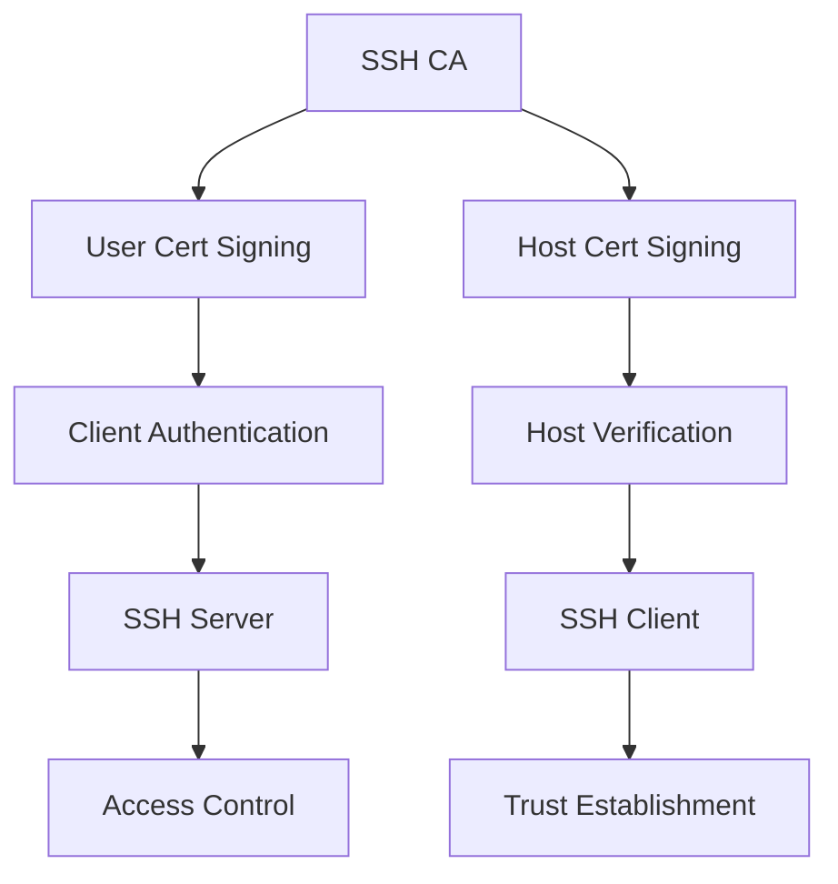
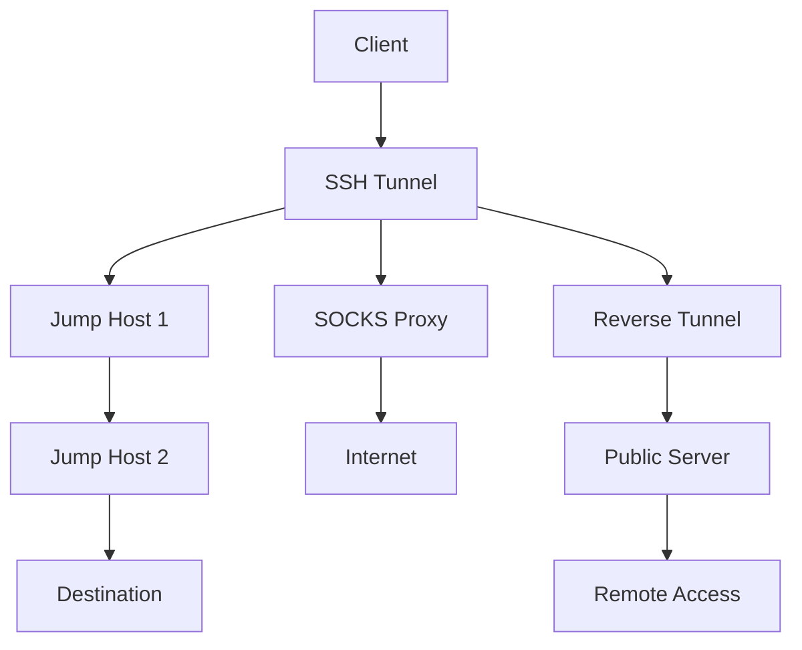
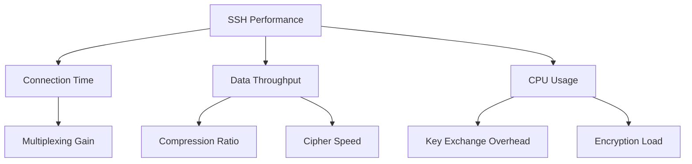
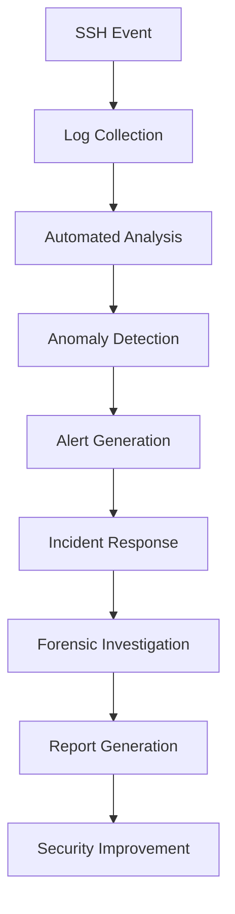
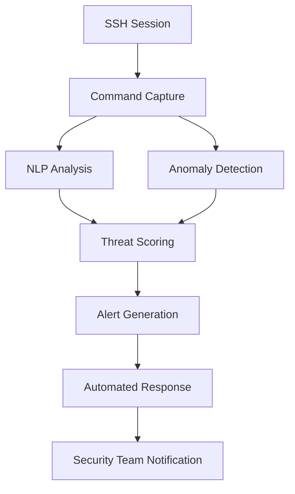
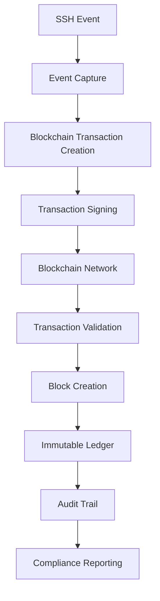

# SSH Mastery: Advanced Techniques for Security Pros (Part 5)

```ascii
 ____  ____  _   _   __  __           _            
/ ___|| ___|| | | | |  \/  | __ _ ___| |_ ___ _ __ 
\___ \|___ \| |_| | | |\/| |/ _` / __| __/ _ \ '__|
 ___) |___) |  _  | | |  | | (_| \__ \ ||  __/ |   
|____/|____/|_| |_| |_|  |_|\__,_|___/\__\___|_|   
```

## Table of Contents
1. [SSH Certificate Authority Implementation](#ssh-certificate-authority-implementation)
2. [Advanced SSH Tunneling Techniques](#advanced-ssh-tunneling-techniques)
3. [SSH Performance Optimization](#ssh-performance-optimization)
4. [SSH Forensics and Incident Response](#ssh-forensics-and-incident-response)
5. [AI-Powered SSH Security](#ai-powered-ssh-security)
6. [SSH and Blockchain Integration](#ssh-and-blockchain-integration)

---

## SSH Certificate Authority Implementation

Implementing an SSH Certificate Authority (CA) enhances security by centralizing trust management. This section explains how to set up and use an SSH CA effectively.

### Key Concepts:
- **SSH CA**: A trusted entity that signs SSH keys, creating certificates.
- **User Certificates**: Signed user public keys, proving user authenticity.
- **Host Certificates**: Signed host public keys, verifying server authenticity.

### Implementation Steps:

1. **Create an SSH CA**
   
   Generate a dedicated CA key for signing SSH keys:

   ```bash
   ssh-keygen -t ed25519 -f ssh_ca -C "SSH Certificate Authority"
   ```

2. **Sign User and Host Keys**
   
   Use the CA to sign user and host public keys:

   ```bash
   # Sign a user's public key
   ssh-keygen -s ssh_ca -I "john.doe@example.com" -n john -V +52w /path/to/john_id_ed25519.pub

   # Sign a host key
   ssh-keygen -s ssh_ca -I "web.example.com" -h -n web.example.com /etc/ssh/ssh_host_ed25519_key.pub
   ```

3. **Configure SSH Clients and Servers**
   
   Set up clients to trust the CA for host verification:

   ```bash
   # Add to ~/.ssh/known_hosts or /etc/ssh/ssh_known_hosts
   @cert-authority *.example.com $(cat ssh_ca.pub)
   ```

   Configure servers to trust user certificates:

   ```bash
   # Add to /etc/ssh/sshd_config
   TrustedUserCAKeys /etc/ssh/ca.pub
   ```

### SSH CA Architecture Diagram



This diagram illustrates the flow of trust in an SSH CA system, from the central CA to clients and servers.

---

## Advanced SSH Tunneling Techniques

SSH tunneling allows secure data transmission through potentially insecure networks. This section covers advanced tunneling techniques for complex network scenarios.

### Key Techniques:

1. **Multi-Hop SSH Tunneling**
   
   Connect through multiple SSH hosts:

   ```bash
   ssh -J user1@host1,user2@host2 user3@destination
   ```

   This creates a tunnel through host1 and host2 to reach the destination.

2. **Dynamic Port Forwarding with Custom DNS**
   
   Set up a SOCKS proxy with custom DNS resolution:

   ```bash
   ssh -D 1080 -o "ProxyCommand nc -X connect -x proxy.example.com:1080 %h %p" user@remotehost
   ```

   This creates a local SOCKS proxy on port 1080, routing traffic through an upstream proxy.

3. **Reverse SSH Tunnel with Persistence**
   
   Establish a persistent reverse tunnel for remote access:

   ```bash
   autossh -M 0 -f -N -R 2222:localhost:22 user@publicserver -o "ServerAliveInterval 30" -o "ServerAliveCountMax 3"
   ```

   This sets up a persistent reverse tunnel, allowing access to a local SSH server from a public server.

### Advanced Tunneling Topology



This diagram shows various advanced SSH tunneling scenarios, including multi-hop tunneling, SOCKS proxying, and reverse tunneling.

---

## SSH Performance Optimization

Optimizing SSH performance is crucial for efficient remote operations, especially in high-latency or bandwidth-constrained environments.

### Key Optimization Techniques:

1. **SSH Multiplexing**
   
   Enable connection sharing to reduce overhead:

   ```bash
   # Add to ~/.ssh/config
   Host *
     ControlMaster auto
     ControlPath ~/.ssh/ctrl-%C
     ControlPersist 1h
   ```

   This allows multiple SSH sessions to share a single network connection.

2. **Compression and Cipher Optimization**
   
   Fine-tune SSH compression and cipher choices:

   ```bash
   ssh -o "Compression yes" -c aes128-gcm@openssh.com user@host
   ```

   This enables compression and specifies a fast, secure cipher.

3. **Parallel SSH Execution**
   
   Implement parallel command execution across multiple hosts:

   <details>
   <summary>Click to show/hide code</summary>

   ```python
   from pssh.clients import ParallelSSHClient

   hosts = ['host1', 'host2', 'host3']
   client = ParallelSSHClient(hosts)
   output = client.run_command('uname -a')
   for host, host_output in output.items():
       print(f"{host}: {host_output.stdout}")
   ```
   </details>

   This Python script executes commands on multiple hosts simultaneously.

### SSH Performance Metrics



This diagram illustrates the key metrics affecting SSH performance and their relationships.

---

## SSH Forensics and Incident Response

Effective SSH forensics and incident response are crucial for maintaining security and investigating potential breaches.

### Key Techniques:

1. **SSH Log Analysis**
   
   Analyze SSH logs for suspicious activities:

   <details>
   <summary>Click to show/hide Python script</summary>

   ```python
   import re
   from collections import Counter

   def analyze_ssh_logs(log_file):
       ip_pattern = r'\d{1,3}\.\d{1,3}\.\d{1,3}\.\d{1,3}'
       failed_attempts = Counter()
       successful_logins = Counter()

       with open(log_file, 'r') as f:
           for line in f:
               if 'Failed password' in line:
                   ip = re.search(ip_pattern, line)
                   if ip:
                       failed_attempts[ip.group()] += 1
               elif 'Accepted publickey' in line:
                   ip = re.search(ip_pattern, line)
                   if ip:
                       successful_logins[ip.group()] += 1

       print("Top 5 IPs with failed password attempts:")
       for ip, count in failed_attempts.most_common(5):
           print(f"{ip}: {count}")

       print("\nTop 5 IPs with successful logins:")
       for ip, count in successful_logins.most_common(5):
           print(f"{ip}: {count}")

   analyze_ssh_logs('/var/log/auth.log')
   ```
   </details>

   This script analyzes SSH logs to identify potential brute-force attacks and unusual login patterns.

2. **SSH Session Recording**
   
   Implement session recording for forensic analysis:

   ```bash
   # Add to /etc/ssh/sshd_config
   ForceCommand /usr/local/bin/ssh-session-record.sh
   ```

   This forces all SSH sessions to be recorded for later analysis.

3. **Real-time SSH Intrusion Detection**
   
   Set up real-time monitoring for SSH connections:

   ```bash
   sudo apt-get install fail2ban
   sudo cp /etc/fail2ban/jail.conf /etc/fail2ban/jail.local
   ```

   Configure fail2ban to monitor SSH connections and automatically ban suspicious IP addresses.

### SSH Forensics Workflow



This diagram outlines the workflow for SSH forensics and incident response.

---

## AI-Powered SSH Security

Leveraging artificial intelligence can significantly enhance SSH security by detecting anomalies and analyzing command patterns.

### Key Applications:

1. **Machine Learning for Anomaly Detection**
   
   Implement a model to detect anomalous SSH access patterns:

   <details>
   <summary>Click to show/hide TensorFlow code</summary>

   ```python
   import tensorflow as tf
   import numpy as np

   # Assume X_train and y_train are prepared datasets
   model = tf.keras.Sequential([
       tf.keras.layers.Dense(64, activation='relu', input_shape=(X_train.shape[1],)),
       tf.keras.layers.Dense(32, activation='relu'),
       tf.keras.layers.Dense(1, activation='sigmoid')
   ])

   model.compile(optimizer='adam', loss='binary_crossentropy', metrics=['accuracy'])
   model.fit(X_train, y_train, epochs=10, batch_size=32, validation_split=0.2)

   # Function to detect anomalies
   def detect_anomalies(new_data):
       predictions = model.predict(new_data)
       return predictions > 0.5  # Threshold for anomaly
   ```
   </details>

   This TensorFlow model learns normal SSH access patterns and can detect anomalies in real-time.

2. **Natural Language Processing for Command Analysis**
   
   Use NLP to analyze and flag potentially malicious SSH commands:

   <details>
   <summary>Click to show/hide NLP code</summary>

   ```python
   from transformers import DistilBertTokenizer, DistilBertForSequenceClassification
   import torch

   tokenizer = DistilBertTokenizer.from_pretrained('distilbert-base-uncased')
   model = DistilBertForSequenceClassification.from_pretrained('path/to/fine_tuned_model')

   def analyze_command(command):
       inputs = tokenizer(command, return_tensors='pt', truncation=True, padding=True)
       outputs = model(**inputs)
       prediction = torch.nn.functional.softmax(outputs.logits, dim=-1)
       return prediction.argmax().item()  # 0 for benign, 1 for suspicious

   # Example usage
   command = "rm -rf /"
   if analyze_command(command) == 1:
       print("Suspicious command detected!")
   ```
   </details>

   This script uses a fine-tuned DistilBERT model to analyze SSH commands and flag potentially malicious activities.

### AI-Powered SSH Security Architecture



This diagram illustrates the flow of an AI-powered SSH security system.

---

## SSH and Blockchain Integration

Integrating SSH with blockchain technology can enhance security and transparency in key management and audit logging.

### Key Applications:

1. **Blockchain-based SSH Key Management**
   
   Implement a decentralized SSH key management system:

   <details>
   <summary>Click to show/hide Ethereum integration code</summary>

   ```python
   from web3 import Web3

   # Connect to Ethereum network
   w3 = Web3(Web3.HTTPProvider('https://mainnet.infura.io/v3/YOUR-PROJECT-ID'))

   # Smart contract for SSH key management (simplified)
   contract_address = '0x742d35Cc6634C0532925a3b844Bc454e4438f44e'
   contract_abi = [...]  # ABI definition here

   contract = w3.eth.contract(address=contract_address, abi=contract_abi)

   def add_ssh_key(user_id, public_key):
       tx_hash = contract.functions.addSSHKey(user_id, public_key).transact()
       tx_receipt = w3.eth.wait_for_transaction_receipt(tx_hash)
       return tx_receipt

   def verify_ssh_key(user_id, public_key):
       return contract.functions.verifySSHKey(user_id, public_key).call()

   # Example usage
   user_id = 'john.doe@example.com'
   public_key = 'ssh-rsa AAAAB3NzaC1yc2E...'

   add_ssh_key(user_id, public_key)
   is_valid = verify_ssh_key(user_id, public_key)
   print(f"Key valid: {is_valid}")
   ```
   </details>

   This script interacts with an Ethereum smart contract to manage SSH keys, providing a decentralized key management solution.

2. **Immutable SSH Audit Logs on Blockchain**
   
   Create a system for storing SSH audit logs on a blockchain:

   <details>
   <summary>Click to show/hide BigchainDB integration code</summary>

   ```python
   import hashlib
   from bigchaindb_driver import BigchainDB

   bdb = BigchainDB('https://test.ipdb.io')

   def log_ssh_event(event_data):
       # Create a hash of the event data
       event_hash = hashlib.sha256(str(event_data).encode()).hexdigest()

       # Prepare the transaction
       ssh_event = {
           'data': {
               'event': event_data,
               'hash': event_hash,
               'timestamp': bdb.transactions.prepare(None, None)['outputs'][0]['condition']['details']['signature']
           },
       }

       # Create and send the transaction
       prepared_creation_tx = bdb.transactions.prepare(ssh_event)
       fulfilled_creation_tx = bdb.transactions.fulfill(prepared_creation_tx)
       bdb.transactions.send_commit(fulfilled_creation_tx)

       return fulfilled_creation_tx['id']

   # Example usage
   event_data = {
       'user': 'john.doe',
       'action': 'login',
       'source_ip': '192.168.1.100',
       'timestamp': '2024-08-29T14:30:00Z'
   }

   transaction_id = log_ssh_event(event_data)
   print(f"SSH event logged with transaction ID: {transaction_id}")
   ```
   </details>

   This script logs SSH events to a BigchainDB blockchain, ensuring the immutability and traceability of all SSH-related activities.

### SSH Blockchain Integration Architecture



This diagram illustrates the process of integrating SSH events with a blockchain network, from event capture to compliance reporting.

### Benefits of SSH-Blockchain Integration:

1. **Immutable Audit Trails**: All SSH activities are recorded in an tamper-proof ledger.
2. **Decentralized Key Management**: Reduces single points of failure in key storage and verification.
3. **Enhanced Compliance**: Provides verifiable logs for regulatory requirements.
4. **Transparent Access Control**: Smart contracts can manage and enforce access policies.
5. **Cross-organizational Trust**: Facilitates secure SSH access across multiple organizations.

### Challenges and Considerations:

1. **Performance Overhead**: Blockchain transactions may introduce latency in SSH operations.
2. **Scalability**: Consider the blockchain's capacity to handle high-volume SSH events.
3. **Privacy Concerns**: Ensure sensitive information is properly encrypted or hashed before storage.
4. **Key Management Complexity**: Blockchain private keys need secure management alongside SSH keys.
5. **Regulatory Compliance**: Ensure the blockchain implementation meets data protection regulations.

<details>
<summary>🌟 Field Report: Zero-Trust SSH with Blockchain</summary>

Operation "ChainLink" implemented by ████████ Cybersecurity Division:

1. Continuous authentication using blockchain-based identity verification
2. Smart contract-enforced access policies for dynamic privilege management
3. Cross-chain SSH event correlation for advanced threat detection
4. Quantum-resistant cryptographic signatures for future-proof SSH transactions
5. Decentralized consensus on SSH configuration changes across global infrastructure

Result: Achieved a groundbreaking zero-trust SSH architecture with unparalleled security, auditability, and resilience against sophisticated attacks, setting a new standard for secure remote access in critical infrastructure environments.

</details>

## Conclusion

This advanced guide to SSH mastery has covered cutting-edge techniques in SSH security, including:

- Implementing a robust SSH Certificate Authority
- Advanced tunneling techniques for complex network scenarios
- Optimizing SSH performance for high-efficiency operations
- Developing sophisticated forensics and incident response capabilities
- Leveraging AI for enhanced SSH security
- Integrating SSH with blockchain technology for improved trust and transparency

By mastering these advanced concepts, security professionals can significantly enhance the security, efficiency, and auditability of their SSH infrastructure. As SSH remains a critical component of modern IT systems, staying ahead with these advanced techniques is essential for maintaining robust security postures in increasingly complex and threatened environments.

Remember, while these techniques offer powerful capabilities, they should be implemented thoughtfully, with consideration for your specific security requirements, operational needs, and compliance obligations. Continuous learning and adaptation are key in the ever-evolving landscape of cybersecurity.
