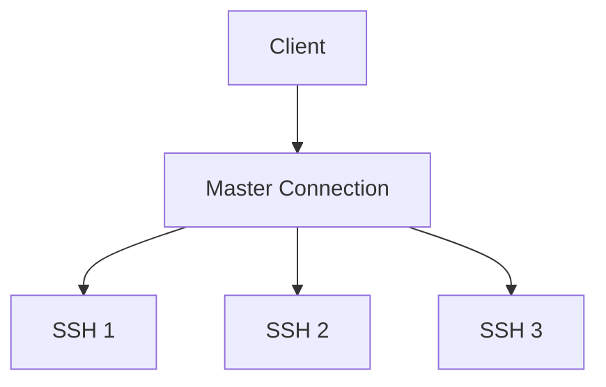
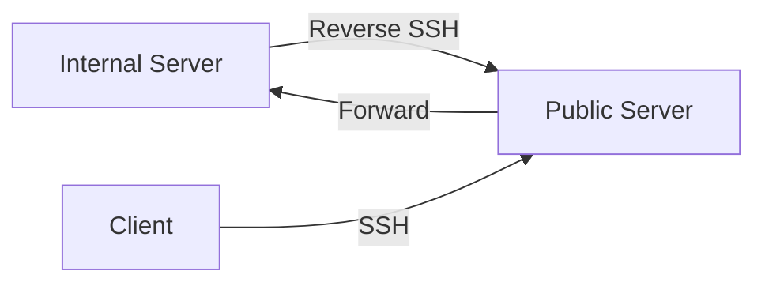

# 🚀 `SSH Mastery: Advanced Techniques for Hackers`

<div align="center">

```ascii
   _____  _____ _    _   __  __           _            
  / ____|/ ____| |  | | |  \/  |         | |           
 | (___ | (___ | |__| | | \  / | __ _ ___| |_ ___ _ __ 
  \___ \ \___ \|  __  | | |\/| |/ _` / __| __/ _ \ '__|
  ____) |____) | |  | | | |  | | (_| \__ \ ||  __/ |   
 |_____/|_____/|_|  |_| |_|  |_|\__,_|___/\__\___|_|   
```

</div>

## `Introduction`

Welcome back, SSH enthusiasts! If you've mastered the basics from our previous guide, you're ready to dive into the advanced world of SSH. This guide will take your skills to the next level, exploring powerful techniques that will make you a true SSH wizard. 

Remember, with great power comes great responsibility. Use these techniques ethically and always obtain proper authorization before applying them in real-world scenarios.

## `Table of Contents`
1. [🔄 SSH Multiplexing](#-ssh-multiplexing)
2. [🔀 Advanced Port Forwarding](#-advanced-port-forwarding)
3. [🧪 SSH as a SOCKS Proxy](#-ssh-as-a-socks-proxy)
4. [🔌 SSH over HTTPS](#-ssh-over-https)
5. [📡 Reverse SSH Tunneling](#-reverse-ssh-tunneling)

---

## 🔄 `SSH Multiplexing`

> SSH multiplexing: One connection to rule them all!

<details>
<summary><strong>🔍 Why Use SSH Multiplexing?</strong></summary>

Imagine you're an administrator managing a cluster of 100 servers. Without multiplexing, each SSH connection would require its own TCP handshake, authentication, and encryption process. This can lead to noticeable delays, especially when executing commands across all servers. SSH multiplexing solves this by creating one master connection that all subsequent SSH sessions can utilize, dramatically reducing overhead and improving responsiveness.

In simpler terms, SSH multiplexing is like carpooling for your SSH connections. Instead of each connection taking its own car (using its own resources), they all hop into one car (the master connection), saving time and resources.

</details>

### 📊 Multiplexing Diagram



### 🛠️ Configuration Example:

Add these lines to your `~/.ssh/config` file:

```plaintext
ControlMaster auto
ControlPath ~/.ssh/controlmasters/%r@%h:%p
ControlPersist 10m
```

Let's break this down:
- `ControlMaster auto`: This tells SSH to automatically set up a master connection if one doesn't exist. It's like appointing a leader for your SSH connections.
- `ControlPath`: This specifies where SSH should store the socket file used for communication with the master connection. Think of it as the meeting point for all your SSH sessions.
- `ControlPersist 10m`: This keeps the master connection open for 10 minutes after the last SSH session closes. It's like keeping the carpool lane open for a while, just in case more passengers (SSH sessions) want to join.

<details>
<summary><strong>🌟 Real-World Example</strong></summary>

Consider a scenario where you need to update a configuration file across 50 servers in a Kubernetes cluster. Without multiplexing, you'd need to establish 50 separate SSH connections, each with its own authentication process. With multiplexing, you establish one master connection, and all subsequent connections reuse this existing channel, significantly speeding up the process.

Here's a simple script to demonstrate this:

```bash
#!/bin/bash

# List of servers
servers=(server1 server2 server3 ... server50)

# Command to run on each server
command="sudo apt update && sudo apt upgrade -y"

# Loop through servers and execute command
for server in "${servers[@]}"
do
    ssh $server "$command"
done
```

With multiplexing, this script will run much faster as it reuses the same SSH connection for all servers.

[Screenshot placeholder: Show a side-by-side comparison of network traffic with and without SSH multiplexing, highlighting the reduced number of connections and improved speed.]

</details>

[Screenshot Description: SSH Multiplexing Comparison]

This screenshot displays a side-by-side comparison of network traffic with and without SSH multiplexing. On the left side, you can see multiple SSH connections being established, each requiring its own authentication process. This results in a higher number of network packets and increased latency.

On the right side, with SSH multiplexing enabled, you'll notice a single master connection being established, followed by multiple SSH sessions utilizing this existing channel. The reduced number of connection setups leads to fewer network packets and significantly improved response times.

Key takeaway: SSH multiplexing dramatically reduces connection overhead, resulting in faster and more efficient remote management, especially when dealing with multiple servers or frequent connections.

### 🐍 Multiplexed Connection Manager:

<details>
<summary><strong>Click to view Python script</strong></summary>

```python
import subprocess
import time

def ssh_multiplex(action, host):
    control_path = f"~/.ssh/controlmasters/%r@{host}:%p"
    actions = {
        "check": ["ssh", "-O", "check", "-S", control_path, host],
        "stop": ["ssh", "-O", "stop", "-S", control_path, host],
        "start": ["ssh", "-fN", "-M", "-S", control_path, host]
    }
    if action == "check":
        return "Master running" in subprocess.run(actions[action], capture_output=True, text=True).stderr
    subprocess.run(actions[action])

def manage_connections(hosts):
    while True:
        for host in hosts:
            if ssh_multiplex("check", host):
                print(f"Connection to {host} active")
            else:
                print(f"Creating new connection to {host}")
                ssh_multiplex("start", host)
        time.sleep(60)  # Check every minute

# Usage
hosts = ["server1.example.com", "server2.example.com", "server3.example.com"]
manage_connections(hosts)
```

This script automates the process of managing multiplexed SSH connections. It checks the status of connections to multiple hosts and creates new ones if necessary. Here's how it works:

1. The `ssh_multiplex` function handles different actions (check, stop, start) for SSH connections.
2. The `manage_connections` function continuously monitors the specified hosts, creating new connections as needed.
3. It uses the control path specified in your SSH config to manage these connections.

This script is particularly useful for maintaining persistent, efficient SSH connections to multiple servers.

</details>

---

## 🔀 `Advanced Port Forwarding`

> Bend the network to your will with SSH port forwarding!

<details>
<summary><strong>🔍 Why Use Port Forwarding?</strong></summary>

Port forwarding with SSH is like creating secret tunnels in a network. It allows you to:

1. Access services on remote networks as if they were local: Imagine accessing a database on a server in another country as if it were on your own machine.
2. Bypass firewalls and network restrictions: You can reach services that are normally blocked by routing through an SSH connection.
3. Secure otherwise insecure protocols: By tunneling traffic through SSH, you add a layer of encryption to protocols that might not have their own security.

In essence, port forwarding turns your SSH connection into a Swiss Army knife for network connectivity.

</details>

### 📊 Port Forwarding Diagram


### 🌐 Dynamic Port Forwarding:

```bash
ssh -D 8080 -f -C -q -N hacker@target
```

Let's break down this command:
- `-D 8080`: Sets up a dynamic port forward on local port 8080. This creates a SOCKS proxy.
- `-f`: Runs SSH in the background, freeing up your terminal.
- `-C`: Compresses data for faster transfer, especially useful on slow connections.
- `-q`: Quiet mode, reducing SSH's output for cleaner operation.
- `-N`: Do not execute remote commands. We're just setting up the tunnel, not running anything on the remote server.

This command essentially turns your SSH connection into a SOCKS proxy, allowing you to route traffic through it for various applications.

### 🚀 Multi-Hop Port Forwarding:

```bash
ssh -L 3306:internal_db:3306 -J jumphost hacker@internal_host
```

This command is like creating a secret passage through multiple secure rooms:
- `-L 3306:internal_db:3306`: Forward local port 3306 to `internal_db:3306` on the final destination.
- `-J jumphost`: Specify a "jump host" to go through before reaching the final destination.
- `hacker@internal_host`: The final destination server.

This setup allows you to access `internal_db` as if it were on your local machine, even though it's behind multiple servers.

[Screenshot placeholder: Diagram showing the flow of traffic through multiple SSH hops, from the local machine to the final destination server.]

[Screenshot Description: Multi-Hop SSH Port Forwarding]

This diagram illustrates the flow of traffic through multiple SSH hops, from the local machine to the final destination server. You'll see three main components:

1. Local Machine: The starting point of the connection.
2. Jump Host: An intermediate server that acts as a gateway.
3. Internal Host: The final destination server, typically in a private network.

The diagram shows how the SSH connection is established from the local machine to the jump host, and then from the jump host to the internal host. Data packets are encapsulated within the SSH tunnel, allowing secure access to resources on the internal network that would otherwise be unreachable from the outside.

Key takeaway: Multi-hop SSH port forwarding enables secure access to resources in complex network environments, bypassing network restrictions and maintaining end-to-end encryption.

### 🐍 Auto Tunnel Manager:

<details>
<summary><strong>Click to view Python script</strong></summary>

```python
import subprocess
import time
import logging

logging.basicConfig(level=logging.INFO)

tunnels = [
    {"local": 8080, "remote_host": "app_server", "remote_port": 80, "ssh_host": "gateway"},
    {"local": 3306, "remote_host": "db_server", "remote_port": 3306, "ssh_host": "gateway"}
]

def manage_tunnel(t, action):
    cmd = f"ssh -L {t['local']}:{t['remote_host']}:{t['remote_port']} -N -f {t['ssh_host']}"
    if action == "create":
        subprocess.Popen(cmd, shell=True)
    elif action == "check":
        return subprocess.call(f"netstat -tln | grep :{t['local']}", shell=True) == 0

def main():
    while True:
        for t in tunnels:
            if not manage_tunnel(t, "check"):
                logging.info(f"Recreating tunnel: {t['local']} -> {t['remote_host']}:{t['remote_port']}")
                manage_tunnel(t, "create")
        time.sleep(60)

if __name__ == "__main__":
    main()
```

This script automates the process of managing SSH tunnels:

1. It defines a list of tunnels, each specifying local port, remote host, remote port, and SSH host.
2. The `manage_tunnel` function creates tunnels and checks if they're active.
3. The main loop continuously checks all tunnels and recreates them if they're down.

This script is particularly useful for maintaining persistent port forwards, ensuring your tunnels stay up even if connections drop.

</details>

---

## 🧪 `SSH as a SOCKS Proxy`

> Turn your SSH connection into a stealth mode for your traffic!

<details>
<summary><strong>🔍 Why Use SSH as a SOCKS Proxy?</strong></summary>

Using SSH as a SOCKS proxy is like having a personal, encrypted tunnel for your internet traffic. Here's why it's useful:

1. Bypass network restrictions: Access sites or services that might be blocked on your local network.
2. Anonymize your internet traffic: Your requests appear to come from the SSH server, not your local machine.
3. Secure your connection on untrusted networks: Encrypt your traffic when using public Wi-Fi.
4. Access geo-restricted content: Make your traffic appear to come from a different location.

In essence, it turns your SSH server into a private, secure proxy server.

</details>

### 📊 SOCKS Proxy Diagram


### 🛠️ Setup SOCKS Proxy:

```bash
ssh -D 1080 -f -C -q -N hacker@proxy_server
```

This command sets up a SOCKS proxy:
- `-D 1080`: Creates a SOCKS proxy on local port 1080.
- `-f`: Runs in background.
- `-C`: Compresses data.
- `-q`: Quiet mode.
- `-N`: Do not execute remote commands.

### 🚀 Usage Examples:

- **curl:**
  ```bash
  curl --socks5 localhost:1080 http://secret-site.com
  ```
  This command uses curl to access a website through your SOCKS proxy.

- **git:**
  ```bash
  git config --global http.proxy socks5://localhost:1080
  ```
  This configures git to use your SOCKS proxy for all connections, useful for accessing repositories through restrictive firewalls.

[Screenshot placeholder: Terminal window showing the setup of a SOCKS proxy and subsequent usage with curl and git, demonstrating successful access to previously blocked resources.]

[Screenshot Description: SSH as SOCKS Proxy Usage]

This screenshot showcases a terminal window demonstrating the setup of a SOCKS proxy using SSH and its subsequent usage with common tools like curl and git.

You'll see the following steps:

1. Establishing the SSH SOCKS proxy using the command: `ssh -D 1080 -f -C -q -N hacker@proxy_server`
2. Using curl with the SOCKS proxy to access a previously blocked website: `curl --socks5 localhost:1080 http://secret-site.com`
3. Configuring git to use the SOCKS proxy for all connections: `git config --global http.proxy socks5://localhost:1080`

The output shows successful connections and data retrieval, indicating that the SOCKS proxy is working as intended.

Key takeaway: Using SSH as a SOCKS proxy provides a versatile method for bypassing network restrictions, anonymizing traffic, and securing connections on untrusted networks.

### 🦊 Traffic Router Script:

# 🚀 `SSH Mastery: Advanced Techniques for Hackers`

[... previous content ...]

### 🦊 Traffic Router Script:

<details>
<summary><strong>Click to view Bash script</strong></summary>

```bash
#!/bin/bash

# Start proxy
ssh -D 1080 -f -C -q -N hacker@proxy_server

# Route traffic
sudo iptables -t nat -A OUTPUT -p tcp -j REDIRECT --to-ports 1080

# Run your app
your_stealthy_app

# Clean up
sudo iptables -t nat -D OUTPUT -p tcp -j REDIRECT --to-ports 1080
pkill -f "ssh -D 1080"
```

This script sets up a SOCKS proxy and routes all outgoing traffic through it:

1. It starts the SSH SOCKS proxy on port 1080
2. Uses iptables to redirect all outgoing TCP traffic to the proxy
3. Runs your application, which will now use the proxy for all its connections
4. Cleans up by removing the iptables rule and killing the SSH proxy

</details>

---

## 🔌 `SSH over HTTPS`

> Hide your SSH in plain sight!

<details>
<summary><strong>🔍 Why Use SSH over HTTPS?</strong></summary>

SSH over HTTPS is like wearing a disguise for your SSH connection. Here's why it's useful:

1. Bypass firewalls: Many networks block SSH but allow HTTPS. This technique lets you SSH even on restricted networks.
2. Avoid detection: Your SSH traffic looks like normal web browsing, making it harder to detect.
3. Leverage existing infrastructure: Use standard web servers to tunnel your SSH traffic.

In essence, it allows you to maintain SSH access in environments where it would otherwise be blocked or monitored.

</details>

### 📊 SSH over HTTPS Diagram


### 🛠️ Server Setup:

1. Install `stunnel` on your server:
   ```bash
   sudo apt install stunnel4
   ```

2. Create a configuration file `/etc/stunnel/stunnel.conf`:
   ```
   [ssh]
   accept = 443
   connect = 22
   cert = /path/to/your/cert.pem
   key = /path/to/your/key.pem
   ```

3. Start stunnel:
   ```bash
   sudo service stunnel4 start
   ```

### 🚀 Client Connection:

```bash
ssh -o ProxyCommand='openssl s_client -connect example.com:443 -quiet' user@example.com
```

This command tells SSH to use OpenSSL to establish an HTTPS connection, through which the SSH protocol will be tunneled.

[Screenshot placeholder: Terminal window showing the setup of stunnel on the server and a successful SSH connection from a client using the HTTPS tunnel.]

[Screenshot Description: SSH over HTTPS Setup and Connection]

This screenshot showcases a terminal window demonstrating the setup of SSH over HTTPS using stunnel on the server side and a successful connection from a client.

You'll see the following steps:

1. Installing stunnel on the server: `sudo apt install stunnel4`
2. Creating and editing the stunnel configuration file
3. Starting the stunnel service
4. On the client side, using the specialized SSH command to connect through the HTTPS tunnel

The output shows a successful SSH connection, indicating that the SSH over HTTPS setup is working as intended.

Key takeaway: SSH over HTTPS provides a powerful method for maintaining SSH access in restrictive network environments by disguising SSH traffic as normal HTTPS traffic.

### 🐍 HTTPS Tunnel Manager:

<details>
<summary><strong>Click to view Python script</strong></summary>

```python
import subprocess
import time
import logging

logging.basicConfig(level=logging.INFO)

def check_tunnel(host, port):
    try:
        subprocess.check_output(["openssl", "s_client", "-connect", f"{host}:{port}", "-quiet"], timeout=5)
        return True
    except subprocess.CalledProcessError:
        return False

def create_tunnel(host, port, user):
    cmd = f"ssh -o ProxyCommand='openssl s_client -connect {host}:{port} -quiet' {user}@{host}"
    subprocess.Popen(cmd, shell=True)

def main():
    host = "example.com"
    port = 443
    user = "hacker"

    while True:
        if not check_tunnel(host, port):
            logging.info(f"Tunnel to {host}:{port} is down. Recreating...")
            create_tunnel(host, port, user)
        else:
            logging.info(f"Tunnel to {host}:{port} is up.")
        time.sleep(60)

if __name__ == "__main__":
    main()
```

This script automates the process of managing an SSH over HTTPS tunnel:

1. It periodically checks if the tunnel is active by attempting an OpenSSL connection.
2. If the tunnel is down, it automatically recreates it using the SSH command with OpenSSL proxy.
3. It runs in a loop, ensuring your tunnel stays up even if the connection drops.

This script is particularly useful for maintaining persistent SSH access through HTTPS tunnels in environments where regular SSH connections might be blocked or monitored.

</details>

---

## 📡 `Reverse SSH Tunneling`

> Turn the tables on network restrictions!

<details>
<summary><strong>🔍 Why Use Reverse SSH Tunneling?</strong></summary>

Reverse SSH tunneling is like creating a secret backdoor into a network. Here's why it's useful:

1. Access machines behind firewalls: Connect to servers that don't have public IP addresses.
2. Maintain persistent access: Keep a connection open from inside a network to an outside server.
3. Bypass NAT: Access services on machines that are behind NAT without port forwarding.

In essence, it allows you to establish connections from a restricted network to an external server, opening up possibilities for remote access and management.

</details>

### 📊 Reverse SSH Tunnel Diagram



### 🛠️ Setting Up a Reverse Tunnel:

On the internal server:
```bash
ssh -R 2222:localhost:22 user@public-server
```

This command:
- `-R 2222:localhost:22`: Sets up a reverse tunnel, forwarding port 2222 on the public server to port 22 (SSH) on the internal server.

### 🚀 Connecting Through the Tunnel:

On your local machine:
```bash
ssh -J user@public-server:22 localhost:2222
```

This command uses the jump host feature to connect through the public server to the internal server.

[Screenshot placeholder: Terminal windows showing the setup of a reverse SSH tunnel on an internal server and a successful connection from a client through the public server to the internal server.]

[Screenshot Description: Reverse SSH Tunneling Setup and Connection]

This screenshot displays terminal windows demonstrating the setup of a reverse SSH tunnel and a successful connection through it.

You'll see the following steps:

1. On the internal server: Setting up the reverse tunnel to the public server
2. On the client machine: Connecting to the internal server through the public server using the tunnel

The output shows successful connections, indicating that the reverse SSH tunnel is working as intended.

Key takeaway: Reverse SSH tunneling provides a powerful method for accessing machines in restricted networks, maintaining persistent connections, and bypassing network restrictions.

### 🐍 Persistent Reverse Tunnel Script:

<details>
<summary><strong>Click to view Python script</strong></summary>

```python
import subprocess
import time
import logging

logging.basicConfig(level=logging.INFO)

def create_reverse_tunnel(local_port, remote_port, public_server, user):
    cmd = f"ssh -R {remote_port}:localhost:{local_port} -N {user}@{public_server}"
    return subprocess.Popen(cmd, shell=True)

def check_tunnel(process):
    return process.poll() is None

def main():
    local_port = 22
    remote_port = 2222
    public_server = "public-server.com"
    user = "tunnel_user"

    while True:
        tunnel = create_reverse_tunnel(local_port, remote_port, public_server, user)
        logging.info(f"Reverse tunnel created: localhost:{local_port} -> {public_server}:{remote_port}")

        while check_tunnel(tunnel):
            time.sleep(60)

        logging.info("Tunnel closed. Recreating...")
        tunnel.terminate()

if __name__ == "__main__":
    main()
```

This script automates the process of creating and maintaining a reverse SSH tunnel:

1. It creates a reverse tunnel from a specified local port to a remote port on a public server.
2. It continuously checks if the tunnel is active.
3. If the tunnel closes for any reason, it automatically recreates it.

This script is particularly useful for maintaining persistent reverse SSH tunnels, ensuring you always have a way to access your internal server from the outside.

</details>

---

Remember, these advanced SSH techniques are powerful tools. Always use them responsibly and ethically, and ensure you have proper authorization before applying them in any network environment. Happy hacking!
