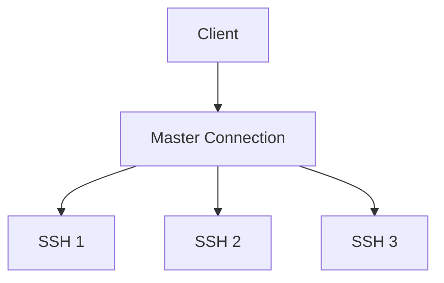
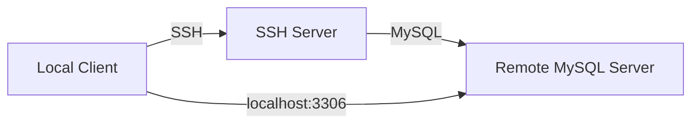
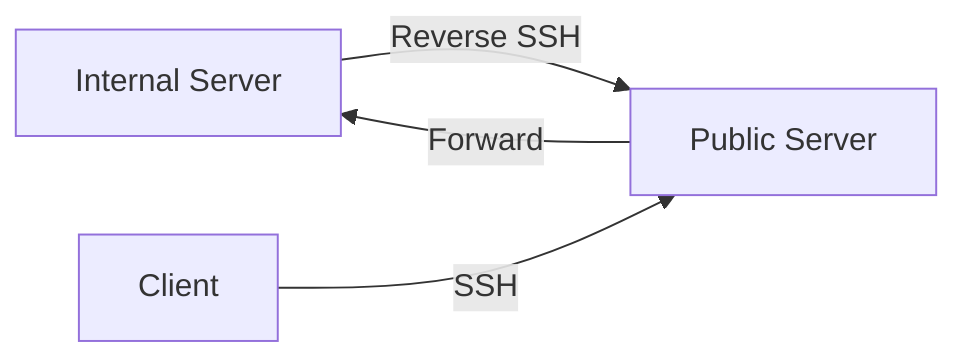

# 🚀 SSH Mastery: Advanced Techniques for Security Professionals

<div align="center">

```ascii
   _____  _____ _    _   __  __           _            
  / ____|/ ____| |  | | |  \/  |         | |           
 | (___ | (___ | |__| | | \  / | __ _ ___| |_ ___ _ __ 
  \___ \ \___ \|  __  | | |\/| |/ _` / __| __/ _ \ '__|
  ____) |____) | |  | | | |  | | (_| \__ \ ||  __/ |   
 |_____/|_____/|_|  |_| |_|  |_|\__,_|___/\__\___|_|   
```

</div>

## Introduction

Welcome to the advanced world of SSH! This guide will elevate your SSH skills, exploring powerful techniques that will transform you into an SSH expert. Remember, these advanced techniques come with great responsibility. Always use them ethically and with proper authorization.

## Table of Contents
1. [SSH Multiplexing](#ssh-multiplexing)
2. [Advanced Port Forwarding](#advanced-port-forwarding)
3. [SSH as a SOCKS Proxy](#ssh-as-a-socks-proxy)
4. [SSH over HTTPS](#ssh-over-https)
5. [Reverse SSH Tunneling](#reverse-ssh-tunneling)

---

## SSH Multiplexing

SSH multiplexing allows you to reuse an existing SSH connection for multiple sessions, significantly reducing connection overhead and improving responsiveness.

### Why Use SSH Multiplexing?

Imagine managing a cluster of 100 servers. Without multiplexing, each SSH connection requires its own TCP handshake, authentication, and encryption process. Multiplexing solves this by creating one master connection that all subsequent SSH sessions can utilize.

### Multiplexing Diagram



### Configuration

Add these lines to your `~/.ssh/config` file:

```plaintext
ControlMaster auto
ControlPath ~/.ssh/controlmasters/%r@%h:%p
ControlPersist 10m
```

- `ControlMaster auto`: Automatically set up a master connection if one doesn't exist.
- `ControlPath`: Specifies where SSH should store the socket file for the master connection.
- `ControlPersist 10m`: Keeps the master connection open for 10 minutes after the last SSH session closes.

### Real-World Example

Consider updating a configuration file across 50 servers in a Kubernetes cluster:

```bash
#!/bin/bash

servers=(server1 server2 server3 ... server50)
command="sudo apt update && sudo apt upgrade -y"

for server in "${servers[@]}"
do
    ssh $server "$command"
done
```

With multiplexing, this script runs much faster as it reuses the same SSH connection for all servers.


**Figure 1: SSH Multiplexing Performance Comparison**

This diagram illustrates the significant performance benefits of SSH multiplexing. The left side shows traditional SSH connections, where each session requires its own handshake and authentication process, resulting in higher latency and resource usage. The right side demonstrates SSH multiplexing, where a single master connection is established and reused for multiple sessions, dramatically reducing connection overhead and improving response times. The color-coded packets highlight the efficiency gained through multiplexing, with fewer total packets needed to accomplish the same tasks.

### Multiplexed Connection Manager

<details>
<summary><strong>Click to view Python script for Multiplexed Connection Manager</strong></summary>

```python
import subprocess
import time

def ssh_multiplex(action, host):
    control_path = f"~/.ssh/controlmasters/%r@{host}:%p"
    actions = {
        "check": ["ssh", "-O", "check", "-S", control_path, host],
        "stop": ["ssh", "-O", "stop", "-S", control_path, host],
        "start": ["ssh", "-fN", "-M", "-S", control_path, host]
    }
    if action == "check":
        return "Master running" in subprocess.run(actions[action], capture_output=True, text=True).stderr
    subprocess.run(actions[action])

def manage_connections(hosts):
    while True:
        for host in hosts:
            if ssh_multiplex("check", host):
                print(f"Connection to {host} active")
            else:
                print(f"Creating new connection to {host}")
                ssh_multiplex("start", host)
        time.sleep(60)  # Check every minute

# Usage
hosts = ["server1.example.com", "server2.example.com", "server3.example.com"]
manage_connections(hosts)
```

</details>

This script automates the process of managing multiplexed SSH connections, ensuring efficient and persistent connections to multiple servers.

---

## Advanced Port Forwarding

SSH port forwarding allows you to create secure tunnels through an SSH connection, enabling access to services on remote networks and bypassing firewalls.

### Port Forwarding Diagram



### Dynamic Port Forwarding

```bash
ssh -D 8080 -f -C -q -N user@target
```

- `-D 8080`: Sets up a dynamic port forward on local port 8080 (SOCKS proxy).
- `-f`: Runs SSH in the background.
- `-C`: Compresses data for faster transfer.
- `-q`: Quiet mode, reducing SSH's output.
- `-N`: Do not execute remote commands.

### Multi-Hop Port Forwarding

```bash
ssh -L 3306:internal_db:3306 -J jumphost user@internal_host
```

- `-L 3306:internal_db:3306`: Forward local port 3306 to `internal_db:3306` on the final destination.
- `-J jumphost`: Specify a "jump host" to go through before reaching the final destination.


**Figure 2: Multi-Hop SSH Port Forwarding Architecture**

This diagram presents a comprehensive view of a multi-hop SSH port forwarding setup. It illustrates how a client can securely access a service on an internal network by traversing multiple network segments. The architecture shows:

1. The client initiating an SSH connection to a jump host.
2. The jump host serving as an intermediary, forwarding the connection to the internal SSH server.
3. The internal SSH server providing access to the target service (e.g., a database).

Color-coding is used to distinguish between different network zones (external, DMZ, and internal), while arrows indicate the direction of the SSH connections and data flow. This setup demonstrates how SSH port forwarding can be used to securely access resources across complex network topologies while maintaining strict firewall rules.

### Auto Tunnel Manager

<details>
<summary><strong>Click to view Python script for Auto Tunnel Manager</strong></summary>

```python
import subprocess
import time
import logging

logging.basicConfig(level=logging.INFO)

tunnels = [
    {"local": 8080, "remote_host": "app_server", "remote_port": 80, "ssh_host": "gateway"},
    {"local": 3306, "remote_host": "db_server", "remote_port": 3306, "ssh_host": "gateway"}
]

def manage_tunnel(t, action):
    cmd = f"ssh -L {t['local']}:{t['remote_host']}:{t['remote_port']} -N -f {t['ssh_host']}"
    if action == "create":
        subprocess.Popen(cmd, shell=True)
    elif action == "check":
        return subprocess.call(f"netstat -tln | grep :{t['local']}", shell=True) == 0

def main():
    while True:
        for t in tunnels:
            if not manage_tunnel(t, "check"):
                logging.info(f"Recreating tunnel: {t['local']} -> {t['remote_host']}:{t['remote_port']}")
                manage_tunnel(t, "create")
        time.sleep(60)

if __name__ == "__main__":
    main()
```

</details>

This script automates the process of managing SSH tunnels, ensuring they stay up even if connections drop.

---

## SSH as a SOCKS Proxy

Using SSH as a SOCKS proxy provides a secure tunnel for your internet traffic, allowing you to bypass network restrictions and anonymize your connection.

### SOCKS Proxy Diagram


### Setup SOCKS Proxy

```bash
ssh -D 1080 -f -C -q -N user@proxy_server
```

This command sets up a SOCKS proxy on local port 1080.

### Usage Examples

- **curl:**
  ```bash
  curl --socks5 localhost:1080 http://example.com
  ```

- **git:**
  ```bash
  git config --global http.proxy socks5://localhost:1080
  ```


**Figure 3: SSH SOCKS Proxy Configuration and Usage**

This comprehensive diagram illustrates the setup and usage of an SSH SOCKS proxy:

1. **Proxy Setup**: The left side shows the command to establish the SSH SOCKS proxy, creating a secure tunnel to the SSH server.
2. **Application Configuration**: The center demonstrates how to configure various applications (e.g., curl, git) to use the SOCKS proxy.
3. **Traffic Flow**: The right side visualizes how traffic from the local machine is routed through the SSH tunnel to access remote resources.

The color-coded elements highlight different components: local machine (blue), SSH server (green), and remote resources (orange). Arrows indicate the direction of data flow, emphasizing how all traffic is encrypted and tunneled through the SSH connection. This setup provides a powerful method for bypassing network restrictions and enhancing privacy by masking the origin of the traffic.

### Traffic Router Script

<details>
<summary><strong>Click to view Bash script for Traffic Router</strong></summary>

```bash
#!/bin/bash

# Start proxy
ssh -D 1080 -f -C -q -N user@proxy_server

# Route traffic
sudo iptables -t nat -A OUTPUT -p tcp -j REDIRECT --to-ports 1080

# Run your app
your_application

# Clean up
sudo iptables -t nat -D OUTPUT -p tcp -j REDIRECT --to-ports 1080
pkill -f "ssh -D 1080"
```

</details>

This script sets up a SOCKS proxy and routes all outgoing traffic through it, providing a seamless way to anonymize your connection.

---

## SSH over HTTPS

SSH over HTTPS allows you to tunnel your SSH connection through HTTPS, making it appear as normal web traffic and bypassing firewalls that might block SSH.

### SSH over HTTPS Diagram


### Server Setup

1. Install `stunnel`:
   ```bash
   sudo apt install stunnel4
   ```

2. Create `/etc/stunnel/stunnel.conf`:
   ```
   [ssh]
   accept = 443
   connect = 22
   cert = /path/to/your/cert.pem
   key = /path/to/your/key.pem
   ```

3. Start stunnel:
   ```bash
   sudo service stunnel4 start
   ```

### Client Connection

```bash
ssh -o ProxyCommand='openssl s_client -connect example.com:443 -quiet' user@example.com
```


**Figure 4: SSH over HTTPS Architecture**

This diagram provides a detailed look at the SSH over HTTPS setup:

1. **Client Network**: The leftmost section shows the client initiating what appears to be a standard HTTPS connection on port 443.
2. **Firewall**: The orange bar represents a firewall that allows HTTPS traffic but may block standard SSH connections.
3. **Server Network**: The right side illustrates the server-side components:
   - **Stunnel Server**: Receives HTTPS traffic on port 443 and decrypts it.
   - **SSH Server**: Receives the decrypted SSH traffic on the standard port 22.

The color-coding helps distinguish between different components and traffic types:
- Blue: Client-side elements
- Orange: Network security devices
- Green: Server-side components

Arrows show the flow of data, emphasizing how SSH traffic is encapsulated within HTTPS, effectively bypassing restrictions on standard SSH connections. This architecture allows for secure SSH access in environments where direct SSH connections are not permitted, leveraging the ubiquity of HTTPS traffic.

### HTTPS Tunnel Manager

<details>
<summary><strong>Click to view Python script for HTTPS Tunnel Manager</strong></summary>

```python
import subprocess
import time
import logging

logging.basicConfig(level=logging.INFO)

def check_tunnel(host, port):
    try:
        subprocess.check_output(["openssl", "s_client", "-connect", f"{host}:{port}", "-quiet"], timeout=5)
        return True
    except subprocess.CalledProcessError:
        return False

def create_tunnel(host, port, user):
    cmd = f"ssh -o ProxyCommand='openssl s_client -connect {host}:{port} -quiet' {user}@{host}"
    subprocess.Popen(cmd, shell=True)

def main():
    host = "example.com"
    port = 443
    user = "your_username"

    while True:
        if not check_tunnel(host, port):
            logging.info(f"Tunnel to {host}:{port} is down. Recreating...")
            create_tunnel(host, port, user)
        else:
            logging.info(f"Tunnel to {host}:{port} is up.")
        time.sleep(60)

if __name__ == "__main__":
    main()
```

</details>

This script automates the process of managing an SSH over HTTPS tunnel, ensuring persistent access in restrictive network environments.

---

## Reverse SSH Tunneling

Reverse SSH tunneling allows you to create a connection from a restricted network to an external server, providing a way to access machines behind firewalls or NAT.

### Reverse SSH Tunnel Diagram



### Setting Up a Reverse Tunnel

On the internal server:
```bash
ssh -R 2222:localhost:22 user@public-server
```

This command sets up a reverse tunnel, forwarding port 2222 on the public server to port 22 (SSH) on the internal server.

### Connecting Through the Tunnel

On your local machine:
```bash
ssh -J user@public-server:22 localhost:2222
```


**Figure 5: Reverse SSH Tunneling Configuration**

This diagram presents a comprehensive view of a reverse SSH
[... previous content ...]


**Figure 5: Reverse SSH Tunneling Configuration**

This diagram presents a comprehensive view of a reverse SSH tunneling setup:

1. **Internal Network**: On the left, we see the internal server behind a firewall or NAT, which initiates the reverse SSH connection.
2. **Public Internet**: The center represents the public internet, where the SSH tunnel is established.
3. **Public Server**: On the right, we have the public SSH server that acts as an intermediary.
4. **Client**: At the bottom, a client connects to the public server to access the internal server.

Key components and processes illustrated:
- The internal server initiates an outbound SSH connection to the public server, creating a reverse tunnel.
- The public server listens on a specified port (2222 in this example) and forwards connections to the internal server's SSH port (22).
- The client connects to the public server's port 2222, which then forwards the connection through the tunnel to the internal server.

Color coding helps distinguish between different network zones:
- Blue: Internal network
- Green: Public server
- Orange: Client

Arrows indicate the direction of the SSH connections and data flow, emphasizing how the reverse tunnel allows external access to an internal resource that would otherwise be unreachable.

This setup is particularly useful for accessing devices behind firewalls or NAT, remote management of systems in restricted networks, and providing secure access to internal services without exposing them directly to the internet.

### Persistent Reverse Tunnel Manager

<details>
<summary><strong>Click to view Python script for Persistent Reverse Tunnel Manager</strong></summary>

```python
import subprocess
import time
import logging

logging.basicConfig(level=logging.INFO)

def create_reverse_tunnel(local_port, remote_port, public_server, user):
    cmd = f"ssh -R {remote_port}:localhost:{local_port} -N {user}@{public_server}"
    return subprocess.Popen(cmd, shell=True)

def check_tunnel(process):
    return process.poll() is None

def main():
    local_port = 22
    remote_port = 2222
    public_server = "public-server.com"
    user = "tunnel_user"

    while True:
        tunnel = create_reverse_tunnel(local_port, remote_port, public_server, user)
        logging.info(f"Reverse tunnel created: localhost:{local_port} -> {public_server}:{remote_port}")

        while check_tunnel(tunnel):
            time.sleep(60)

        logging.info("Tunnel closed. Recreating...")
        tunnel.terminate()

if __name__ == "__main__":
    main()
```

</details>

This script automates the process of creating and maintaining a reverse SSH tunnel:

1. It establishes a reverse tunnel from a specified local port to a remote port on a public server.
2. The script continuously monitors the tunnel's status.
3. If the tunnel closes for any reason, it automatically recreates it.

This automation ensures persistent access to your internal server from the outside, making it ideal for:
- Maintaining access to systems behind dynamic IP addresses
- Providing continuous remote support for clients behind firewalls
- Ensuring uninterrupted access to IoT devices in restricted networks

By using this script, you can maintain a robust and reliable reverse SSH tunnel, enhancing your ability to manage and access resources in complex network environments.

---

## Conclusion

The advanced SSH techniques covered in this guide provide powerful tools for secure network management, remote access, and bypassing network restrictions. From SSH multiplexing for efficient connections to reverse tunneling for accessing restricted networks, these methods significantly enhance your capabilities as a security professional or system administrator.

Remember to always use these techniques responsibly and ethically. Ensure you have proper authorization before applying them in any network environment. As you implement these advanced SSH strategies, you'll find new ways to optimize your workflows, enhance security, and overcome complex networking challenges.

Continue exploring and experimenting with these techniques in controlled environments to fully grasp their potential and limitations. With practice, you'll be able to leverage the full power of SSH to solve a wide array of networking and security challenges.

Happy secure networking!
