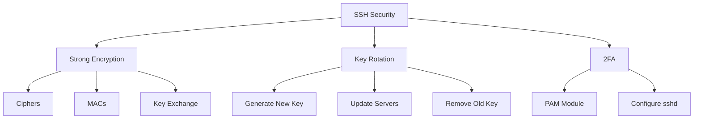
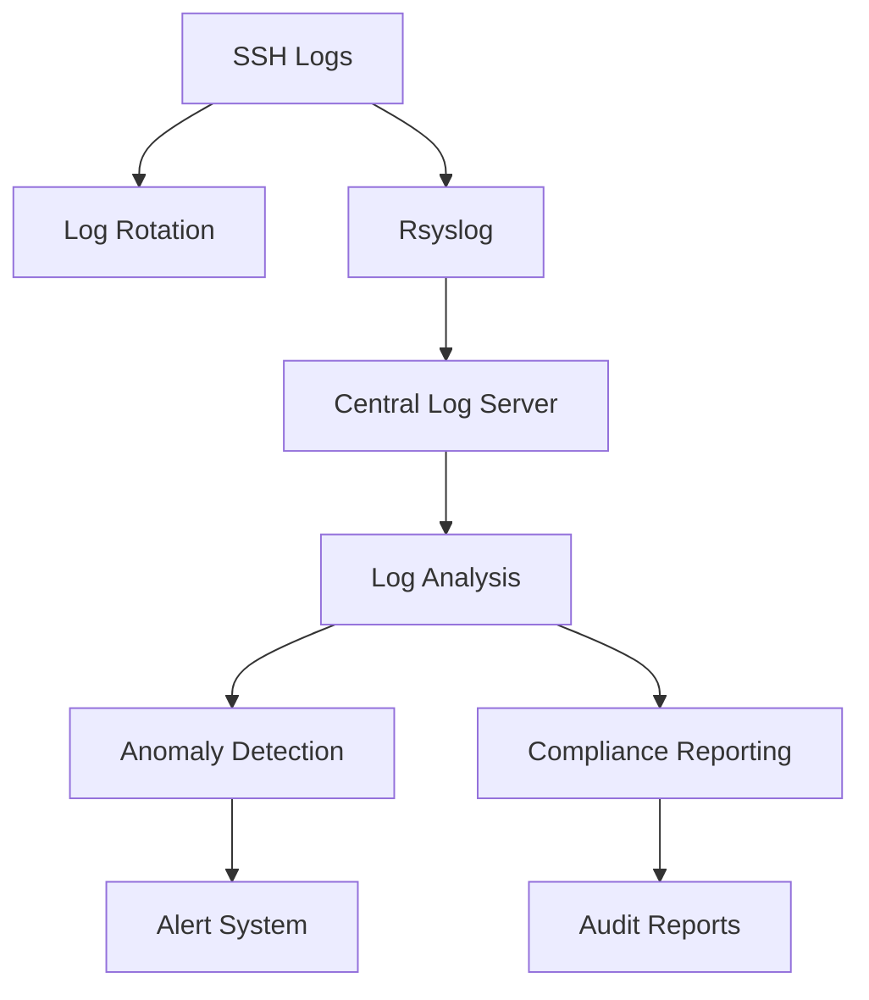
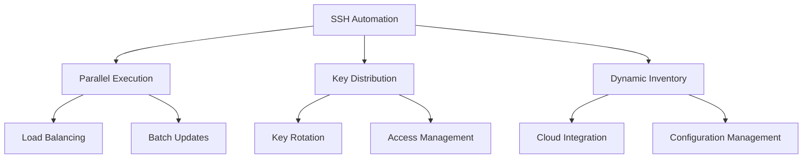
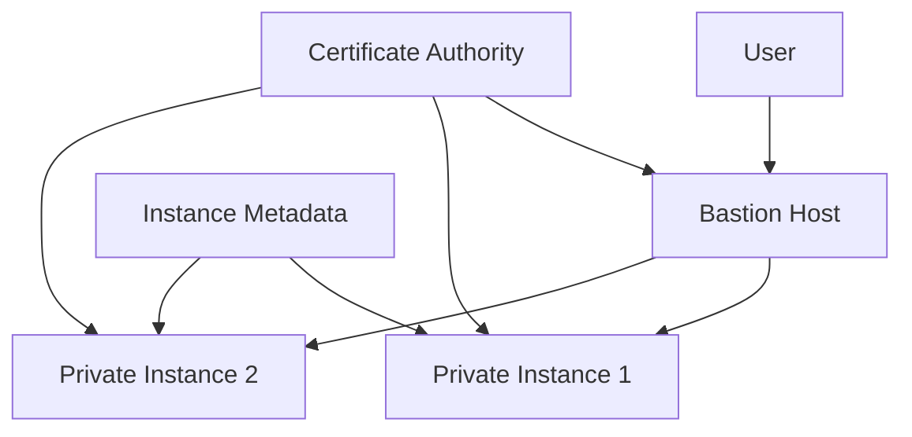
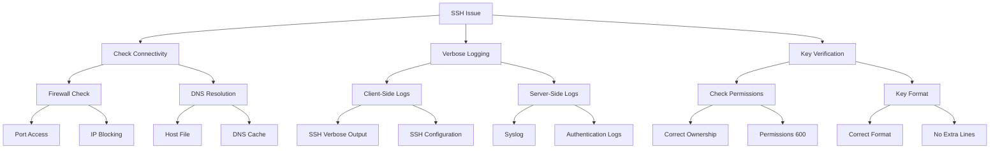

# 🚀 SSH Mastery: Advanced Techniques for Security Professionals (Part 3)

<div align="center">

```ascii
   _____  _____ _    _   __  __           _            
  / ____|/ ____| |  | | |  \/  |         | |           
 | (___ | (___ | |__| | | \  / | __ _ ___| |_ ___ _ __ 
  \___ \ \___ \|  __  | | |\/| |/ _` / __| __/ _ \ '__|
  ____) |____) | |  | | | |  | | (_| \__ \ ||  __/ |   
 |_____/|_____/|_|  |_| |_|  |_|\__,_|___/\__\___|_|   
```

</div>

## Table of Contents
10. [🛡️ Hardening SSH Security](#-hardening-ssh-security)
11. [🔍 SSH Auditing and Logging](#-ssh-auditing-and-logging)
12. [🔄 SSH Automation and Scripting](#-ssh-automation-and-scripting)
13. [🌐 SSH in Cloud Environments](#-ssh-in-cloud-environments)
14. [🧪 Advanced SSH Troubleshooting](#-advanced-ssh-troubleshooting)

---

## 🛡️ Hardening SSH Security

Enhancing SSH security is crucial for protecting your systems from unauthorized access and potential attacks. By implementing robust security measures, you can significantly reduce the risk of breaches and ensure the integrity of your SSH infrastructure.

### Key Security Measures

1. **Use Strong Encryption Algorithms**
   Configuring SSH to use strong, modern encryption algorithms is essential for maintaining the confidentiality of your connections. By specifying secure ciphers, MACs, and key exchange algorithms, you can mitigate the risk of cryptographic attacks.

   ```bash
   # In /etc/ssh/sshd_config
   Ciphers chacha20-poly1305@openssh.com,aes256-gcm@openssh.com
   MACs hmac-sha2-512-etm@openssh.com,hmac-sha2-256-etm@openssh.com
   KexAlgorithms curve25519-sha256@libssh.org,diffie-hellman-group16-sha512
   ```

   These settings enforce the use of state-of-the-art encryption methods, providing a strong foundation for secure SSH communications.

2. **Implement SSH Key Rotation**
   Regular rotation of SSH keys is a critical security practice that limits the potential impact of compromised keys. By periodically generating and distributing new keys while retiring old ones, you maintain a dynamic security posture.

   ```bash
   # Generate a new key
   ssh-keygen -t ed25519 -f ~/.ssh/id_ed25519_new -C "new_key_$(date +%Y-%m-%d)"

   # Add new key to authorized_keys on remote servers
   ssh-copy-id -i ~/.ssh/id_ed25519_new.pub user@remote_host

   # Update local SSH config
   sed -i 's/IdentityFile ~\/.ssh\/id_ed25519/IdentityFile ~\/.ssh\/id_ed25519_new/' ~/.ssh/config

   # Remove old key from remote servers
   ssh user@remote_host "sed -i '/old_key/d' ~/.ssh/authorized_keys"
   ```

   This script automates the key rotation process, ensuring that your SSH infrastructure remains secure even if individual keys are compromised.

3. **Enable Two-Factor Authentication**
   Implementing two-factor authentication (2FA) adds an extra layer of security to your SSH access. By requiring a second form of verification, you can prevent unauthorized access even if passwords or keys are compromised.

   ```bash
   # Install Google Authenticator PAM module
   sudo apt-get install libpam-google-authenticator

   # Configure PAM
   echo "auth required pam_google_authenticator.so" | sudo tee -a /etc/pam.d/sshd

   # Update sshd_config
   echo "ChallengeResponseAuthentication yes" | sudo tee -a /etc/ssh/sshd_config
   ```

   These commands set up 2FA using Google Authenticator, significantly enhancing the security of your SSH logins.

### 📊 Security Hardening Diagram



[Insert screenshot here: Diagram illustrating SSH security hardening measures, including encryption, key rotation, and 2FA implementation.]

<details>
<summary><strong>🌟 Real-World Scenario: Financial Institution</strong></summary>

Consider a large financial institution managing sensitive customer data. They implement:

1. Quarterly key rotation
2. Hardware security modules (HSMs) for key storage
3. Geo-fencing to restrict SSH access based on IP ranges
4. Continuous monitoring and alerting for unusual SSH activity

These measures provide defense-in-depth, significantly reducing the risk of unauthorized access to critical systems. By combining multiple security layers, the financial institution creates a robust SSH infrastructure that can withstand sophisticated attacks and meet stringent compliance requirements.

</details>

---

## 🔍 SSH Auditing and Logging

Effective auditing and logging are essential for maintaining security and compliance in SSH environments. By implementing comprehensive logging practices, you can gain valuable insights into SSH activity, detect potential security incidents, and maintain a detailed audit trail for forensic analysis.

### Advanced Logging Techniques

1. **Enable Verbose Logging**
   Configuring SSH to log detailed information about connections and activities provides a wealth of data for security analysis and troubleshooting.

   ```bash
   # In /etc/ssh/sshd_config
   LogLevel VERBOSE
   ```

   This setting ensures that SSH logs contain comprehensive information about authentication attempts, session details, and potential security events.

2. **Configure Rsyslog for SSH Logs**
   Centralizing SSH logs using Rsyslog allows for more efficient log management and analysis.

   ```bash
   # In /etc/rsyslog.d/10-ssh.conf
   if $programname == 'sshd' then /var/log/ssh.log
   & stop
   ```

   This configuration directs all SSH-related logs to a dedicated file, simplifying log analysis and retention.

3. **Implement Log Rotation**
   Proper log rotation is crucial for managing disk space and maintaining log integrity over time.

   ```bash
   # In /etc/logrotate.d/ssh
   /var/log/ssh.log {
       rotate 7
       daily
       compress
       missingok
       notifempty
   }
   ```

   This setup ensures that SSH logs are rotated daily, compressed, and retained for a week, balancing storage needs with the requirement for historical data.

### 🐍 SSH Log Analyzer

To effectively analyze SSH logs, you can use a Python script that processes log files and extracts valuable insights:

<details>
<summary><strong>Click to view Python script</strong></summary>

```python
import re
import sys
from collections import Counter

def analyze_ssh_log(log_file):
    ip_pattern = r'\d{1,3}\.\d{1,3}\.\d{1,3}\.\d{1,3}'
    failed_attempts = Counter()
    successful_logins = Counter()

    with open(log_file, 'r') as f:
        for line in f:
            if 'Failed password' in line:
                ip = re.search(ip_pattern, line)
                if ip:
                    failed_attempts[ip.group()] += 1
            elif 'Accepted publickey' in line:
                ip = re.search(ip_pattern, line)
                if ip:
                    successful_logins[ip.group()] += 1

    print("Top 5 IPs with failed password attempts:")
    for ip, count in failed_attempts.most_common(5):
        print(f"{ip}: {count}")

    print("\nTop 5 IPs with successful logins:")
    for ip, count in successful_logins.most_common(5):
        print(f"{ip}: {count}")

if __name__ == "__main__":
    if len(sys.argv) != 2:
        print("Usage: python ssh_log_analyzer.py /path/to/ssh.log")
        sys.exit(1)
    analyze_ssh_log(sys.argv[1])
```

</details>

This script provides valuable insights into SSH activity, helping identify potential security threats and unusual patterns.

### 📊 Log Analysis Workflow



[Insert screenshot here: Dashboard showing SSH log analysis results, including failed login attempts, successful logins, and geographic distribution of connections.]

<details>
<summary><strong>🌟 Real-World Scenario: Security Operations Center</strong></summary>

A Security Operations Center (SOC) implements:

1. Real-time log streaming to a SIEM (Security Information and Event Management) system
2. Machine learning algorithms for anomaly detection in SSH access patterns
3. Automated incident response for suspicious SSH activities (e.g., blocking IPs after multiple failed attempts)
4. Integration with threat intelligence feeds to identify known malicious IP addresses

This sophisticated setup allows the SOC to proactively identify and respond to potential SSH-based attacks. By leveraging advanced analytics and automation, the SOC can efficiently manage large volumes of SSH log data, quickly detect anomalies, and respond to threats in real-time.

</details>

---

[Content from previous sections...]

## 🔄 SSH Automation and Scripting

Automating SSH tasks can significantly improve efficiency and reduce human error in managing large-scale infrastructures. By leveraging scripts and automation tools, system administrators and security professionals can streamline operations, ensure consistency, and rapidly respond to incidents.

### Advanced Automation Techniques

1. **Parallel SSH Execution**
   Executing commands across multiple servers simultaneously can dramatically reduce the time required for bulk operations.

   ```bash
   #!/bin/bash
   hosts=(host1 host2 host3)
   command="uptime"

   for host in "${hosts[@]}"; do
       ssh "$host" "$command" &
   done

   wait
   ```

   This script demonstrates a simple yet effective method for parallel SSH execution. By running SSH commands in the background and using the `wait` command, we can achieve concurrent execution across multiple hosts.

2. **SSH Key Distribution Script**
   Automating the distribution of SSH keys is crucial for maintaining secure access across a large number of servers.

   ```bash
   #!/bin/bash
   key_file="$HOME/.ssh/id_ed25519.pub"
   hosts_file="hosts.txt"

   while read -r host; do
       ssh-copy-id -i "$key_file" "$host"
   done < "$hosts_file"
   ```

   This script reads a list of hosts from a file and distributes the specified SSH key to each of them. This ensures consistent and secure access configuration across your infrastructure.

3. **Dynamic Inventory for Configuration Management**
   In cloud environments, where servers can be created and destroyed dynamically, maintaining an up-to-date inventory is crucial for effective management.

   ```python
   #!/usr/bin/env python3
   import json
   import subprocess

   def get_ssh_hosts():
       result = subprocess.run(["aws", "ec2", "describe-instances", "--query", "Reservations[*].Instances[*].PublicDnsName", "--output", "json"], capture_output=True, text=True)
       hosts = json.loads(result.stdout)
       return [host for sublist in hosts for host in sublist if host]

   inventory = {
       "all": {
           "hosts": get_ssh_hosts(),
           "vars": {
               "ansible_user": "ec2-user",
               "ansible_ssh_private_key_file": "~/.ssh/my_aws_key.pem"
           }
       }
   }

   print(json.dumps(inventory))
   ```

   This Python script generates a dynamic inventory for Ansible by querying AWS EC2 instances. It demonstrates how to integrate SSH automation with cloud services, ensuring that your configuration management always works with an up-to-date list of hosts.

### 📊 Automation Workflow



[Insert screenshot here: Terminal output showing parallel SSH execution across multiple servers, demonstrating improved efficiency in managing large-scale infrastructure.]

<details>
<summary><strong>🌟 Real-World Scenario: DevOps Pipeline</strong></summary>

A DevOps team implements:

1. CI/CD pipeline using SSH for secure deployments
   - Automated SSH key generation for each deployment job
   - Temporary access granted to CI/CD runners using just-in-time provisioning
   - Revocation of access immediately after deployment completion

2. Automated SSH key rotation integrated with secrets management system
   - Weekly rotation of all SSH keys used in production environments
   - Integration with HashiCorp Vault for secure storage and distribution of new keys
   - Automated testing of new keys before full rollout

3. Dynamic SSH proxy for accessing internal resources securely during deployments
   - On-demand creation of SSH tunnels to access protected resources
   - Automatic closure of tunnels after task completion
   - Logging and auditing of all proxy usage for compliance

4. SSH-based health checks and rollback mechanisms
   - Continuous health checks via SSH after deployments
   - Automated rollback triggered by failed health checks
   - Notification system integrated with monitoring tools for immediate alerts

This comprehensive automation ensures secure, efficient, and consistent deployments across multiple environments. By integrating SSH automation deeply into their DevOps practices, the team achieves a high level of security and reliability in their deployment pipeline.

</details>

---

## 🌐 SSH in Cloud Environments

Leveraging SSH in cloud environments requires adapting traditional practices to cloud-native paradigms. The dynamic nature of cloud infrastructure presents unique challenges and opportunities for SSH management and security.

### Cloud-Specific SSH Techniques

1. **SSH Bastion Host Setup**
   A bastion host serves as a secure entry point for SSH access to your cloud infrastructure, allowing you to minimize the attack surface of your internal systems.

   ```bash
   # In ~/.ssh/config
   Host bastion
       HostName bastion.example.com
       User bastion_user
       IdentityFile ~/.ssh/bastion_key

   Host private-instance
       HostName 10.0.0.5
       User instance_user
       ProxyJump bastion
       IdentityFile ~/.ssh/instance_key
   ```

   This configuration allows you to securely access private instances through a bastion host, enforcing a single point of entry and simplifying firewall rules.

2. **Using Instance Metadata for Key Management**
   Cloud providers offer instance metadata services that can be leveraged for dynamic SSH key management.

   ```bash
   #!/bin/bash
   # Fetch public key from instance metadata
   curl -s http://169.254.169.254/latest/meta-data/public-keys/0/openssh-key > /home/ec2-user/.ssh/authorized_keys
   chmod 600 /home/ec2-user/.ssh/authorized_keys
   ```

   This script demonstrates how to retrieve SSH public keys from instance metadata in AWS EC2, allowing for centralized key management and easy key rotation.

3. **SSH Certificate Authority for Dynamic Environments**
   Using an SSH Certificate Authority (CA) can greatly simplify key management in dynamic cloud environments.

   ```bash
   # Generate CA key
   ssh-keygen -f ca_key -C "SSH CA Key"

   # Sign user key
   ssh-keygen -s ca_key -I "user@example.com" -n "ec2-user" -V +1w user_key.pub

   # Configure servers to trust CA
   echo "TrustedUserCAKeys /etc/ssh/ca_key.pub" >> /etc/ssh/sshd_config
   ```

   This approach allows you to manage access through short-lived certificates rather than long-lived SSH keys, enhancing security and simplifying access management in dynamic cloud environments.

### 📊 Cloud SSH Architecture



[Insert screenshot here: Diagram showing SSH architecture in a cloud environment, including bastion hosts, private instances, and certificate authority integration.]

<details>
<summary><strong>🌟 Real-World Scenario: Multi-Cloud Environment</strong></summary>

A global company with a multi-cloud infrastructure implements:

1. Centralized SSH Certificate Authority for user authentication across all clouds
   - Unified CA system that issues certificates valid across AWS, Azure, and GCP
   - Integration with corporate identity management for automatic certificate issuance and revocation
   - Short-lived certificates (12 hours) to minimize the impact of potential key compromise

2. Cloud-agnostic bastion hosts with adaptive firewall rules
   - Containerized bastion hosts that can be deployed across any cloud provider
   - Dynamic firewall rules that adapt based on user authentication and role
   - Session recording and real-time monitoring for all bastion host connections

3. Just-in-time SSH access provisioning integrated with IAM systems
   - API-driven access requests tied to specific tasks or incidents
   - Automatic access revocation after a set period or task completion
   - Detailed logging of access patterns for auditing and anomaly detection

4. SSH tunneling for secure cross-cloud data transfers
   - Automated setup of SSH tunnels for data migration between clouds
   - End-to-end encryption for all inter-cloud data transfers
   - Bandwidth monitoring and optimization to ensure efficient use of network resources

This sophisticated setup provides consistent, secure access management across diverse cloud environments. By leveraging cloud-native services and implementing advanced SSH techniques, the company achieves a high level of security, flexibility, and operational efficiency in their multi-cloud infrastructure.

</details>

---

## 🧪 Advanced SSH Troubleshooting

Effective troubleshooting is crucial for maintaining reliable SSH connections in complex environments. By mastering advanced diagnostic techniques, you can quickly identify and resolve issues, minimizing downtime and ensuring smooth operations.

### Advanced Troubleshooting Techniques

1. **SSH Verbose Debugging**
   Enabling verbose output can provide detailed insights into the SSH connection process, helping to pinpoint issues.

   ```bash
   ssh -vvv user@host
   ```

   This command initiates an SSH connection with maximum verbosity, displaying each step of the connection process, including key exchange, authentication, and channel setup.

2. **Network Diagnostics with Netcat**
   Netcat can be used to test basic connectivity and verify that the SSH port is open and accessible.

   ```bash
   nc -vz host 22
   ```

   This command attempts to connect to the specified host on port 22 (the default SSH port), providing immediate feedback on connectivity issues.

3. **Analyzing SSH Key Issues**
   When facing key-related problems, these commands can help verify the integrity and format of your SSH keys:

   ```bash
   ssh-keygen -l -f /path/to/key
   ssh-keygen -y -f /path/to/private_key
   ```

   The first command displays the fingerprint of a key, while the second extracts the public key from a private key file, allowing you to verify key pairs.

4. **Tracing SSH Connections**
   For deep-dive troubleshooting, you can use `strace` to analyze system calls made during the SSH connection process:

   ```bash
   sudo strace -f -p $(pgrep -n sshd)
   ```

   This command attaches to the most recently started SSH daemon process, showing all system calls made during SSH connections.

### 🐍 SSH Connection Tester

To systematically test and diagnose SSH connections, you can use this Python script:

<details>
<summary><strong>Click to view Python script</strong></summary>

```python
import paramiko
import socket
import time

def test_ssh_connection(hostname, username, key_filename, port=22):
    start_time = time.time()
    try:
        client = paramiko.SSHClient()
        client.set_missing_host_key_policy(paramiko.AutoAddPolicy())
        client.connect(hostname, port=port, username=username, key_filename=key_filename, timeout=5)
        end_time = time.time()
        print(f"Successfully connected to {hostname}")
        print(f"Connection time: {end_time - start_time:.2f} seconds")

        stdin, stdout, stderr = client.exec_command('uptime')
        print(f"Server uptime: {stdout.read().decode().strip()}")

        transport = client.get_transport()
        print(f"Using cipher: {transport.local_cipher}")
        print(f"Using MAC: {transport.local_mac}")
        print(f"Using compression: {transport.use_compression}")

    except paramiko.AuthenticationException:
        print(f"Authentication failed for {hostname}")
    except paramiko.SSHException as ssh_exception:
        print(f"SSH exception occurred: {ssh_exception}")
    except socket.error as socket_error:
        print(f"Socket error occurred: {socket_error}")
    finally:
        if 'client' in locals():
            client.close()

# Usage
test_ssh_connection('example.com', 'user', '/path/to/private_key')
```

</details>

This script provides a comprehensive test of SSH connectivity, including authentication, command execution, and connection details, making it an invaluable tool for diagnosing SSH issues.

### 📊 Troubleshooting Workflow



[Insert screenshot here: Terminal output showing detailed steps for troubleshooting SSH connectivity issues, including key verification, connection tracing, and analysis of verbose logs.]

<details>
<summary><strong>🌟 Real-World Scenario: Enterprise Network</strong></summary>

An enterprise IT department faces intermittent SSH connectivity issues in their network. They implement:

1. Advanced network diagnostics using `netcat` and `strace` to trace connection problems
   - Automated scripts that run periodic connectivity checks and log results
   - Integration with network monitoring tools to correlate SSH issues with other network events
   - Custom dashboards for visualizing SSH connectivity trends and identifying patterns

2. A systematic approach to key management, ensuring all SSH keys are correctly formatted and permissions are properly set
   - Centralized key management system with automated auditing of key permissions and formats
   - Scheduled jobs to detect and correct any deviations from security best practices
   - Integration with SIEM for alerting on unauthorized key changes or anomalies

3. A centralized logging system to correlate client-side and server-side SSH logs, helping to quickly identify and resolve issues
   - Log aggregation from all SSH clients and servers into a centralized Elasticsearch cluster
   - Custom Logstash filters for parsing and enriching SSH log data
   - Kibana dashboards for real-time visualization of SSH activity and error patterns
   - Automated alerting based on predefined thresholds and anomaly detection algorithms

4. Proactive monitoring and testing of SSH infrastructure
   - Continuous testing of SSH connectivity from various network segments
   - Synthetic transactions to simulate user activities and detect performance issues
   - Integration with CI/CD pipelines to test SSH connectivity after infrastructure changes

This comprehensive methodology reduces downtime, improves the reliability of SSH access across the enterprise, and enables the IT team to proactively address potential issues before they impact users. By combining advanced troubleshooting techniques with automated monitoring and management, the enterprise maintains a robust and secure SSH infrastructure.

</details>

---

[Previous content remains unchanged...]

## Conclusion (continued)

Remember that SSH security is an ongoing process. Stay informed about the latest developments in SSH technology and security practices, and regularly review and update your SSH configurations and policies to maintain a strong security posture.

To further enhance your SSH mastery:

1. **Continuous Learning**: Keep up with the latest SSH vulnerabilities, patches, and best practices by following security blogs, attending conferences, and participating in professional forums.

2. **Regular Audits**: Conduct periodic audits of your SSH infrastructure, including key inventories, access policies, and configuration reviews.

3. **Incident Response Planning**: Develop and maintain an incident response plan specific to SSH-related security events, ensuring rapid and effective action in case of a breach.

4. **Performance Optimization**: Regularly assess and optimize your SSH setup for performance, balancing security measures with operational efficiency.

5. **Documentation**: Maintain comprehensive documentation of your SSH infrastructure, including network diagrams, configuration standards, and troubleshooting procedures.

By mastering these advanced SSH techniques and maintaining a proactive approach to SSH security, you'll be well-equipped to handle the challenges of modern, complex IT environments while ensuring robust protection for your organization's critical assets.

We hope this guide has provided valuable insights and practical knowledge to elevate your SSH expertise. As you implement these advanced techniques, remember that security is a continuous journey, and SSH mastery is a powerful asset in your professional toolkit.

[Stay tuned for more deep dives into security topics, and feel free to share your feedback or ask questions!]

---

<div align="center">

```ascii
   _____  _    _ _    _ _____   _____          __  __ ______ 
  / ____|| |  | | |  | |_   _| |  __ \   /\   |  \/  |  ____|
 | (___  | |  | | |  | | | |   | |__) | /  \  | \  / | |__   
  \___ \ | |  | | |  | | | |   |  _  / / /\ \ | |\/| |  __|  
  ____) || |__| | |__| |_| |_  | | \ \/ ____ \| |  | | |____ 
 |_____/  \____/ \____/|_____| |_|  \/_/    \_\_|  |_|______|

            Thank you for your dedication to SSH security!
         May your connections be swift and your systems secure.
```

</div>
