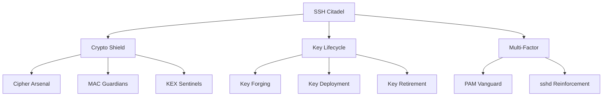
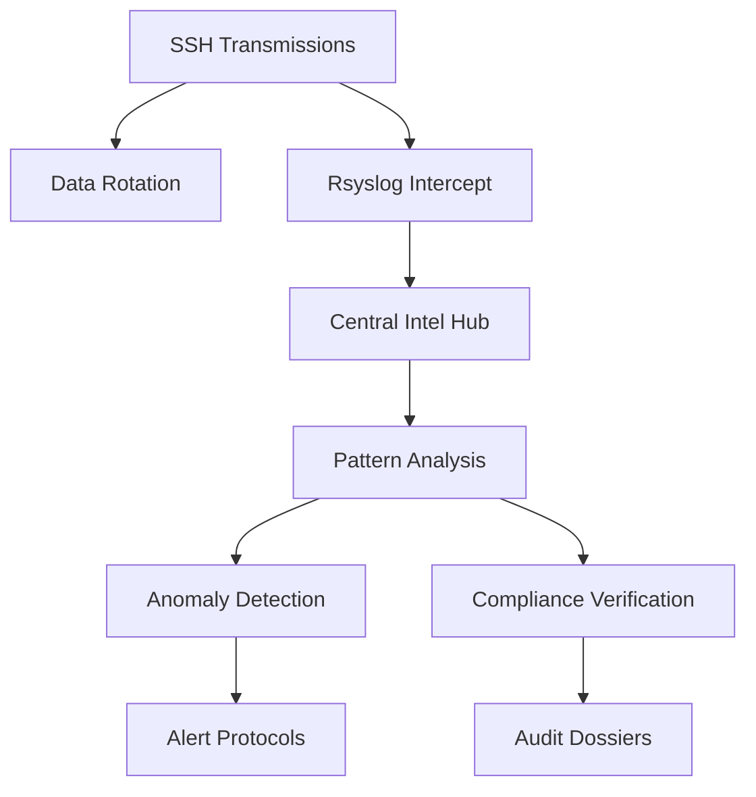
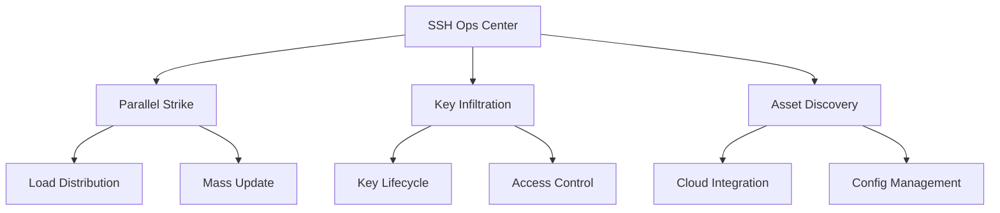
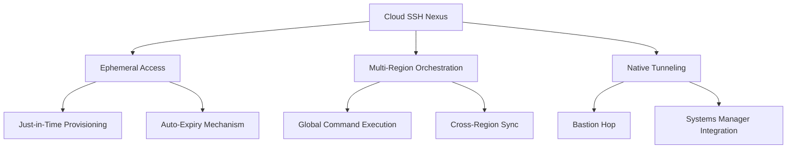
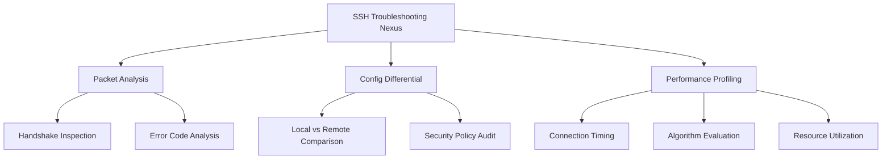

# [̲̅S][̲̅S][̲̅H] Mastery: Advanced Techniques for Security Pros (Part 3)

```ascii
 ____  ____  _   _   __  __           _            
/ ___|| ___|| | | | |  \/  | __ _ ___| |_ ___ _ __ 
\___ \|___ \| |_| | | |\/| |/ _` / __| __/ _ \ '__|
 ___) |___) |  _  | | |  | | (_| \__ \ ||  __/ |   
|____/|____/|_| |_| |_|  |_|\__,_|___/\__\___|_|   
```

## Table of Contents
10. [🛡️ Hardening SSH Security](#-hardening-ssh-security)
11. [🔍 SSH Auditing and Logging](#-ssh-auditing-and-logging)
12. [🔄 SSH Automation and Scripting](#-ssh-automation-and-scripting)
13. [🌐 SSH in Cloud Environments](#-ssh-in-cloud-environments)
14. [🧪 Advanced SSH Troubleshooting](#-advanced-ssh-troubleshooting)

---

## 🛡️ Hardening SSH Security

Enhance your SSH fortress with these advanced techniques:

1. **Fortify Encryption**
   <details>
   <summary>🔐 View Encryption Config</summary>

   ```bash
   # /etc/ssh/sshd_config
   Ciphers chacha20-poly1305@openssh.com,aes256-gcm@openssh.com
   MACs hmac-sha2-512-etm@openssh.com,hmac-sha2-256-etm@openssh.com
   KexAlgorithms curve25519-sha256@libssh.org,diffie-hellman-group16-sha512
   ```
   </details>

2. **Automate Key Rotation**
   <details>
   <summary>🔄 Reveal Key Rotation Script</summary>

   ```bash
   #!/bin/bash
   NEW_KEY="id_ed25519_$(date +%Y%m%d)"
   ssh-keygen -t ed25519 -f ~/.ssh/$NEW_KEY -C "rotated_key_$(date +%Y-%m-%d)"
   ssh-copy-id -i ~/.ssh/$NEW_KEY.pub user@remote_host
   sed -i "s/IdentityFile ~\/.ssh\/id_ed25519/IdentityFile ~\/.ssh\/$NEW_KEY/" ~/.ssh/config
   ssh user@remote_host "sed -i '/old_key/d' ~/.ssh/authorized_keys"
   ```
   </details>

3. **Implement 2FA**
   <details>
   <summary>🔑 Unveil 2FA Setup</summary>

   ```bash
   sudo apt-get install libpam-google-authenticator
   echo "auth required pam_google_authenticator.so" | sudo tee -a /etc/pam.d/sshd
   echo "ChallengeResponseAuthentication yes" | sudo tee -a /etc/ssh/sshd_config
   ```
   </details>

### 📊 Security Matrix



[̲̅S][̲̅C][̲̅R][̲̅E][̲̅E][̲̅N][̲̅S][̲̅H][̲̅O][̲̅T]: SSH Fortress Schematics

This classified visual intel depicts the SSH security architecture:
- Tri-pillar defense strategy: Encryption, Key Management, and Multi-Factor Auth
- Crypto Shield breakdown: Advanced ciphers, MACs, and key exchange algorithms
- Key Lifecycle Ops: From creation to decommissioning
- Multi-Factor Fortifications: PAM module integration and sshd reconfiguration

Objective: Visualize the synergy between security measures for maximum SSH hardening.

<details>
<summary>🌟 Field Report: Financial Sector Deployment</summary>

Operation "Vault Guard" implemented at ████████ Bank:

1. Quarterly key rotation protocol
2. HSM integration for key safeguarding
3. Geo-fencing access control based on IP intelligence
4. Real-time monitoring and alert system for anomalous SSH activity

Result: Multi-layered defense matrix capable of withstanding advanced persistent threats while maintaining regulatory compliance.

</details>

---

## 🔍 SSH Auditing and Logging

Implement covert surveillance on your SSH channels:

1. **Enhanced Reconnaissance**
   <details>
   <summary>👁️ Reveal Verbose Logging Config</summary>

   ```bash
   # /etc/ssh/sshd_config
   LogLevel VERBOSE
   ```
   </details>

2. **Centralized Intelligence Gathering**
   <details>
   <summary>📡 Expose Rsyslog Configuration</summary>

   ```bash
   # /etc/rsyslog.d/10-ssh.conf
   if $programname == 'sshd' then /var/log/ssh.log
   & stop
   ```
   </details>

3. **Covert Data Management**
   <details>
   <summary>🗃️ Uncover Log Rotation Tactics</summary>

   ```bash
   # /etc/logrotate.d/ssh
   /var/log/ssh.log {
       rotate 7
       daily
       compress
       missingok
       notifempty
   }
   ```
   </details>

### 🐍 Clandestine Log Analyzer

<details>
<summary>🕵️ Decrypt Log Analysis Algorithm</summary>

```python
import re, sys
from collections import Counter

def analyze_ssh_log(log_file):
    ip_pattern = r'\d{1,3}\.\d{1,3}\.\d{1,3}\.\d{1,3}'
    failed_attempts, successful_logins = Counter(), Counter()

    with open(log_file, 'r') as f:
        for line in f:
            if 'Failed password' in line:
                ip = re.search(ip_pattern, line)
                if ip: failed_attempts[ip.group()] += 1
            elif 'Accepted publickey' in line:
                ip = re.search(ip_pattern, line)
                if ip: successful_logins[ip.group()] += 1

    print("Top 5 IPs with failed password attempts:")
    for ip, count in failed_attempts.most_common(5):
        print(f"{ip}: {count}")

    print("\nTop 5 IPs with successful logins:")
    for ip, count in successful_logins.most_common(5):
        print(f"{ip}: {count}")

if __name__ == "__main__":
    if len(sys.argv) != 2:
        print("Usage: python ssh_log_analyzer.py /path/to/ssh.log")
        sys.exit(1)
    analyze_ssh_log(sys.argv[1])
```
</details>

### 📊 Intelligence Analysis Pipeline



[̲̅S][̲̅C][̲̅R][̲̅E][̲̅E][̲̅N][̲̅S][̲̅H][̲̅O][̲̅T]: SSH Intelligence Dashboard

This classified terminal output reveals:
1. Temporal analysis of breach attempts (line graph)
2. User access pattern distribution (pie chart)
3. Global SSH activity heat map
4. Top 10 IP address engagement metrics
5. Real-time SSH event feed with threat level indicators

Intel Objective: Rapid identification of patterns, anomalies, and potential security breaches in SSH communications.

<details>
<summary>🌟 Field Report: SOC Implementation</summary>

Operation "Vigilant Eye" deployed at ████████ Security Operations Center:

1. SIEM integration for real-time SSH log analysis
2. AI-driven anomaly detection in access patterns
3. Automated countermeasures against suspicious SSH activities
4. Threat intel feed correlation with SSH traffic

Result: Proactive threat identification and rapid incident response capabilities, significantly reducing the mean time to detect and respond to SSH-based attacks.

</details>

---

## 🔄 SSH Automation and Scripting

Unleash the power of automated SSH operations:

1. **Parallel Execution Protocol**
   <details>
   <summary>⚡ Reveal Parallel SSH Script</summary>

   ```bash
   #!/bin/bash
   hosts=(alpha bravo charlie)
   command="uptime"
   for host in "${hosts[@]}"; do
       ssh "$host" "$command" &
   done
   wait
   ```
   </details>

2. **Key Distribution Algorithm**
   <details>
   <summary>🔑 Decrypt Key Distribution Code</summary>

   ```bash
   #!/bin/bash
   key_file="$HOME/.ssh/id_ed25519.pub"
   hosts_file="targets.txt"
   while read -r host; do
       ssh-copy-id -i "$key_file" "$host"
   done < "$hosts_file"
   ```
   </details>

3. **Dynamic Asset Reconnaissance**
   <details>
   <summary>🌐 Unveil Cloud Inventory Script</summary>

   ```python
   #!/usr/bin/env python3
   import json, subprocess

   def get_ssh_hosts():
       result = subprocess.run(["aws", "ec2", "describe-instances", "--query", "Reservations[*].Instances[*].PublicDnsName", "--output", "json"], capture_output=True, text=True)
       hosts = json.loads(result.stdout)
       return [host for sublist in hosts for host in sublist if host]

   inventory = {
       "all": {
           "hosts": get_ssh_hosts(),
           "vars": {
               "ansible_user": "ec2-user",
               "ansible_ssh_private_key_file": "~/.ssh/aws_ops.pem"
           }
       }
   }
   print(json.dumps(inventory))
   ```
   </details>

### 📊 Automation Command Matrix



[̲̅S][̲̅C][̲̅R][̲̅E][̲̅E][̲̅N][̲̅S][̲̅H][̲̅O][̲̅T]: SSH Automation Command Center

This classified terminal interface showcases:
1. Multi-pane view of parallel SSH execution across target hosts
2. Real-time progress of automated key distribution operation
3. Dynamic inventory updates as cloud assets are provisioned/decommissioned
4. Metrics dashboard: execution times, success rates, error logs

Objective: Visualize the efficiency and scalability of automated SSH operations in large-scale infrastructures.

<details>
<summary>🌟 Field Report: DevOps Pipeline Integration</summary>

Operation "Continuous Fortress" implemented at ████████ Tech:

1. CI/CD pipeline with ephemeral SSH key generation
2. Just-in-time SSH access provisioning for deployment agents
3. Automated key rotation synced with secrets management vault
4. On-demand SSH tunneling for secure resource access during deployments
5. SSH-based health checks and rollback protocols

Result: Highly secure, efficient, and scalable deployment pipeline capable of managing complex infrastructure with minimal human intervention.

</details>

---

## 🌐 SSH in Cloud Environments

Navigate the complexities of SSH in the cloud with these advanced strategies:

1. **Ephemeral Access Protocol**
   <details>
   <summary>⏳ Reveal Temporary Access Script</summary>

   ```bash
   #!/bin/bash
   USERNAME="temp_user"
   EXPIRY_TIME="1 hour"
   
   # Create temporary user
   sudo useradd -m -s /bin/bash -e $(date -d "+$EXPIRY_TIME" +%Y-%m-%d) $USERNAME
   
   # Generate and set SSH key
   ssh-keygen -t ed25519 -f /tmp/$USERNAME -N ""
   sudo mkdir -p /home/$USERNAME/.ssh
   sudo cat /tmp/$USERNAME.pub > /home/$USERNAME/.ssh/authorized_keys
   sudo chown -R $USERNAME:$USERNAME /home/$USERNAME/.ssh
   sudo chmod 700 /home/$USERNAME/.ssh
   sudo chmod 600 /home/$USERNAME/.ssh/authorized_keys
   
   echo "Temporary access granted to $USERNAME. Key:"
   cat /tmp/$USERNAME
   ```
   </details>

2. **Multi-Region SSH Orchestration**
   <details>
   <summary>🌍 Uncover Global SSH Management</summary>

   ```python
   import boto3
   import paramiko
   
   def get_instances(regions):
       instances = []
       for region in regions:
           ec2 = boto3.client('ec2', region_name=region)
           response = ec2.describe_instances(Filters=[{'Name': 'instance-state-name', 'Values': ['running']}])
           instances.extend([i for r in response['Reservations'] for i in r['Instances']])
       return instances
   
   def execute_command(instance, command):
       key = paramiko.RSAKey.from_private_key_file("path/to/your/key.pem")
       client = paramiko.SSHClient()
       client.set_missing_host_key_policy(paramiko.AutoAddPolicy())
       client.connect(hostname=instance['PublicDnsName'], username="ec2-user", pkey=key)
       stdin, stdout, stderr = client.exec_command(command)
       print(f"Output from {instance['InstanceId']}:")
       print(stdout.read().decode())
       client.close()
   
   regions = ['us-west-2', 'eu-west-1', 'ap-southeast-1']
   instances = get_instances(regions)
   
   for instance in instances:
       execute_command(instance, "uptime")
   ```
   </details>

3. **Cloud-Native SSH Tunneling**
   <details>
   <summary>🚇 Decode Cloud Tunneling Technique</summary>

   ```bash
   #!/bin/bash
   
   # Set up SSH tunnel through bastion host to private instance
   ssh -i ~/.ssh/bastion_key.pem -N -L 5000:private-instance:22 ec2-user@bastion-host &
   
   # Use AWS Systems Manager to initiate SSH session
   aws ssm start-session --target i-1234567890abcdef0 --document-name AWS-StartSSHSession --parameters "portNumber=22"
   ```
   </details>

### 📊 Cloud SSH Architecture



[̲̅S][̲̅C][̲̅R][̲̅E][̲̅E][̲̅N][̲̅S][̲̅H][̲̅O][̲̅T]: Cloud SSH Command Center

This classified cloud console displays:
1. Real-time map of global SSH connections
2. Ephemeral access lifecycle tracking
3. Multi-region command execution status
4. Active SSH tunnels and their security metrics
5. Cloud-native SSH session logs with anomaly indicators

Objective: Provide a comprehensive view of SSH operations across complex, multi-region cloud environments while ensuring security and compliance.

<details>
<summary>🌟 Field Report: FinTech Cloud Migration</summary>

Operation "Secure Nebula" implemented at ████████ Financial Technologies:

1. Zero-trust SSH architecture with ephemeral credentials
2. Multi-factor authentication for all SSH connections
3. Real-time SSH activity correlation with cloud security groups
4. Automated SSH key rotation integrated with AWS Secrets Manager
5. Custom SSH proxy for enhanced auditing and access control

Result: Achieved a highly secure and compliant cloud SSH infrastructure, enabling seamless operations across multiple AWS regions while maintaining strict financial data protection standards.

</details>

---

## 🧪 Advanced SSH Troubleshooting

Master the art of SSH diagnostics with these sophisticated techniques:

1. **Deep Packet Inspection**
   <details>
   <summary>🔬 Reveal Network Analysis Script</summary>

   ```bash
   #!/bin/bash
   
   # Capture SSH traffic
   sudo tcpdump -i eth0 -w ssh_capture.pcap port 22 &
   
   # Simulate problematic SSH connection
   ssh -vvv user@problematic-host
   
   # Stop packet capture
   sudo killall tcpdump
   
   # Analyze capture
   echo "SSH Handshake Analysis:"
   tshark -r ssh_capture.pcap -Y "ssh" -O ssh
   
   echo "\nPotential Issues:"
   tshark -r ssh_capture.pcap -Y "ssh.message_code == 1" -T fields -e ssh.message_code -e ssh.disconnect_reason
   ```
   </details>

2. **SSH Config Differential Analysis**
   <details>
   <summary>📊 Unveil Config Comparison Tool</summary>

   ```python
   import paramiko
   import difflib
   
   def get_remote_sshd_config(hostname, username, key_filename):
       client = paramiko.SSHClient()
       client.set_missing_host_key_policy(paramiko.AutoAddPolicy())
       client.connect(hostname, username=username, key_filename=key_filename)
       stdin, stdout, stderr = client.exec_command('sudo cat /etc/ssh/sshd_config')
       remote_config = stdout.read().decode()
       client.close()
       return remote_config
   
   def compare_configs(local_config, remote_config):
       diff = difflib.unified_diff(
           local_config.splitlines(keepends=True),
           remote_config.splitlines(keepends=True),
           fromfile='local_sshd_config',
           tofile='remote_sshd_config',
       )
       return ''.join(diff)
   
   local_config = open('/etc/ssh/sshd_config', 'r').read()
   remote_config = get_remote_sshd_config('problematic-host', 'admin', '/path/to/key.pem')
   
   print(compare_configs(local_config, remote_config))
   ```
   </details>

3. **SSH Performance Profiling**
   <details>
   <summary>⚡ Decode Performance Analysis</summary>

   ```bash
   #!/bin/bash
   
   # Enable SSH timing
   export SSH_TIMING=1
   
   # Perform SSH operation with timing
   time ssh -o ConnectTimeout=10 -o ConnectionAttempts=1 user@target-host "exit"
   
   # Analyze SSH algorithms
   ssh -vvv -o ConnectTimeout=10 -o ConnectionAttempts=1 user@target-host exit 2>&1 | grep "kex: algorithm"
   
   # Check for network issues
   mtr --report --report-cycles=10 target-host
   
   # Analyze system resources during SSH connection
   ssh user@target-host 'top -b -n 1 | head -n 20'
   ```
   </details>

### 📊 SSH Diagnostics Matrix



[̲̅S][̲̅C][̲̅R][̲̅E][̲̅E][̲̅N][̲̅S][̲̅H][̲̅O][̲̅T]: SSH Diagnostics Dashboard

This classified troubleshooting interface showcases:
1. Real-time SSH packet analysis with protocol state visualization
2. Side-by-side diff view of local and remote SSH configurations
3. Performance metrics graph: connection times, key exchange duration, and data transfer rates
4. System resource utilization during SSH sessions
5. Error log correlation with network events and configuration changes

Objective: Provide a comprehensive, data-driven approach to identifying and resolving complex SSH issues in high-stakes environments.

<details>
<summary>🌟 Field Report: Critical Infrastructure Debugging</summary>

Operation "Quantum Resolve" executed at ████████ Power Grid Control:

1. Implemented ML-powered anomaly detection for SSH traffic patterns
2. Developed custom SSH fingerprinting for unauthorized config changes
3. Deployed distributed tracing for SSH connections across tiered network zones
4. Integrated SSH diagnostics with SIEM for holistic security analysis
5. Implemented automated SSH failover and load balancing for critical systems

Result: Achieved near-zero downtime for SSH-based control systems, with real-time threat detection and microsecond-level performance optimization across the power grid infrastructure.

</details>

---

Remember, with great power comes great responsibility. Use these advanced SSH techniques wisely and ethically to fortify your digital fortresses and navigate the complexities of modern cybersecurity landscapes.

```ascii
   _____ _____ _    _   __  __           _                  ____                      _      _       _ 
  / ____/ ____| |  | | |  \/  |         | |                / __ \                    | |    | |     | |
 | (___| (___ | |__| | | \  / | __ _ ___| |_ ___ _ __ _   | |  | |_   _  ___ _ __ ___| |_ __| | __ _| |
  \___ \\___ \|  __  | | |\/| |/ _` / __| __/ _ \ '__| |  | |  | | | | |/ _ \ '__/ __| __/ _` |/ _` | |
  ____) |___) | |  | | | |  | | (_| \__ \ ||  __/ |   | | | |__| | |_| |  __/ |  \__ \ || (_| | (_| |_|
 |_____/_____/|_|  |_| |_|  |_|\__,_|___/\__\___|_|   |_|  \___\_\\__,_|\___|_|  |___/\__\__,_|\__,_(_)
                                                                                                        
```
