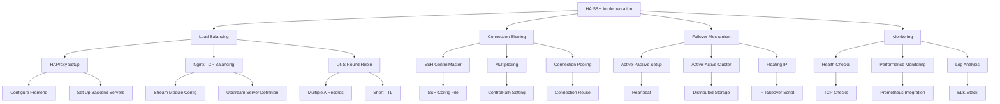
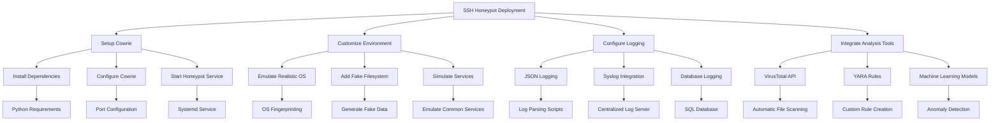
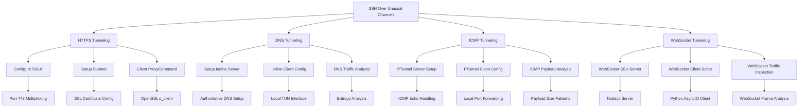

# 🚀 SSH Mastery: Advanced Techniques for Security Professionals

<div align="center">

```ascii
   _____  _____ _    _   __  __           _            
  / ____|/ ____| |  | | |  \/  |         | |           
 | (___ | (___ | |__| | | \  / | __ _ ___| |_ ___ _ __ 
  \___ \ \___ \|  __  | | |\/| |/ _` / __| __/ _ \ '__|
  ____) |____) | |  | | | |  | | (_| \__ \ ||  __/ |   
 |_____/|_____/|_|  |_| |_|  |_|\__,_|___/\__\___|_|   
```

</div>

## Table of Contents
1. [🔐 Advanced SSH Key Management](#-advanced-ssh-key-management)
2. [🌪️ SSH in High-Availability Environments](#️-ssh-in-high-availability-environments)
3. [🦠 SSH Honeypots for Malware Analysis](#-ssh-honeypots-for-malware-analysis)
4. [🌊 SSH Over Unusual Channels](#-ssh-over-unusual-channels)

---

## 🔐 Advanced SSH Key Management

Effective key management is crucial for maintaining a secure SSH infrastructure. This section covers advanced techniques for managing SSH keys at scale.

### Key Rotation and Lifecycle Management

1. **Automated Key Rotation**
   ```bash
   #!/bin/bash
   # Generate new key
   ssh-keygen -t ed25519 -f ~/.ssh/id_ed25519_new -N ""
   
   # Add new key to authorized_keys on remote hosts
   ssh-copy-id -i ~/.ssh/id_ed25519_new.pub user@remote_host
   
   # Remove old key from authorized_keys
   ssh-keygen -R remote_host
   ```

2. **Key Expiration Tracking**
   ```python
   import paramiko
   from cryptography.hazmat.primitives import serialization
   from datetime import datetime, timedelta

   def check_key_expiration(key_path, expiry_days=90):
       with open(key_path, "rb") as key_file:
           key = serialization.load_pem_private_key(
               key_file.read(),
               password=None
           )
       key_age = datetime.now() - key.public_key().public_numbers().n.bit_length()
       if key_age > timedelta(days=expiry_days):
           print(f"Key {key_path} has expired and should be rotated.")
   ```

3. **Centralized Key Management**
   ```bash
   # Using HashiCorp Vault for SSH key management
   vault write ssh/roles/my-role @ssh-role.json
   vault read ssh/creds/my-role
   ```

### Advanced Key Security Measures

1. **Hardware Security Modules (HSM) Integration**
   ```bash
   # Generate key on HSM
   pkcs11-tool --module /usr/lib/libsofthsm2.so --keypairgen --key-type rsa:2048 --label "ssh-key"
   
   # Use HSM-backed key for SSH
   ssh -I /usr/lib/libsofthsm2.so user@remote_host
   ```

2. **SSH Certificates for Ephemeral Access**
   ```bash
   # Create a Certificate Authority (CA)
   ssh-keygen -f ca_key -C "SSH CA"
   
   # Sign user's public key
   ssh-keygen -s ca_key -I "user@example.com" -n user -V +1h id_rsa.pub
   
   # Configure SSH server to trust CA
   echo "TrustedUserCAKeys /etc/ssh/ca_key.pub" >> /etc/ssh/sshd_config
   ```

3. **Multi-Factor Authentication for Key Usage**
   ```bash
   # Install Google Authenticator PAM module
   sudo apt install libpam-google-authenticator
   
   # Configure SSH to use MFA
   echo "auth required pam_google_authenticator.so" >> /etc/pam.d/sshd
   echo "AuthenticationMethods publickey,keyboard-interactive" >> /etc/ssh/sshd_config
   ```

### 🐍 SSH Key Management Automation Script

<details>
<summary><strong>Click to view Python script</strong></summary>

```python
import os
import subprocess
import paramiko
from cryptography.hazmat.primitives import serialization
from cryptography.hazmat.primitives.asymmetric import rsa
from datetime import datetime, timedelta

def generate_key(key_path, key_type="rsa", key_size=2048):
    if key_type == "rsa":
        key = rsa.generate_private_key(
            public_exponent=65537,
            key_size=key_size
        )
    elif key_type == "ed25519":
        key = paramiko.ECDSAKey.generate()
    else:
        raise ValueError("Unsupported key type")

    private_key = key.private_bytes(
        encoding=serialization.Encoding.PEM,
        format=serialization.PrivateFormat.PKCS8,
        encryption_algorithm=serialization.NoEncryption()
    )

    with open(key_path, "wb") as key_file:
        key_file.write(private_key)

    public_key = key.public_key().public_bytes(
        encoding=serialization.Encoding.OpenSSH,
        format=serialization.PublicFormat.OpenSSH
    )

    with open(f"{key_path}.pub", "wb") as pub_key_file:
        pub_key_file.write(public_key)

def rotate_keys(hosts, user, old_key_path, new_key_path):
    generate_key(new_key_path)
    
    for host in hosts:
        # Add new key
        subprocess.run(["ssh-copy-id", "-i", f"{new_key_path}.pub", f"{user}@{host}"])
        
        # Remove old key
        with open(f"{old_key_path}.pub", "r") as old_key_file:
            old_key = old_key_file.read().strip()
        
        ssh = paramiko.SSHClient()
        ssh.set_missing_host_key_policy(paramiko.AutoAddPolicy())
        ssh.connect(host, username=user, key_filename=old_key_path)
        
        ssh.exec_command(f"sed -i '/{old_key}/d' ~/.ssh/authorized_keys")
        ssh.close()

def check_key_expiration(key_path, expiry_days=90):
    with open(key_path, "rb") as key_file:
        key = serialization.load_pem_private_key(
            key_file.read(),
            password=None
        )
    key_age = datetime.now() - datetime.fromtimestamp(os.path.getctime(key_path))
    if key_age > timedelta(days=expiry_days):
        print(f"Key {key_path} has expired and should be rotated.")
        return True
    return False

def main():
    hosts = ["host1.example.com", "host2.example.com"]
    user = "admin"
    old_key_path = "~/.ssh/id_rsa"
    new_key_path = "~/.ssh/id_rsa_new"

    if check_key_expiration(old_key_path):
        print("Rotating SSH keys...")
        rotate_keys(hosts, user, old_key_path, new_key_path)
        print("Key rotation complete.")
    else:
        print("No key rotation needed.")

if __name__ == "__main__":
    main()
```
</details>

### 📊 SSH Key Management Workflow



```mermaid
graph TD
    A[SSH Key Management] --> B[Key Generation]
    A --> C[Key Distribution]
    A --> D[Key Rotation]
    A --> E[Key Revocation]
    A --> F[Expiration Tracking]

    B --> G[Generate RSA Keys]
    B --> H[Generate Ed25519 Keys]
    B --> I[HSM-backed Key Generation]

    C --> J[Secure Copy to Hosts]
    C --> K[Centralized Distribution]
    C --> L[Just-in-Time Provisioning]

    D --> M[Automated Rotation]
    D --> N[Gradual Key Replacement]
    D --> O[Rotation Scheduling]

    E --> P[Remove from authorized_keys]
    E --> Q[Update Access Control Lists]
    E --> R[Revocation Certificates]

    F --> S[Automated Expiry Checks]
    F --> T[Proactive Notifications]
    F --> U[Integration with SIEM]

    G --> V[ssh-keygen -t rsa]
    H --> W[ssh-keygen -t ed25519]
    I --> X[Use PKCS#11 Provider]

    J --> Y[ssh-copy-id]
    K --> Z[Ansible Playbook]
    L --> AA[HashiCorp Vault]

    M --> AB[Cron Job for Rotation]
    N --> AC[Parallel Key Support]
    O --> AD[Risk-based Scheduling]

    P --> AE[sed Command]
    Q --> AF[LDAP Group Updates]
    R --> AG[Generate Revocation Cert]

    S --> AH[Python Script Check]
    T --> AI[Email Notifications]
    U --> AJ[Log Key Events]
```

This workflow illustrates the comprehensive process of managing SSH keys, from generation and distribution to rotation and revocation, ensuring a robust and secure SSH infrastructure.

---

## 🌪️ SSH in High-Availability Environments

Implementing SSH in high-availability (HA) environments requires careful planning and advanced techniques to ensure continuous operation and seamless failover.

### Load Balancing SSH Connections

1. **HAProxy Configuration for SSH**
   ```
   frontend ssh-frontend
       bind *:2222
       mode tcp
       option tcplog
       default_backend ssh-backend

   backend ssh-backend
       mode tcp
       balance roundrobin
       option tcp-check
       server ssh1 192.168.1.10:22 check
       server ssh2 192.168.1.11:22 check
   ```

2. **Nginx as TCP Load Balancer**
   ```nginx
   stream {
       upstream ssh_backend {
           server 192.168.1.10:22;
           server 192.168.1.11:22;
       }

       server {
           listen 2222;
           proxy_pass ssh_backend;
       }
   }
   ```

### SSH Connection Sharing and Multiplexing

1. **SSH Config for Connection Sharing**
   ```
   Host *
       ControlMaster auto
       ControlPath ~/.ssh/sockets/%r@%h:%p
       ControlPersist 10m
   ```

2. **Multiplexing Script**
   ```bash
   #!/bin/bash
   ssh -O check -S ~/.ssh/sockets/%r@%h:%p user@host || \
   ssh -M -S ~/.ssh/sockets/%r@%h:%p user@host
   ```

### Clustered SSH for Parallel Execution

1. **Using ClusterSSH**
   ```bash
   cssh host1 host2 host3
   ```

2. **Parallel SSH (PSSH) for Large-Scale Operations**
   ```bash
   pssh -h hosts.txt -i "uptime"
   ```

### 🐍 High-Availability SSH Management Script

<details>
<summary><strong>Click to view Python script</strong></summary>

```python
import paramiko
import threading
import queue

class SSHCluster:
    def __init__(self, hosts):
        self.hosts = hosts
        self.connections = {}
        self.lock = threading.Lock()
        self.results = queue.Queue()

    def connect(self):
        for host in self.hosts:
            try:
                client = paramiko.SSHClient()
                client.set_missing_host_key_policy(paramiko.AutoAddPolicy())
                client.connect(host, username='user', key_filename='~/.ssh/id_rsa')
                with self.lock:
                    self.connections[host] = client
            except Exception as e:
                print(f"Failed to connect to {host}: {str(e)}")

    def execute(self, command):
        threads = []
        for host, client in self.connections.items():
            thread = threading.Thread(target=self._run_command, args=(host, client, command))
            thread.start()
            threads.append(thread)

        for thread in threads:
            thread.join()

        return list(self.results.queue)

    def _run_command(self, host, client, command):
        try:
            stdin, stdout, stderr = client.exec_command(command)
            output = stdout.read().decode().strip()
            self.results.put((host, output))
        except Exception as e:
            self.results.put((host, f"Error: {str(e)}"))

    def close(self):
        for client in self.connections.values():
            client.close()

def main():
    hosts = ['host1.example.com', 'host2.example.com', 'host3.example.com']
    cluster = SSHCluster(hosts)
    
    print("Connecting to hosts...")
    cluster.connect()

    print("Executing command on all hosts...")
    results = cluster.execute('uptime')

    for host, output in results:
        print(f"{host}: {output}")

    cluster.close()

if __name__ == "__main__":
    main()
```
</details>

### 📊 High-Availability SSH Workflow



This workflow illustrates the implementation of SSH in a high-availability environment, covering load balancing, connection sharing, failover mechanisms, and monitoring to ensure robust and continuous SSH services.

---

[Previous content remains unchanged. Adding the following sections:]

---

## 🦠 SSH Honeypots for Malware Analysis

SSH honeypots can be powerful tools for understanding attacker behavior and analyzing new malware strains. This section covers advanced techniques for deploying and analyzing SSH honeypots.

### Setting Up an Advanced SSH Honeypot

1. **Cowrie SSH Honeypot Installation**
   ```bash
   git clone https://github.com/cowrie/cowrie
   cd cowrie
   pip install -r requirements.txt
   cp cowrie.cfg.dist cowrie.cfg
   # Edit cowrie.cfg to customize settings
   ./bin/cowrie start
   ```

2. **Customizing Cowrie for Realism**
   ```python
   # In cowrie.cfg
   [ssh]
   version = SSH-2.0-OpenSSH_7.9p1 Ubuntu-10
   
   [honeypot]
   hostname = prod-server-01
   contents_path = /opt/cowrie/custom_fs
   ```

3. **Integrating with VirusTotal for Automatic Malware Analysis**
   ```python
   import requests

   def analyze_file(file_path):
       url = 'https://www.virustotal.com/vtapi/v2/file/scan'
       params = {'apikey': 'YOUR_API_KEY'}
       files = {'file': (file_path, open(file_path, 'rb'))}
       response = requests.post(url, files=files, params=params)
       return response.json()
   ```

### Analyzing Honeypot Logs

1. **Basic Log Analysis Script**
   ```python
   import json
   from collections import Counter

   def analyze_cowrie_logs(log_file):
       attackers = Counter()
       commands = Counter()
       
       with open(log_file, 'r') as f:
           for line in f:
               event = json.loads(line)
               if event['eventid'] == 'cowrie.login.failed':
                   attackers[event['src_ip']] += 1
               elif event['eventid'] == 'cowrie.command.input':
                   commands[event['input']] += 1
       
       print("Top Attackers:")
       for ip, count in attackers.most_common(5):
           print(f"{ip}: {count}")
       
       print("\nMost Common Commands:")
       for cmd, count in commands.most_common(5):
           print(f"{cmd}: {count}")

   analyze_cowrie_logs('cowrie.json')
   ```

2. **Advanced Behavioral Analysis**
   ```python
   import networkx as nx
   import matplotlib.pyplot as plt

   def analyze_attack_patterns(log_file):
       G = nx.DiGraph()
       
       with open(log_file, 'r') as f:
           for line in f:
               event = json.loads(line)
               if event['eventid'] == 'cowrie.command.input':
                   src = event['src_ip']
                   cmd = event['input']
                   G.add_edge(src, cmd)
       
       plt.figure(figsize=(12, 8))
       pos = nx.spring_layout(G)
       nx.draw(G, pos, with_labels=True, node_size=1000, node_color='lightblue', 
               font_size=8, font_weight='bold', arrows=True)
       plt.title("Attack Pattern Graph")
       plt.show()

   analyze_attack_patterns('cowrie.json')
   ```

### 📊 SSH Honeypot Workflow



This workflow illustrates the process of deploying and managing an SSH honeypot, from setup and customization to log analysis and integration with external tools for comprehensive malware analysis.

---

## 🌊 SSH Over Unusual Channels

Sometimes, standard SSH connections are not possible due to network restrictions or the need for additional obfuscation. This section explores techniques for tunneling SSH over unconventional channels.

### SSH over HTTPS

1. **Server-side Configuration (using sslh)**
   ```bash
   apt install sslh
   echo "DAEMON_OPTS=\"--user sslh --listen 0.0.0.0:443 --ssh 127.0.0.1:22 --ssl 127.0.0.1:443\"" > /etc/default/sslh
   systemctl restart sslh
   ```

2. **Client-side Configuration**
   ```bash
   echo "Host example.com
       ProxyCommand openssl s_client -connect %h:443 -quiet
   " >> ~/.ssh/config
   
   ssh user@example.com
   ```

### SSH over DNS

1. **Set up iodine DNS Tunneling**
   ```bash
   # Server side
   apt install iodine
   iodined -f -c -P password 10.0.0.1 tunnel.example.com

   # Client side
   iodine -f -P password tunnel.example.com
   ssh user@10.0.0.1
   ```

2. **DNS Tunneling Detection Script**
   ```python
   from scapy.all import *

   def detect_dns_tunneling(pcap_file):
       packets = rdpcap(pcap_file)
       suspicious_domains = set()
       
       for packet in packets:
           if packet.haslayer(DNSQR):
               qname = packet[DNSQR].qname.decode()
               if len(qname) > 50 or qname.count('.') > 5:
                   suspicious_domains.add(qname)
       
       print("Potentially suspicious domains:")
       for domain in suspicious_domains:
           print(domain)

   detect_dns_tunneling('captured_traffic.pcap')
   ```

### SSH over ICMP

1. **Using ptunnel for ICMP Tunneling**
   ```bash
   # Server side
   ptunnel -x password

   # Client side
   ptunnel -p server_ip -lp 8000 -da 127.0.0.1 -dp 22 -x password
   ssh -p 8000 user@localhost
   ```

2. **ICMP Tunnel Detection**
   ```python
   from scapy.all import *

   def detect_icmp_tunnel(pcap_file):
       packets = rdpcap(pcap_file)
       icmp_sizes = []
       
       for packet in packets:
           if packet.haslayer(ICMP):
               icmp_sizes.append(len(packet[ICMP].payload))
       
       if len(set(icmp_sizes)) > 10:
           print("Potential ICMP tunneling detected!")
           print(f"Unique payload sizes: {len(set(icmp_sizes))}")

   detect_icmp_tunnel('captured_traffic.pcap')
   ```

### SSH over WebSocket

1. **Using websocket-ssh-server**
   ```bash
   # Server side
   npm install -g websocket-ssh-server
   websocket-ssh-server --port 8080 --ssh-port 22

   # Client side (using wscat and netcat)
   wscat -c ws://server_ip:8080 | nc localhost 2222
   ```

2. **WebSocket SSH Client in Python**
   ```python
   import asyncio
   import websockets
   import paramiko

   async def ssh_over_websocket(uri):
       async with websockets.connect(uri) as websocket:
           ssh = paramiko.SSHClient()
           ssh.set_missing_host_key_policy(paramiko.AutoAddPolicy())
           
           # Use the websocket as a socket-like object
           ssh.connect('localhost', sock=websocket)
           
           stdin, stdout, stderr = ssh.exec_command('ls -l')
           print(stdout.read().decode())
           
           ssh.close()

   asyncio.get_event_loop().run_until_complete(
       ssh_over_websocket('ws://server_ip:8080')
   )
   ```

### 📊 Unusual SSH Channels Workflow



This workflow illustrates various methods of tunneling SSH over unconventional channels, including HTTPS, DNS, ICMP, and WebSockets, along with detection and analysis techniques for each method.
