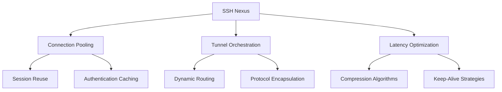
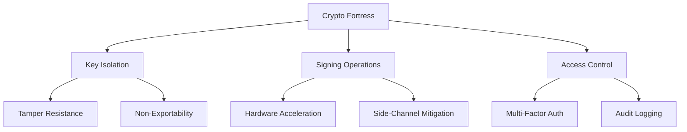
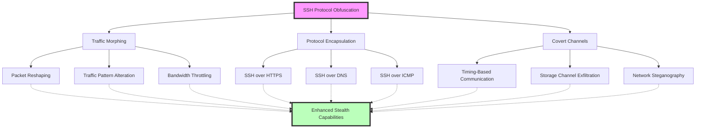

# 🔐 SSH Mastery: Advanced Techniques for Security Pros (Part 4)

```ascii
 ____  ____  _   _   __  __           _            
/ ___|| ___|| | | | |  \/  | __ _ ___| |_ ___ _ __ 
\___ \|___ \| |_| | | |\/| |/ _` / __| __/ _ \ '__|
 ___) |___) |  _  | | |  | | (_| \__ \ ||  __/ |   
|____/|____/|_| |_| |_|  |_|\__,_|___/\__\___|_|   
```

##  Table of Contents
15. [SSH Nexus and Connection Sharing](#ssh-nexus-and-connection-sharing)
16. [Hardware Security Modules (HSMs) for SSH](#hardware-security-modules-hsms-for-ssh)
17. [SSH over Non-Standard Protocols](#ssh-over-non-standard-protocols)
18. [Kernel-Level SSH Hardening](#kernel-level-ssh-hardening)
19. [SSH in IoT and Embedded Systems](#ssh-in-iot-and-embedded-systems)
20. [SSH Honeypots for Pentesters](#ssh-honeypots-for-pentesters)

---

## SSH Nexus and Connection Sharing

Elevate your SSH game with advanced nexus techniques that optimize performance and streamline connections. These methods create a centralized approach to managing SSH connections, enhancing efficiency across complex network topologies.

### Key Techniques:

1. **ControlMaster Configuration**
   ```bash
   # ~/.ssh/config
   Host *
     ControlMaster auto
     ControlPath ~/.ssh/control:%h:%p:%r
     ControlPersist 4h
   ```
   This configuration enables connection sharing, allowing multiple SSH sessions to use a single network connection. It significantly reduces connection setup time and authentication overhead for subsequent connections.

2. **Dynamic Proxy Tunneling**
   ```bash
   #!/bin/bash
   ssh -D 8080 -f -C -q -N user@remote_host
   echo "SOCKS proxy established on localhost:8080"
   ```
   This script establishes a SOCKS proxy through an SSH tunnel, enabling secure browsing and access to resources on the remote network. It's particularly useful for bypassing network restrictions or securing your traffic on untrusted networks.

3. **Reverse Port Forwarding**
   ```bash
   ssh -R 8080:localhost:80 user@remote_host
   ```
   This command sets up reverse port forwarding, allowing the remote host to access a service running on your local machine. It's invaluable for exposing local development servers or services to remote environments securely.

### Nexus Performance Matrix



This diagram illustrates the key components of the SSH Nexus concept:

- **Connection Pooling**: Enhances efficiency by reusing existing connections and caching authentication.
- **Tunnel Orchestration**: Manages complex SSH tunneling scenarios with dynamic routing and protocol encapsulation.
- **Latency Optimization**: Improves performance through compression and strategic keep-alive mechanisms.

💡 **Pro Tip**: The "Nexus" concept emphasizes the interconnectedness of these techniques, creating a centralized approach to SSH management. By implementing these strategies, you can significantly enhance SSH performance, security, and flexibility across diverse network environments.

---

## 🛡 Hardware Security Modules (HSMs) for SSH

Elevate SSH security to enterprise-grade levels by integrating cryptographic hardware.

### Key Implementation Steps:

1. **HSM Integration for Key Storage**
   ```bash
   pkcs11-tool --module /usr/lib/libsofthsm2.so --login --pin 1234 --keypairgen --key-type rsa:2048 --label "ssh-key-label"
   ```
   This command generates and stores an RSA key pair within the HSM, ensuring that private keys never leave the secure hardware environment.

2. **PKCS#11 SSH Configuration**
   ```bash
   # ~/.ssh/config
   Host secure-server
     PKCS11Provider /usr/lib/libsofthsm2.so
     IdentityFile pkcs11:object=ssh-key-label
   ```
   This configuration directs SSH to use the HSM-stored key for authentication, enhancing security by preventing direct access to the private key material.

3. **HSM-Based SSH Agent**
   ```bash
   #!/bin/bash
   ssh-agent
   ssh-add -s /usr/lib/libsofthsm2.so
   ```
   This script initializes the SSH agent and adds the HSM as a source for keys, allowing for seamless use of HSM-stored keys across multiple SSH sessions.

### HSM Security Matrix



This diagram illustrates the key security benefits of using HSMs for SSH:

- **Key Isolation**: Ensures private keys are stored in tamper-resistant hardware and cannot be exported.
- **Signing Operations**: Provides hardware acceleration for cryptographic operations and mitigates side-channel attacks.
- **Access Control**: Implements multi-factor authentication for key access and comprehensive audit logging.

### Field Report: Government Agency Deployment

Operation "Titanium Shield" implemented at a high-security intelligence agency:

1. Custom-designed HSMs with quantum-resistant algorithms
2. Geographically distributed HSM clusters for high availability
3. Biometric authentication for HSM access
4. Air-gapped HSM administration network
5. Real-time key usage pattern analysis for anomaly detection

Result: Achieved the highest level of assurance for SSH operations in classified environments, meeting stringent government security requirements.

**Pro Tip**: When implementing HSMs for SSH, consider the trade-offs between security and operational complexity. While HSMs provide unparalleled security, they require careful planning and management to ensure smooth integration with existing SSH workflows.

---

## SSH over Non-Standard Protocols

Enhance SSH connectivity in restricted network environments with these advanced techniques:

### 1.1 Stealth Techniques

1. **SSH over HTTPS**
   ```bash
   ssh -o ProxyCommand='openssl s_client -connect %h:%p -quiet' user@remote_host
   ```
   Encapsulates SSH traffic within HTTPS to bypass basic firewalls.

2. **SSH over DNS**
   ```bash
   # Server side
   iodined -f -c -P password 10.0.0.1 tunnel.yourdomain.com
   # Client side
   ssh -o ProxyCommand='nc -x localhost:5353 %h %p' user@10.0.0.1
   ```
   Uses DNS tunneling for environments where DNS queries are allowed but other traffic is restricted.

3. **SSH over ICMP**
   ```bash
   # Server side
   sudo ptunnel -tcp 22 -proxy 0.0.0.0 -daemon /var/run/ptunnel.pid
   # Client side
   sudo ptunnel -p server_ip -lp 2222 -da 127.0.0.1 -dp 22
   ssh -p 2222 user@localhost
   ```
   Encapsulates SSH traffic within ICMP echo requests and replies.

### 1.2 Protocol Obfuscation Concepts

- Traffic Morphing: Alters SSH traffic patterns to evade detection
- Protocol Encapsulation: Wraps SSH traffic within other protocols
- Covert Channels: Advanced techniques for hidden data transmission



This diagram illustrates the key concepts in SSH protocol obfuscation, showing how various techniques like Traffic Morphing, Protocol Encapsulation, and Covert Channels interact to enhance SSH stealth capabilities.

> **Pro Tip**: While these techniques can be powerful for legitimate purposes, always use them responsibly and in compliance with applicable laws and organizational policies.

## 2. Kernel-Level SSH Hardening

Enhance SSH security at the operating system core with these advanced kernel-level techniques:

### 2.1 Implementation Examples

1. **Custom Kernel Module for SSH Integrity**
   
   This module monitors access to SSH configuration files for real-time tampering detection.

   ```c
   #include <linux/module.h>
   #include <linux/kernel.h>
   #include <linux/init.h>
   #include <linux/syscalls.h>
   #include <linux/file.h>
   #include <linux/fs.h>

   // ... (rest of the code)
   ```

2. **Secure Memory Allocation for SSH**
   
   Ensures sensitive SSH data is stored in protected memory areas.

   ```c
   #include <sys/mman.h>

   void *secure_alloc(size_t size) {
       // ... (implementation details)
   }

   void secure_free(void *ptr, size_t size) {
       // ... (implementation details)
   }
   ```

3. **SSH-Specific Syscall Filtering**
   
   Restricts system calls available to SSH processes, reducing the attack surface.

   ```c
   #include <linux/filter.h>
   #include <linux/seccomp.h>
   #include <sys/prctl.h>

   // ... (rest of the code)
   ```

### 2.2 Kernel Hardening Concepts

- Memory Protection: Implements ASLR and stack canaries
- Syscall Filtering: Restricts available system calls and provides auditing
- Integrity Monitoring: Ensures kernel module integrity and performs runtime checks


This diagram illustrates the key components of kernel-level SSH hardening, showing how Memory Protection, Syscall Filtering, and Integrity Monitoring work together to create a robust security framework at the kernel level.

> **Pro Tip**: Always thoroughly test kernel-level SSH hardening in a controlled environment before deploying to production systems.

## 3. SSH in IoT and Embedded Systems

Implement robust SSH solutions for resource-constrained IoT devices:

### 3.1 Key Implementation Strategies

1. **Lightweight SSH Implementation**

   ```c
   #include <libssh/libssh.h>

  int main() {
    ssh_session my_ssh_session;
    int rc;

    // Create new SSH session
    my_ssh_session = ssh_new();
    if (my_ssh_session == NULL) {
        exit(-1);
    }

    // Set SSH connection options
    ssh_options_set(my_ssh_session, SSH_OPTIONS_HOST, "localhost");
    ssh_options_set(my_ssh_session, SSH_OPTIONS_USER, "username");

    // Connect to the SSH server
    rc = ssh_connect(my_ssh_session);
    if (rc != SSH_OK) {
        fprintf(stderr, "Error connecting to host: %s\n", ssh_get_error(my_ssh_session));
        ssh_free(my_ssh_session);
        exit(-1);
    }

    // Authenticate (using password in this example)
    rc = ssh_userauth_password(my_ssh_session, NULL, "password");
    if (rc != SSH_AUTH_SUCCESS) {
        fprintf(stderr, "Authentication failed: %s\n", ssh_get_error(my_ssh_session));
        ssh_disconnect(my_ssh_session);
        ssh_free(my_ssh_session);
        exit(-1);
    }

    printf("Successfully connected and authenticated!\n");

    // Perform SSH operations here...

    // Disconnect and free the session
    ssh_disconnect(my_ssh_session);
    ssh_free(my_ssh_session);

    return 0;
}
   ```

2. **SSH Key Management for IoT Fleets**

   ```python
   import paramiko
   import os
   from cryptography.hazmat.primitives import serialization
   from cryptography.hazmat.primitives.asymmetric import rsa

  def generate_key_pair():
    key = rsa.generate_private_key(
        public_exponent=65537,
        key_size=2048
    )
    private_key = key.private_bytes(
        encoding=serialization.Encoding.PEM,
        format=serialization.PrivateFormat.PKCS8,
        encryption_algorithm=serialization.NoEncryption()
    )
    public_key = key.public_key().public_bytes(
        encoding=serialization.Encoding.OpenSSH,
        format=serialization.PublicFormat.OpenSSH
    )
    return private_key, public_key

def update_device_key(hostname, username, current_key_file, new_public_key):
    client = paramiko.SSHClient()
    client.set_missing_host_key_policy(paramiko.AutoAddPolicy())
    
    try:
        client.connect(hostname, username=username, key_filename=current_key_file)
        
        # Add the new public key to authorized_keys
        client.exec_command(f'echo "{new_public_key.decode()}" >> ~/.ssh/authorized_keys')
        
        print(f"Successfully updated key on {hostname}")
    except Exception as e:
        print(f"Error updating key on {hostname}: {str(e)}")
    finally:
        client.close()

# Example usage
if __name__ == "__main__":
    private_key, public_key = generate_key_pair()
    
    # Save the new private key (in a secure location)
    with open("new_private_key.pem", "wb") as f:
        f.write(private_key)
    
    # Update the key on a device
    update_device_key("device_hostname", "device_username", "current_key.pem", public_key)
   ```

3. **Secure Firmware Updates over SSH**

   ```python
   import paramiko
   import hashlib

  def secure_firmware_update(hostname, username, key_filename, firmware_file):
    # Calculate firmware hash
    with open(firmware_file, "rb") as f:
        firmware_data = f.read()
        firmware_hash = hashlib.sha256(firmware_data).hexdigest()

    client = paramiko.SSHClient()
    client.set_missing_host_key_policy(paramiko.AutoAddPolicy())

    try:
        # Connect to the device
        client.connect(hostname, username=username, key_filename=key_filename)

        # Transfer firmware file
        sftp = client.open_sftp()
        sftp.put(firmware_file, "/tmp/new_firmware.bin")
        sftp.close()

        # Verify firmware integrity
        stdin, stdout, stderr = client.exec_command(f"sha256sum /tmp/new_firmware.bin")
        remote_hash = stdout.read().decode().split()[0]

        if remote_hash != firmware_hash:
            print("Firmware integrity check failed!")
            client.exec_command("rm /tmp/new_firmware.bin")
            return

        # Apply firmware update
        stdin, stdout, stderr = client.exec_command("sudo /usr/local/bin/update_firmware /tmp/new_firmware.bin")
        if stderr.channel.recv_exit_status() != 0:
            print("Firmware update failed!")
        else:
            print("Firmware updated successfully!")

    except Exception as e:
        print(f"Error during firmware update: {str(e)}")
    finally:
        client.close()

# Example usage
if __name__ == "__main__":
    secure_firmware_update("device_hostname", "device_username", "device_key.pem", "new_firmware.bin")
   ```

### 3.2 IoT SSH Security Concepts

- Resource Optimization: Uses lightweight crypto and compressed SSH
- Key Management: Implements automated rotation and centralized authentication
- Update Mechanisms: Provides OTA updates with rollback protection


This IoT Fleet SSH Management Console provides a comprehensive overview of your IoT device ecosystem's SSH security status. It displays real-time SSH session metrics, key rotation schedules, firmware update progress, resource usage statistics, and anomaly detection alerts for unexpected SSH behavior.

## 4. SSH Honeypots for Pentesters

Design decoy systems to attract and detect potential attackers, providing valuable insights for security professionals:

### 4.1 Implementation Example

```python
import paramiko
import threading
import socket

class SSHServer(paramiko.ServerInterface):
    def check_auth_password(self, username, password):
        print(f"Login attempt - Username: {username}, Password: {password}")
        return paramiko.AUTH_FAILED

    # ... (rest of the implementation)

def start_server():
    # ... (server setup and main loop)

if __name__ == '__main__':
    start_server()
```

### 4.2 SSH Honeypot Concepts

- Deception Techniques: Implements service emulation and dynamic responses
- Data Collection: Performs behavior analysis and attack pattern recognition
- Threat Intelligence: Generates IOCs and enables attacker profiling


This SSH Honeypot Analytics Dashboard provides a comprehensive view of attacker behaviors and trends. It visualizes connection attempts over time, common usernames and passwords used in brute-force attempts, geographic origin of attacks, attack technique classification, and real-time alerts for sophisticated or unusual attack patterns.

### 4.3 Best Practices

1. Isolate honeypots from production networks
2. Use realistic-looking but fake data
3. Monitor honeypots closely for signs of compromise
4. Regularly analyze collected data for new attack patterns
5. Implement logging and alerting mechanisms for real-time threat detection

> **Pro Tip**: Always obtain proper authorization before deploying honeypots in any network environment.

Remember to use these advanced SSH techniques responsibly and in compliance with all applicable laws and regulations. With great power comes great responsibility in the world of cybersecurity.

```ascii
   _____  _____ _    _   __  __           _             
  / ____|/ ____| |  | | |  \/  |         | |            
 | (___ | (___ | |__| | | \  / | __ _ ___| |_ ___ _ __  
  \___ \ \___ \|  __  | | |\/| |/ _` / __| __/ _ \ '__| 
  ____) |___) | |  | | | |  | | (_| \__ \ ||  __/ |    
 |_____/_____/|_|  |_| |_|  |_|\__,_|___/\__\___|_|    

          Secure Shell, Secure Future!
```
