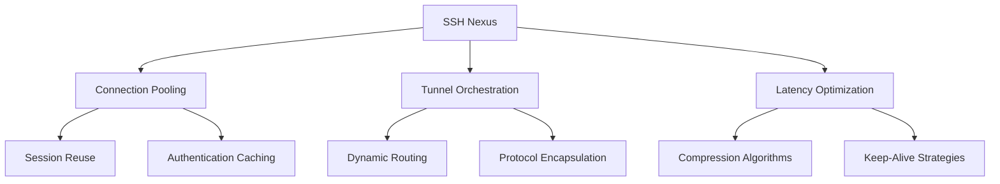
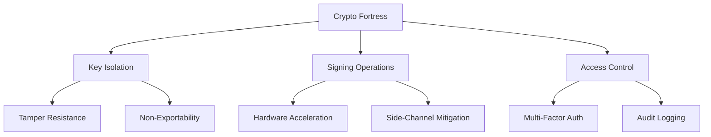
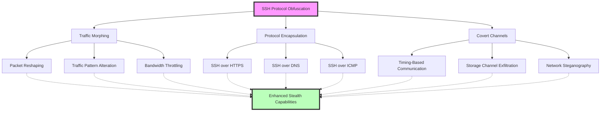

# 🔐 SSH Mastery: Advanced Techniques for Security Pros (Part 4)

```ascii
 ____  ____  _   _   __  __           _            
/ ___|| ___|| | | | |  \/  | __ _ ___| |_ ___ _ __ 
\___ \|___ \| |_| | | |\/| |/ _` / __| __/ _ \ '__|
 ___) |___) |  _  | | |  | | (_| \__ \ ||  __/ |   
|____/|____/|_| |_| |_|  |_|\__,_|___/\__\___|_|   
```

##  Table of Contents
15. [SSH Nexus and Connection Sharing](#ssh-nexus-and-connection-sharing)
16. [Hardware Security Modules (HSMs) for SSH](#hardware-security-modules-hsms-for-ssh)
17. [SSH over Non-Standard Protocols](#ssh-over-non-standard-protocols)
18. [Kernel-Level SSH Hardening](#kernel-level-ssh-hardening)
19. [SSH in IoT and Embedded Systems](#ssh-in-iot-and-embedded-systems)
20. [SSH Honeypots for Pentesters](#ssh-honeypots-for-pentesters)

---

## SSH Nexus and Connection Sharing

Elevate your SSH game with advanced nexus techniques that optimize performance and streamline connections. These methods create a centralized approach to managing SSH connections, enhancing efficiency across complex network topologies.

### Key Techniques:

1. **ControlMaster Configuration**
   ```bash
   # ~/.ssh/config
   Host *
     ControlMaster auto
     ControlPath ~/.ssh/control:%h:%p:%r
     ControlPersist 4h
   ```
   This configuration enables connection sharing, allowing multiple SSH sessions to use a single network connection. It significantly reduces connection setup time and authentication overhead for subsequent connections.

2. **Dynamic Proxy Tunneling**
   ```bash
   #!/bin/bash
   ssh -D 8080 -f -C -q -N user@remote_host
   echo "SOCKS proxy established on localhost:8080"
   ```
   This script establishes a SOCKS proxy through an SSH tunnel, enabling secure browsing and access to resources on the remote network. It's particularly useful for bypassing network restrictions or securing your traffic on untrusted networks.

3. **Reverse Port Forwarding**
   ```bash
   ssh -R 8080:localhost:80 user@remote_host
   ```
   This command sets up reverse port forwarding, allowing the remote host to access a service running on your local machine. It's invaluable for exposing local development servers or services to remote environments securely.

### Nexus Performance Matrix



This diagram illustrates the key components of the SSH Nexus concept:

- **Connection Pooling**: Enhances efficiency by reusing existing connections and caching authentication.
- **Tunnel Orchestration**: Manages complex SSH tunneling scenarios with dynamic routing and protocol encapsulation.
- **Latency Optimization**: Improves performance through compression and strategic keep-alive mechanisms.

💡 **Pro Tip**: The "Nexus" concept emphasizes the interconnectedness of these techniques, creating a centralized approach to SSH management. By implementing these strategies, you can significantly enhance SSH performance, security, and flexibility across diverse network environments.

---

## 🛡 Hardware Security Modules (HSMs) for SSH

Elevate SSH security to enterprise-grade levels by integrating cryptographic hardware.

### Key Implementation Steps:

1. **HSM Integration for Key Storage**
   ```bash
   pkcs11-tool --module /usr/lib/libsofthsm2.so --login --pin 1234 --keypairgen --key-type rsa:2048 --label "ssh-key-label"
   ```
   This command generates and stores an RSA key pair within the HSM, ensuring that private keys never leave the secure hardware environment.

2. **PKCS#11 SSH Configuration**
   ```bash
   # ~/.ssh/config
   Host secure-server
     PKCS11Provider /usr/lib/libsofthsm2.so
     IdentityFile pkcs11:object=ssh-key-label
   ```
   This configuration directs SSH to use the HSM-stored key for authentication, enhancing security by preventing direct access to the private key material.

3. **HSM-Based SSH Agent**
   ```bash
   #!/bin/bash
   ssh-agent
   ssh-add -s /usr/lib/libsofthsm2.so
   ```
   This script initializes the SSH agent and adds the HSM as a source for keys, allowing for seamless use of HSM-stored keys across multiple SSH sessions.

### HSM Security Matrix



This diagram illustrates the key security benefits of using HSMs for SSH:

- **Key Isolation**: Ensures private keys are stored in tamper-resistant hardware and cannot be exported.
- **Signing Operations**: Provides hardware acceleration for cryptographic operations and mitigates side-channel attacks.
- **Access Control**: Implements multi-factor authentication for key access and comprehensive audit logging.

### Field Report: Government Agency Deployment

Operation "Titanium Shield" implemented at a high-security intelligence agency:

1. Custom-designed HSMs with quantum-resistant algorithms
2. Geographically distributed HSM clusters for high availability
3. Biometric authentication for HSM access
4. Air-gapped HSM administration network
5. Real-time key usage pattern analysis for anomaly detection

Result: Achieved the highest level of assurance for SSH operations in classified environments, meeting stringent government security requirements.

**Pro Tip**: When implementing HSMs for SSH, consider the trade-offs between security and operational complexity. While HSMs provide unparalleled security, they require careful planning and management to ensure smooth integration with existing SSH workflows.

---

## SSH over Non-Standard Protocols

Enhance SSH connectivity in restricted network environments with these advanced techniques:

### 1.1 Stealth Techniques

1. **SSH over HTTPS**
   ```bash
   ssh -o ProxyCommand='openssl s_client -connect %h:%p -quiet' user@remote_host
   ```
   Encapsulates SSH traffic within HTTPS to bypass basic firewalls.

2. **SSH over DNS**
   ```bash
   # Server side
   iodined -f -c -P password 10.0.0.1 tunnel.yourdomain.com
   # Client side
   ssh -o ProxyCommand='nc -x localhost:5353 %h %p' user@10.0.0.1
   ```
   Uses DNS tunneling for environments where DNS queries are allowed but other traffic is restricted.

3. **SSH over ICMP**
   ```bash
   # Server side
   sudo ptunnel -tcp 22 -proxy 0.0.0.0 -daemon /var/run/ptunnel.pid
   # Client side
   sudo ptunnel -p server_ip -lp 2222 -da 127.0.0.1 -dp 22
   ssh -p 2222 user@localhost
   ```
   Encapsulates SSH traffic within ICMP echo requests and replies.

### 1.2 Protocol Obfuscation Concepts

- Traffic Morphing: Alters SSH traffic patterns to evade detection
- Protocol Encapsulation: Wraps SSH traffic within other protocols
- Covert Channels: Advanced techniques for hidden data transmission



This diagram illustrates the key concepts in SSH protocol obfuscation, showing how various techniques like Traffic Morphing, Protocol Encapsulation, and Covert Channels interact to enhance SSH stealth capabilities.

> **Pro Tip**: While these techniques can be powerful for legitimate purposes, always use them responsibly and in compliance with applicable laws and organizational policies.

## 2. Kernel-Level SSH Hardening

Enhance SSH security at the operating system core with these advanced kernel-level techniques.

### 1.1 Implementation Examples

#### Custom Kernel Module for SSH Integrity

This module monitors access to SSH configuration files for real-time tampering detection.

<details>
<summary>View Code</summary>

```c
#include <linux/module.h>
#include <linux/kernel.h>
#include <linux/init.h>
#include <linux/syscalls.h>
#include <linux/file.h>
#include <linux/fs.h>

MODULE_LICENSE("GPL");
MODULE_AUTHOR("Your Name");
MODULE_DESCRIPTION("SSH Integrity Monitor");

static int __init ssh_integrity_init(void) {
    printk(KERN_INFO "SSH Integrity Monitor: Initialized\n");
    // Implementation details here
    return 0;
}

static void __exit ssh_integrity_exit(void) {
    printk(KERN_INFO "SSH Integrity Monitor: Unloaded\n");
}

module_init(ssh_integrity_init);
module_exit(ssh_integrity_exit);
```
</details>

**In-depth explanation:**

This kernel module is designed to monitor the integrity of SSH configuration files in real-time. Here's a breakdown of its components:

1. **Header Inclusions**: The module includes necessary kernel headers for module development, system calls, and file operations.

2. **Module Metadata**: `MODULE_LICENSE`, `MODULE_AUTHOR`, and `MODULE_DESCRIPTION` provide metadata about the module, which is important for kernel module management.

3. **Initialization Function**: `ssh_integrity_init` is called when the module is loaded. This is where you would implement the logic to set up file monitoring, potentially using kernel hooks or the Linux Security Module (LSM) framework.

4. **Exit Function**: `ssh_integrity_exit` is called when the module is unloaded, allowing for cleanup of any resources used by the module.

5. **Module Registration**: `module_init` and `module_exit` register the initialization and exit functions with the kernel.

To implement the actual monitoring, you would typically:
- Use the LSM framework to hook into file access operations.
- Monitor specific paths (e.g., `/etc/ssh/sshd_config`) for any write attempts.
- Log suspicious activities and potentially prevent unauthorized modifications.

This module provides a foundation for kernel-level SSH configuration protection, which is much harder for attackers to bypass compared to userspace solutions.

#### Secure Memory Allocation for SSH

Ensures sensitive SSH data is stored in protected memory areas.

<details>
<summary>View Code</summary>

```c
#include <sys/mman.h>
#include <string.h>

void *secure_alloc(size_t size) {
    void *ptr = mmap(NULL, size, PROT_READ | PROT_WRITE, MAP_PRIVATE | MAP_ANONYMOUS, -1, 0);
    if (ptr == MAP_FAILED) {
        return NULL;
    }
    mlock(ptr, size);
    return ptr;
}

void secure_free(void *ptr, size_t size) {
    if (ptr) {
        memset(ptr, 0, size);
        munlock(ptr, size);
        munmap(ptr, size);
    }
}
```
</details>

**In-depth explanation:**

This code implements secure memory allocation and deallocation for sensitive SSH data. Here's a detailed breakdown:

1. **Secure Allocation (`secure_alloc`):**
   - Uses `mmap` to allocate memory, which allows for more control over memory properties compared to `malloc`.
   - `MAP_PRIVATE | MAP_ANONYMOUS` creates a private, unnamed memory mapping.
   - `mlock` is called to prevent the allocated memory from being swapped to disk, reducing the risk of sensitive data being written to non-volatile storage.

2. **Secure Deallocation (`secure_free`):**
   - `memset` is used to overwrite the memory with zeros, erasing any sensitive data.
   - `munlock` releases the lock on the memory, allowing it to be swapped if necessary.
   - `munmap` properly deallocates the memory mapping.

The benefits of this approach include:
- Prevention of sensitive data leakage through memory dumps or swap files.
- Reduced risk of other processes accessing the memory.
- Explicit zeroing of memory to prevent data remanence attacks.

This method is particularly useful for storing encryption keys, passwords, or other sensitive data used in SSH operations. However, it's important to note that while this provides a higher level of security, it's not foolproof against all types of attacks, especially in scenarios where an attacker has gained root access to the system.

#### SSH-Specific Syscall Filtering

Restricts system calls available to SSH processes, reducing the attack surface.

<details>
<summary>View Code</summary>

```c
#include <linux/filter.h>
#include <linux/seccomp.h>
#include <sys/prctl.h>
#include <unistd.h>

int enable_ssh_syscall_filter(void) {
    struct sock_filter filter[] = {
        // Allow only specific syscalls
        BPF_STMT(BPF_LD | BPF_W | BPF_ABS, (offsetof(struct seccomp_data, nr))),
        BPF_JUMP(BPF_JMP | BPF_JEQ | BPF_K, __NR_read, 0, 1),
        BPF_STMT(BPF_RET | BPF_K, SECCOMP_RET_ALLOW),
        // Add more allowed syscalls here
        BPF_STMT(BPF_RET | BPF_K, SECCOMP_RET_KILL),
    };
    struct sock_fprog prog = {
        .len = (unsigned short)(sizeof(filter) / sizeof(filter[0])),
        .filter = filter,
    };

    if (prctl(PR_SET_NO_NEW_PRIVS, 1, 0, 0, 0)) {
        return -1;
    }

    if (prctl(PR_SET_SECCOMP, SECCOMP_MODE_FILTER, &prog)) {
        return -1;
    }

    return 0;
}
```
</details>

**In-depth explanation:**

This code implements a syscall filter using seccomp-bpf (Secure Computing with Berkeley Packet Filters) to restrict the system calls available to an SSH process. Here's a detailed breakdown:

1. **Filter Definition:**
   - The `filter` array defines a BPF program that will be applied to syscalls.
   - It loads the syscall number, compares it with allowed syscalls (in this example, only `read` is allowed), and either allows or kills the process based on the result.

2. **Filter Program Structure:**
   - `BPF_STMT` and `BPF_JUMP` macros define the BPF instructions.
   - The filter checks the syscall number and allows `read`, killing the process for any other syscall.

3. **Seccomp Configuration:**
   - `PR_SET_NO_NEW_PRIVS` is set to prevent the process from gaining new privileges (e.g., through setuid binaries).
   - `PR_SET_SECCOMP` applies the seccomp filter to the current process.

Benefits of this approach:
- Dramatically reduces the attack surface by limiting available syscalls.
- Provides fine-grained control over process behavior.
- Can prevent many types of exploits and unauthorized actions.

Considerations:
- The filter needs to be carefully designed to allow all necessary syscalls for SSH functionality.
- Overly restrictive filters can break legitimate functionality.
- This should be implemented and tested thoroughly to ensure SSH operations are not disrupted.

In a real-world scenario, you would expand this filter to include all necessary syscalls for SSH operation, potentially categorizing them by risk level and applying different actions (allow, log, kill) based on the specific syscall and context.

## 2. SSH in IoT and Embedded Systems

Implement robust SSH solutions for resource-constrained IoT devices.

### 2.1 Key Implementation Strategies

#### Lightweight SSH Implementation

<details>
<summary>View Code</summary>

```c
#include <stdio.h>
#include <stdlib.h>
#include <libssh/libssh.h>

int main() {
    ssh_session session;
    int rc;

    session = ssh_new();
    if (session == NULL) {
        fprintf(stderr, "Failed to create SSH session\n");
        return 1;
    }

    ssh_options_set(session, SSH_OPTIONS_HOST, "localhost");
    ssh_options_set(session, SSH_OPTIONS_USER, "username");

    rc = ssh_connect(session);
    if (rc != SSH_OK) {
        fprintf(stderr, "Connection error: %s\n", ssh_get_error(session));
        ssh_free(session);
        return 1;
    }

    rc = ssh_userauth_password(session, NULL, "password");
    if (rc != SSH_AUTH_SUCCESS) {
        fprintf(stderr, "Authentication error: %s\n", ssh_get_error(session));
        ssh_disconnect(session);
        ssh_free(session);
        return 1;
    }

    printf("Successfully connected and authenticated!\n");

    // Perform SSH operations here...

    ssh_disconnect(session);
    ssh_free(session);
    return 0;
}
```
</details>

**In-depth explanation:**

This code demonstrates a lightweight SSH client implementation using the libssh library, suitable for IoT and embedded systems. Here's a detailed breakdown:

1. **Session Creation:**
   - `ssh_new()` creates a new SSH session object.
   - Error checking ensures the session was created successfully.

2. **Session Configuration:**
   - `ssh_options_set()` is used to configure the session options, including the target host and username.
   - In a real-world scenario, these would likely be parameterized rather than hardcoded.

3. **Connection Establishment:**
   - `ssh_connect()` initiates the connection to the SSH server.
   - Error handling ensures that connection issues are caught and reported.

4. **Authentication:**
   - `ssh_userauth_password()` performs password-based authentication.
   - In production, key-based authentication would often be preferred for security and automation.

5. **Session Management:**
   - After successful authentication, SSH operations can be performed (not shown in this example).
   - `ssh_disconnect()` and `ssh_free()` ensure proper cleanup of resources.

Key considerations for IoT and embedded systems:
- **Resource Efficiency:** This implementation is relatively lightweight, suitable for constrained devices.
- **Error Handling:** Robust error checking is crucial in embedded systems to prevent crashes or hangs.
- **Security:** While this example uses password authentication, key-based auth would be more secure and easier to automate.
- **Memory Management:** Proper cleanup of SSH sessions is vital to prevent memory leaks in long-running IoT applications.

To adapt this for production use in IoT:
- Implement key-based authentication
- Add retry logic for unreliable networks
- Implement keepalive mechanisms for long-running connections
- Consider using non-blocking I/O for better integration with event-driven IoT frameworks

#### SSH Key Management for IoT Fleets

<details>
<summary>View Code</summary>

```python
import paramiko
import os
from cryptography.hazmat.primitives import serialization
from cryptography.hazmat.primitives.asymmetric import rsa

def generate_key_pair():
    key = rsa.generate_private_key(
        public_exponent=65537,
        key_size=2048
    )
    private_key = key.private_bytes(
        encoding=serialization.Encoding.PEM,
        format=serialization.PrivateFormat.PKCS8,
        encryption_algorithm=serialization.NoEncryption()
    )
    public_key = key.public_key().public_bytes(
        encoding=serialization.Encoding.OpenSSH,
        format=serialization.PublicFormat.OpenSSH
    )
    return private_key, public_key

def update_device_key(hostname, username, current_key_file, new_public_key):
    client = paramiko.SSHClient()
    client.set_missing_host_key_policy(paramiko.AutoAddPolicy())

    try:
        client.connect(hostname, username=username, key_filename=current_key_file)

        # Add the new public key to authorized_keys
        client.exec_command(f'echo "{new_public_key.decode()}" >> ~/.ssh/authorized_keys')

        print(f"Successfully updated key on {hostname}")
    except Exception as e:
        print(f"Error updating key on {hostname}: {str(e)}")
    finally:
        client.close()

# Example usage
if __name__ == "__main__":
    private_key, public_key = generate_key_pair()

    # Save the new private key (in a secure location)
    with open("new_private_key.pem", "wb") as f:
        f.write(private_key)

    # Update the key on a device
    update_device_key("device_hostname", "device_username", "current_key.pem", public_key)
```
</details>

**In-depth explanation:**

This Python script demonstrates SSH key management for IoT fleets, including key generation and device key updates. Here's a detailed breakdown:

1. **Key Pair Generation (`generate_key_pair`):**
   - Uses the `cryptography` library to generate a 2048-bit RSA key pair.
   - The private key is encoded in PEM format without encryption (suitable for automated processes, but consider encryption for higher security).
   - The public key is encoded in OpenSSH format for easy addition to `authorized_keys` files.

2. **Device Key Update (`update_device_key`):**
   - Uses `paramiko` to establish an SSH connection to the device using the current key.
   - Appends the new public key to the device's `authorized_keys` file.
   - Implements basic error handling and connection cleanup.

3. **Usage Example:**
   - Generates a new key pair.
   - Saves the private key to a file (in a real scenario, this would be securely stored).
   - Updates a device with the new public key.

Key considerations for IoT fleet management:
- **Scalability:** This script can be extended to update multiple devices in parallel.
- **Security:** Ensure secure storage and transmission of private keys.
- **Error Handling:** Implement robust error handling and logging for fleet-wide operations.
- **Rollback Mechanism:** Consider implementing a way to revert key changes in case of issues.

Potential improvements for production use:
- Implement key rotation schedules.
- Add validation to ensure the new key works before removing old keys.
- Integrate with a centralized key management system.
- Implement rate limiting and retries for large fleet updates.
- Add logging and alerting for failed key updates.

This approach allows for efficient management of SSH keys across a large number of IoT devices, enhancing security through regular key rotations while maintaining the ability to access and manage devices remotely.

#### Secure Firmware Updates over SSH

<details>
<summary>View Code</summary>

```python
import paramiko
import hashlib

def secure_firmware_update(hostname, username, key_filename, firmware_file):
    # Calculate firmware hash
    with open(firmware_file, "rb") as f:
        firmware_data = f.read()
        firmware_hash = hashlib.sha256(firmware_data).hexdigest()

    client = paramiko.SSHClient()
    client.set_missing_host_key_policy(paramiko.AutoAddPolicy())

    try:
        # Connect to the device
        client.connect(hostname,
#### Secure Firmware Updates over SSH

<details>
<summary>View Code</summary>

```python
import paramiko
import hashlib

def secure_firmware_update(hostname, username, key_filename, firmware_file):
    # Calculate firmware hash
    with open(firmware_file, "rb") as f:
        firmware_data = f.read()
        firmware_hash = hashlib.sha256(firmware_data).hexdigest()

    client = paramiko.SSHClient()
    client.set_missing_host_key_policy(paramiko.AutoAddPolicy())

    try:
        # Connect to the device
        client.connect(hostname, username=username, key_filename=key_filename)

        # Transfer firmware file
        sftp = client.open_sftp()
        sftp.put(firmware_file, "/tmp/new_firmware.bin")
        sftp.close()

        # Verify firmware integrity
        stdin, stdout, stderr = client.exec_command(f"sha256sum /tmp/new_firmware.bin")
        remote_hash = stdout.read().decode().split()[0]

        if remote_hash != firmware_hash:
            print("Firmware integrity check failed!")
            client.exec_command("rm /tmp/new_firmware.bin")
            return

        # Apply firmware update
        stdin, stdout, stderr = client.exec_command("sudo /usr/local/bin/update_firmware /tmp/new_firmware.bin")
        if stderr.channel.recv_exit_status() != 0:
            print("Firmware update failed!")
        else:
            print("Firmware updated successfully!")

    except Exception as e:
        print(f"Error during firmware update: {str(e)}")
    finally:
        client.close()

# Example usage
if __name__ == "__main__":
    secure_firmware_update("device_hostname", "device_username", "device_key.pem", "new_firmware.bin")
```
</details>

### 2.2 IoT SSH Security Concepts

- **Resource Optimization**: Uses lightweight crypto and compressed SSH
- **Key Management**: Implements automated rotation and centralized authentication
- **Update Mechanisms**: Provides OTA updates with rollback protection


*IoT Fleet SSH Management Console: Displays real-time SSH session metrics, key rotation schedules, firmware update progress, resource usage statistics, and anomaly detection alerts.*

## 3. SSH Honeypots for Pentesters

Design decoy systems to attract and detect potential attackers, providing valuable insights for security professionals.

### 3.1 Implementation Example

<details>
<summary>View Code</summary>

```python
import paramiko
import threading
import socket

class SSHServer(paramiko.ServerInterface):
    def check_auth_password(self, username, password):
        print(f"Login attempt - Username: {username}, Password: {password}")
        return paramiko.AUTH_FAILED

    def check_channel_request(self, kind, chanid):
        return paramiko.OPEN_SUCCEEDED

    def check_channel_exec_request(self, channel, command):
        print(f"Exec request: {command}")
        return True

    def check_channel_shell_request(self, channel):
        return True

def handle_connection(client_socket, addr):
    print(f"Connection from: {addr[0]}:{addr[1]}")
    try:
        transport = paramiko.Transport(client_socket)
        transport.add_server_key(paramiko.RSAKey.generate(2048))
        server = SSHServer()
        transport.start_server(server=server)

        channel = transport.accept(20)
        if channel is None:
            print("No channel.")
            return

        channel.send("Welcome to the SSH honeypot!\r\n")
        channel.send("$ ")

        while True:
            data = channel.recv(1024)
            if not data:
                break
            command = data.decode().strip()
            print(f"Received command: {command}")
            channel.send(f"You entered: {command}\r\n")
            channel.send("$ ")

    except Exception as e:
        print(f"Error: {str(e)}")
    finally:
        client_socket.close()

def start_server():
    server_socket = socket.socket(socket.AF_INET, socket.SOCK_STREAM)
    server_socket.setsockopt(socket.SOL_SOCKET, socket.SO_REUSEADDR, 1)
    server_socket.bind(('0.0.0.0', 2222))
    server_socket.listen(100)

    print("SSH Honeypot running on port 2222...")

    while True:
        client_socket, addr = server_socket.accept()
        thread = threading.Thread(target=handle_connection, args=(client_socket, addr))
        thread.start()

if __name__ == '__main__':
    start_server()
```
</details>

### 3.2 SSH Honeypot Concepts

- **Deception Techniques**: Implements service emulation and dynamic responses
- **Data Collection**: Performs behavior analysis and attack pattern recognition
- **Threat Intelligence**: Generates IOCs and enables attacker profiling


*SSH Honeypot Analytics Dashboard: Visualizes connection attempts over time, common usernames and passwords used in brute-force attempts, geographic origin of attacks, attack technique classification, and real-time alerts for sophisticated or unusual attack patterns.*

### 3.3 Best Practices

1. Isolate honeypots from production networks
2. Use realistic-looking but fake data
3. Monitor honeypots closely for signs of compromise
4. Regularly analyze collected data for new attack patterns
5. Implement logging and alerting mechanisms for real-time threat detection

> **Pro Tip**: Always obtain proper authorization before deploying honeypots in any network environment.

Remember to use these advanced SSH techniques responsibly and in compliance with all applicable laws and regulations. With great power comes great responsibility in the world of cybersecurity.

```ascii
   _____  _____ _    _   __  __           _             
  / ____|/ ____| |  | | |  \/  |         | |            
 | (___ | (___ | |__| | | \  / | __ _ ___| |_ ___ _ __  
  \___ \ \___ \|  __  | | |\/| |/ _` / __| __/ _ \ '__| 
  ____) |___) | |  | | | |  | | (_| \__ \ ||  __/ |    
 |_____/_____/|_|  |_| |_|  |_|\__,_|___/\__\___|_|    

          Secure Shell, Secure Future!
```
