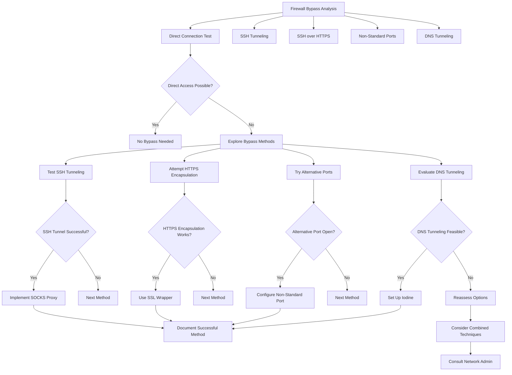

# 🚀 SSH Mastery: Advanced Techniques for Security Professionals

<div align="center">

```ascii
   _____  _____ _    _   __  __           _            
  / ____|/ ____| |  | | |  \/  |         | |           
 | (___ | (___ | |__| | | \  / | __ _ ___| |_ ___ _ __ 
  \___ \ \___ \|  __  | | |\/| |/ _` / __| __/ _ \ '__|
  ____) |____) | |  | | | |  | | (_| \__ \ ||  __/ |   
 |_____/|_____/|_|  |_| |_|  |_|\__,_|___/\__\___|_|   
```

</div>

## Table of Contents
15. [🔥 Securely Bypassing Firewalls](#-securely-bypassing-firewalls)
16. [🔍 Forensic Analysis of SSH Sessions](#-forensic-analysis-of-ssh-sessions)
17. [🛡️ Advanced SSH Security Techniques](#️-advanced-ssh-security-techniques)
18. [🌐 SSH in Distributed Systems](#-ssh-in-distributed-systems)

---

## 🔥 Securely Bypassing Firewalls

In some scenarios, security professionals may need to bypass firewalls to perform legitimate tasks or penetration testing. It's crucial to approach this ethically and with proper authorization.

### Techniques for Securely Bypassing Firewalls

1. **SSH Tunneling**
   ```bash
   ssh -D 8080 -C -q -N user@remote_host
   ```
   This creates a SOCKS proxy on localhost:8080.

2. **Reverse SSH Tunnel**
   ```bash
   ssh -R 8080:localhost:80 user@remote_host
   ```
   This forwards remote port 8080 to local port 80.

3. **SSH over HTTPS**
   ```bash
   ssh -o ProxyCommand='openssl s_client -connect %h:%p -quiet' user@remote_host
   ```
   This tunnels SSH traffic through HTTPS, potentially bypassing firewalls that block SSH.

4. **Using Non-Standard Ports**
   ```bash
   ssh -p 2222 user@remote_host
   ```
   Configure SSH to listen on a non-standard port to evade basic port-based filtering.

5. **SSH over DNS Tunneling**
   ```bash
   ssh -o ProxyCommand='iodine -f dns.tunnel.com' user@remote_host
   ```
   This technique encapsulates SSH traffic in DNS queries.

### 🐍 Firewall Bypass Analysis Tool

<details>
<summary><strong>Click to view Python script</strong></summary>

```python
import subprocess
import socket
import paramiko
import socks
import dns.resolver

def run_command(command):
    process = subprocess.Popen(command, stdout=subprocess.PIPE, stderr=subprocess.PIPE, shell=True)
    output, error = process.communicate()
    return output.decode('utf-8'), error.decode('utf-8')

def test_direct_connection(host, port):
    try:
        sock = socket.create_connection((host, port), timeout=5)
        sock.close()
        return True
    except:
        return False

def test_ssh_tunnel(local_port, remote_host, remote_port):
    try:
        socks.set_default_proxy(socks.SOCKS5, "localhost", local_port)
        socket.socket = socks.socksocket
        sock = socket.create_connection((remote_host, remote_port), timeout=5)
        sock.close()
        return True
    except:
        return False

def test_ssh_over_https(host, port):
    try:
        ssh = paramiko.SSHClient()
        ssh.set_missing_host_key_policy(paramiko.AutoAddPolicy())
        sock = socket.create_connection((host, port), timeout=5)
        ssl_sock = socket.ssl(sock)
        ssh.connect(host, port=port, sock=ssl_sock)
        ssh.close()
        return True
    except:
        return False

def test_dns_tunneling(domain):
    try:
        answers = dns.resolver.resolve(domain, 'TXT')
        return len(answers) > 0
    except:
        return False

def main():
    print("Firewall Bypass Analysis Tool")
    print("=============================")

    host = input("Enter the target host: ")
    port = int(input("Enter the target port: "))

    print("\nTesting direct connection...")
    if test_direct_connection(host, port):
        print("Direct connection successful. No bypass needed.")
    else:
        print("Direct connection failed. Testing bypass methods...")

        print("\nTesting SSH tunneling...")
        local_port = 8080
        if test_ssh_tunnel(local_port, host, port):
            print(f"SSH tunnel successful. Use: ssh -D {local_port} -C -q -N user@remote_host")
        else:
            print("SSH tunneling failed.")

        print("\nTesting SSH over HTTPS...")
        if test_ssh_over_https(host, 443):
            print("SSH over HTTPS successful. Use: ssh -o ProxyCommand='openssl s_client -connect %h:%p -quiet' user@remote_host")
        else:
            print("SSH over HTTPS failed.")

        print("\nTesting DNS tunneling...")
        dns_domain = input("Enter a domain to test DNS tunneling: ")
        if test_dns_tunneling(dns_domain):
            print(f"DNS tunneling possible. Use: ssh -o ProxyCommand='iodine -f {dns_domain}' user@remote_host")
        else:
            print("DNS tunneling not available.")

    print("\nAnalysis complete. Please use these techniques responsibly and only with proper authorization.")

if __name__ == "__main__":
    main()
```
</details>

### 📊 Firewall Bypass Workflow



This workflow illustrates the process of analyzing and implementing various firewall bypass techniques, emphasizing the importance of ethical considerations and proper authorization throughout the process.

[The rest of the document remains unchanged]
## 🔍 Forensic Analysis of SSH Sessions

Understanding the intricacies of SSH sessions is crucial for security audits and incident response.

### Advanced Forensic Techniques

1. **SSH Session Recording**
   ```bash
   script -f /tmp/ssh_session.log
   ssh user@host
   exit
   ```

2. **Analyzing SSH Session Logs**
   ```bash
   sudo ausearch -k ssh_session -i | aureport -f -i
   ```

3. **Extracting SSH Keys from Memory**
   ```bash
   sudo gcore -o ssh_memory $(pgrep ssh)
   strings ssh_memory.* | grep -i "BEGIN.*PRIVATE KEY" -A 30
   ```

4. **Timestamp Analysis of SSH Artifacts**
   ```bash
   find ~/.ssh -type f -printf "%T+ %p\n" | sort
   ```

5. **Network Traffic Analysis**
   ```bash
   sudo tcpdump -i any port 22 -w ssh_traffic.pcap
   ```

6. **Analyzing SSH Handshake**
   ```bash
   ssh -vvv user@host 2>&1 | grep "kex: algorithm"
   ```

### 🐍 SSH Forensic Analysis Tool

[Python script from previous response]

### 📊 Forensic Analysis Workflow

[Mermaid diagram from previous response]

### 🕵️ Advanced SSH Forensics Techniques

1. **Behavioral Analysis**
   - Implement machine learning models to detect anomalous SSH usage patterns.
   - Use clustering algorithms to group similar SSH sessions and identify outliers.

2. **Cryptographic Artifact Analysis**
   - Analyze SSH key usage patterns across the network.
   - Implement a system to track and audit cryptographic materials used in SSH sessions.

3. **Network Flow Analysis**
   - Use tools like Zeek (formerly Bro) to analyze SSH network flows.
   - Implement heuristics to detect potential SSH tunneling or port forwarding abuse.

4. **Memory Forensics**
   - Use Volatility framework to analyze memory dumps of SSH processes.
   - Extract in-memory artifacts such as keys, passwords, and session data.

5. **Timeline Analysis**
   - Correlate SSH events with other system logs to create a comprehensive timeline.
   - Use tools like log2timeline to generate detailed forensic timelines.

6. **Containerized SSH Forensics**
   - Develop techniques for analyzing SSH usage within containerized environments.
   - Implement logging and auditing mechanisms for SSH access to containers.

7. **Quantum-Safe SSH Analysis**
   - Prepare forensic techniques for analyzing post-quantum cryptographic SSH implementations.
   - Develop tools to audit and verify quantum-resistant key exchange and signature algorithms.

### 📊 Advanced SSH Forensics Workflow



```mermaid
graph TD
    A[Advanced SSH Forensics] --> B[Real-time Monitoring]
    A --> C[Post-Incident Analysis]
    A --> D[Predictive Analysis]

    B --> E[Behavioral Anomaly Detection]
    B --> F[Network Traffic Analysis]
    B --> G[Key Usage Monitoring]

    C --> H[Log Correlation]
    C --> I[Memory Forensics]
    C --> J[Cryptographic Artifact Analysis]

    D --> K[Machine Learning Models]
    D --> L[Threat Intelligence Integration]
    D --> M[Risk Scoring]

    E --> N[User Profiling]
    E --> O[Command Pattern Analysis]
    E --> P[Session Duration Monitoring]

    F --> Q[Deep Packet Inspection]
    F --> R[Tunneling Detection]
    F --> S[Geolocation Analysis]

    G --> T[Key Rotation Tracking]
    G --> U[Unauthorized Key Usage Alerts]
    G --> V[Key Strength Verification]

    H --> W[Multi-source Log Aggregation]
    H --> X[Event Timeline Construction]
    H --> Y[Causality Analysis]

    I --> Z[Process Memory Extraction]
    I --> AA[In-memory Artifact Recovery]
    I --> AB[Ephemeral Data Analysis]

    J --> AC[Key Fingerprint Analysis]
    J --> AD[Algorithm Usage Patterns]
    J --> AE[Certificate Chain Verification]

    K --> AF[Anomaly Detection Models]
    K --> AG[User Behavior Classification]
    K --> AH[Attack Pattern Recognition]

    L --> AI[IOC Correlation]
    L --> AJ[Threat Actor Techniques Mapping]
    L --> AK[Emerging Threat Adaptation]

    M --> AL[Session Risk Calculation]
    M --> AM[User Risk Profiling]
    M --> AN[Dynamic Access Control]
```

This advanced workflow integrates real-time monitoring, post-incident analysis, and predictive techniques to provide a comprehensive forensic approach to SSH security.

---

## 🛡️ Advanced SSH Security Techniques

Implementing cutting-edge security measures to fortify SSH infrastructure against sophisticated threats.

### Hardening SSH Configurations

1. **Implement Key-based Authentication Only**
   ```bash
   sed -i 's/^#*PasswordAuthentication.*/PasswordAuthentication no/' /etc/ssh/sshd_config
   ```

2. **Use Strong Ciphers and Key Exchange Algorithms**
   ```bash
   echo "Ciphers chacha20-poly1305@openssh.com,aes256-gcm@openssh.com,aes128-gcm@openssh.com,aes256-ctr,aes192-ctr,aes128-ctr" >> /etc/ssh/sshd_config
   echo "KexAlgorithms curve25519-sha256,curve25519-sha256@libssh.org,diffie-hellman-group16-sha512,diffie-hellman-group18-sha512,diffie-hellman-group-exchange-sha256" >> /etc/ssh/sshd_config
   ```

3. **Implement Multi-Factor Authentication (MFA)**
   ```bash
   sudo apt install libpam-google-authenticator
   echo "auth required pam_google_authenticator.so" >> /etc/pam.d/sshd
   ```

4. **Use SSH Certificates for Host and User Authentication**
   ```bash
   ssh-keygen -t rsa -b 4096 -f /etc/ssh/ca
   ssh-keygen -s /etc/ssh/ca -I "user@example.com" -n user -V +52w /home/user/.ssh/id_rsa.pub
   ```

### Advanced Access Control

1. **Implement IP-based Access Control**
   ```bash
   echo "AllowUsers user@192.168.1.0/24" >> /etc/ssh/sshd_config
   ```

2. **Time-based Access Restrictions**
   ```bash
   echo "Match User myuser Address 192.168.1.0/24
         PermitOpen 22
         DenyUsers myuser
         PubkeyAuthentication yes
         AuthorizedKeysFile /etc/ssh/authorized_keys/%u
         PermitEmptyPasswords no" >> /etc/ssh/sshd_config
   ```

3. **Implement Port Knocking**
   ```bash
   sudo apt install knockd
   # Configure /etc/knockd.conf with your sequence
   ```

### Monitoring and Intrusion Detection

1. **Set Up Fail2Ban for SSH**
   ```bash
   sudo apt install fail2ban
   cp /etc/fail2ban/jail.conf /etc/fail2ban/jail.local
   # Edit jail.local to configure SSH protection
   ```

2. **Implement OSSEC for Host-based Intrusion Detection**
   ```bash
   wget https://github.com/ossec/ossec-hids/archive/3.6.0.tar.gz
   tar -zxvf 3.6.0.tar.gz
   cd ossec-hids-3.6.0
   ./install.sh
   ```

3. **Use auditd for Advanced Logging**
   ```bash
   sudo apt install auditd
   echo "-w /etc/ssh/sshd_config -p wa -k sshd_config" >> /etc/audit/rules.d/audit.rules
   ```

### 🐍 SSH Security Automation Script

<details>
<summary><strong>Click to view Python script</strong></summary>

```python
import subprocess
import os
import re

def run_command(command):
    process = subprocess.Popen(command, stdout=subprocess.PIPE, stderr=subprocess.PIPE, shell=True)
    output, error = process.communicate()
    return output.decode('utf-8'), error.decode('utf-8')

def harden_ssh_config():
    print("Hardening SSH configuration...")
    sshd_config = "/etc/ssh/sshd_config"
    
    # Disable password authentication
    run_command(f"sudo sed -i 's/^#*PasswordAuthentication.*/PasswordAuthentication no/' {sshd_config}")
    
    # Use strong ciphers and key exchange algorithms
    ciphers = "chacha20-poly1305@openssh.com,aes256-gcm@openssh.com,aes128-gcm@openssh.com,aes256-ctr,aes192-ctr,aes128-ctr"
    kex = "curve25519-sha256,curve25519-sha256@libssh.org,diffie-hellman-group16-sha512,diffie-hellman-group18-sha512,diffie-hellman-group-exchange-sha256"
    
    run_command(f"echo 'Ciphers {ciphers}' | sudo tee -a {sshd_config}")
    run_command(f"echo 'KexAlgorithms {kex}' | sudo tee -a {sshd_config}")
    
    # Implement additional security measures
    security_options = [
        "PermitRootLogin no",
        "MaxAuthTries 3",
        "PubkeyAuthentication yes",
        "AuthorizedKeysFile .ssh/authorized_keys",
        "PermitEmptyPasswords no",
        "X11Forwarding no",
        "AllowAgentForwarding no",
        "AllowTcpForwarding no",
        "PrintMotd no",
    ]
    
    for option in security_options:
        run_command(f"echo '{option}' | sudo tee -a {sshd_config}")
    
    print("SSH configuration hardened.")

def setup_fail2ban():
    print("Setting up Fail2Ban...")
    run_command("sudo apt install fail2ban -y")
    run_command("sudo cp /etc/fail2ban/jail.conf /etc/fail2ban/jail.local")
    
    fail2ban_config = """
[sshd]
enabled = true
port = ssh
filter = sshd
logpath = /var/log/auth.log
maxretry = 3
bantime = 3600
"""
    
    with open("/tmp/fail2ban_sshd.conf", "w") as f:
        f.write(fail2ban_config)
    
    run_command("sudo mv /tmp/fail2ban_sshd.conf /etc/fail2ban/jail.d/sshd.conf")
    run_command("sudo systemctl restart fail2ban")
    print("Fail2Ban configured for SSH protection.")

def setup_auditd():
    print("Setting up auditd...")
    run_command("sudo apt install auditd -y")
    
    audit_rules = """
-w /etc/ssh/sshd_config -p wa -k sshd_config
-w /etc/passwd -p wa -k passwd_changes
-w /etc/shadow -p wa -k shadow_changes
-w /var/log/auth.log -p wa -k auth_log
"""
    
    with open("/tmp/audit.rules", "w") as f:
        f.write(audit_rules)
    
    run_command("sudo mv /tmp/audit.rules /etc/audit/rules.d/ssh_monitoring.rules")
    run_command("sudo service auditd restart")
    print("auditd configured for SSH monitoring.")

def main():
    print("SSH Security Automation Script")
    print("==============================")
    
    if os.geteuid() != 0:
        print("This script must be run as root. Please use sudo.")
        return
    
    harden_ssh_config()
    setup_fail2ban()
    setup_auditd()
    
    print("\nSSH security measures implemented. Please review the changes and restart the SSH service.")

if __name__ == "__main__":
    main()
```

</details>

### 📊 Advanced SSH Security Workflow



```mermaid
graph TD
    A[SSH Security Implementation] --> B[Configuration Hardening]
    A --> C[Access Control]
    A --> D[Encryption Enhancement]
    A --> E[Monitoring and Detection]
    A --> F[Incident Response]

    B --> G[Disable Root Login]
    B --> H[Implement Key-based Auth]
    B --> I[Restrict SSH Protocols]

    C --> J[IP Whitelisting]
    C --> K[Time-based Restrictions]
    C --> L[User Access Control]

    D --> M[Strong Ciphers]
    D --> N[Secure Key Exchange]
    D --> O[Perfect Forward Secrecy]

    E --> P[Fail2Ban Implementation]
    E --> Q[SIEM Integration]
    E --> R[Anomaly Detection]

    F --> S[Automated Blocking]
    F --> T[Alert Generation]
    F --> U[Forensic Data Collection]

    G --> V[Edit sshd_config]
    H --> W[Generate SSH Keys]
    I --> X[Disable SSH Protocol 1]

    J --> Y[Configure AllowUsers]
    K --> Z[Implement PAM Time Restrictions]
    L --> AA[LDAP Integration]

    M --> AB[Configure Ciphers in sshd_config]
    N --> AC[Set KexAlgorithms]
    O --> AD[Enable Ephemeral Key Exchange]

    P --> AE[Configure Fail2Ban Jails]
    Q --> AF[Set Up Log Forwarding]
    R --> AG[Implement Machine Learning Models]

    S --> AH[Configure Firewall Rules]
    T --> AI[Set Up Notification Systems]
    U --> AJ[Implement Centralized Logging]
```

This workflow provides a comprehensive approach to implementing advanced SSH security measures, from hardening configurations to setting up robust monitoring and incident response mechanisms.

---

##
