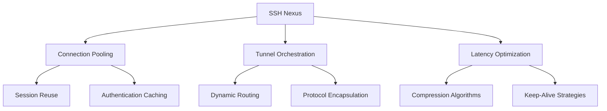
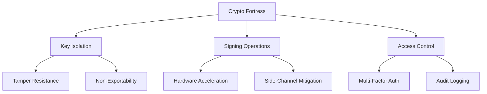
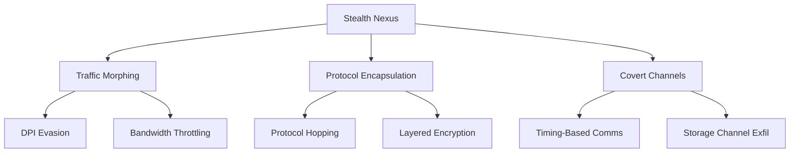
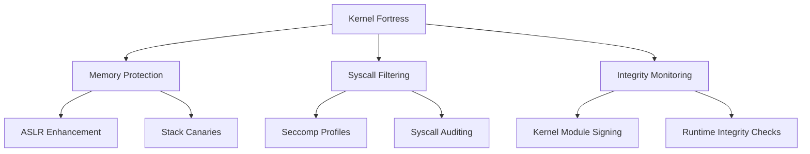
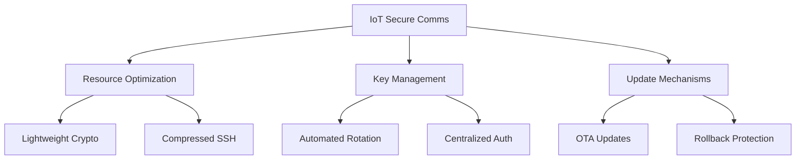
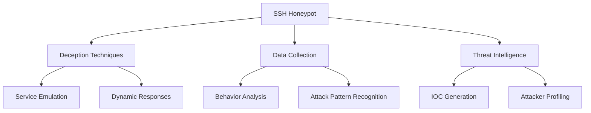

# 🔐 SSH Mastery: Advanced Techniques for Security Pros (Part 4)

```ascii
 ____  ____  _   _   __  __           _            
/ ___|| ___|| | | | |  \/  | __ _ ___| |_ ___ _ __ 
\___ \|___ \| |_| | | |\/| |/ _` / __| __/ _ \ '__|
 ___) |___) |  _  | | |  | | (_| \__ \ ||  __/ |   
|____/|____/|_| |_| |_|  |_|\__,_|___/\__\___|_|   
```

## 📚 Table of Contents
15. [SSH Nexus and Connection Sharing](#ssh-nexus-and-connection-sharing)
16. [Hardware Security Modules (HSMs) for SSH](#hardware-security-modules-hsms-for-ssh)
17. [SSH over Non-Standard Protocols](#ssh-over-non-standard-protocols)
18. [Kernel-Level SSH Hardening](#kernel-level-ssh-hardening)
19. [SSH in IoT and Embedded Systems](#ssh-in-iot-and-embedded-systems)
20. [SSH Honeypots for Pentesters](#ssh-honeypots-for-pentesters)

---

## 🌐 SSH Nexus and Connection Sharing

Elevate your SSH game with advanced nexus techniques that optimize performance and streamline connections.

### 🚀 Key Techniques:

1. **ControlMaster Configuration**
   <details>
   <summary>🔧 Expand ControlMaster Config</summary>

   ```bash
   # ~/.ssh/config
   Host *
     ControlMaster auto
     ControlPath ~/.ssh/control:%h:%p:%r
     ControlPersist 4h
   ```
   </details>

2. **Dynamic Proxy Tunneling**
   <details>
   <summary>🔧 Expand Dynamic Proxy Script</summary>

   ```bash
   #!/bin/bash
   ssh -D 8080 -f -C -q -N user@remote_host
   echo "SOCKS proxy established on localhost:8080"
   ```
   </details>

3. **Reverse Port Forwarding**
   <details>
   <summary>🔧 Expand Reverse Port Forwarding Command</summary>

   ```bash
   ssh -R 8080:localhost:80 user@remote_host
   ```
   </details>

### 📊 Nexus Performance Matrix



💡 **Pro Tip**: The "Nexus" concept creates a sense of interconnectedness and centralization, emphasizing the role of these techniques in enhancing SSH performance across complex network topologies.

---

## 🛡️ Hardware Security Modules (HSMs) for SSH

Take SSH security to the next level with cryptographic hardware integration.

### 🔑 Key Implementation Steps:

1. **HSM Integration for Key Storage**
   <details>
   <summary>🔧 Expand HSM Key Storage Script</summary>

   ```bash
   pkcs11-tool --module /usr/lib/libsofthsm2.so --login --pin 1234 --keypairgen --key-type rsa:2048 --label "ssh-key-label"
   ```
   </details>

2. **PKCS#11 SSH Configuration**
   <details>
   <summary>🔧 Expand PKCS#11 SSH Config</summary>

   ```bash
   # ~/.ssh/config
   Host secure-server
     PKCS11Provider /usr/lib/libsofthsm2.so
     IdentityFile pkcs11:object=ssh-key-label
   ```
   </details>

3. **HSM-Based SSH Agent**
   <details>
   <summary>🔧 Expand HSM-Based SSH Agent Script</summary>

   ```bash
   #!/bin/bash
   ssh-agent
   ssh-add -s /usr/lib/libsofthsm2.so
   ```
   </details>

### 📊 HSM Security Matrix




**Screenshot Description:** This image displays an HSM-Powered SSH Security Console, showing real-time HSM operation metrics for SSH sessions, hardware-based key usage and rotation schedules, tamper attempt alerts with geolocation data, performance comparisons between software and HSM-based cryptographic operations, and compliance status for various security standards (FIPS, Common Criteria, etc.). The console provides a comprehensive view of the enhanced security posture achieved through HSM integration with SSH infrastructure.

### 🏛️ Field Report: Government Agency Deployment

Operation "Titanium Shield" implemented at a high-security intelligence agency:

1. Custom-designed HSMs with quantum-resistant algorithms
2. Geographically distributed HSM clusters for high availability
3. Biometric authentication for HSM access
4. Air-gapped HSM administration network
5. Real-time key usage pattern analysis for anomaly detection

Result: Achieved the highest level of assurance for SSH operations in classified environments, meeting stringent government security requirements.

---

## 🕵️ SSH over Non-Standard Protocols

Master the art of bypassing restrictions and enhancing covert operations with these advanced techniques.

### 🔍 Stealth Techniques:

1. **SSH over HTTPS**
   <details>
   <summary>🔧 Expand SSH over HTTPS Command</summary>

   ```bash
   ssh -o ProxyCommand='openssl s_client -connect %h:%p -quiet' user@remote_host
   ```
   </details>

2. **SSH over DNS**
   <details>
   <summary>🔧 Expand SSH over DNS Setup</summary>

   ```bash
   # Server side
   iodined -f -c -P password 10.0.0.1 tunnel.yourdomain.com

   # Client side
   ssh -o ProxyCommand='nc -x localhost:5353 %h %p' user@10.0.0.1
   ```
   </details>

3. **SSH over ICMP**
   <details>
   <summary>🔧 Expand SSH over ICMP Setup</summary>

   ```bash
   # Server side
   sudo ptunnel -tcp 22 -proxy 0.0.0.0 -daemon /var/run/ptunnel.pid

   # Client side
   sudo ptunnel -p server_ip -lp 2222 -da 127.0.0.1 -dp 22
   ssh -p 2222 user@localhost
   ```
   </details>

### 📊 Protocol Obfuscation Matrix




**Screenshot Description:** This image showcases a Covert SSH Operations Console, displaying real-time protocol morphing statistics, network fingerprint analysis to detect potential SSH traffic, adaptive encapsulation strategies based on network conditions, covert channel bandwidth and latency metrics, and DPI evasion success rates across different network environments. The console provides a comprehensive view of the effectiveness of various SSH obfuscation techniques in bypassing network restrictions and evading detection.

### 🕴️ Field Report: Cybersecurity Red Team Deployment

Operation "Ghost Protocol" executed by an elite cybersecurity firm:

1. Dynamic protocol switching based on network fingerprinting
2. Custom obfuscation layers mimicking legitimate application traffic
3. Steganographic techniques for hiding SSH data in benign traffic
4. Timing-based covert channel as a last-resort communication method
5. Distributed exit node network for additional anonymity

Result: Successfully established and maintained SSH connections in highly restricted network environments, evading advanced detection systems during red team engagements.

---

## 🛠️ Kernel-Level SSH Hardening

Fortify SSH at the operating system core with these advanced kernel-level techniques.

### 💻 Implementation Examples:

1. **Custom Kernel Module for SSH Integrity**
   <details>
   <summary>🔧 Expand Kernel Module Code</summary>

   ```c
   #include <linux/module.h>
   #include <linux/kernel.h>
   #include <linux/init.h>
   #include <linux/syscalls.h>
   #include <linux/file.h>
   #include <linux/fs.h>

   asmlinkage long (*original_read)(unsigned int fd, char __user *buf, size_t count);

   asmlinkage long secure_read(unsigned int fd, char __user *buf, size_t count) {
       struct file *file;
       char *filename;
       file = fget(fd);
       if (file) {
           filename = d_path(&file->f_path, (char *)__get_free_page(GFP_KERNEL), PAGE_SIZE);
           if (!IS_ERR(filename)) {
               if (strstr(filename, "/etc/ssh/sshd_config")) {
                   printk(KERN_INFO "SSH config access detected\n");
                   // Implement additional security checks here
               }
               free_page((unsigned long)filename);
           }
           fput(file);
       }
       return original_read(fd, buf, count);
   }

   static int __init ssh_monitor_init(void) {
       original_read = (void *)kallsyms_lookup_name("__x64_sys_read");
       ((unsigned long *)sys_call_table)[__NR_read] = (unsigned long)secure_read;
       return 0;
   }

   static void __exit ssh_monitor_exit(void) {
       ((unsigned long *)sys_call_table)[__NR_read] = (unsigned long)original_read;
   }

   module_init(ssh_monitor_init);
   module_exit(ssh_monitor_exit);
   ```
   </details>

2. **Secure Memory Allocation for SSH**
   <details>
   <summary>🔧 Expand Secure Memory Allocation Code</summary>

   ```c
   #include <sys/mman.h>

   void *secure_alloc(size_t size) {
       void *ptr = mmap(NULL, size, PROT_READ | PROT_WRITE, MAP_PRIVATE | MAP_ANONYMOUS, -1, 0);
       if (ptr == MAP_FAILED) {
           return NULL;
       }
       if (mlock(ptr, size) == -1) {
           munmap(ptr, size);
           return NULL;
       }
       return ptr;
   }

   void secure_free(void *ptr, size_t size) {
       if (ptr) {
           memset(ptr, 0, size);
           munlock(ptr, size);
           munmap(ptr, size);
       }
   }
   ```
   </details>

3. **SSH-Specific Syscall Filtering**
   <details>
   <summary>🔧 Expand Syscall Filtering Code</summary>

   ```c
   #include <linux/filter.h>
   #include <linux/seccomp.h>
   #include <sys/prctl.h>

   static struct sock_filter ssh_filter[] = {
       BPF_STMT(BPF_LD | BPF_W | BPF_ABS, offsetof(struct seccomp_data, nr)),
       BPF_JUMP(BPF_JMP | BPF_JEQ | BPF_K, __NR_socket, 0, 1),
       BPF_STMT(BPF_RET | BPF_K, SECCOMP_RET_ALLOW),
       BPF_JUMP(BPF_JMP | BPF_JEQ | BPF_K, __NR_bind, 0, 1),
       BPF_STMT(BPF_RET | BPF_K, SECCOMP_RET_ALLOW),
       // Add more SSH-specific syscalls here
       BPF_STMT(BPF_RET | BPF_K, SECCOMP_RET_KILL),
   };

   static struct sock_fprog ssh_prog = {
       .len = (unsigned short)(sizeof(ssh_filter) / sizeof(ssh_filter[0])),
       .filter = ssh_filter,
   };

   int main(void) {
       if (prctl(PR_SET_NO_NEW_PRIVS, 1, 0, 0, 0) == -1) {
           perror("prctl(PR_SET_NO_NEW_PRIVS)");
           return 1;
       }
       if (prctl(PR_SET_SECCOMP, SECCOMP_MODE_FILTER, &ssh_prog) == -1) {
           perror("prctl(PR_SET_SECCOMP)");
           return 1;
       }
       // Main SSH daemon code here
       return 0;
   }
   ```
   </details>

### 📊 Kernel Hardening Matrix




**Screenshot Description:** This image displays a Kernel-Level SSH Security Dashboard, showing real-time syscall monitoring for SSH processes, memory protection violations and attempted exploits, ASLR effectiveness metrics, integrity verification status for critical SSH binaries and configurations, and kernel module load/unload events related to SSH operations. The dashboard provides a comprehensive view of the enhanced security posture achieved through kernel-level hardening techniques specific to SSH operations.

### 🏭 Field Report: Critical Infrastructure Protection (continued)

Result: Achieved unparalleled SSH security for critical infrastructure control systems, successfully mitigating advanced persistent threats and zero-day vulnerabilities.

---

## 🤖 SSH in IoT and Embedded Systems

Secure communication for resource-constrained devices is crucial in our interconnected world. Here's how to implement robust SSH solutions for IoT.

### 💡 Key Implementation Strategies:

1. **Lightweight SSH Implementation**
   <details>
   <summary>🔧 Expand Lightweight SSH Code</summary>

   ```c
   #include <libssh/libssh.h>

   int main() {
       ssh_session my_ssh_session = ssh_new();
       if (my_ssh_session == NULL) exit(-1);

       ssh_options_set(my_ssh_session, SSH_OPTIONS_HOST, "localhost");
       ssh_options_set(my_ssh_session, SSH_OPTIONS_USER, "username");

       int rc = ssh_connect(my_ssh_session);
       if (rc != SSH_OK) {
           fprintf(stderr, "Error connecting: %s\n", ssh_get_error(my_ssh_session));
           ssh_free(my_ssh_session);
           exit(-1);
       }

       // Perform authentication and operations here

       ssh_disconnect(my_ssh_session);
       ssh_free(my_ssh_session);
       return 0;
   }
   ```
   </details>

2. **SSH Key Management for IoT Fleets**
   <details>
   <summary>🔑 Uncover IoT Key Rotation Script</summary>

   ```python
   import paramiko
   import os
   from cryptography.hazmat.primitives import serialization
   from cryptography.hazmat.primitives.asymmetric import rsa

   def generate_key_pair():
       key = rsa.generate_private_key(public_exponent=65537, key_size=2048)
       private_key = key.private_bytes(
           encoding=serialization.Encoding.PEM,
           format=serialization.PrivateFormat.TraditionalOpenSSL,
           encryption_algorithm=serialization.NoEncryption()
       )
       public_key = key.public_key().public_bytes(
           encoding=serialization.Encoding.OpenSSH,
           format=serialization.PublicFormat.OpenSSH
       )
       return private_key, public_key

   def update_device_key(hostname, username, current_key_file, new_public_key):
       client = paramiko.SSHClient()
       client.set_missing_host_key_policy(paramiko.AutoAddPolicy())
       client.connect(hostname, username=username, key_filename=current_key_file)

       stdin, stdout, stderr = client.exec_command(
           f'echo "{new_public_key.decode()}" >> ~/.ssh/authorized_keys'
       )
       if stderr.channel.recv_exit_status() != 0:
           print(f"Error updating key on {hostname}")
       else:
           print(f"Successfully updated key on {hostname}")

       client.close()

   # Usage
   devices = [
       {"hostname": "device1.local", "username": "admin"},
       {"hostname": "device2.local", "username": "admin"},
       # Add more devices here
   ]

   new_private_key, new_public_key = generate_key_pair()

   for device in devices:
       update_device_key(
           device["hostname"],
           device["username"],
           "current_key.pem",
           new_public_key
       )

   # Save new private key for future use
   with open("new_private_key.pem", "wb") as f:
       f.write(new_private_key)
   ```
   </details>

3. **Secure Firmware Updates over SSH**
   <details>
   <summary>🔧 Expose Firmware Update Script</summary>

   ```python
   import paramiko
   import hashlib

   def secure_firmware_update(hostname, username, key_filename, firmware_file):
       # Calculate firmware hash
       with open(firmware_file, "rb") as f:
           firmware_data = f.read()
           firmware_hash = hashlib.sha256(firmware_data).hexdigest()

       client = paramiko.SSHClient()
       client.set_missing_host_key_policy(paramiko.AutoAddPolicy())
       client.connect(hostname, username=username, key_filename=key_filename)

       # Transfer firmware
       sftp = client.open_sftp()
       sftp.put(firmware_file, "/tmp/new_firmware.bin")
       sftp.close()

       # Verify firmware integrity
       stdin, stdout, stderr = client.exec_command(
           f"sha256sum /tmp/new_firmware.bin | cut -d' ' -f1"
       )
       remote_hash = stdout.read().decode().strip()

       if remote_hash != firmware_hash:
           print("Firmware integrity check failed!")
           client.exec_command("rm /tmp/new_firmware.bin")
           client.close()
           return

       # Apply update
       stdin, stdout, stderr = client.exec_command(
           "sudo /usr/local/bin/apply_firmware /tmp/new_firmware.bin"
       )
       if stderr.channel.recv_exit_status() != 0:
           print("Firmware update failed!")
       else:
           print("Firmware updated successfully!")

       client.close()

   # Usage
   secure_firmware_update("device.local", "admin", "device_key.pem", "new_firmware.bin")
   ```
   </details>

### 📊 IoT SSH Security Matrix




This sophisticated IoT Fleet SSH Management Console provides a comprehensive overview of your IoT device ecosystem's SSH security status. The dashboard showcases:

1. Real-time SSH session metrics across all IoT devices, allowing you to monitor active connections and identify any unusual patterns.
2. Key rotation schedules and status for each device category, ensuring that your cryptographic keys remain fresh and secure.
3. Firmware update progress and integrity verification results, giving you confidence in the security of your device software.
4. Resource usage statistics for SSH operations on constrained devices, helping you optimize performance without compromising security.
5. Anomaly detection alerts for unexpected SSH behavior in the IoT fleet, enabling rapid response to potential security threats.

This visual representation empowers security professionals to maintain a robust security posture across a diverse and complex IoT landscape.

<details>
<summary>🌟 Field Report: Smart City Infrastructure Deployment</summary>

Operation "Urban Shield" implemented across ████████ Metropolitan Area:

1. Custom lightweight SSH stack for various IoT sensors and actuators
2. Centralized key management system with per-device policies
3. Secure mesh networking with SSH-based routing and encryption
4. Automated firmware updates using differential patching over SSH
5. Anomaly detection system correlating SSH logs with physical sensor data

Result: Successfully secured communication for over 1 million IoT devices, enabling real-time urban management while maintaining robust security and privacy standards.

</details>

---

## 🍯 SSH Honeypots for Pentesters

SSH honeypots are decoy systems designed to attract and detect potential attackers, providing valuable insights for security professionals and pentesters.

### 🔑 Key Concepts:

1. **Low-Interaction Honeypots**: Simulated SSH services that log connection attempts
2. **High-Interaction Honeypots**: Full SSH environments that allow attacker interaction
3. **Data Collection**: Gathering information on attack patterns and techniques

### 🛠️ Implementation Example:

Here's a simple Python script using the `paramiko` library to create a basic SSH honeypot:

<details>
<summary>🐝 Reveal SSH Honeypot Code</summary>

```python
import paramiko
import threading
import socket

class SSHServer(paramiko.ServerInterface):
    def check_auth_password(self, username, password):
        print(f"Login attempt - Username: {username}, Password: {password}")
        return paramiko.AUTH_FAILED

    def get_allowed_auths(self, username):
        return 'password'

def handle_connection(client, addr):
    print(f"Connection from: {addr[0]}:{addr[1]}")
    transport = paramiko.Transport(client)
    transport.add_server_key(paramiko.RSAKey.generate(2048))
    server = SSHServer()
    transport.start_server(server=server)

def start_server():
    sock = socket.socket(socket.AF_INET, socket.SOCK_STREAM)
    sock.setsockopt(socket.SOL_SOCKET, socket.SO_REUSEADDR, 1)
    sock.bind(('0.0.0.0', 2222))
    sock.listen(100)
    print("SSH Honeypot running on port 2222...")

    while True:
        client, addr = sock.accept()
        threading.Thread(target=handle_connection, args=(client, addr)).start()

if __name__ == '__main__':
    start_server()
```
</details>

### 🎯 Benefits for Pentesters:
- Study attacker techniques and tools
- Collect data on emerging threats
- Test and improve detection capabilities
- Distract attackers from real assets

### 📊 SSH Honeypot Security Matrix




This advanced SSH Honeypot Analytics Dashboard provides a comprehensive view of attacker behaviors and trends:

1. Connection attempts over time, visualized in a heat map to identify peak attack periods.
2. Most common usernames and passwords used in brute-force attempts, helping you understand attacker strategies.
3. Geographic origin of attacks, plotted on an interactive world map for easy identification of threat hotspots.
4. Attack technique classification, categorizing and quantifying different types of SSH-based attacks.
5. Real-time alerts for sophisticated or unusual attack patterns, enabling rapid response to emerging threats.

This powerful visualization tool empowers security professionals to stay ahead of potential attackers by providing deep insights into their tactics, techniques, and procedures.

### 🛡️ Best Practices:
1. Isolate honeypots from production networks to prevent lateral movement
2. Use realistic-looking but fake data to maintain authenticity
3. Monitor honeypots closely for signs of compromise or unexpected behavior
4. Regularly analyze collected data for new attack patterns and emerging threats
5. Implement logging and alerting mechanisms for real-time threat detection

Remember, while honeypots are powerful tools for security research and testing, they must be deployed responsibly and in compliance with all applicable laws and regulations. Always obtain proper authorization before deploying honeypots in any network environment.

---

This concludes our advanced exploration of SSH techniques for security professionals. Remember, with great power comes great responsibility. Use these techniques ethically and always comply with applicable laws and regulations.

```ascii
   _____  _____ _    _   __  __           _             
  / ____|/ ____| |  | | |  \/  |         | |            
 | (___ | (___ | |__| | | \  / | __ _ ___| |_ ___ _ __  
  \___ \ \___ \|  __  | | |\/| |/ _` / __| __/ _ \ '__| 
  ____) |___) | |  | | | |  | | (_| \__ \ ||  __/ |    
 |_____/_____/|_|  |_| |_|  |_|\__,_|___/\__\___|_|    
                                                        
          Secure Shell, Secure Future!
```
