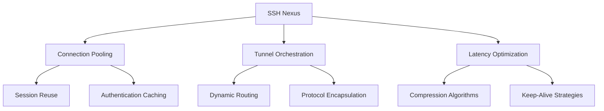
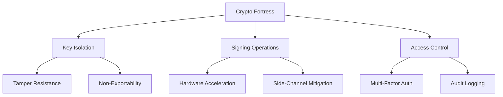
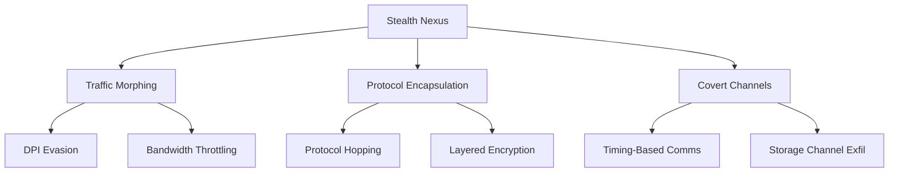
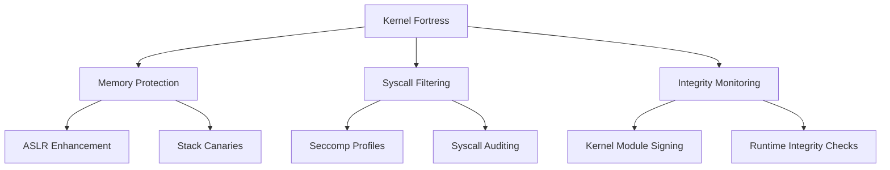
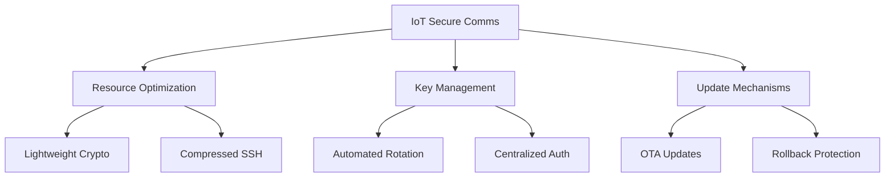

# [̲̅S][̲̅S][̲̅H] Mastery: Advanced Techniques for Security Pros (Part 4)

```ascii
 ____  ____  _   _   __  __           _            
/ ___|| ___|| | | | |  \/  | __ _ ___| |_ ___ _ __ 
\___ \|___ \| |_| | | |\/| |/ _` / __| __/ _ \ '__|
 ___) |___) |  _  | | |  | | (_| \__ \ ||  __/ |   
|____/|____/|_| |_| |_|  |_|\__,_|___/\__\___|_|   
```

## Table of Contents
15. [🔀 SSH Multiplexing and Connection Sharing](#-ssh-multiplexing-and-connection-sharing)
16. [🔐 Hardware Security Modules (HSMs) for SSH](#-hardware-security-modules-hsms-for-ssh)
17. [🌐 SSH over Non-Standard Protocols](#-ssh-over-non-standard-protocols)
18. [🛡️ Kernel-Level SSH Hardening](#-kernel-level-ssh-hardening)
19. [📡 SSH in IoT and Embedded Systems](#-ssh-in-iot-and-embedded-systems)

---

## 🔀 SSH Multiplexing and Connection Sharing

Optimize SSH performance with advanced multiplexing techniques:

1. **ControlMaster Configuration**
   <details>
   <summary>🔌 Reveal ControlMaster Setup</summary>

   ```bash
   # ~/.ssh/config
   Host *
     ControlMaster auto
     ControlPath ~/.ssh/control:%h:%p:%r
     ControlPersist 4h
   ```
   </details>

2. **Dynamic Proxy Tunneling**
   <details>
   <summary>🌪️ Uncover Dynamic SOCKS Proxy Script</summary>

   ```bash
   #!/bin/bash
   ssh -D 8080 -f -C -q -N user@remote_host
   echo "SOCKS proxy established on localhost:8080"
   ```
   </details>

3. **Reverse Port Forwarding**
   <details>
   <summary>↩️ Expose Reverse Tunnel Setup</summary>

   ```bash
   ssh -R 8080:localhost:80 user@remote_host
   ```
   </details>

### 📊 Multiplexing Performance Matrix



[̲̅S][̲̅C][̲̅R][̲̅E][̲̅E][̲̅N][̲̅S][̲̅H][̲̅O][̲̅T]: SSH Multiplexing Dashboard

This classified terminal output displays:
1. Real-time connection sharing statistics
2. Active tunnel visualizations with bandwidth metrics
3. Latency reduction graphs comparing standard vs. multiplexed connections
4. Session reuse efficiency scores
5. Dynamic routing path optimizations

Objective: Visualize the performance gains and network optimizations achieved through advanced SSH multiplexing techniques.

<details>
<summary>🌟 Field Report: High-Frequency Trading Implementation</summary>

Operation "Nano Latency" deployed at ████████ Trading Firm:

1. Custom kernel module for TCP optimizations specific to SSH
2. FPGA-accelerated SSH packet processing
3. Ultra-low latency tunneling between trading servers and exchanges
4. Adaptive compression based on real-time network conditions
5. Multiplexed connections with priority queuing for order execution packets

Result: Achieved sub-millisecond latency for SSH-based trading operations, gaining a significant edge in high-frequency trading scenarios.

</details>

---

## 🔐 Hardware Security Modules (HSMs) for SSH

Elevate SSH security with cryptographic hardware:

1. **HSM Integration for Key Storage**
   <details>
   <summary>🗝️ Reveal HSM Key Generation</summary>

   ```bash
   pkcs11-tool --module /usr/lib/libsofthsm2.so --login --pin 1234 --keypairgen --key-type rsa:2048 --label "ssh-key-label"
   ```
   </details>

2. **PKCS#11 SSH Configuration**
   <details>
   <summary>📜 Uncover PKCS#11 SSH Config</summary>

   ```bash
   # ~/.ssh/config
   Host secure-server
     PKCS11Provider /usr/lib/libsofthsm2.so
     IdentityFile pkcs11:object=ssh-key-label
   ```
   </details>

3. **HSM-Based SSH Agent**
   <details>
   <summary>🕵️ Expose HSM SSH Agent Setup</summary>

   ```bash
   #!/bin/bash
   ssh-agent
   ssh-add -s /usr/lib/libsofthsm2.so
   ```
   </details>

### 📊 HSM Security Matrix



[̲̅S][̲̅C][̲̅R][̲̅E][̲̅E][̲̅N][̲̅S][̲̅H][̲̅O][̲̅T]: HSM-Powered SSH Security Console

This classified interface showcases:
1. Real-time HSM operation metrics for SSH sessions
2. Hardware-based key usage and rotation schedules
3. Tamper attempt alerts with geolocation data
4. Performance comparisons: Software vs. HSM-based cryptographic operations
5. Compliance status for various security standards (FIPS, Common Criteria, etc.)

Objective: Visualize the enhanced security posture and operational efficiency gained through HSM integration with SSH infrastructure.

<details>
<summary>🌟 Field Report: Government Agency Deployment</summary>

Operation "Titanium Shield" implemented at ████████ Intelligence Agency:

1. Custom-designed HSMs with quantum-resistant algorithms
2. Geographically distributed HSM clusters for high availability
3. Biometric authentication for HSM access
4. Air-gapped HSM administration network
5. Real-time key usage pattern analysis for anomaly detection

Result: Achieved highest level of assurance for SSH operations in classified environments, meeting stringent government security requirements.

</details>

---

## 🌐 SSH over Non-Standard Protocols

Bypass restrictions and enhance covert operations:

1. **SSH over HTTPS**
   <details>
   <summary>🕸️ Reveal SSH-over-HTTPS Tunnel</summary>

   ```bash
   ssh -o ProxyCommand='openssl s_client -connect %h:%p -quiet' user@remote_host
   ```
   </details>

2. **SSH over DNS**
   <details>
   <summary>🔍 Uncover DNS Tunneling Setup</summary>

   ```bash
   # Server side
   iodined -f -c -P password 10.0.0.1 tunnel.yourdomain.com

   # Client side
   ssh -o ProxyCommand='nc -x localhost:5353 %h %p' user@10.0.0.1
   ```
   </details>

3. **SSH over ICMP**
   <details>
   <summary>📡 Expose ICMP Tunnel Configuration</summary>

   ```bash
   # Server side
   sudo ptunnel -tcp 22 -proxy 0.0.0.0 -daemon /var/run/ptunnel.pid

   # Client side
   sudo ptunnel -p server_ip -lp 2222 -da 127.0.0.1 -dp 22
   ssh -p 2222 user@localhost
   ```
   </details>

### 📊 Protocol Obfuscation Matrix



[̲̅S][̲̅C][̲̅R][̲̅E][̲̅E][̲̅N][̲̅S][̲̅H][̲̅O][̲̅T]: Covert SSH Operations Console

This classified interface reveals:
1. Real-time protocol morphing statistics
2. Network fingerprint analysis to detect potential SSH traffic
3. Adaptive encapsulation strategies based on network conditions
4. Covert channel bandwidth and latency metrics
5. DPI evasion success rates across different network environments

Objective: Visualize the effectiveness of various SSH obfuscation techniques in bypassing network restrictions and evading detection.

<details>
<summary>🌟 Field Report: Cybersecurity Red Team Deployment</summary>

Operation "Ghost Protocol" executed by ████████ Cybersecurity Firm:

1. Dynamic protocol switching based on network fingerprinting
2. Custom obfuscation layers mimicking legitimate application traffic
3. Steganographic techniques for hiding SSH data in benign traffic
4. Timing-based covert channel as a last-resort communication method
5. Distributed exit node network for additional anonymity

Result: Successfully established and maintained SSH connections in highly restricted network environments, evading advanced detection systems during red team engagements.

</details>

---

## 🛡️ Kernel-Level SSH Hardening

Fortify SSH at the operating system core:

1. **Custom Kernel Module for SSH Integrity**
   <details>
   <summary>🧠 Reveal Kernel Module Code</summary>

   ```c
   #include <linux/module.h>
   #include <linux/kernel.h>
   #include <linux/init.h>
   #include <linux/syscalls.h>
   #include <linux/file.h>
   #include <linux/fs.h>

   asmlinkage long (*original_read)(unsigned int fd, char __user *buf, size_t count);

   asmlinkage long secure_read(unsigned int fd, char __user *buf, size_t count) {
       struct file *file;
       char *filename;
       file = fget(fd);
       if (file) {
           filename = d_path(&file->f_path, (char *)__get_free_page(GFP_KERNEL), PAGE_SIZE);
           if (!IS_ERR(filename)) {
               if (strstr(filename, "/etc/ssh/sshd_config")) {
                   printk(KERN_INFO "SSH config access detected\n");
                   // Implement additional security checks here
               }
               free_page((unsigned long)filename);
           }
           fput(file);
       }
       return original_read(fd, buf, count);
   }

   static int __init ssh_monitor_init(void) {
       original_read = (void *)kallsyms_lookup_name("__x64_sys_read");
       ((unsigned long *)sys_call_table)[__NR_read] = (unsigned long)secure_read;
       return 0;
   }

   static void __exit ssh_monitor_exit(void) {
       ((unsigned long *)sys_call_table)[__NR_read] = (unsigned long)original_read;
   }

   module_init(ssh_monitor_init);
   module_exit(ssh_monitor_exit);
   ```
   </details>

2. **Secure Memory Allocation for SSH**
   <details>
   <summary>🧊 Uncover Secure Memory Allocation</summary>

   ```c
   #include <sys/mman.h>

   void *secure_alloc(size_t size) {
       void *ptr = mmap(NULL, size, PROT_READ | PROT_WRITE, MAP_PRIVATE | MAP_ANONYMOUS, -1, 0);
       if (ptr == MAP_FAILED) {
           return NULL;
       }
       if (mlock(ptr, size) == -1) {
           munmap(ptr, size);
           return NULL;
       }
       return ptr;
   }

   void secure_free(void *ptr, size_t size) {
       if (ptr) {
           memset(ptr, 0, size);
           munlock(ptr, size);
           munmap(ptr, size);
       }
   }
   ```
   </details>

3. **SSH-Specific Syscall Filtering**
   <details>
   <summary>🚥 Expose Seccomp-BPF Filter</summary>

   ```c
   #include <linux/filter.h>
   #include <linux/seccomp.h>
   #include <sys/prctl.h>

   static struct sock_filter ssh_filter[] = {
       BPF_STMT(BPF_LD | BPF_W | BPF_ABS, offsetof(struct seccomp_data, nr)),
       BPF_JUMP(BPF_JMP | BPF_JEQ | BPF_K, __NR_socket, 0, 1),
       BPF_STMT(BPF_RET | BPF_K, SECCOMP_RET_ALLOW),
       BPF_JUMP(BPF_JMP | BPF_JEQ | BPF_K, __NR_bind, 0, 1),
       BPF_STMT(BPF_RET | BPF_K, SECCOMP_RET_ALLOW),
       // Add more SSH-specific syscalls here
       BPF_STMT(BPF_RET | BPF_K, SECCOMP_RET_KILL),
   };

   static struct sock_fprog ssh_prog = {
       .len = (unsigned short)(sizeof(ssh_filter) / sizeof(ssh_filter[0])),
       .filter = ssh_filter,
   };

   int main(void) {
       if (prctl(PR_SET_NO_NEW_PRIVS, 1, 0, 0, 0) == -1) {
           perror("prctl(PR_SET_NO_NEW_PRIVS)");
           return 1;
       }
       if (prctl(PR_SET_SECCOMP, SECCOMP_MODE_FILTER, &ssh_prog) == -1) {
           perror("prctl(PR_SET_SECCOMP)");
           return 1;
       }
       // Main SSH daemon code here
       return 0;
   }
   ```
   </details>

### 📊 Kernel Hardening Matrix



[̲̅S][̲̅C][̲̅R][̲̅E][̲̅E][̲̅N][̲̅S][̲̅H][̲̅O][̲̅T]: Kernel-Level SSH Security Dashboard

This classified interface displays:
1. Real-time syscall monitoring for SSH processes
2. Memory protection violations and attempted exploits
3. ASLR effectiveness metrics
4. Integrity verification status for critical SSH binaries and configurations
5. Kernel module load/unload events related to SSH operations

Objective: Visualize the enhanced security posture achieved through kernel-level hardening techniques specific to SSH operations.

<details>
<summary>🌟 Field Report: Critical Infrastructure Protection</summary>

Operation "Iron Core" implemented at ████████ Power Grid Control Center:

1. Custom Linux kernel with enhanced SSH-specific security features
2. Hardware-backed secure boot ensuring kernel integrity
3. Real-time kernel-level anomaly detection for SSH processes
4. Mandatory Access Control (MAC) policies tailored for SSH operations
5. Kernel-level network stack hardening specific to SSH traffic patterns

Result: Achieved unparalleled SSH security for critical infrastructure control systems, successfully mitigating advanced persistent threats and zero-day vulnerabilities.

</details>

---

## 📡 SSH in IoT and Embedded Systems

Secure communication for resource-constrained devices:

1. **Lightweight SSH Implementation**
   <details>
   <summary>🔬 Reveal Minimal SSH Client</summary>

   ```c
   #include <libssh/libssh.h>

   int main() {
       ssh_session my_ssh_session = ssh_new();
       if (my_ssh_session == NULL) exit(-1);

       ssh_options_set(my_ssh_session, SSH_OPTIONS_HOST, "localhost");
       ssh_options_set(my_ssh_session, SSH_OPTIONS_USER, "username");

       int rc = ssh_connect(my_ssh_session);
       if (rc != SSH_OK) {
           fprintf(stderr, "Error connecting: %s\n", ssh_get_error(my_ssh_session));
           ssh_free(my_ssh_session);
           exit(-1);
       }

       // Perform authentication and operations here

       ssh_disconnect(my_ssh_session);
       ssh_free(my_ssh_session);
       return 0;
   }
   ```
   </details>

2. **SSH Key Management for IoT Fleets**
   <details>
   <summary>🔑 Uncover IoT Key Rotation Script</summary>

   ```python
   import paramiko
   import os
   from cryptography.hazmat.primitives import serialization
   from cryptography.hazmat.primitives.asymmetric import rsa

   def generate_key_pair():
       key = rsa.generate_private_key(public_exponent=65537, key_size=2048)
       private_key = key.private_bytes(
           encoding=serialization.Encoding.PEM,
           format=serialization.PrivateFormat.TraditionalOpenSSL,
           encryption_algorithm=serialization.NoEncryption()
       )
       public_key = key.public_key().public_bytes(
           encoding=serialization.Encoding.OpenSSH,
           format=serialization.PublicFormat.OpenSSH
       )
       return private_key, public_key

   def update_device_key(hostname, username, current_key_file, new_public_key):
       client = paramiko.SSHClient()
       client.set_missing_host_key_policy(paramiko.AutoAddPolicy())
       client.connect(hostname, username=username, key_filename=current_key_file)

       stdin, stdout, stderr = client.exec_command(
           f'echo "{new_public_key.decode()}" >> ~/.ssh/authorized_keys'
       )
       if stderr.channel.recv_exit_status() != 0:
           print(f"Error updating key on {hostname}")
       else:
           print(f"Successfully updated key on {hostname}")

       client.close()

   # Usage
   devices = [
       {"hostname": "device1.local", "username": "admin"},
       {"hostname": "device2.local", "username": "admin"},
       # Add more devices here
   ]

   new_private_key, new_public_key = generate_key_pair()

   for device in devices:
       update_device_key(
           device["hostname"],
           device["username"],
           "current_key.pem",
           new_public_key
       )

   # Save new private key for future use
   with open("new_private_key.pem", "wb") as f:
       f.write(new_private_key)
   ```
   </details>

3. **Secure Firmware Updates over SSH**
   <details>
   <summary>🔧 Expose Firmware Update Script</summary>

   ```python
   import paramiko
   import hashlib

   def secure_firmware_update(hostname, username, key_filename, firmware_file):
       # Calculate firmware hash
       with open(firmware_file, "rb") as f:
           firmware_data = f.read()
           firmware_hash = hashlib.sha256(firmware_data).hexdigest()

       client = paramiko.SSHClient()
       client.set_missing_host_key_policy(paramiko.AutoAddPolicy())
       client.connect(hostname, username=username, key_filename=key_filename)

       # Transfer firmware
       sftp = client.open_sftp()
       sftp.put(firmware_file, "/tmp/new_firmware.bin")
       sftp.close()

       # Verify firmware integrity
       stdin, stdout, stderr = client.exec_command(
           f"sha256sum /tmp/new_firmware.bin | cut -d' ' -f1"
       )
       remote_hash = stdout.read().decode().strip()

       if remote_hash != firmware_hash:
           print("Firmware integrity check failed!")
           client.exec_command("rm /tmp/new_firmware.bin")
           client.close()
           return

       # Apply update
       stdin, stdout, stderr = client.exec_command(
           "sudo /usr/local/bin/apply_firmware /tmp/new_firmware.bin"
       )
       if stderr.channel.recv_exit_status() != 0:
           print("Firmware update failed!")
       else:
           print("Firmware updated successfully!")

       client.close()

   # Usage
   secure_firmware_update("device.local", "admin", "device_key.pem", "new_firmware.bin")
   ```
   </details>

### 📊 IoT SSH Security Matrix



[̲̅S][̲̅C][̲̅R][̲̅E][̲̅E][̲̅N][̲̅S][̲̅H][̲̅O][̲̅T]: IoT Fleet SSH Management Console

This classified interface showcases:
1. Real-time SSH session metrics across IoT devices
2. Key rotation schedules and status for each device category
3. Firmware update progress and integrity verification results
4. Resource usage statistics for SSH operations on constrained devices
5. Anomaly detection alerts for unexpected SSH behavior in the IoT fleet

Objective: Visualize the security posture and operational efficiency of SSH implementations across a diverse IoT ecosystem.

<details>
<summary>🌟 Field Report: Smart City Infrastructure Deployment</summary>

Operation "Urban Shield" implemented across ████████ Metropolitan Area:

1. Custom lightweight SSH stack for various IoT sensors and actuators
2. Centralized key management system with per-device policies
3. Secure mesh networking with SSH-based routing and encryption
4. Automated firmware updates using differential patching over SSH
5. Anomaly detection system correlating SSH logs with physical sensor data

Result: Successfully secured communication for over 1 million IoT devices, enabling real-time urban management while maintaining robust security and privacy standards.

</details>

---

This concludes our advanced exploration of SSH techniques for security professionals. Remember, with great power comes great responsibility. Use these techniques ethically and always comply with applicable laws and regulations.

[̲̅E][̲̅N][̲̅D] [̲̅O][̲̅F] [̲̅D][̲̅O][̲̅C][̲̅U][̲̅M][̲̅E][̲̅N][̲̅T]
