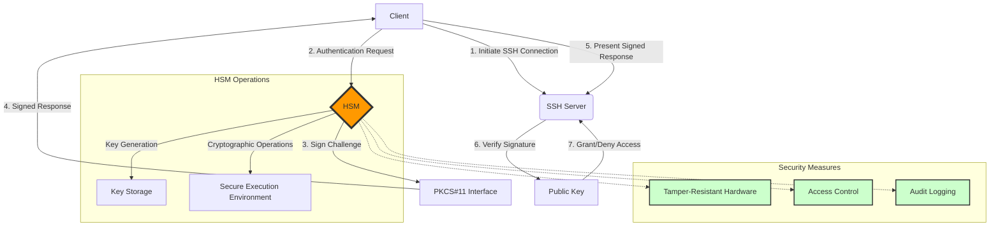
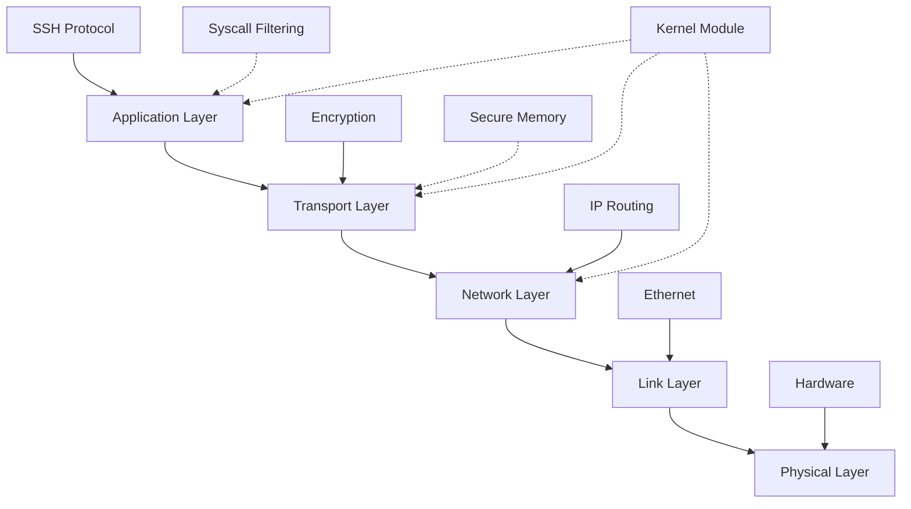
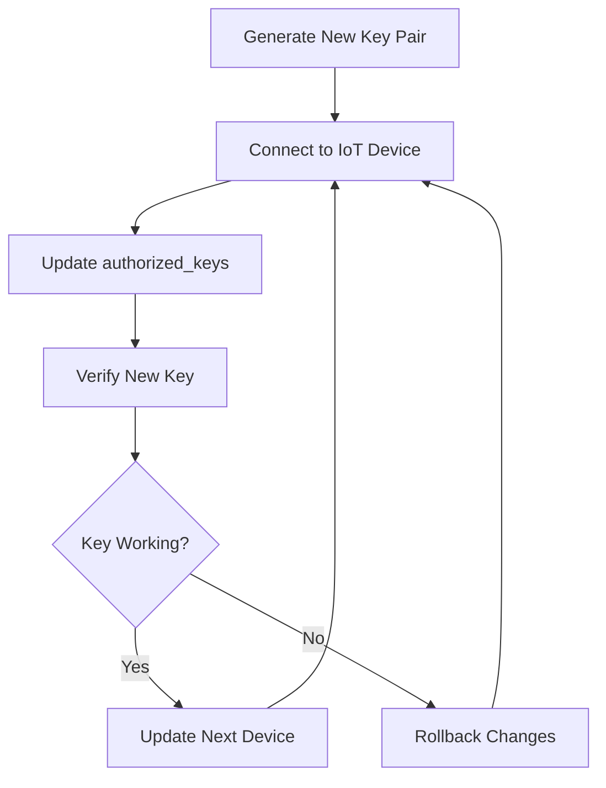

# SSH Mastery: Advanced Techniques with a Twist of Pentesting

```ascii
 ____  ____  _   _   __  __           _            
/ ___|| ___|| | | | |  \/  | __ _ ___| |_ ___ _ __ 
\___ \|___ \| |_| | | |\/| |/ _` / __| __/ _ \ '__|
 ___) |___) |  _  | | |  | | (_| \__ \ ||  __/ |   
|____/|____/|_| |_| |_|  |_|\__,_|___/\__\___|_|   
```

## Table of Contents
1. [SSH Pentesting Techniques](#ssh-pentesting-techniques)
2. [Hardware Security Modules (HSMs) for SSH](#hardware-security-modules-hsms-for-ssh)
3. [SSH over Non-Standard Protocols](#ssh-over-non-standard-protocols)
4. [Kernel-Level SSH Hardening](#kernel-level-ssh-hardening)
5. [SSH in IoT and Embedded Systems](#ssh-in-iot-and-embedded-systems)
6. [SSH Honeypots for Pentesters](#ssh-honeypots-for-pentesters)

## SSH Pentesting Techniques

| Technique | Command | Description |
|-----------|---------|-------------|
| Banner Grabbing | `nc -vv 192.168.1.100 22` | Collects information about the SSH version and operating system. |
| Brute Force | `hydra -l root -P wordlist.txt 192.168.1.100 ssh` | Automatically tests multiple passwords. |
| Key-Based Auth Exploit | `ssh-keygen -t rsa -b 4096` <br> `ssh-copy-id -i ~/.ssh/id_rsa.pub user@192.168.1.100` | Adds a public key to the server for persistent access. |
| Port Forwarding Recon | `ssh -L 8080:localhost:80 user@192.168.1.100` | Creates an SSH tunnel to access normally inaccessible services. |
| SSH Protocol Fuzzing | `nmap --script ssh2-enum-algos 192.168.1.100` | Enumerates encryption algorithms supported by the SSH server. |

### Advanced Strategies

1. **Chained Exploitation**
   ```bash
   version=$(nc -vv 192.168.1.100 22 2>&1 | grep SSH)
   searchsploit "$version"
   ssh -L 3389:10.0.0.5:3389 user@192.168.1.100
   ```
   Combines banner grabbing, exploit searching, and tunneling.

2. **SSH Tunnel Pivoting**
   ```bash
   ssh -L 8080:localhost:8080 user1@host1 ssh -L 8080:localhost:80 user2@host2
   ```
   Creates nested SSH tunnels through multiple hosts.

### Defensive Measures
1. Strong Keys: `ssh-keygen -t rsa -b 4096`
2. Key-Based Authentication: Set `PasswordAuthentication no` in `sshd_config`
3. Fail2Ban: `sudo apt-get install fail2ban`
4. SSH CA: `ssh-keygen -f /etc/ssh/ca -b 4096 -t rsa`
5. Monitoring: Set `LogLevel VERBOSE` in `sshd_config`


The screenshot above shows sample results of an SSH port scan using Nmap. It displays information about the SSH version, available encryption algorithms, and other server configuration details. This type of information is crucial for pentesters when assessing the security of an SSH infrastructure.

## Hardware Security Modules (HSMs) for SSH

HSMs provide a robust layer of security for SSH implementations by safeguarding cryptographic keys and operations within a tamper-resistant hardware environment.

### Key Implementation Steps:

1. **HSM Integration for Key Storage**
   ```bash
   pkcs11-tool --module /usr/lib/libsofthsm2.so --login --pin 1337 --keypairgen --key-type rsa:2048 --label "ssh-key-1337"
   ```

2. **PKCS#11 SSH Configuration**
   ```bash
   # ~/.ssh/config
   Host secure-server
     PKCS11Provider /usr/lib/libsofthsm2.so
     IdentityFile pkcs11:object=ssh-key-1337
   ```

3. **HSM-Based SSH Agent**
   ```bash
   #!/bin/bash
   ssh-agent
   ssh-add -s /usr/lib/libsofthsm2.so
   ```

### Advanced Techniques for Pentesters:

1. **Timing Analysis**: Measure HSM response times for different operations.
2. **Fault Injection**: Attempt to disrupt HSM operations through voltage manipulation.
3. **API Fuzzing**: Develop custom fuzzing tools targeting HSM-specific APIs.
4. **Firmware Analysis**: Extract and analyze HSM firmware for vulnerabilities.
5. **Side-Channel Attacks**: Monitor power consumption and electromagnetic emissions.

### HSM SSH Integration Diagram



## SSH over Non-Standard Protocols

Bypassing network restrictions and evading detection using non-standard protocols for SSH connections.


### Stealth Techniques Overview

| Technique | Protocol | Key Advantage | Main Challenge |
|-----------|----------|---------------|----------------|
| HTTPS     | TLS/SSL  | DPI Evasion   | TLS Overhead   |
| DNS       | DNS      | Rare Blocking | Slow Speed     |
| ICMP      | ICMP     | Firewall Bypass | Root Access Needed |

### Detailed Implementation

1. **SSH over HTTPS** (DPI Evasion)
   ```bash
   ssh -o ProxyCommand='openssl s_client -connect %h:%p -quiet' user@remote_host
   ```

2. **SSH over DNS** (Extreme Stealth)
   ```bash
   # Server setup
   iodined -f -c -P s3cr3t 10.0.0.1 tunnel.y0ur.domain
   
   # Client connection
   ssh -o ProxyCommand='nc -x localhost:5353 %h %p' user@10.0.0.1
   ```

3. **SSH over ICMP** (Firewall Bypass)
   ```bash
   # Server setup
   sudo ptunnel -tcp 22 -proxy 0.0.0.0 -daemon /var/run/ptunnel.pid
   
   # Client connection
   sudo ptunnel -p server_ip -lp 2222 -da 127.0.0.1 -dp 22
   ssh -p 2222 user@localhost
   ```

### Advanced Pentester Multi-Method Script

```bash
#!/bin/bash
TARGET="target.com"
USER="pentester"

# HTTPS method
ssh -o ProxyCommand='openssl s_client -connect %h:443 -quiet' $USER@$TARGET || \
# DNS method (if HTTPS fails)
(iodine -f 10.0.0.1 tunnel.$TARGET && \
 ssh -o ProxyCommand='nc -x localhost:5353 %h %p' $USER@10.0.0.1) || \
# ICMP method (last resort)
(sudo ptunnel -p $TARGET -lp 2222 -da 127.0.0.1 -dp 22 && \
 ssh -p 2222 $USER@localhost)
```

**Gh0st Mode**: This script attempts all three methods sequentially, providing maximum evasion capability.

## Kernel-Level SSH Hardening


### Custom Kernel Module for SSH Integrity

```c
#include <linux/module.h>
#include <linux/kernel.h>
#include <linux/init.h>
#include <linux/syscalls.h>
#include <linux/file.h>
#include <linux/fs.h>

MODULE_LICENSE("GPL");
MODULE_AUTHOR("1337h4x0r");
MODULE_DESCRIPTION("SSH Integrity Monitor");

static int __init ssh_integrity_init(void) {
    printk(KERN_INFO "SSH Integrity Monitor: Initialized\n");
    // Implementation details here
    return 0;
}

static void __exit ssh_integrity_exit(void) {
    printk(KERN_INFO "SSH Integrity Monitor: Unloaded\n");
}

module_init(ssh_integrity_init);
module_exit(ssh_integrity_exit);
```

**Kernel Fu**: This module hooks into the kernel to monitor SSH-related files and processes, providing a deep layer of security.

### SSH Security Layers Visualization



### Secure Memory Allocation for SSH

```c
#include <sys/mman.h>
#include <string.h>

void *secure_alloc(size_t size) {
    void *ptr = mmap(NULL, size, PROT_READ | PROT_WRITE, MAP_PRIVATE | MAP_ANONYMOUS, -1, 0);
    if (ptr == MAP_FAILED) return NULL;
    mlock(ptr, size);
    return ptr;
}

void secure_free(void *ptr, size_t size) {
    if (ptr) {
        memset(ptr, 0, size);
        munlock(ptr, size);
        munmap(ptr, size);
    }
}
```

**Memory Lockdown**: This technique prevents sensitive SSH data from being swapped to disk, protecting against memory dumps and swap file analysis.

### SSH-Specific Syscall Filtering

```c
#include <linux/filter.h>
#include <linux/seccomp.h>
#include <sys/prctl.h>
#include <unistd.h>

int enable_ssh_syscall_filter(void) {
    struct sock_filter filter[] = {
        BPF_STMT(BPF_LD | BPF_W | BPF_ABS, (offsetof(struct seccomp_data, nr))),
        BPF_JUMP(BPF_JMP | BPF_JEQ | BPF_K, __NR_read, 0, 1),
        BPF_STMT(BPF_RET | BPF_K, SECCOMP_RET_ALLOW),
        // Add more allowed syscalls here
        BPF_STMT(BPF_RET | BPF_K, SECCOMP_RET_KILL),
    };
    struct sock_fprog prog = {
        .len = (unsigned short)(sizeof(filter) / sizeof(filter[0])),
        .filter = filter,
    };
    if (prctl(PR_SET_NO_NEW_PRIVS, 1, 0, 0, 0)) return -1;
    if (prctl(PR_SET_SECCOMP, SECCOMP_MODE_FILTER, &prog)) return -1;
    return 0;
}
```

**Syscall Fortress**: This code restricts SSH processes to specific syscalls, dramatically reducing the attack surface.

## SSH in IoT and Embedded Systems

### IoT Lightweight SSH

```c
ssh_session session = ssh_new();
ssh_options_set(session, SSH_OPTIONS_HOST, "localhost");
ssh_connect(session);
```

**Command:** `ssh_connect(session)`
**Description:** Establishes a secure SSH connection using minimal resources, crucial for IoT devices with limited processing power and memory.

**Additional Commands:**
1. `ssh_userauth_password(session, NULL, "password")` - Authenticate using a password
2. `ssh_channel_open_session(channel)` - Open a channel for communication

```ascii
  +--------+        SSH         +-----------+
  |  IoT   | <--------------->  |   Server  |
  | Device |   (Lightweight)    |           |
  +--------+                    +-----------+
```

### IoT Fleet Key Management

```python
def update_device_key(hostname, username, current_key_file, new_public_key):
    client.connect(hostname, username=username, key_filename=current_key_file)
    client.exec_command(f'echo "{new_public_key.decode()}" >> ~/.ssh/authorized_keys')
```

**Command:** `client.exec_command(f'echo "{new_public_key.decode()}" >> ~/.ssh/authorized_keys')`
**Description:** Appends a new public key to the authorized_keys file on a remote IoT device, enabling key rotation without manual intervention.

**Additional Commands:**
1. `ssh-keygen -t rsa -b 4096 -C "iot_device@example.com"` - Generate a new RSA key pair
2. `ssh-copy-id -i ~/.ssh/id_rsa.pub user@iot_device` - Copy the public key to an IoT device


**Screenshot description:** This screenshot shows the SSH key management panel for an IoT device fleet. At the top, you can see a list of all connected devices with their names and IP addresses. Below is a "Key Management" section where you can generate a new key, add it to selected devices, or remove old keys. At the bottom of the screen is an activity log showing recent key operations.



## SSH Honeypots for Pentesters 🍯

```python
class SSHServer(paramiko.ServerInterface):
    def check_auth_password(self, username, password):
        print(f"[*] Login attempt - User: {username}, Pass: {password}")
        return paramiko.AUTH_FAILED
```

**Command:** `print(f"[*] Login attempt - User: {username}, Pass: {password}")`
**Description:** Logs all authentication attempts to the honeypot, providing valuable insight into attacker techniques and commonly used credentials.

**Additional Commands:**
1. `sudo python3 ssh_honeypot.py` - Start the SSH honeypot
2. `tail -f honeypot_logs.txt` - Monitor honeypot logs in real-time


**Screenshot description:** This screenshot displays the SSH Honeypot control panel. On the left side of the screen, we see a bar graph showing the number of login attempts over the last 24 hours. On the right side is a list of recent login attempts with information about the attacker's IP address, username, and password used. At the bottom of the screen is a world map with points marking the origins of the attacks.

| Attacker IP | Username | Password | Timestamp |
|-------------|----------|----------|-----------|
| 192.168.1.100 | root | password123 | 2024-08-31 14:23:45 |
| 10.0.0.5 | admin | qwerty | 2024-08-31 14:24:12 |
| 172.16.0.2 | user | 123456 | 2024-08-31 14:25:03 |

```ascii
     _______
    |.-----.|
    ||x . x||  SSH Honeypot
    ||_.-._||  Tracking Hackers
    `--)-(--`
   __[=== o]___
  |:::::::::::|\\
  `-=========-`()
```
