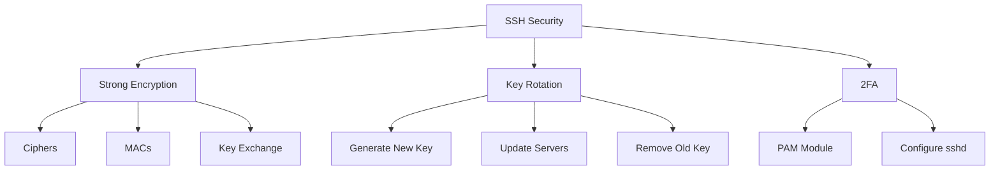
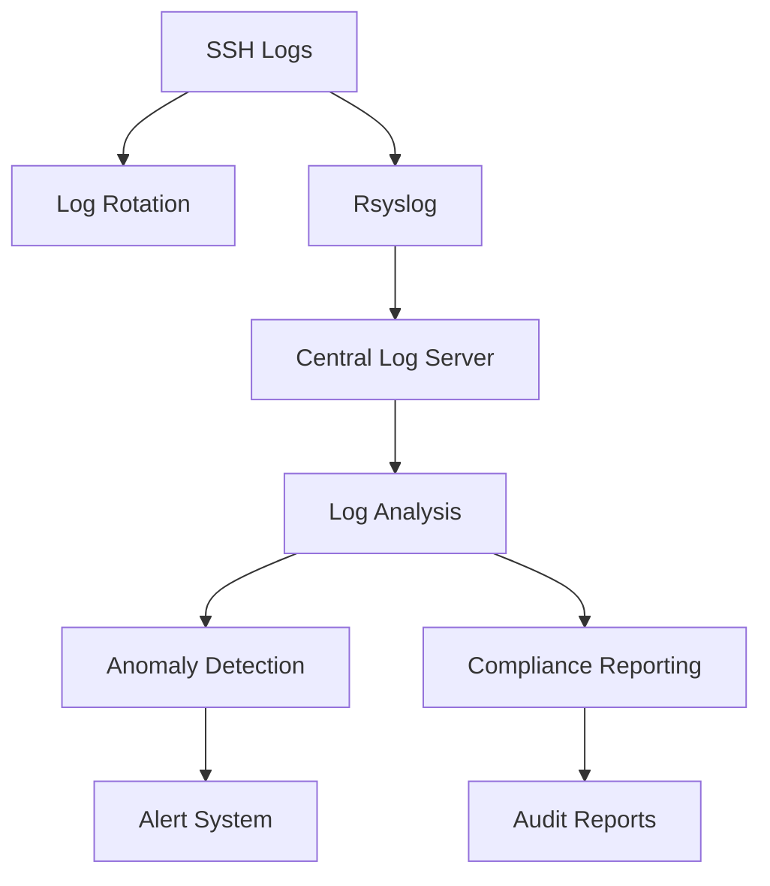
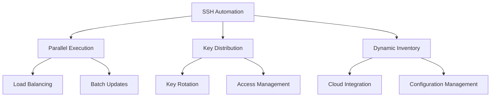
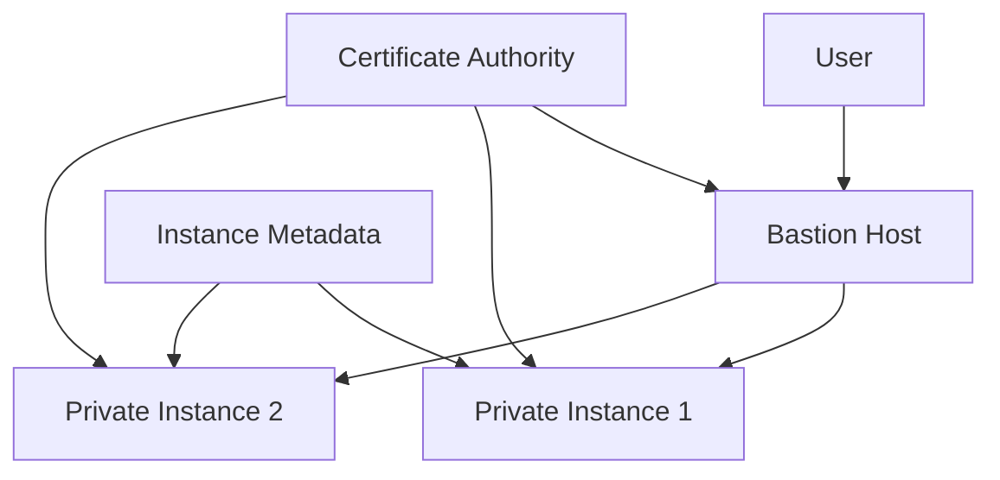
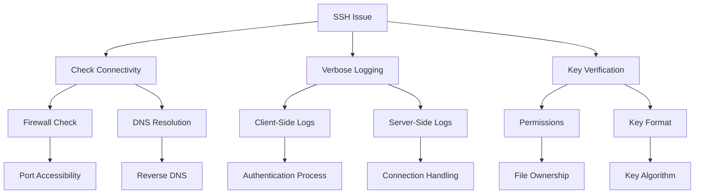

# 🚀 SSH Mastery: Advanced Techniques for Security Professionals

<div align="center">

```ascii
   _____  _____ _    _   __  __           _            
  / ____|/ ____| |  | | |  \/  |         | |           
 | (___ | (___ | |__| | | \  / | __ _ ___| |_ ___ _ __ 
  \___ \ \___ \|  __  | | |\/| |/ _` / __| __/ _ \ '__|
  ____) |____) | |  | | | |  | | (_| \__ \ ||  __/ |   
 |_____/|_____/|_|  |_| |_|  |_|\__,_|___/\__\___|_|   
```

</div>

## Table of Contents
10. [🛡️ Hardening SSH Security](#-hardening-ssh-security)
11. [🔍 SSH Auditing and Logging](#-ssh-auditing-and-logging)
12. [🔄 SSH Automation and Scripting](#-ssh-automation-and-scripting)
13. [🌐 SSH in Cloud Environments](#-ssh-in-cloud-environments)
14. [🧪 Advanced SSH Troubleshooting](#-advanced-ssh-troubleshooting)

---

## 🛡️ Hardening SSH Security

Enhancing SSH security is crucial for protecting your systems from unauthorized access and potential attacks.

### Key Security Measures

1. **Use Strong Encryption Algorithms**
   ```bash
   # In /etc/ssh/sshd_config
   Ciphers chacha20-poly1305@openssh.com,aes256-gcm@openssh.com
   MACs hmac-sha2-512-etm@openssh.com,hmac-sha2-256-etm@openssh.com
   KexAlgorithms curve25519-sha256@libssh.org,diffie-hellman-group16-sha512
   ```

2. **Implement SSH Key Rotation**
   ```bash
   # Generate a new key
   ssh-keygen -t ed25519 -f ~/.ssh/id_ed25519_new -C "new_key_$(date +%Y-%m-%d)"

   # Add new key to authorized_keys on remote servers
   ssh-copy-id -i ~/.ssh/id_ed25519_new.pub user@remote_host

   # Update local SSH config
   sed -i 's/IdentityFile ~\/.ssh\/id_ed25519/IdentityFile ~\/.ssh\/id_ed25519_new/' ~/.ssh/config

   # Remove old key from remote servers
   ssh user@remote_host "sed -i '/old_key/d' ~/.ssh/authorized_keys"
   ```

3. **Enable Two-Factor Authentication**
   ```bash
   # Install Google Authenticator PAM module
   sudo apt-get install libpam-google-authenticator

   # Configure PAM
   echo "auth required pam_google_authenticator.so" | sudo tee -a /etc/pam.d/sshd

   # Update sshd_config
   echo "ChallengeResponseAuthentication yes" | sudo tee -a /etc/ssh/sshd_config
   ```

### 📊 Security Hardening Diagram



<details>
<summary><strong>🌟 Real-World Scenario: Financial Institution</strong></summary>

Consider a large financial institution managing sensitive customer data. They implement:

1. Quarterly key rotation
2. Hardware security modules (HSMs) for key storage
3. Geo-fencing to restrict SSH access based on IP ranges
4. Continuous monitoring and alerting for unusual SSH activity

These measures provide defense-in-depth, significantly reducing the risk of unauthorized access to critical systems.

</details>

---

## 🔍 SSH Auditing and Logging

Effective auditing and logging are essential for maintaining security and compliance in SSH environments.

### Advanced Logging Techniques

1. **Enable Verbose Logging**
   ```bash
   # In /etc/ssh/sshd_config
   LogLevel VERBOSE
   ```

2. **Configure Rsyslog for SSH Logs**
   ```bash
   # In /etc/rsyslog.d/10-ssh.conf
   if $programname == 'sshd' then /var/log/ssh.log
   & stop
   ```

3. **Implement Log Rotation**
   ```bash
   # In /etc/logrotate.d/ssh
   /var/log/ssh.log {
       rotate 7
       daily
       compress
       missingok
       notifempty
   }
   ```

### 🐍 SSH Log Analyzer

<details>
<summary><strong>Click to view Python script</strong></summary>

```python
import re
import sys
from collections import Counter

def analyze_ssh_log(log_file):
    ip_pattern = r'\d{1,3}\.\d{1,3}\.\d{1,3}\.\d{1,3}'
    failed_attempts = Counter()
    successful_logins = Counter()

    with open(log_file, 'r') as f:
        for line in f:
            if 'Failed password' in line:
                ip = re.search(ip_pattern, line)
                if ip:
                    failed_attempts[ip.group()] += 1
            elif 'Accepted publickey' in line:
                ip = re.search(ip_pattern, line)
                if ip:
                    successful_logins[ip.group()] += 1

    print("Top 5 IPs with failed password attempts:")
    for ip, count in failed_attempts.most_common(5):
        print(f"{ip}: {count}")

    print("\nTop 5 IPs with successful logins:")
    for ip, count in successful_logins.most_common(5):
        print(f"{ip}: {count}")

if __name__ == "__main__":
    if len(sys.argv) != 2:
        print("Usage: python ssh_log_analyzer.py /path/to/ssh.log")
        sys.exit(1)
    analyze_ssh_log(sys.argv[1])
```

</details>

### 📊 Log Analysis Workflow



<details>
<summary><strong>🌟 Real-World Scenario: Security Operations Center</strong></summary>

A Security Operations Center (SOC) implements:

1. Real-time log streaming to a SIEM (Security Information and Event Management) system
2. Machine learning algorithms for anomaly detection in SSH access patterns
3. Automated incident response for suspicious SSH activities (e.g., blocking IPs after multiple failed attempts)
4. Integration with threat intelligence feeds to identify known malicious IP addresses

This setup allows the SOC to proactively identify and respond to potential SSH-based attacks.

</details>

---

## 🔄 SSH Automation and Scripting

Automating SSH tasks can significantly improve efficiency and reduce human error in managing large-scale infrastructures.

### Advanced Automation Techniques

1. **Parallel SSH Execution**
   ```bash
   #!/bin/bash
   hosts=(host1 host2 host3)
   command="uptime"

   for host in "${hosts[@]}"; do
       ssh "$host" "$command" &
   done

   wait
   ```

2. **SSH Key Distribution Script**
   ```bash
   #!/bin/bash
   key_file="$HOME/.ssh/id_ed25519.pub"
   hosts_file="hosts.txt"

   while read -r host; do
       ssh-copy-id -i "$key_file" "$host"
   done < "$hosts_file"
   ```

3. **Dynamic Inventory for Configuration Management**
   ```python
   #!/usr/bin/env python3
   import json
   import subprocess

   def get_ssh_hosts():
       result = subprocess.run(["aws", "ec2", "describe-instances", "--query", "Reservations[*].Instances[*].PublicDnsName", "--output", "json"], capture_output=True, text=True)
       hosts = json.loads(result.stdout)
       return [host for sublist in hosts for host in sublist if host]

   inventory = {
       "all": {
           "hosts": get_ssh_hosts(),
           "vars": {
               "ansible_user": "ec2-user",
               "ansible_ssh_private_key_file": "~/.ssh/my_aws_key.pem"
           }
       }
   }

   print(json.dumps(inventory))
   ```

### 📊 Automation Workflow



<details>
<summary><strong>🌟 Real-World Scenario: DevOps Pipeline</strong></summary>

A DevOps team implements:

1. CI/CD pipeline using SSH for secure deployments
2. Automated SSH key rotation integrated with secrets management system
3. Dynamic SSH proxy for accessing internal resources securely during deployments
4. SSH-based health checks and rollback mechanisms

This automation ensures secure, efficient, and consistent deployments across multiple environments.

</details>

---

## 🌐 SSH in Cloud Environments

Leveraging SSH in cloud environments requires adapting traditional practices to cloud-native paradigms.

### Cloud-Specific SSH Techniques

1. **SSH Bastion Host Setup**
   ```bash
   # In ~/.ssh/config
   Host bastion
       HostName bastion.example.com
       User bastion_user
       IdentityFile ~/.ssh/bastion_key

   Host private-instance
       HostName 10.0.0.5
       User instance_user
       ProxyJump bastion
       IdentityFile ~/.ssh/instance_key
   ```

2. **Using Instance Metadata for Key Management**
   ```bash
   #!/bin/bash
   # Fetch public key from instance metadata
   curl -s http://169.254.169.254/latest/meta-data/public-keys/0/openssh-key > /home/ec2-user/.ssh/authorized_keys
   chmod 600 /home/ec2-user/.ssh/authorized_keys
   ```

3. **SSH Certificate Authority for Dynamic Environments**
   ```bash
   # Generate CA key
   ssh-keygen -f ca_key -C "SSH CA Key"

   # Sign user key
   ssh-keygen -s ca_key -I "user@example.com" -n "ec2-user" -V +1w user_key.pub

   # Configure servers to trust CA
   echo "TrustedUserCAKeys /etc/ssh/ca_key.pub" >> /etc/ssh/sshd_config
   ```

### 📊 Cloud SSH Architecture



<details>
<summary><strong>🌟 Real-World Scenario: Multi-Cloud Environment</strong></summary>

A global company with a multi-cloud infrastructure implements:

1. Centralized SSH Certificate Authority for user authentication across all clouds
2. Cloud-agnostic bastion hosts with adaptive firewall rules
3. Just-in-time SSH access provisioning integrated with IAM systems
4. SSH tunneling for secure cross-cloud data transfers

This setup provides consistent, secure access management across diverse cloud environments.

</details>

---

## 🧪 Advanced SSH Troubleshooting

Effective troubleshooting is crucial for maintaining reliable SSH connections in complex environments.

### Advanced Troubleshooting Techniques

1. **SSH Verbose Debugging**
   ```bash
   ssh -vvv user@host
   ```

2. **Network Diagnostics with Netcat**
   ```bash
   nc -vz host 22
   ```

3. **Analyzing SSH Key Issues**
   ```bash
   ssh-keygen -l -f /path/to/key
   ssh-keygen -y -f /path/to/private_key
   ```

4. **Tracing SSH Connections**
   ```bash
   sudo strace -f -p $(pgrep -n sshd)
   ```

### 🐍 SSH Connection Tester

<details>
<summary><strong>Click to view Python script</strong></summary>

```python
import paramiko
import socket
import time

def test_ssh_connection(hostname, username, key_filename, port=22):
    start_time = time.time()
    try:
        client = paramiko.SSHClient()
        client.set_missing_host_key_policy(paramiko.AutoAddPolicy())
        client.connect(hostname, port=port, username=username, key_filename=key_filename, timeout=5)
        end_time = time.time()
        print(f"Successfully connected to {hostname}")
        print(f"Connection time: {end_time - start_time:.2f} seconds")

        stdin, stdout, stderr = client.exec_command('uptime')
        print(f"Server uptime: {stdout.read().decode().strip()}")

        transport = client.get_transport()
        print(f"Using cipher: {transport.local_cipher}")
        print(f"Using MAC: {transport.local_mac}")
        print(f"Using compression: {transport.use_compression}")

    except paramiko.AuthenticationException:
        print(f"Authentication failed for {hostname}")
    except paramiko.SSHException as ssh_exception:
        print(f"SSH exception occurred: {ssh_exception}")
    except socket.error as socket_error:
        print(f"Socket error occurred: {socket_error}")
    finally:
        if 'client' in locals():
            client.close()

# Usage
test_ssh_connection('example.com', 'user', '/path/to/private_key')
```

</details>

### 📊 Troubleshooting Workflow



<details>
<summary><strong>🌟 Real-World Scenario: Global Enterprise Network</strong></summary>

A multinational corporation with a complex network infrastructure faces SSH connectivity issues. Their troubleshooting process
