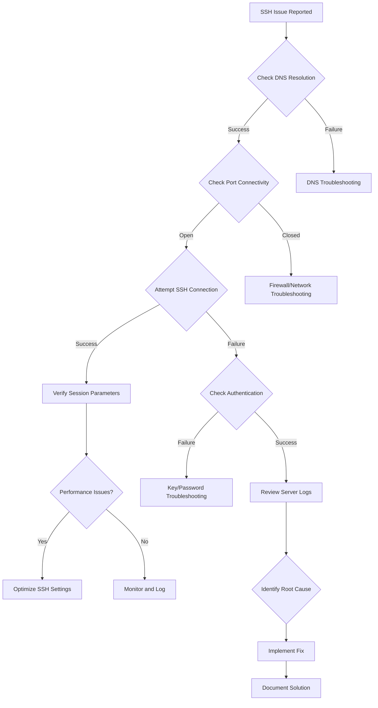

# 🚀 SSH Mastery: Advanced Techniques for Security Professionals

## Part 5: 🛠️ Advanced SSH Troubleshooting Techniques

Building upon our previous troubleshooting methods, this section delves into more sophisticated techniques for diagnosing and resolving complex SSH issues.

### 5.1 Advanced SSH Connection Analysis

#### 5.1.1 TCP Handshake Inspection
Use `tcpdump` to capture and analyze the TCP handshake process:

```bash
sudo tcpdump -i eth0 -n 'tcp[tcpflags] & (tcp-syn|tcp-ack) != 0 and port 22'
```

#### 5.1.2 SSH Key Exchange Analysis
Examine the key exchange process in detail:

```bash
ssh -vvv -o 'LogLevel=DEBUG3' user@host | grep 'kex:'
```

### 5.2 Performance Optimization

#### 5.2.1 SSH Multiplexing
Enable SSH multiplexing to improve connection speed:

```bash
echo "
Host *
    ControlMaster auto
    ControlPath ~/.ssh/controlmasters/%r@%h:%p
    ControlPersist 10m
" >> ~/.ssh/config
```

#### 5.2.2 Compression Analysis
Test SSH performance with different compression levels:

```bash
for i in {0..9}; do
    time ssh -C -o "CompressionLevel $i" user@host 'dd if=/dev/zero bs=1M count=100'
done
```

### 5.3 Advanced Security Auditing

#### 5.3.1 SSH Cipher Enumeration
List and test available ciphers:

```bash
ssh -Q cipher | xargs -n1 ssh -o 'Ciphers=+aes128-cbc' user@host
```

#### 5.3.2 Host Key Verification
Implement stricter host key checking:

```bash
ssh -o "VerifyHostKeyDNS=yes" -o "StrictHostKeyChecking=yes" user@host
```

### 5.4 Automated Troubleshooting Script

Create a comprehensive SSH troubleshooting script:

```python
import paramiko
import socket
import subprocess
import sys

def check_dns(hostname):
    try:
        return socket.gethostbyname(hostname)
    except socket.gaierror:
        return None

def check_port(hostname, port):
    sock = socket.socket(socket.AF_INET, socket.SOCK_STREAM)
    result = sock.connect_ex((hostname, port))
    sock.close()
    return result == 0

def check_ssh_connection(hostname, username, key_path):
    client = paramiko.SSHClient()
    client.set_missing_host_key_policy(paramiko.AutoAddPolicy())
    try:
        client.connect(hostname, username=username, key_filename=key_path)
        return True
    except Exception as e:
        print(f"SSH connection failed: {str(e)}")
        return False
    finally:
        client.close()

def main(hostname, username, key_path):
    print(f"Troubleshooting SSH connection to {hostname}")
    
    ip = check_dns(hostname)
    if ip:
        print(f"DNS resolution successful: {hostname} -> {ip}")
    else:
        print(f"DNS resolution failed for {hostname}")
        return
    
    if check_port(hostname, 22):
        print("Port 22 is open")
    else:
        print("Port 22 is closed")
        return
    
    if check_ssh_connection(hostname, username, key_path):
        print("SSH connection successful")
    else:
        print("SSH connection failed")

if __name__ == "__main__":
    if len(sys.argv) != 4:
        print("Usage: python ssh_troubleshoot.py hostname username key_path")
        sys.exit(1)
    main(sys.argv[1], sys.argv[2], sys.argv[3])
```

### 5.5 Advanced SSH Logging and Monitoring

#### 5.5.1 Centralized SSH Logging
Configure centralized logging for SSH connections:

```bash
echo "
*.* @@logserver.example.com:514
" >> /etc/rsyslog.d/ssh-forward.conf

sudo systemctl restart rsyslog
```

#### 5.5.2 Real-time SSH Monitoring
Use `fail2ban` for real-time monitoring and protection:

```bash
sudo apt install fail2ban
sudo cp /etc/fail2ban/jail.conf /etc/fail2ban/jail.local
sudo nano /etc/fail2ban/jail.local

# Add the following configuration:
[sshd]
enabled = true
port = ssh
filter = sshd
logpath = /var/log/auth.log
maxretry = 3
bantime = 3600

sudo systemctl restart fail2ban
```

### 5.6 Troubleshooting Workflow



This advanced troubleshooting workflow provides a structured approach to diagnosing and resolving complex SSH issues, incorporating the techniques and tools discussed in this section.
