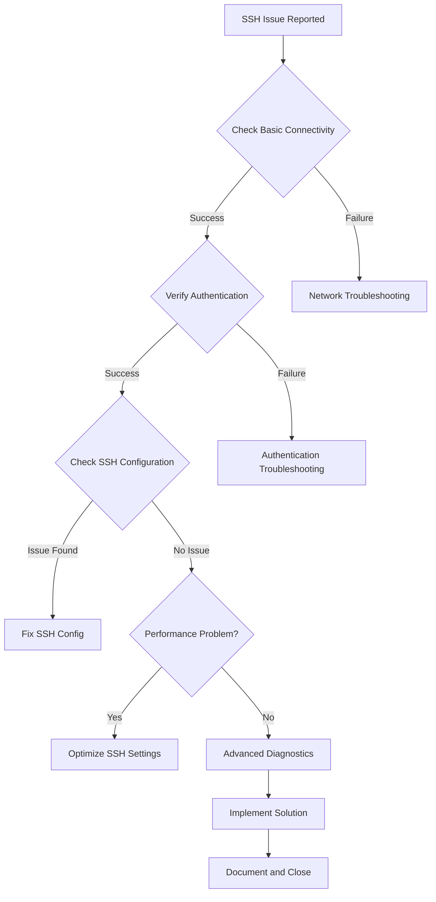

# 🚀 SSH Mastery: Comprehensive Troubleshooting Guide

## Introduction to SSH Troubleshooting

SSH (Secure Shell) is a powerful tool for secure remote access, but it can sometimes present challenges. This guide will walk you through the process of troubleshooting SSH issues, starting from the basics and progressing to advanced techniques.

## Part 1: 🌱 SSH Basics and Common Issues

Before diving into advanced troubleshooting, it's crucial to understand the basics of SSH and common issues that may arise.

### 1.1 What is SSH?

SSH is a network protocol that provides a secure way to access a remote computer. It encrypts all traffic between the client and server, protecting your data from eavesdropping.

### 1.2 Common SSH Issues

1. **Connection Refused**: The SSH server might not be running or a firewall could be blocking the connection.
2. **Authentication Failure**: Incorrect username or password, or issues with SSH keys.
3. **Slow Connection**: Network problems or server overload can cause slow SSH connections.
4. **Host Key Verification Failed**: This occurs when the server's host key doesn't match the one stored on your client.

### 1.3 Basic Troubleshooting Steps

1. **Check Your Internet Connection**: Ensure you have a stable internet connection.
2. **Verify Server Status**: Make sure the SSH server is running on the remote machine.
3. **Check Firewall Settings**: Ensure your firewall isn't blocking SSH traffic (usually port 22).
4. **Verify Credentials**: Double-check your username and password or SSH key.

## Part 2: 🔍 Intermediate Troubleshooting Techniques

Once you've covered the basics, you can move on to more detailed troubleshooting methods.

### 2.1 Using Verbose Mode

SSH's verbose mode can provide valuable information for troubleshooting:

```bash
ssh -v username@hostname
```

This command will show detailed information about the connection process, helping you identify where issues might be occurring.

### 2.2 Checking SSH Server Logs

Server logs can offer insights into failed connection attempts:

```bash
sudo tail -f /var/log/auth.log
```

This command shows real-time log entries, which can be useful for identifying authentication issues or unusual activity.

### 2.3 Testing SSH Port Connectivity

Use the `netcat` tool to check if the SSH port is open:

```bash
nc -vz hostname 22
```

If successful, you'll see a message indicating the port is open.

### 2.4 Checking SSH Key Permissions

Incorrect permissions on SSH key files can cause authentication failures. Ensure your private key has the correct permissions:

```bash
chmod 600 ~/.ssh/id_rsa
```

This command sets the correct permissions for your private key file.

## Part 3: 🛠️ Advanced SSH Troubleshooting Techniques

For more complex issues, advanced techniques can help diagnose and resolve problems.

### 3.1 Advanced SSH Connection Analysis

#### 3.1.1 TCP Handshake Inspection
Use `tcpdump` to capture and analyze the TCP handshake process:

```bash
sudo tcpdump -i eth0 -n 'tcp[tcpflags] & (tcp-syn|tcp-ack) != 0 and port 22'
```

This command captures TCP SYN and ACK packets on port 22, allowing you to see if the initial connection is being established correctly.

#### 3.1.2 SSH Key Exchange Analysis
Examine the key exchange process in detail:

```bash
ssh -vvv -o 'LogLevel=DEBUG3' user@host | grep 'kex:'
```

This command provides a detailed look at the key exchange process, which can help identify issues with encryption algorithms or key negotiation.

### 3.2 Performance Optimization

#### 3.2.1 SSH Multiplexing
Enable SSH multiplexing to improve connection speed:

```bash
echo "
Host *
    ControlMaster auto
    ControlPath ~/.ssh/controlmasters/%r@%h:%p
    ControlPersist 10m
" >> ~/.ssh/config
```

Multiplexing allows multiple SSH sessions to share a single network connection, reducing latency and improving performance.

#### 3.2.2 Compression Analysis
Test SSH performance with different compression levels:

```bash
for i in {0..9}; do
    time ssh -C -o "CompressionLevel $i" user@host 'dd if=/dev/zero bs=1M count=100'
done
```

This script tests SSH performance with different compression levels, helping you find the optimal setting for your connection.

### 3.3 Advanced Security Auditing

#### 3.3.1 SSH Cipher Enumeration
List and test available ciphers:

```bash
ssh -Q cipher | xargs -n1 ssh -o 'Ciphers=+aes128-cbc' user@host
```

This command lists all available ciphers and attempts to connect using each one, helping you identify supported and potentially problematic ciphers.

#### 3.3.2 Host Key Verification
Implement stricter host key checking:

```bash
ssh -o "VerifyHostKeyDNS=yes" -o "StrictHostKeyChecking=yes" user@host
```

This command enables DNS-based host key verification and strict host key checking, enhancing security but potentially causing connection issues if keys don't match.

### 3.4 Automated Troubleshooting Script

Here's a comprehensive Python script for automated SSH troubleshooting:

```python
import paramiko
import socket
import subprocess
import sys

def check_dns(hostname):
    try:
        return socket.gethostbyname(hostname)
    except socket.gaierror:
        return None

def check_port(hostname, port):
    sock = socket.socket(socket.AF_INET, socket.SOCK_STREAM)
    result = sock.connect_ex((hostname, port))
    sock.close()
    return result == 0

def check_ssh_connection(hostname, username, key_path):
    client = paramiko.SSHClient()
    client.set_missing_host_key_policy(paramiko.AutoAddPolicy())
    try:
        client.connect(hostname, username=username, key_filename=key_path)
        return True
    except Exception as e:
        print(f"SSH connection failed: {str(e)}")
        return False
    finally:
        client.close()

def main(hostname, username, key_path):
    print(f"Troubleshooting SSH connection to {hostname}")

    ip = check_dns(hostname)
    if ip:
        print(f"DNS resolution successful: {hostname} -> {ip}")
    else:
        print(f"DNS resolution failed for {hostname}")
        return

    if check_port(hostname, 22):
        print("Port 22 is open")
    else:
        print("Port 22 is closed")
        return

    if check_ssh_connection(hostname, username, key_path):
        print("SSH connection successful")
    else:
        print("SSH connection failed")

if __name__ == "__main__":
    if len(sys.argv) != 4:
        print("Usage: python ssh_troubleshoot.py hostname username key_path")
        sys.exit(1)
    main(sys.argv[1], sys.argv[2], sys.argv[3])
```

This script automates several troubleshooting steps, including DNS resolution, port checking, and SSH connection testing.

### 3.5 Advanced SSH Logging and Monitoring

#### 3.5.1 Centralized SSH Logging
Configure centralized logging for SSH connections:

```bash
echo "
*.* @@logserver.example.com:514
" >> /etc/rsyslog.d/ssh-forward.conf

sudo systemctl restart rsyslog
```

This configuration forwards SSH logs to a central log server, allowing for easier monitoring and analysis of SSH activity across multiple systems.

#### 3.5.2 Real-time SSH Monitoring
Use `fail2ban` for real-time monitoring and protection:

```bash
sudo apt install fail2ban
sudo cp /etc/fail2ban/jail.conf /etc/fail2ban/jail.local
sudo nano /etc/fail2ban/jail.local

# Add the following configuration:
[sshd]
enabled = true
port = ssh
filter = sshd
logpath = /var/log/auth.log
maxretry = 3
bantime = 3600

sudo systemctl restart fail2ban
```

This setup automatically bans IP addresses that show suspicious activity, such as multiple failed login attempts.

## Part 4: 🧭 Troubleshooting Workflow

To effectively troubleshoot SSH issues, follow this structured workflow:

1. **Identify the Problem**: Clearly define the issue you're experiencing.
2. **Check Basic Connectivity**: Ensure network connectivity and that the SSH server is running.
3. **Verify Authentication**: Check username, password, or SSH key validity.
4. **Analyze Logs**: Review client and server logs for error messages.
5. **Test Different SSH Options**: Try using verbose mode or different SSH options to isolate the issue.
6. **Check Firewall and Security Settings**: Ensure firewalls aren't blocking SSH traffic.
7. **Perform Advanced Diagnostics**: Use tools like `tcpdump` for deeper analysis if needed.
8. **Implement and Test Solution**: Apply a fix based on your findings and test the connection.
9. **Document the Solution**: Record the issue and solution for future reference.



By following this comprehensive guide and workflow, you'll be well-equipped to handle a wide range of SSH troubleshooting scenarios, from basic connectivity issues to complex performance and security concerns.
