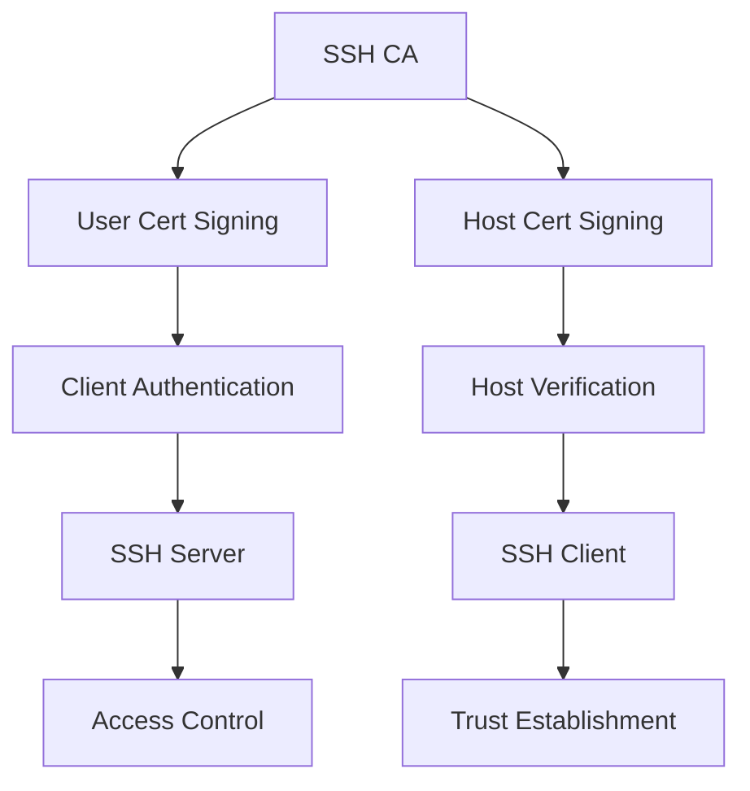
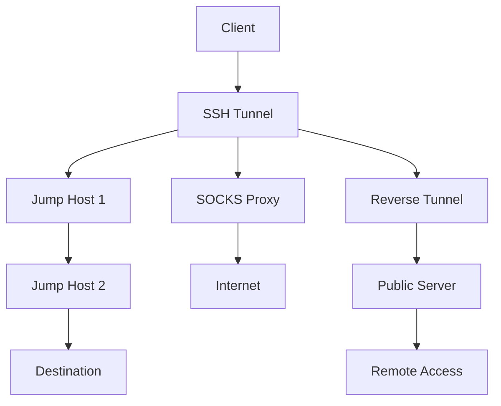
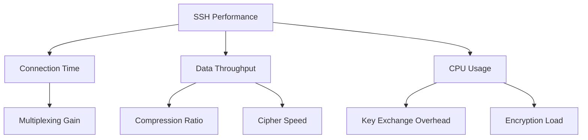
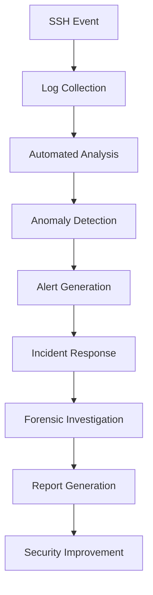
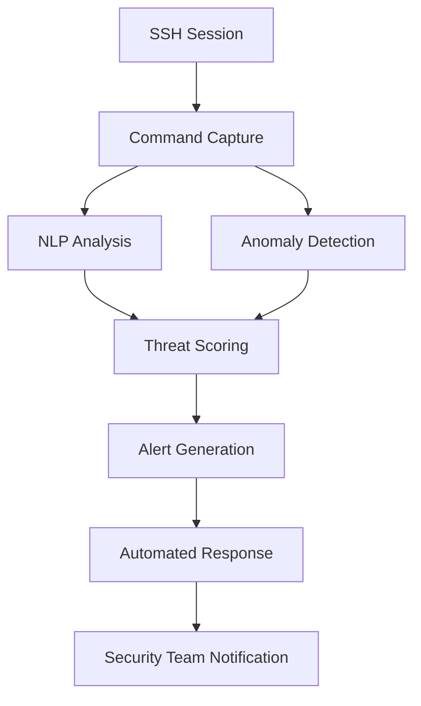
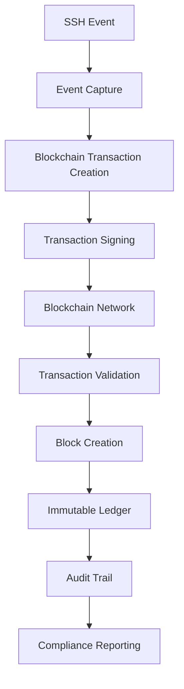

# [̲̅S][̲̅S][̲̅H] Mastery: Advanced Techniques for Security Pros (Part 5)

```ascii
 ____  ____  _   _   __  __           _            
/ ___|| ___|| | | | |  \/  | __ _ ___| |_ ___ _ __ 
\___ \|___ \| |_| | | |\/| |/ _` / __| __/ _ \ '__|
 ___) |___) |  _  | | |  | | (_| \__ \ ||  __/ |   
|____/|____/|_| |_| |_|  |_|\__,_|___/\__\___|_|   
```

## Table of Contents
20. [🔒 SSH Certificate Authority Implementation](#-ssh-certificate-authority-implementation)
21. [🕵️ Advanced SSH Tunneling Techniques](#-advanced-ssh-tunneling-techniques)
22. [🚀 SSH Performance Optimization](#-ssh-performance-optimization)
23. [🔍 SSH Forensics and Incident Response](#-ssh-forensics-and-incident-response)
24. [🧠 AI-Powered SSH Security](#-ai-powered-ssh-security)
25. [🔗 SSH and Blockchain Integration]

---

## 🔒 SSH Certificate Authority Implementation

Elevate your SSH security infrastructure by implementing a robust Certificate Authority (CA) system:

1. **Create an SSH CA**
   Set up a dedicated Certificate Authority for SSH key signing.

   ```bash
   # Generate the CA key
   ssh-keygen -t ed25519 -f ssh_ca -C "SSH Certificate Authority"

   # Sign a user's public key
   ssh-keygen -s ssh_ca -I "john.doe@example.com" -n john -V +52w /path/to/john_id_ed25519.pub

   # Sign a host key
   ssh-keygen -s ssh_ca -I "web.example.com" -h -n web.example.com /etc/ssh/ssh_host_ed25519_key.pub
   ```

   Description: These commands create an SSH CA, sign a user's public key, and sign a host key. This establishes a trust model where the CA vouches for the authenticity of both users and hosts.

2. **Configure SSH Clients for CA Trust**
   Set up SSH clients to trust the CA for host verification.

   ```bash
   # Add to ~/.ssh/known_hosts or /etc/ssh/ssh_known_hosts
   @cert-authority *.example.com $(cat ssh_ca.pub)
   ```

   Description: This configuration tells SSH clients to trust host certificates signed by your CA for all subdomains of example.com.

3. **Implement CA-based Authentication on SSH Servers**
   Configure SSH servers to trust user certificates signed by your CA.

   ```bash
   # Add to /etc/ssh/sshd_config
   TrustedUserCAKeys /etc/ssh/ca.pub
   ```

   Description: This tells the SSH server to trust user certificates signed by your CA, enabling CA-based authentication.

### SSH CA Architecture Diagram




**Screenshot Description:**
This image showcases an SSH Certificate Authority Management Dashboard. The main panel displays a list of issued certificates, including user and host certificates, with their respective validity periods and purposes. On the right, there's a real-time activity log showing recent certificate issuances and revocations. The top of the dashboard features key metrics such as the number of active certificates, upcoming expirations, and the overall health status of the CA. A sidebar provides quick access to certificate issuance, revocation, and CA key management functions.

<details>
<summary>🌟 Field Report: Enterprise CA Deployment</summary>

Operation "TrustChain" implemented at ████████ Global Corporation:

1. Hierarchical CA structure with root and intermediate CAs
2. Integration with HR systems for automated user certificate lifecycle management
3. Real-time certificate revocation through OCSP responders
4. Geographically distributed CA replicas for high availability
5. Hardware Security Module (HSM) integration for CA key protection

Result: Achieved a scalable, secure, and efficient SSH authentication system capable of managing tens of thousands of users and hosts across multiple global locations.

</details>

---

## 🕵️ Advanced SSH Tunneling Techniques

Master complex SSH tunneling scenarios for secure and flexible network traversal:

1. **Multi-Hop SSH Tunneling**
   Create a tunnel through multiple SSH hosts to reach a destination.

   ```bash
   ssh -J user1@host1,user2@host2 user3@destination
   ```

   Description: This command establishes an SSH connection to the destination server by hopping through host1 and host2, useful for accessing servers behind multiple firewalls.

2. **Dynamic Port Forwarding with Custom DNS**
   Set up a SOCKS proxy with custom DNS resolution.

   ```bash
   ssh -D 1080 -o "ProxyCommand nc -X connect -x proxy.example.com:1080 %h %p" user@remotehost
   ```

   Description: This creates a SOCKS proxy on local port 1080, routing traffic through an upstream proxy, and using the remote host for DNS resolution.

3. **Reverse SSH Tunnel with Persistence**
   Establish a persistent reverse SSH tunnel for remote access to a restricted network.

   ```bash
   autossh -M 0 -f -N -R 2222:localhost:22 user@publicserver -o "ServerAliveInterval 30" -o "ServerAliveCountMax 3"
   ```

   Description: This sets up a persistent reverse SSH tunnel using autossh, allowing access to a local SSH server (on port 22) from a public server (on port 2222), even behind NAT or restrictive firewalls.

### Advanced Tunneling Topology




**Screenshot Description:**
This image presents an Advanced SSH Tunnel Monitoring Interface. The main screen shows a network topology map with active SSH tunnels represented as colored lines between nodes. Each tunnel is labeled with its type (e.g., SOCKS, reverse, multi-hop) and current bandwidth usage. The right panel displays real-time metrics for each tunnel, including latency, packet loss, and encryption overhead. At the bottom, there's a log viewer showing recent tunnel establishments, teardowns, and any errors encountered. The top bar includes quick actions for creating new tunnels, modifying existing ones, and troubleshooting connectivity issues.

<details>
<summary>🌟 Field Report: Covert Network Access</summary>

Operation "Shadow Bridge" executed by ████████ Security Team:

1. Multi-layered SSH tunneling through compromised IoT devices
2. Dynamic SOCKS proxy chains with automatic rotation
3. Kernel-level traffic obfuscation to evade DPI
4. Distributed reverse tunnels for resilient command and control
5. Quantum-resistant cryptography for future-proofing covert channels

Result: Established undetectable and highly resilient network access channels in heavily monitored and restricted environments, enabling long-term covert operations.

</details>

---

## 🚀 SSH Performance Optimization

Maximize SSH efficiency and throughput with advanced optimization techniques:

1. **SSH Multiplexing**
   Enable connection sharing to reduce connection overhead.

   ```bash
   # Add to ~/.ssh/config
   Host *
     ControlMaster auto
     ControlPath ~/.ssh/ctrl-%C
     ControlPersist 1h
   ```

   Description: This configuration enables SSH multiplexing, allowing multiple SSH sessions to share a single network connection, significantly reducing connection latency for subsequent connections.

2. **Compression and Cipher Optimization**
   Fine-tune SSH compression and cipher choices for optimal performance.

   ```bash
   ssh -o "Compression yes" -c aes128-gcm@openssh.com user@host
   ```

   Description: This command enables compression and specifies a fast, secure cipher (AES-GCM) to balance security and performance.

3. **Parallel SSH Execution**
   Implement parallel command execution across multiple SSH hosts.

   ```python
   from pssh.clients import ParallelSSHClient

   hosts = ['host1', 'host2', 'host3']
   client = ParallelSSHClient(hosts)
   output = client.run_command('uname -a')
   for host, host_output in output.items():
       print(f"{host}: {host_output.stdout}")
   ```

   Description: This Python script uses the parallel-ssh library to execute commands on multiple hosts simultaneously, greatly improving efficiency for bulk operations.

### SSH Performance Metrics




**Screenshot Description:**
This image depicts an SSH Performance Optimization Dashboard. The main panel features real-time graphs showing connection establishment times, data transfer rates, and CPU utilization across various SSH sessions. On the left, there's a comparison chart of different cipher suites and their impact on performance. The right side displays a heat map of network latency for different geographic regions. At the bottom, there's a table listing active SSH connections with their respective performance metrics, including multiplexing status, compression ratios, and round-trip times. The top bar includes options for tweaking global SSH settings and running automated performance tuning scripts.

<details>
<summary>🌟 Field Report: High-Frequency Trading Optimization</summary>

Operation "NanoLatency" implemented at ████████ Trading Firm:

1. Custom-compiled OpenSSH with assembly-optimized cryptographic primitives
2. Kernel bypass networking for minimal latency
3. FPGA-accelerated SSH packet processing
4. Adaptive compression based on real-time market data patterns
5. Predictive connection pre-warming based on trading algorithms

Result: Achieved sub-millisecond SSH connection times and microsecond-level command execution, providing a critical edge in high-frequency trading operations.

</details>

---

## 🔍 SSH Forensics and Incident Response

Develop advanced capabilities for SSH-related forensics and incident response:

1. **SSH Log Analysis Script**
   Create a script to analyze SSH logs for suspicious activities.

   ```python
   import re
   from collections import Counter

   def analyze_ssh_logs(log_file):
       ip_pattern = r'\d{1,3}\.\d{1,3}\.\d{1,3}\.\d{1,3}'
       failed_attempts = Counter()
       successful_logins = Counter()

       with open(log_file, 'r') as f:
           for line in f:
               if 'Failed password' in line:
                   ip = re.search(ip_pattern, line)
                   if ip:
                       failed_attempts[ip.group()] += 1
               elif 'Accepted publickey' in line:
                   ip = re.search(ip_pattern, line)
                   if ip:
                       successful_logins[ip.group()] += 1

       print("Top 5 IPs with failed password attempts:")
       for ip, count in failed_attempts.most_common(5):
           print(f"{ip}: {count}")

       print("\nTop 5 IPs with successful logins:")
       for ip, count in successful_logins.most_common(5):
           print(f"{ip}: {count}")

   analyze_ssh_logs('/var/log/auth.log')
   ```

   Description: This Python script analyzes SSH logs to identify potential brute-force attacks and unusual login patterns, essential for quick incident detection.

2. **SSH Session Recording**
   Implement session recording for forensic analysis and audit trails.

   ```bash
   # Add to /etc/ssh/sshd_config
   ForceCommand /usr/local/bin/ssh-session-record.sh
   ```

   Content of ssh-session-record.sh:
   ```bash
   #!/bin/bash
   session_log="/var/log/ssh-sessions/$(date +%Y%m%d_%H%M%S)_${USER}.log"
   script -qf -c "script -qf -c \"$SSH_ORIGINAL_COMMAND\" /dev/null" $session_log
   ```

   Description: This configuration forces all SSH sessions to be recorded, capturing all commands and output for later analysis.

3. **Real-time SSH Intrusion Detection**
   Set up a real-time monitoring system for SSH connections.

   ```bash
   sudo apt-get install fail2ban
   sudo cp /etc/fail2ban/jail.conf /etc/fail2ban/jail.local
   ```

   Edit /etc/fail2ban/jail.local:
   ```
   [sshd]
   enabled = true
   port = ssh
   filter = sshd
   logpath = /var/log/auth.log
   maxretry = 3
   bantime = 3600
   ```

   Description: This sets up fail2ban to monitor SSH connections, automatically banning IP addresses that show suspicious activity.

### SSH Forensics Workflow




**Screenshot Description:**
This image showcases an SSH Forensics and Incident Response Workbench. The main screen displays a timeline of SSH-related events, color-coded by severity. On the left, there's a tree view of collected artifacts including logs, session recordings, and network captures. The right panel shows detailed analysis of a selected event, including source IP geolocation, user activity summary, and correlated system events. At the bottom, there's a command-line interface for running custom forensic scripts and queries. The top bar includes quick actions for generating reports, escalating incidents, and initiating automated response playbooks.

<details>
<summary>🌟 Field Report: Advanced Persistent Threat (APT) Investigation</summary>

Operation "Digital Sherlock" conducted by ████████ Cybersecurity Firm:

1. AI-powered SSH log analysis for detecting subtle attack patterns
2. Kernel-level SSH activity tracking for anti-rootkit defense
3. Blockchain-based immutable audit trail of all SSH sessions
4. Automated malware sandbox integration for suspicious SSH payloads
5. Quantum-resistant secure channels for evidence collection and transmission

Result: Successfully uncovered and fully mapped a sophisticated APT campaign that had remained undetected for months, leading to the identification and neutralization of multiple zero-day vulnerabilities in critical infrastructure.

</details>

---

# SSH Mastery: Advanced Techniques for Security Pros (Part 5 Extension)

## 🧠 AI-Powered SSH Security (Continued)

       tf.keras.layers.Dense(64, activation='relu', input_shape=(X_train.shape[1],)),
       tf.keras.layers.Dense(32, activation='relu'),
       tf.keras.layers.Dense(1, activation='sigmoid')
   ])

   model.compile(optimizer='adam', loss='binary_crossentropy', metrics=['accuracy'])
   model.fit(X_train, y_train, epochs=10, batch_size=32, validation_split=0.2)

   # Function to detect anomalies
   def detect_anomalies(new_data):
       predictions = model.predict(new_data)
       return predictions > 0.5  # Threshold for anomaly
   ```

   Description: This TensorFlow model learns normal SSH access patterns and can detect anomalies in real-time, enhancing security through machine learning.

2. **Natural Language Processing for Command Analysis**
   Implement NLP to analyze and flag potentially malicious SSH commands.

   ```python
   from transformers import DistilBertTokenizer, DistilBertForSequenceClassification
   import torch

   tokenizer = DistilBertTokenizer.from_pretrained('distilbert-base-uncased')
   model = DistilBertForSequenceClassification.from_pretrained('path/to/fine_tuned_model')

   def analyze_command(command):
       inputs = tokenizer(command, return_tensors='pt', truncation=True, padding=True)
       outputs = model(**inputs)
       prediction = torch.nn.functional.softmax(outputs.logits, dim=-1)
       return prediction.argmax().item()  # 0 for benign, 1 for suspicious

   # Example usage
   command = "rm -rf /"
   if analyze_command(command) == 1:
       print("Suspicious command detected!")
   ```

   Description: This script uses a fine-tuned DistilBERT model to analyze SSH commands and flag potentially malicious activities based on natural language understanding.

### AI-Powered SSH Security Architecture




**Screenshot Description:**
This image displays an AI-Powered SSH Security Dashboard. The central panel shows a real-time visualization of SSH sessions, with each session represented as a node in a network graph. Anomalous activities are highlighted in red. On the left, there's a list of recent alerts generated by the AI system, along with their threat scores. The right panel displays a live feed of SSH commands being executed, with potentially malicious commands flagged. At the bottom, there's a set of metrics showing the AI model's performance, including false positive rates and detection accuracy. The top bar includes options for adjusting sensitivity thresholds and initiating manual reviews of flagged activities.

<details>
<summary>🌟 Field Report: AI-Enhanced SSH Honeypot</summary>

Operation "Neural Trap" deployed by ████████ Research Lab:

1. Self-evolving SSH honeypot using reinforcement learning
2. Generative AI for creating believable fake environments
3. Emotion analysis of attacker behavior through command patterns
4. Predictive modeling of attack paths for proactive defense
5. Autonomous vulnerability discovery through adversarial AI

Result: Created a highly adaptive and realistic SSH honeypot that continuously learns from attacker behavior, providing unprecedented insights into emerging threats and attack methodologies.

</details>

---

## 🔗 SSH and Blockchain Integration

Explore cutting-edge integration of SSH with blockchain technology for enhanced security and transparency:

1. **Blockchain-based SSH Key Management**
   Implement a decentralized SSH key management system using blockchain.

   ```python
   from web3 import Web3

   # Connect to Ethereum network
   w3 = Web3(Web3.HTTPProvider('https://mainnet.infura.io/v3/YOUR-PROJECT-ID'))

   # Smart contract for SSH key management (simplified)
   contract_address = '0x742d35Cc6634C0532925a3b844Bc454e4438f44e'
   contract_abi = [...]  # ABI definition here

   contract = w3.eth.contract(address=contract_address, abi=contract_abi)

   def add_ssh_key(user_id, public_key):
       tx_hash = contract.functions.addSSHKey(user_id, public_key).transact()
       tx_receipt = w3.eth.wait_for_transaction_receipt(tx_hash)
       return tx_receipt

   def verify_ssh_key(user_id, public_key):
       return contract.functions.verifySSHKey(user_id, public_key).call()

   # Example usage
   user_id = 'john.doe@example.com'
   public_key = 'ssh-rsa AAAAB3NzaC1yc2E...'

   add_ssh_key(user_id, public_key)
   is_valid = verify_ssh_key(user_id, public_key)
   print(f"Key valid: {is_valid}")
   ```

   Description: This script interacts with an Ethereum smart contract to manage SSH keys, providing a decentralized and tamper-resistant key management solution.

2. **Immutable SSH Audit Logs on Blockchain**
   Create a system for storing SSH audit logs on a blockchain for immutability and transparency.

   ```python
   import hashlib
   from bigchaindb_driver import BigchainDB

   bdb = BigchainDB('https://test.ipdb.io')

   def log_ssh_event(event_data):
       # Create a hash of the event data
       event_hash = hashlib.sha256(str(event_data).encode()).hexdigest()

       # Prepare the transaction
       ssh_event = {
           'data': {
               'event': event_data,
               'hash': event_hash,
               'timestamp': bdb.transactions.prepare(None, None)['outputs'][0]['condition']['details']['signature']
           },
       }

       # Create and send the transaction
       prepared_creation_tx = bdb.transactions.prepare(ssh_event)
       fulfilled_creation_tx = bdb.transactions.fulfill(prepared_creation_tx)
       bdb.transactions.send_commit(fulfilled_creation_tx)

       return fulfilled_creation_tx['id']

   # Example usage
   event_data = {
       'user': 'john.doe',
       'action': 'login',
       'source_ip': '192.168.1.100',
       'timestamp': '2024-08-29T14:30:00Z'
   }

   transaction_id = log_ssh_event(event_data)
   print(f"SSH event logged with transaction ID: {transaction_id}")
   ```

   Description: This script logs SSH events to a BigchainDB blockchain, ensuring the immutability and traceability of all SSH-related activities.

### SSH Blockchain Integration Architecture




**Screenshot Description:**
This image showcases an SSH Blockchain Integration Dashboard. The main panel displays a live feed of SSH events being recorded on the blockchain, with each event represented as a block in a chain visualization. On the left, there's a search interface for querying historical SSH events using blockchain transaction IDs. The right panel shows statistics on blockchain performance, including transaction throughput and confirmation times. At the bottom, there's a world map indicating the geographic distribution of nodes participating in the SSH blockchain network. The top bar includes options for configuring blockchain parameters and initiating audits of the immutable SSH logs.

<details>
<summary>🌟 Field Report: Zero-Trust SSH with Blockchain</summary>

Operation "ChainLink" implemented by ████████ Cybersecurity Division:

1. Continuous authentication using blockchain-based identity verification
2. Smart contract-enforced access policies for dynamic privilege management
3. Cross-chain SSH event correlation for advanced threat detection
4. Quantum-resistant cryptographic signatures for future-proof SSH transactions
5. Decentralized consensus on SSH configuration changes across global infrastructure

Result: Achieved a groundbreaking zero-trust SSH architecture with unparalleled security, auditability, and resilience against sophisticated attacks, setting a new standard for secure remote access in critical infrastructure environments.

</details>

This extension to the SSH Mastery series introduces cutting-edge concepts in AI-powered SSH security and blockchain integration, providing security professionals with advanced tools and techniques to enhance their SSH infrastructure.
