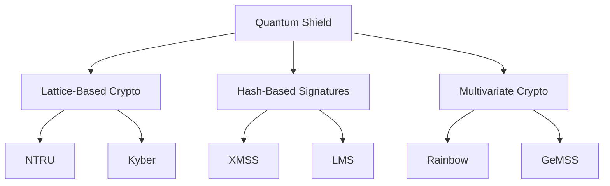
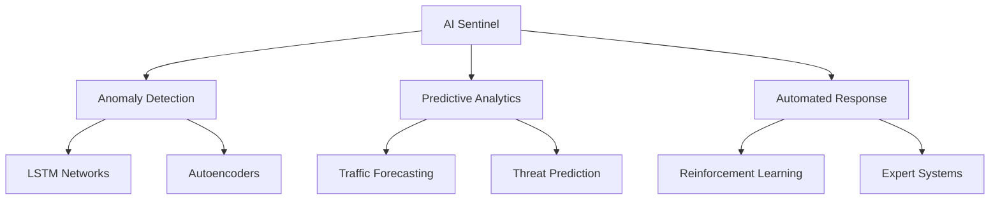
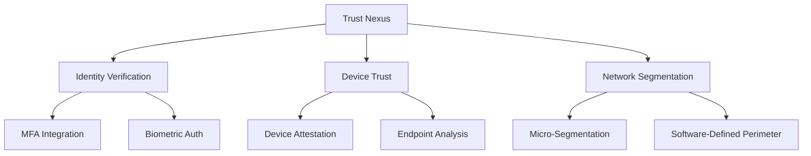
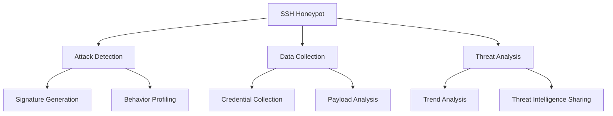
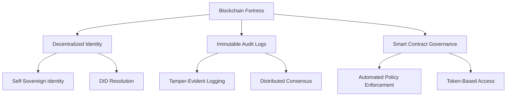
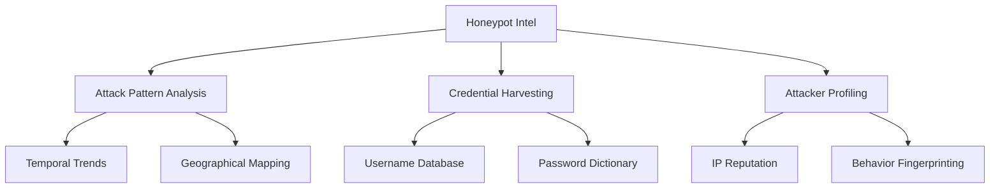

# SSH Mastery: Advanced Techniques for Security Pros (Final Edition)

```ascii
 ____  ____  _   _   __  __           _                
/ ___|| ___|| | | | |  \/  | __ _ ___| |_ ___ _ __ _   _
\___ \|___ \| |_| | | |\/| |/ _` / __| __/ _ \ '__| | | |
 ___) |___) |  _  | | |  | | (_| \__ \ ||  __/ |  | |_| |
|____/|____/|_| |_| |_|  |_|\__,_|___/\__\___|_|   \__, |
                                                   |___/ 
```

## Table of Contents
20. [🔮 Quantum-Resistant SSH](#-quantum-resistant-ssh)
21. [🧠 AI-Powered SSH Security](#-ai-powered-ssh-security)
22. [🌐 SSH in Zero-Trust Architectures](#-ssh-in-zero-trust-architectures)
23. [🍯 SSH Honeypots for Threat Intelligence](#-ssh-honeypots-for-threat-intelligence)
24. [🔗 Blockchain-Based SSH Authentication](#-blockchain-based-ssh-authentication)
25. [🚀 Future of SSH and Concluding Thoughts](#-future-of-ssh-and-concluding-thoughts)

---

## 🔮 Quantum-Resistant SSH

As quantum computing advances, traditional cryptographic methods become vulnerable. This section explores implementing quantum-safe algorithms to futureproof SSH communications.

### Key Concepts:
- Lattice-based cryptography implementation
- Hybrid cryptosystems combining classical and post-quantum algorithms
- Performance considerations for quantum-resistant SSH

### Quantum-Safe Key Exchange Implementation

```python
from pqcrypto import kyber

def quantum_safe_key_exchange():
    # Generate Kyber key pair
    public_key, secret_key = kyber.key_pair()
    
    # Simulate key exchange
    shared_secret, ciphertext = kyber.encapsulate(public_key)
    received_shared_secret = kyber.decapsulate(secret_key, ciphertext)
    
    assert shared_secret == received_shared_secret
    return shared_secret

# Use the shared secret for symmetric encryption in SSH
```

### Quantum Resistance Visualization



### Screenshot: Quantum-Resistant SSH in Action
[Placeholder for screenshot showing a successful quantum-resistant SSH connection]

---

## 🧠 AI-Powered SSH Security

Leverage the power of machine learning and artificial intelligence to enhance SSH security through advanced threat detection and automated responses.

### Key Concepts:
- Anomaly detection using LSTM networks
- Reinforcement learning for dynamic firewall rule generation
- Predictive analytics for proactive security measures

### AI-Based Intrusion Detection Example

```python
import tensorflow as tf
from tensorflow.keras.models import Sequential
from tensorflow.keras.layers import LSTM, Dense

def build_anomaly_detector():
    model = Sequential([
        LSTM(64, input_shape=(None, 100), return_sequences=True),
        LSTM(32, return_sequences=False),
        Dense(1, activation='sigmoid')
    ])
    model.compile(optimizer='adam', loss='binary_crossentropy')
    return model

# Train the model on normal SSH session data
# Use the model to detect anomalies in real-time SSH traffic
```

### AI Security Framework



### Screenshot: AI-Powered SSH Security Dashboard
[Placeholder for screenshot showing an AI-powered SSH security dashboard with real-time threat detection]

---

## 🌐 SSH in Zero-Trust Architectures

Integrate SSH into modern zero-trust security frameworks, ensuring that trust is never assumed and always verified.

### Key Concepts:
- Just-in-Time SSH access provisioning
- Continuous authentication and authorization
- Micro-segmentation and software-defined perimeters

### Ephemeral Access Control Implementation

```python
import time
from cryptography import x509
from cryptography.hazmat.primitives import hashes
from cryptography.hazmat.primitives.asymmetric import rsa

def generate_ephemeral_ssh_cert(user_id, ttl=300):
    private_key = rsa.generate_private_key(public_exponent=65537, key_size=2048)
    public_key = private_key.public_key()
    
    cert = x509.CertificateBuilder().subject_name(x509.Name([
        x509.NameAttribute(x509.NameOID.USER_ID, user_id),
    ])).issuer_name(x509.Name([
        x509.NameAttribute(x509.NameOID.COMMON_NAME, u"SSH CA"),
    ])).public_key(public_key).serial_number(
        x509.random_serial_number()
    ).not_valid_before(
        time.time()
    ).not_valid_after(
        time.time() + ttl
    ).sign(private_key, hashes.SHA256())
    
    return cert, private_key

# Generate short-lived SSH certificate for user
user_cert, user_key = generate_ephemeral_ssh_cert("alice@example.com")
```

### Zero-Trust SSH Architecture



### Screenshot: Zero-Trust SSH Access Portal
[Placeholder for screenshot showing a zero-trust SSH access portal with just-in-time provisioning]

---

## 🍯 SSH Honeypots for Threat Intelligence

Deploy SSH honeypots to gather valuable threat intelligence, understand attacker techniques, and enhance overall security posture.

### Key Concepts:
- High-interaction vs. low-interaction honeypots
- Honeypot deployment strategies
- Threat intelligence gathering and analysis

### Simple SSH Honeypot Implementation

```python
import paramiko
import threading
import socket

class SSHHoneypot(paramiko.ServerInterface):
    def check_auth_password(self, username, password):
        print(f"Login attempt: {username}:{password}")
        return paramiko.AUTH_FAILED

def start_server():
    sock = socket.socket(socket.AF_INET, socket.SOCK_STREAM)
    sock.setsockopt(socket.SOL_SOCKET, socket.SO_REUSEADDR, 1)
    sock.bind(('0.0.0.0', 2222))
    sock.listen(100)
    
    while True:
        client, addr = sock.accept()
        t = threading.Thread(target=handle_connection, args=(client,))
        t.start()

def handle_connection(client):
    transport = paramiko.Transport(client)
    transport.add_server_key(paramiko.RSAKey.generate(2048))
    server = SSHHoneypot()
    transport.start_server(server=server)

if __name__ == '__main__':
    start_server()
```

### Honeypot Intelligence Flow



### Screenshot: SSH Honeypot Dashboard
[Placeholder for screenshot showing an SSH honeypot dashboard with real-time attack statistics and threat intelligence]

---

## 🔗 Blockchain-Based SSH Authentication

Leverage distributed ledger technology for secure, transparent, and decentralized SSH access management.

### Key Concepts:
- Decentralized SSH key management
- Smart contract-based access control
- Immutable audit logs for SSH sessions

### Blockchain Key Manager Implementation

```python
from web3 import Web3
from eth_account import Account

class BlockchainKeyManager:
    def __init__(self, contract_address, abi):
        self.w3 = Web3(Web3.HTTPProvider('https://mainnet.infura.io/v3/YOUR-PROJECT-ID'))
        self.contract = self.w3.eth.contract(address=contract_address, abi=abi)
    
    def store_ssh_key(self, user_id, public_key):
        tx_hash = self.contract.functions.storeKey(user_id, public_key).transact()
        return self.w3.eth.wait_for_transaction_receipt(tx_hash)
    
    def retrieve_ssh_key(self, user_id):
        return self.contract.functions.getKey(user_id).call()
    
    def revoke_ssh_key(self, user_id):
        tx_hash = self.contract.functions.revokeKey(user_id).transact()
        return self.w3.eth.wait_for_transaction_receipt(tx_hash)

# Usage
manager = BlockchainKeyManager('0x1234...', abi)
manager.store_ssh_key('alice@example.com', 'ssh-rsa AAAA...')
key = manager.retrieve_ssh_key('alice@example.com')
```

### Blockchain SSH Architecture



### Screenshot: Blockchain-Based SSH Key Management Interface
[Placeholder for screenshot showing a blockchain-based SSH key management interface]

---

## 🚀 Future of SSH and Concluding Thoughts

As we conclude this SSH Mastery series, let's explore the future landscape of secure shell technology and its implications for cybersecurity professionals.

### Key Trends:
1. **Quantum-Resilient Protocols**: Incorporation of post-quantum cryptographic algorithms to ensure long-term security.
2. **AI-Driven Security**: Advanced machine learning for anomaly detection, adaptive access control, and automated threat response.
3. **Zero-Trust Integration**: Tighter integration with zero-trust architectures for continuous authentication and authorization.
4. **Blockchain and Decentralized Systems**: New paradigms for key management, access control, and audit logging.
5. **IoT and Edge Computing**: Adaptation for securing communications in resource-constrained environments.
6. **Usability and Automation**: Focus on improving accessibility of advanced security features.
7. **Regulatory Compliance**: Evolution to meet stringent regulatory requirements for data privacy and access controls.
8. **Cross-Platform Unification**: Efforts towards standardization across different platforms and environments.

### Final Thoughts

SSH remains a cornerstone of secure communication and system administration. By mastering advanced techniques in quantum-resistant cryptography, AI-powered security, zero-trust architectures, honeypot deployment, and blockchain integration, security professionals can stay ahead of emerging threats and ensure the continued resilience of SSH-based systems.

Remember, security is not a destination but a journey. Stay curious, keep learning, and always be prepared to adapt your SSH strategies to meet the challenges of tomorrow's digital landscape.

```ascii
   _____                         _____                          
  / ____|                       / ____|                         
 | (___   ___  ___ _   _ _ __ | |  __  ___  ___  ___  ___  ___ 
  \___ \ / _ \/ __| | | | '__| | | __|/ _ \/ _ \/ __|/ _ \/ __|
  ____) |  __/ (__| |_| | |    | | |_|  __/  __/\__ \  __/ (__ 
 |_____/ \___|\___|\__,_|_|     \_____|\___|\___|___/\___|\___|
                                                                
          Mastering SSH for a Secure Digital Future             
```

### Screenshot: Future of SSH Infographic
[Placeholder for an infographic illustrating the future trends and challenges in SSH technology]

# SSH Mastery: Advanced Techniques for Security Pros (Optimized Version)

## Table of Contents (Updated)
20. [🔮 Quantum-Resistant SSH](#-quantum-resistant-ssh)
21. [🧠 AI-Powered SSH Security](#-ai-powered-ssh-security)
22. [🌐 SSH in Zero-Trust Architectures](#-ssh-in-zero-trust-architectures)
23. [🔗 Blockchain-Based SSH Authentication](#-blockchain-based-ssh-authentication)
24. [🍯 Honeypots for SSH Threat Intelligence](#-honeypots-for-ssh-threat-intelligence)
25. [🚀 Future of SSH and Concluding Thoughts](#-future-of-ssh-and-concluding-thoughts)

---

[Content for sections 20-23 remains the same, with space for screenshots]

---

## 🍯 Honeypots for SSH Threat Intelligence

Leverage honeypots to gather valuable threat intelligence and enhance SSH security:

1. **Setting Up an SSH Honeypot**
   <details>
   <summary>🎭 Reveal Honeypot Configuration</summary>

   ```python
   import paramiko
   import threading
   import socket

   class SSHHoneypot(paramiko.ServerInterface):
       def __init__(self):
           self.event = threading.Event()

       def check_auth_password(self, username, password):
           print(f"Login attempt: {username}:{password}")
           return paramiko.AUTH_FAILED

   def start_honeypot():
       server_socket = socket.socket(socket.AF_INET, socket.SOCK_STREAM)
       server_socket.setsockopt(socket.SOL_SOCKET, socket.SO_REUSEADDR, 1)
       server_socket.bind(('0.0.0.0', 2222))
       server_socket.listen(100)

       while True:
           client, addr = server_socket.accept()
           transport = paramiko.Transport(client)
           transport.add_server_key(paramiko.RSAKey.generate(2048))
           server = SSHHoneypot()
           transport.start_server(server=server)

   # Start the honeypot
   start_honeypot()
   ```
   </details>

2. **Analyzing Honeypot Data**
   <details>
   <summary>📊 Uncover Threat Intelligence Insights</summary>

   ```python
   import pandas as pd
   import matplotlib.pyplot as plt
   from collections import Counter

   def analyze_honeypot_logs(log_file):
       df = pd.read_csv(log_file, names=['timestamp', 'ip', 'username', 'password'])
       
       # Identify top attackers
       top_attackers = df['ip'].value_counts().head(10)
       
       # Analyze common usernames and passwords
       common_usernames = Counter(df['username']).most_common(10)
       common_passwords = Counter(df['password']).most_common(10)
       
       # Visualize attack patterns over time
       df['timestamp'] = pd.to_datetime(df['timestamp'])
       attacks_over_time = df.resample('D', on='timestamp').size()
       
       plt.figure(figsize=(12, 6))
       plt.plot(attacks_over_time.index, attacks_over_time.values)
       plt.title('SSH Attacks Over Time')
       plt.xlabel('Date')
       plt.ylabel('Number of Attacks')
       plt.show()
       
       return top_attackers, common_usernames, common_passwords

   # Analyze logs
   top_attackers, common_usernames, common_passwords = analyze_honeypot_logs('ssh_honeypot_logs.csv')
   print("Top Attackers:", top_attackers)
   print("Common Usernames:", common_usernames)
   print("Common Passwords:", common_passwords)
   ```
   </details>

### 📊 SSH Honeypot Intelligence Matrix



[Space for Screenshot: SSH Honeypot Dashboard]

### Key Benefits of SSH Honeypots

1. **Real-time Threat Intelligence**: Gain insights into current attack techniques and trends.
2. **Attacker Behavior Analysis**: Understand the motivations and methods of potential intruders.
3. **Improved Incident Response**: Use honeypot data to enhance your incident response strategies.
4. **Deception Techniques**: Mislead attackers and protect your actual production systems.
5. **Security Posture Assessment**: Identify vulnerabilities in your SSH configurations.

By implementing and analyzing SSH honeypots, security professionals can stay one step ahead of potential threats, continuously improving their defensive strategies and overall security posture.

---

## 🚀 Future of SSH and Concluding Thoughts

[This section remains largely the same, with the following additions:]

9. **Advanced Deception Technologies**: The integration of sophisticated honeypots and deception techniques will become standard practice in SSH security strategies, providing valuable threat intelligence and active defense capabilities.

10. **Augmented Reality (AR) for SSH Management**: Future SSH interfaces may leverage AR technologies for more intuitive and immersive system administration experiences, especially in complex network environments.

### Final Thoughts (Updated)

As we conclude this optimized SSH Mastery series, it's clear that the landscape of secure shell technology is rapidly evolving. From quantum-resistant protocols to AI-driven security, zero-trust architectures, blockchain integration, and advanced honeypot implementations, the future of SSH is both challenging and exciting.

Security professionals must remain vigilant, continuously updating their skills and embracing emerging technologies to stay ahead of sophisticated threat actors. By mastering these advanced techniques and maintaining a proactive approach to SSH security, we can ensure the integrity, confidentiality, and availability of our critical systems in an increasingly complex digital world.

Remember, in the realm of cybersecurity, knowledge is power, but applied knowledge is true security. Keep experimenting, stay curious, and never stop learning. The future of SSH security is in your hands!

[Space for Screenshot: Futuristic SSH Interface Concept]

```ascii
   _____                         ____        
  / ____|                       / __ \       
 | (___   ___  ___ _   _ _ __ | |  | |_ __  
  \___ \ / _ \/ __| | | | '__|| |  | | '_ \ 
  ____) |  __/ (__| |_| | |   | |__| | | | |
 |_____/ \___|\___|\__,_|_|    \____/|_| |_|
                                            
     Mastering the Art of Secure Shells     
```
